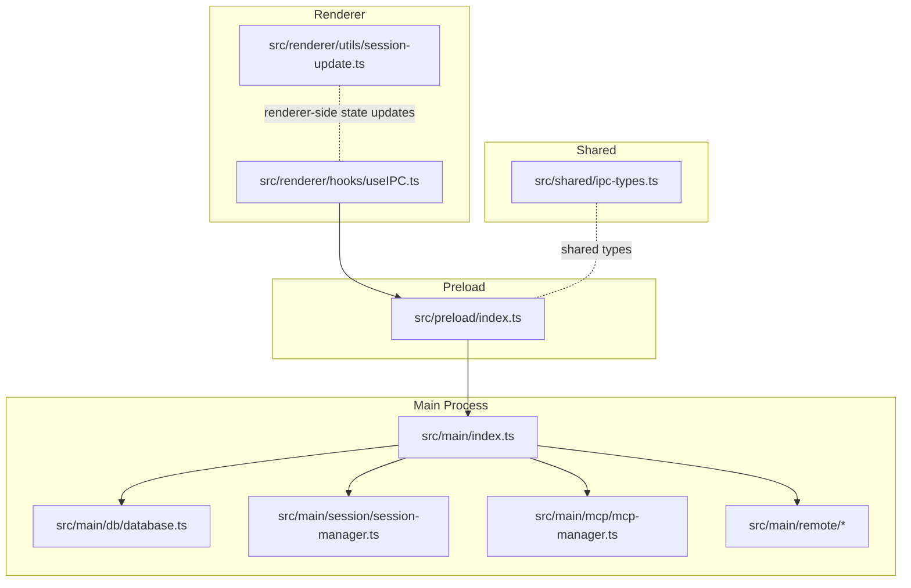
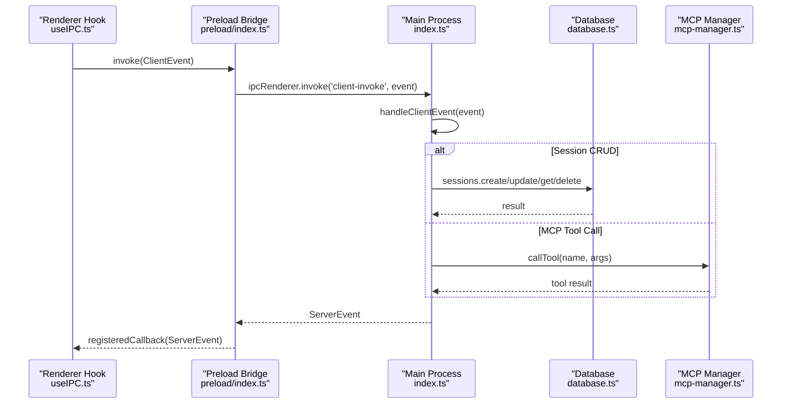
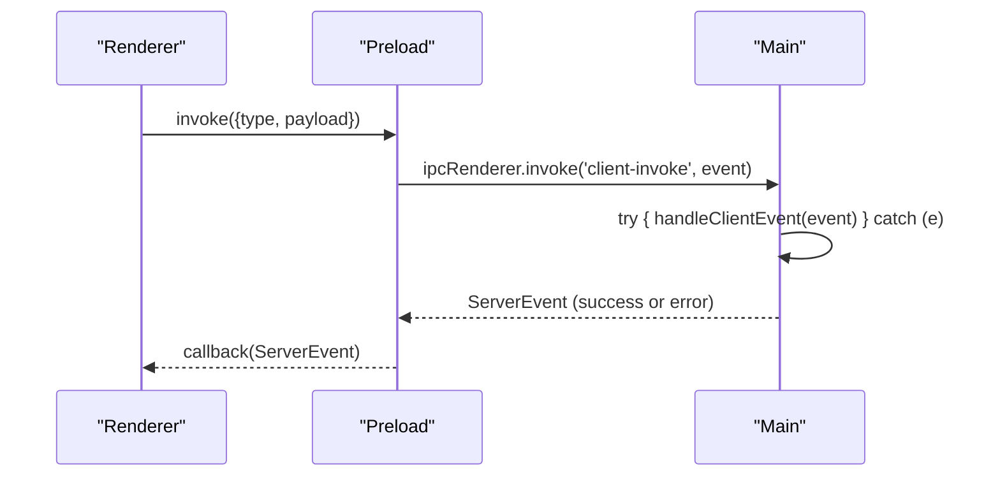
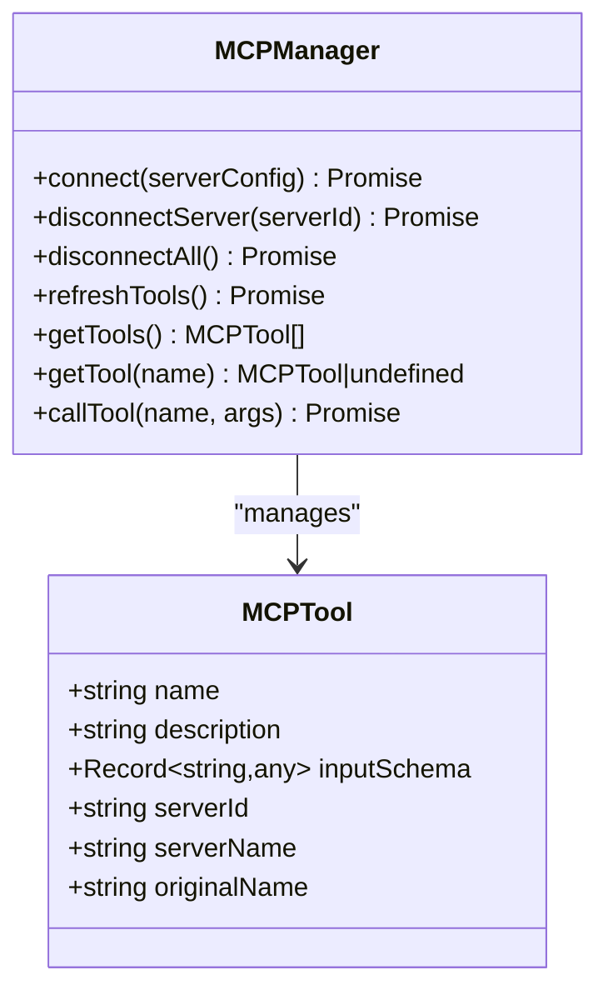
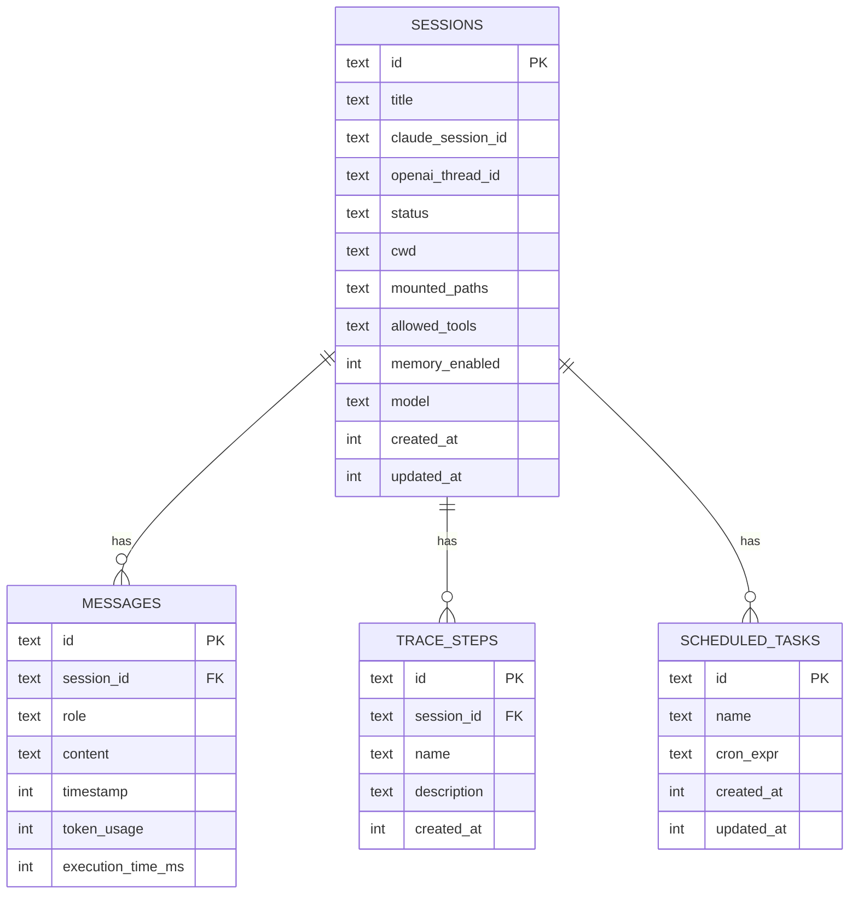
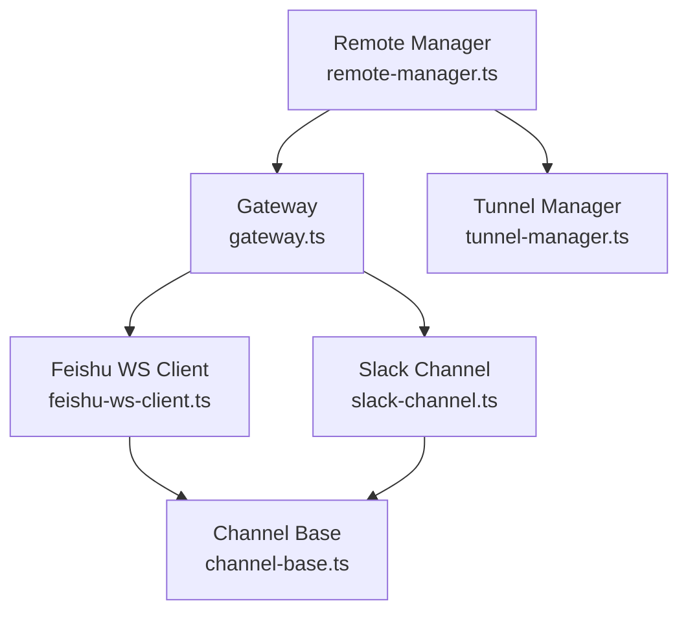
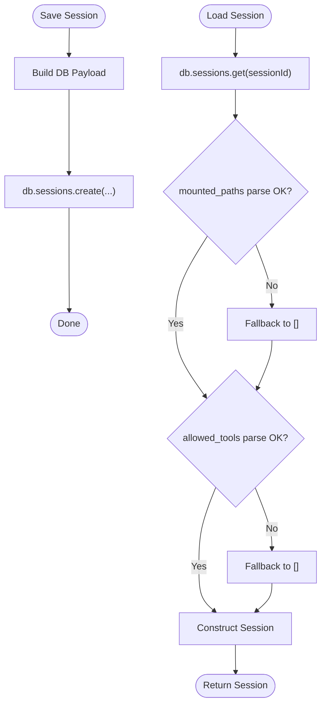
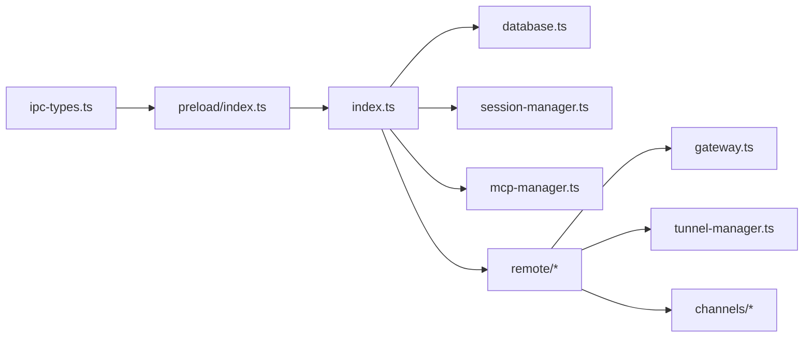
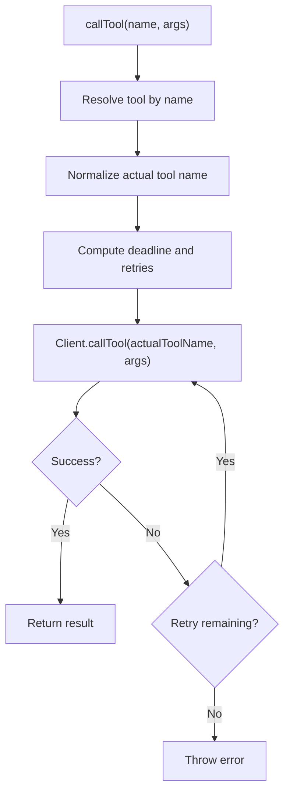

# API Reference

<cite>
**Referenced Files in This Document**
- [index.ts](file://src/main/index.ts)
- [ipc-types.ts](file://src/shared/ipc-types.ts)
- [preload/index.ts](file://src/preload/index.ts)
- [useIPC.ts](file://src/renderer/hooks/useIPC.ts)
- [mcp-manager.ts](file://src/main/mcp/mcp-manager.ts)
- [gui-operate-server.ts](file://src/main/mcp/gui-operate-server.ts)
- [software-dev-server-example.ts](file://src/main/mcp/software-dev-server-example.ts)
- [mcp-oauth.ts](file://src/main/mcp/mcp-oauth.ts)
- [database.ts](file://src/main/db/database.ts)
- [session-manager.ts](file://src/main/session/session-manager.ts)
- [feishu-ws-client.ts](file://src/main/remote/channels/feishu/feishu-ws-client.ts)
- [slack-channel.ts](file://src/main/remote/channels/slack/slack-channel.ts)
- [channel-base.ts](file://src/main/remote/channels/channel-base.ts)
- [gateway.ts](file://src/main/remote/gateway.ts)
- [remote-manager.ts](file://src/main/remote/remote-manager.ts)
- [tunnel-manager.ts](file://src/main/remote/tunnel-manager.ts)
- [message-router.ts](file://src/main/remote/message-router.ts)
- [remote-config-store.ts](file://src/main/remote/remote-config-store.ts)
- [remote-title.ts](file://src/main/remote/remote-title.ts)
- [types.ts](file://src/main/remote/types.ts)
- [session-update.ts](file://src/renderer/utils/session-update.ts)
</cite>

## Table of Contents

1. [Introduction](#introduction)
2. [Project Structure](#project-structure)
3. [Core Components](#core-components)
4. [Architecture Overview](#architecture-overview)
5. [Detailed Component Analysis](#detailed-component-analysis)
6. [Dependency Analysis](#dependency-analysis)
7. [Performance Considerations](#performance-considerations)
8. [Troubleshooting Guide](#troubleshooting-guide)
9. [Conclusion](#conclusion)
10. [Appendices](#appendices)

## Introduction

This document provides a comprehensive API reference for Open Cowork’s internal systems:

- Inter-Process Communication (IPC) between main and renderer processes
- Model Context Protocol (MCP) integration for external tooling
- Database API for session and configuration persistence
- Remote control and real-time messaging via WebSockets and connectors for Feishu and Slack
- Security, rate limiting, and performance guidance

It targets both developers integrating with the app and teams building plugins or connectors.

## Project Structure

Open Cowork is an Electron-based desktop application. The main process runs the app lifecycle, IPC handlers, MCP orchestration, database, and remote control infrastructure. The renderer process hosts the UI and communicates with the main process via IPC. Preload bridges expose safe IPC APIs to web content.

**Diagram sources**

- [index.ts:1151-1166](file://src/main/index.ts#L1151-L1166)
- [ipc-types.ts](file://src/shared/ipc-types.ts)
- [preload/index.ts:87-126](file://src/preload/index.ts#L87-L126)
- [useIPC.ts:368-391](file://src/renderer/hooks/useIPC.ts#L368-L391)
- [database.ts:415-459](file://src/main/db/database.ts#L415-L459)
- [session-manager.ts:317-354](file://src/main/session/session-manager.ts#L317-L354)
- [mcp-manager.ts:1447-1623](file://src/main/mcp/mcp-manager.ts#L1447-L1623)

**Section sources**

- [index.ts:1151-1166](file://src/main/index.ts#L1151-L1166)
- [ipc-types.ts](file://src/shared/ipc-types.ts)
- [preload/index.ts:87-126](file://src/preload/index.ts#L87-L126)
- [useIPC.ts:368-391](file://src/renderer/hooks/useIPC.ts#L368-L391)

## Core Components

- IPC Bridge: Renderer-to-main communication via Electron IPC with typed events and invocation semantics
- MCP Manager: Orchestrates MCP servers, tool discovery, and tool execution with timeouts and retries
- Database API: SQLite-backed persistence for sessions, messages, trace steps, and scheduled tasks
- Remote Control: WebSocket-based channels for Feishu and Slack, plus a gateway and tunnel manager
- Session Management: CRUD and serialization for session metadata and runtime state

**Section sources**

- [index.ts:1151-1166](file://src/main/index.ts#L1151-L1166)
- [mcp-manager.ts:1476-1581](file://src/main/mcp/mcp-manager.ts#L1476-L1581)
- [database.ts:415-459](file://src/main/db/database.ts#L415-L459)
- [feishu-ws-client.ts](file://src/main/remote/channels/feishu/feishu-ws-client.ts)
- [slack-channel.ts](file://src/main/remote/channels/slack/slack-channel.ts)
- [session-manager.ts:317-354](file://src/main/session/session-manager.ts#L317-L354)

## Architecture Overview

The system separates concerns across layers:

- Renderer UI invokes preload-bound IPC methods
- Preload validates and forwards events to main via Electron IPC
- Main routes events to handlers, MCP manager, database, or remote control subsystems
- Events are broadcast back to renderer via a “server-event” channel

**Diagram sources**

- [useIPC.ts:368-391](file://src/renderer/hooks/useIPC.ts#L368-L391)
- [preload/index.ts:87-126](file://src/preload/index.ts#L87-L126)
- [index.ts:1151-1166](file://src/main/index.ts#L1151-L1166)
- [database.ts:415-459](file://src/main/db/database.ts#L415-L459)
- [mcp-manager.ts:1597-1623](file://src/main/mcp/mcp-manager.ts#L1597-L1623)

## Detailed Component Analysis

### IPC Communication (Main ↔ Renderer)

- Event Types: Defined centrally to ensure type safety across processes
- Invocation Pattern: Renderer invokes main with typed events; main responds synchronously
- Event Broadcasting: Main sends “server-event” to renderer for UI updates
- Security: Preload enforces an allowlist of allowed client events before invoking main
- Error Handling: Main catches errors during event handling and emits a generic error event to renderer

**Diagram sources**

- [preload/index.ts:87-126](file://src/preload/index.ts#L87-L126)
- [index.ts:1151-1166](file://src/main/index.ts#L1151-L1166)

Key behaviors:

- Allowed event types are validated in preload before forwarding
- Renderer hooks manage lifecycle and cancellation of partial updates
- Main handles both fire-and-forget and invoked events

**Section sources**

- [ipc-types.ts](file://src/shared/ipc-types.ts)
- [preload/index.ts:87-126](file://src/preload/index.ts#L87-L126)
- [index.ts:1151-1166](file://src/main/index.ts#L1151-L1166)
- [useIPC.ts:368-391](file://src/renderer/hooks/useIPC.ts#L368-L391)

### MCP Protocol Implementation

MCP enables external tools and servers to integrate with the app. The manager discovers tools, calls them with timeouts and retries, and normalizes tool names.

**Diagram sources**

- [mcp-manager.ts:1447-1623](file://src/main/mcp/mcp-manager.ts#L1447-L1623)

Highlights:

- Tool discovery and refresh with per-server timeouts
- Sanitization and mapping of tool names for model-facing consumption
- Retry logic and per-call deadlines
- Optional OAuth integration for MCP servers

**Section sources**

- [mcp-manager.ts:1476-1623](file://src/main/mcp/mcp-manager.ts#L1476-L1623)
- [mcp-oauth.ts](file://src/main/mcp/mcp-oauth.ts)
- [gui-operate-server.ts](file://src/main/mcp/gui-operate-server.ts)
- [software-dev-server-example.ts](file://src/main/mcp/software-dev-server-example.ts)

### Database API (Session and Configuration Persistence)

SQLite-backed persistence with prepared statements for performance. Sessions, messages, trace steps, and scheduled tasks are supported.

**Diagram sources**

- [database.ts:415-459](file://src/main/db/database.ts#L415-L459)

Common operations:

- Create/update sessions and messages
- Retrieve sessions and messages by ID or session
- Delete sessions and associated messages/trace steps
- Prepared statements for performance and safety

**Section sources**

- [database.ts:415-459](file://src/main/db/database.ts#L415-L459)
- [session-manager.ts:317-354](file://src/main/session/session-manager.ts#L317-L354)

### Remote Control and Real-Time Messaging

Remote control integrates with Feishu and Slack via WebSocket connections and a unified channel abstraction. A gateway and tunnel manager coordinate routing and transport.

**Diagram sources**

- [remote-manager.ts](file://src/main/remote/remote-manager.ts)
- [gateway.ts](file://src/main/remote/gateway.ts)
- [tunnel-manager.ts](file://src/main/remote/tunnel-manager.ts)
- [feishu-ws-client.ts](file://src/main/remote/channels/feishu/feishu-ws-client.ts)
- [slack-channel.ts](file://src/main/remote/channels/slack/slack-channel.ts)
- [channel-base.ts](file://src/main/remote/channels/channel-base.ts)

Message flow:

- Channels receive real-time events and forward them to the router
- Router dispatches to appropriate handlers or tunnels
- Tunnel manager manages connection lifecycles and reconnection

**Section sources**

- [feishu-ws-client.ts](file://src/main/remote/channels/feishu/feishu-ws-client.ts)
- [slack-channel.ts](file://src/main/remote/channels/slack/slack-channel.ts)
- [channel-base.ts](file://src/main/remote/channels/channel-base.ts)
- [gateway.ts](file://src/main/remote/gateway.ts)
- [message-router.ts](file://src/main/remote/message-router.ts)
- [tunnel-manager.ts](file://src/main/remote/tunnel-manager.ts)
- [remote-config-store.ts](file://src/main/remote/remote-config-store.ts)
- [remote-title.ts](file://src/main/remote/remote-title.ts)
- [types.ts](file://src/main/remote/types.ts)

### Session Management API

SessionManager encapsulates CRUD and serialization for sessions, mapping database rows to domain objects and vice versa.

**Diagram sources**

- [session-manager.ts:317-354](file://src/main/session/session-manager.ts#L317-L354)

**Section sources**

- [session-manager.ts:317-354](file://src/main/session/session-manager.ts#L317-L354)
- [session-update.ts:1-31](file://src/renderer/utils/session-update.ts#L1-L31)

## Dependency Analysis

High-level dependencies among core modules:

**Diagram sources**

- [ipc-types.ts](file://src/shared/ipc-types.ts)
- [preload/index.ts:87-126](file://src/preload/index.ts#L87-L126)
- [index.ts:1151-1166](file://src/main/index.ts#L1151-L1166)
- [database.ts:415-459](file://src/main/db/database.ts#L415-L459)
- [session-manager.ts:317-354](file://src/main/session/session-manager.ts#L317-L354)
- [mcp-manager.ts:1447-1623](file://src/main/mcp/mcp-manager.ts#L1447-L1623)
- [gateway.ts](file://src/main/remote/gateway.ts)
- [tunnel-manager.ts](file://src/main/remote/tunnel-manager.ts)
- [feishu-ws-client.ts](file://src/main/remote/channels/feishu/feishu-ws-client.ts)
- [slack-channel.ts](file://src/main/remote/channels/slack/slack-channel.ts)

**Section sources**

- [index.ts:1151-1166](file://src/main/index.ts#L1151-L1166)
- [mcp-manager.ts:1447-1623](file://src/main/mcp/mcp-manager.ts#L1447-L1623)
- [database.ts:415-459](file://src/main/db/database.ts#L415-L459)
- [session-manager.ts:317-354](file://src/main/session/session-manager.ts#L317-L354)
- [gateway.ts](file://src/main/remote/gateway.ts)
- [tunnel-manager.ts](file://src/main/remote/tunnel-manager.ts)
- [feishu-ws-client.ts](file://src/main/remote/channels/feishu/feishu-ws-client.ts)
- [slack-channel.ts](file://src/main/remote/channels/slack/slack-channel.ts)

## Performance Considerations

- IPC batching and throttling: Renderer hooks batch partial updates and flush on demand to reduce render pressure
- Database: Prepared statements minimize overhead; avoid ad-hoc SQL; batch writes where possible
- MCP: Use short timeouts and retries judiciously; cache tool listings; sanitize tool names once per refresh cycle
- Remote control: Reuse WebSocket connections; implement backoff on reconnection; throttle incoming message rates
- Memory: Avoid retaining large payloads in renderer state; use immutable update patterns

[No sources needed since this section provides general guidance]

## Troubleshooting Guide

- IPC invocation blocked: Verify the event type is in the allowlist in preload
- Session start failures: Renderer shows a global notice and suppresses throwing; inspect logs for underlying cause
- MCP tool not found: Ensure tools were refreshed and mapped; confirm server connectivity and authentication
- Database open failures: Check path resolution and permissions; enable foreign keys and initialize schema
- Remote channel errors: Inspect gateway and tunnel logs; validate credentials and network connectivity

**Section sources**

- [preload/index.ts:110-117](file://src/preload/index.ts#L110-L117)
- [useIPC.ts:368-391](file://src/renderer/hooks/useIPC.ts#L368-L391)
- [mcp-manager.ts:1597-1623](file://src/main/mcp/mcp-manager.ts#L1597-L1623)
- [database.ts:415-459](file://src/main/db/database.ts#L415-L459)
- [feishu-ws-client.ts](file://src/main/remote/channels/feishu/feishu-ws-client.ts)
- [slack-channel.ts](file://src/main/remote/channels/slack/slack-channel.ts)

## Conclusion

Open Cowork exposes a robust set of internal APIs:

- IPC provides a secure, typed bridge between renderer and main
- MCP offers extensible tooling with discovery, retries, and timeouts
- Database APIs persist sessions and related artifacts efficiently
- Remote control integrates Feishu and Slack via WebSockets with a unified channel abstraction

Adopt the recommended patterns for security, resilience, and performance to build reliable integrations.

[No sources needed since this section summarizes without analyzing specific files]

## Appendices

### IPC Event Types and Patterns

- Client events: Typed requests from renderer to main
- Server events: Responses and notifications from main to renderer
- Invocation: Request-response via ‘client-invoke’
- Fire-and-forget: Event delivery via ‘client-event’

Security:

- Preload enforces an allowlist of client events
- Main wraps handlers in try/catch and emits error events

**Section sources**

- [ipc-types.ts](file://src/shared/ipc-types.ts)
- [preload/index.ts:87-126](file://src/preload/index.ts#L87-L126)
- [index.ts:1151-1166](file://src/main/index.ts#L1151-L1166)

### MCP Tool Execution Flow

**Diagram sources**

- [mcp-manager.ts:1597-1623](file://src/main/mcp/mcp-manager.ts#L1597-L1623)

### Database Access Patterns

- Sessions: Create, update, get by id, list all, delete
- Messages: Create, update, fetch by session, delete by session
- Trace steps: Create, update, fetch by session, delete by session
- Scheduled tasks: Create, update, get, list, delete

**Section sources**

- [database.ts:415-459](file://src/main/db/database.ts#L415-L459)
- [session-manager.ts:317-354](file://src/main/session/session-manager.ts#L317-L354)

### Remote Control Message Formats

- Unified channel interface: Base channel defines common behavior for Feishu and Slack
- WebSocket-based Feishu: Real-time events and commands
- Slack integration: Channel-specific message routing and typing indicators

**Section sources**

- [channel-base.ts](file://src/main/remote/channels/channel-base.ts)
- [feishu-ws-client.ts](file://src/main/remote/channels/feishu/feishu-ws-client.ts)
- [slack-channel.ts](file://src/main/remote/channels/slack/slack-channel.ts)
- [gateway.ts](file://src/main/remote/gateway.ts)
- [message-router.ts](file://src/main/remote/message-router.ts)
- [tunnel-manager.ts](file://src/main/remote/tunnel-manager.ts)

### Security and Rate Limiting

- IPC allowlist prevents unauthorized client events
- MCP OAuth support for secure server access
- Remote channels validate credentials and enforce backoff
- Database operations use prepared statements to mitigate injection risks

[No sources needed since this section provides general guidance]

### Client Implementation Guidelines

- Renderer: Use the provided hook to register listeners and invoke main safely
- Main: Keep handlers deterministic; emit structured server events; centralize error reporting
- MCP: Implement servers with stable tool names; honor timeouts; provide clear input schemas
- Remote: Implement channels with resilient reconnection and message deduplication

[No sources needed since this section provides general guidance]
