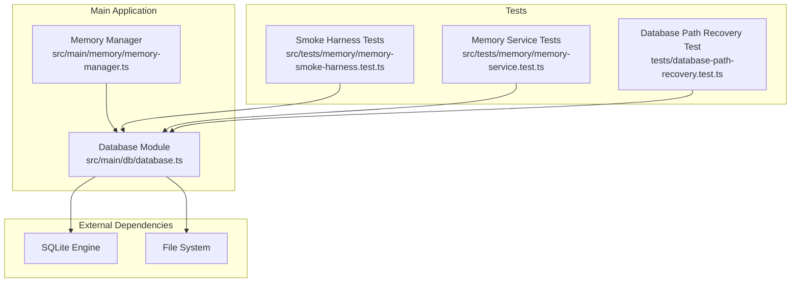
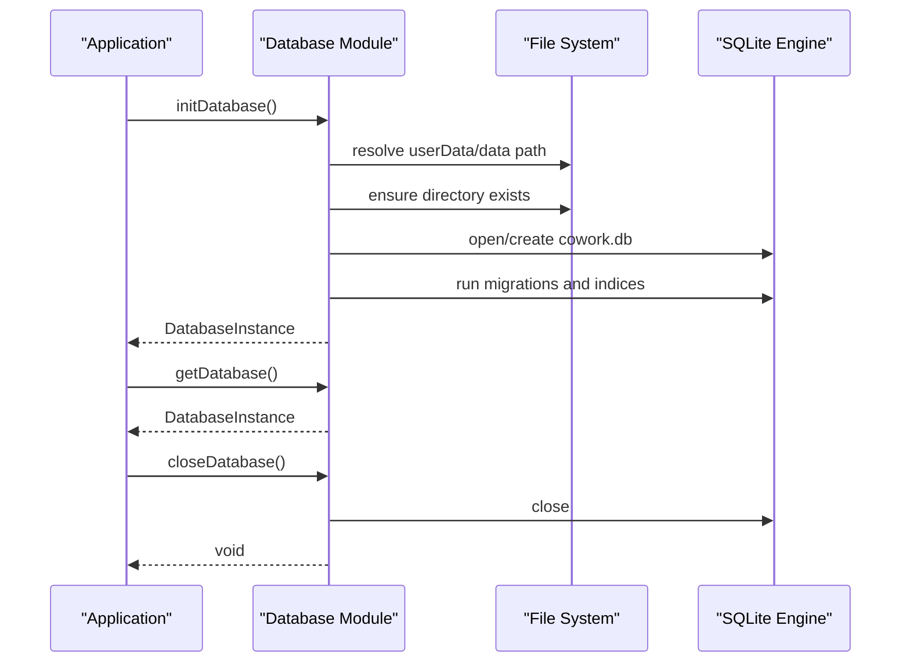
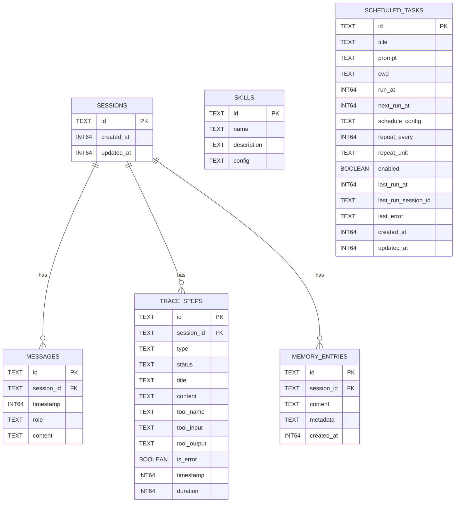
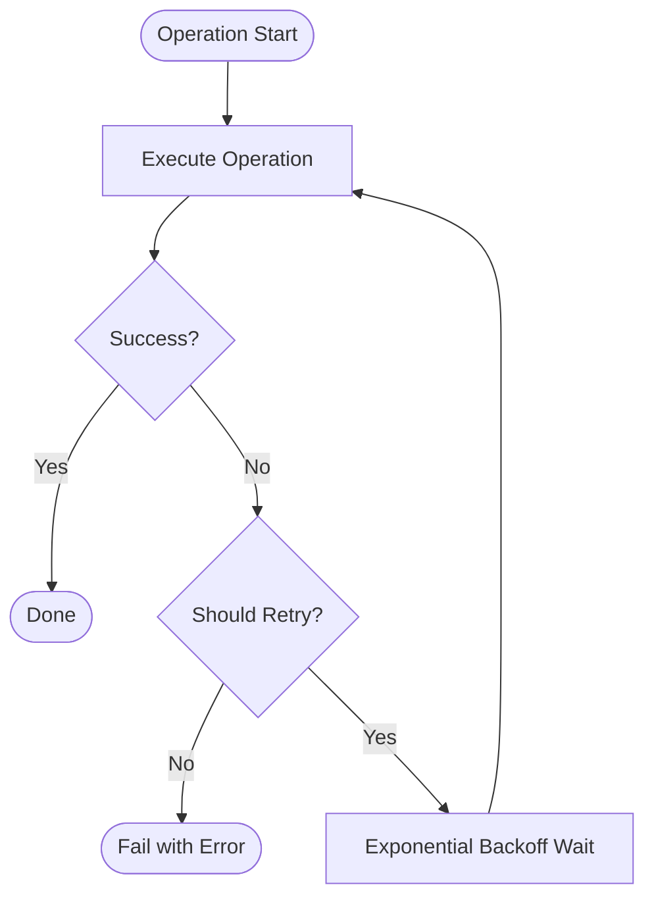
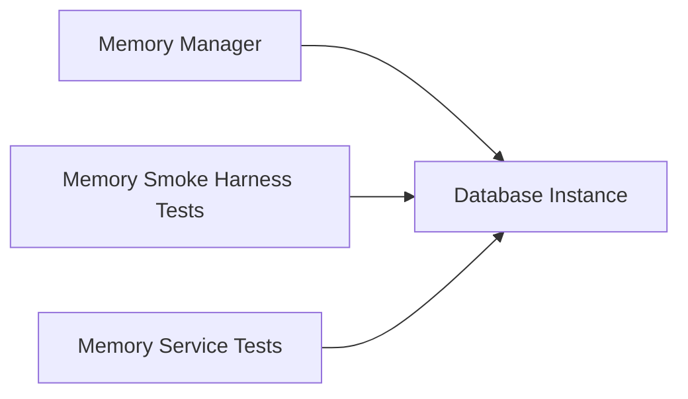

# Database API

<cite>
**Referenced Files in This Document**
- [database.ts](file://src/main/db/database.ts)
- [memory-manager.ts](file://src/main/memory/memory-manager.ts)
- [memory-service.test.ts](file://src/tests/memory/memory-service.test.ts)
- [memory-smoke-harness.test.ts](file://src/tests/memory/memory-smoke-harness.test.ts)
- [database-path-recovery.test.ts](file://tests/database-path-recovery.test.ts)
- [channel-base.ts](file://src/main/remote/channels/channel-base.ts)
- [retry.test.ts](file://tests/retry.test.ts)
</cite>

## Table of Contents

1. [Introduction](#introduction)
2. [Project Structure](#project-structure)
3. [Core Components](#core-components)
4. [Architecture Overview](#architecture-overview)
5. [Detailed Component Analysis](#detailed-component-analysis)
6. [Dependency Analysis](#dependency-analysis)
7. [Performance Considerations](#performance-considerations)
8. [Troubleshooting Guide](#troubleshooting-guide)
9. [Conclusion](#conclusion)
10. [Appendices](#appendices)

## Introduction

This document describes the database layer powering Open Cowork’s session and memory storage, configuration persistence, and scheduled tasks. It covers the SQLite schema, connection lifecycle, transaction handling, query patterns, indexing strategies, and operational procedures such as backup and recovery. It also documents data models for sessions, messages, trace steps, memory entries, skills, and scheduled tasks, along with CRUD and bulk operation patterns, integrity constraints, and security considerations.

## Project Structure

The database layer centers around a single SQLite database managed by a dedicated module. The module initializes tables, prepares statements, exposes typed repositories, and handles lifecycle events such as opening, closing, and recovering from malformed or conflicting paths. Memory operations leverage the same database instance for persistence.

**Diagram sources**

- [database.ts:412-741](file://src/main/db/database.ts#L412-L741)
- [memory-manager.ts:299-332](file://src/main/memory/memory-manager.ts#L299-L332)
- [memory-smoke-harness.test.ts:173-219](file://src/tests/memory/memory-smoke-harness.test.ts#L173-L219)
- [memory-service.test.ts:206-253](file://src/tests/memory/memory-service.test.ts#L206-L253)
- [database-path-recovery.test.ts:131-147](file://tests/database-path-recovery.test.ts#L131-L147)

**Section sources**

- [database.ts:412-741](file://src/main/db/database.ts#L412-L741)
- [memory-manager.ts:299-332](file://src/main/memory/memory-manager.ts#L299-L332)
- [memory-smoke-harness.test.ts:173-219](file://src/tests/memory/memory-smoke-harness.test.ts#L173-L219)
- [memory-service.test.ts:206-253](file://src/tests/memory/memory-service.test.ts#L206-L253)
- [database-path-recovery.test.ts:131-147](file://tests/database-path-recovery.test.ts#L131-L147)

## Core Components

- Database initialization and lifecycle management
- Typed repositories for sessions, messages, trace steps, memory entries, skills, and scheduled tasks
- Statement preparation and reuse
- Schema migration helpers and safety checks
- Backup and recovery routines for database files and WAL/SHM artifacts
- Operational retry patterns for transient failures

**Section sources**

- [database.ts:412-741](file://src/main/db/database.ts#L412-L741)
- [database.ts:225-345](file://src/main/db/database.ts#L225-L345)
- [database.ts:382-407](file://src/main/db/database.ts#L382-L407)

## Architecture Overview

The database module encapsulates:

- A singleton database instance with lazy initialization
- A typed facade exposing repositories per domain entity
- Prepared statements for frequent operations
- Index creation for hot query paths
- Directory and file recovery for robust startup

**Diagram sources**

- [database.ts:412-741](file://src/main/db/database.ts#L412-L741)

## Detailed Component Analysis

### Database Initialization and Lifecycle

- Initializes the database directory under the user data path and ensures it is a directory.
- Recovers legacy SQLite files by moving them into the data directory and renaming WAL/SHM files appropriately.
- Opens or creates the SQLite database file and applies schema and indices.
- Exposes a typed facade with prepared statements and convenience methods.

Operational highlights:

- Directory recovery moves non-directory entries to backups and replaces them with directories.
- Legacy SQLite files are detected via header signature and relocated.
- WAL/SHM files are renamed alongside the database to maintain atomicity during recovery.

**Section sources**

- [database.ts:164-196](file://src/main/db/database.ts#L164-L196)
- [database.ts:412-741](file://src/main/db/database.ts#L412-L741)
- [database-path-recovery.test.ts:131-147](file://tests/database-path-recovery.test.ts#L131-L147)

### Schema Definitions and Relationships

The schema defines the following tables and indices:

- Sessions
  - Purpose: Stores conversation sessions.
  - Key fields: id (primary key), created_at, updated_at.
  - Relationships: Messages, TraceSteps, MemoryEntries reference session_id.

- Messages
  - Purpose: Stores individual message records within sessions.
  - Key fields: id (primary key), session_id (foreign key), timestamp, role, content.
  - Indices: By session_id, by timestamp.

- Trace Steps
  - Purpose: Stores step-level traces for session execution.
  - Key fields: id (primary key), session_id (foreign key), type, status, title, content, timestamps, duration.
  - Indices: By session_id, by timestamp.

- Memory Entries
  - Purpose: Stores memory items associated with sessions.
  - Key fields: id (primary key), session_id (foreign key), content, metadata, created_at.
  - Notes: Used by memory manager for retrieval and deletion.

- Skills
  - Purpose: Stores skill definitions or configurations.
  - Notes: Present in schema; usage depends on runtime features.

- Scheduled Tasks
  - Purpose: Stores scheduled jobs with recurrence and execution history.
  - Key fields: id (primary key), title, prompt, cwd, run_at, next_run_at, schedule_config, repeat_every, repeat_unit, enabled, last_run_at, last_run_session_id, last_error, created_at, updated_at.
  - Indices: By next_run_at for efficient scheduling scans.

**Diagram sources**

- [database.ts:225-345](file://src/main/db/database.ts#L225-L345)

**Section sources**

- [database.ts:225-345](file://src/main/db/database.ts#L225-L345)

### Repositories and Typed Operations

The DatabaseInstance exposes typed repositories for each table. Each repository provides:

- Create: Insert new rows with prepared statements.
- Update: Patch specific fields with dynamic SET clauses and identifier validation.
- Get: Fetch a single row by primary key.
- GetAll: Fetch all rows (where applicable).
- Delete: Remove a row by primary key.
- Bulk operations: Delete by session_id for messages and trace steps.

Examples of repository usage are visible in tests and memory manager code.

**Section sources**

- [database.ts:560-716](file://src/main/db/database.ts#L560-L716)
- [memory-manager.ts:299-332](file://src/main/memory/memory-manager.ts#L299-L332)
- [memory-service.test.ts:206-253](file://src/tests/memory/memory-service.test.ts#L206-L253)
- [memory-smoke-harness.test.ts:173-219](file://src/tests/memory/memory-smoke-harness.test.ts#L173-L219)

### Transaction Handling and Concurrency

- The database module uses prepared statements and executes DML operations directly. There is no explicit transaction wrapper in the module itself.
- For reliability under transient failures, the codebase includes a generic retry helper that can wrap operations such as remote channel interactions. While not a database transaction, it demonstrates a pattern for retrying transient failures.

**Diagram sources**

- [channel-base.ts:190-232](file://src/main/remote/channels/channel-base.ts#L190-L232)
- [retry.test.ts:46-89](file://tests/retry.test.ts#L46-L89)

**Section sources**

- [channel-base.ts:190-232](file://src/main/remote/channels/channel-base.ts#L190-L232)
- [retry.test.ts:46-89](file://tests/retry.test.ts#L46-L89)

### Query Patterns and Optimization

- Prepared statements are reused for frequently executed operations (sessions, messages, trace steps, scheduled tasks).
- Indices are created on hot query paths:
  - messages(session_id), messages(timestamp)
  - trace_steps(session_id), trace_steps(timestamp)
  - scheduled_tasks(next_run_at)
- These indices support common queries such as fetching messages or trace steps by session, ordering by timestamp, and scanning upcoming scheduled tasks efficiently.

Bulk deletion patterns:

- Delete messages by session_id
- Delete trace steps by session_id
- Delete memory entries by session_id

**Section sources**

- [database.ts:279-345](file://src/main/db/database.ts#L279-L345)
- [database.ts:597-650](file://src/main/db/database.ts#L597-L650)
- [memory-manager.ts:312-331](file://src/main/memory/memory-manager.ts#L312-L331)

### Data Migration Procedures

- Column addition helper validates column definitions and adds columns safely.
- Schema initialization runs CREATE TABLE IF NOT EXISTS and CREATE INDEX IF NOT EXISTS for all tables and indices.
- During startup, the module ensures the database directory exists and recovers any legacy SQLite files.

Migration safeguards:

- Type validation for column definitions.
- Existence checks before altering schema.
- Atomic recovery of database and WAL/SHM files.

**Section sources**

- [database.ts:382-407](file://src/main/db/database.ts#L382-L407)
- [database.ts:412-741](file://src/main/db/database.ts#L412-L741)

### Integrity Constraints and Security

- Primary keys and foreign keys define referential integrity among sessions and their child entities.
- Timestamps and created_at/updated_at fields support audit trails and chronological ordering.
- No explicit encryption-at-rest is implemented in the database module. Encryption is handled at the configuration store level using an encrypted store utility.

Access control:

- The database module does not implement application-level access control. Access to the database file is governed by filesystem permissions of the user data directory.

**Section sources**

- [database.ts:225-345](file://src/main/db/database.ts#L225-L345)
- [database.ts:412-741](file://src/main/db/database.ts#L412-L741)

## Dependency Analysis

The memory manager depends on the database instance for persistence operations. Tests validate repository behavior against the schema and confirm expected queries.

**Diagram sources**

- [memory-manager.ts:299-332](file://src/main/memory/memory-manager.ts#L299-L332)
- [memory-smoke-harness.test.ts:173-219](file://src/tests/memory/memory-smoke-harness.test.ts#L173-L219)
- [memory-service.test.ts:206-253](file://src/tests/memory/memory-service.test.ts#L206-L253)

**Section sources**

- [memory-manager.ts:299-332](file://src/main/memory/memory-manager.ts#L299-L332)
- [memory-smoke-harness.test.ts:173-219](file://src/tests/memory/memory-smoke-harness.test.ts#L173-L219)
- [memory-service.test.ts:206-253](file://src/tests/memory/memory-service.test.ts#L206-L253)

## Performance Considerations

- Prefer prepared statements for repeated operations to reduce parsing overhead.
- Use indices on filter/order columns (session_id, timestamp) to accelerate queries.
- Batch deletions by session_id to avoid row-by-row overhead.
- Keep WAL/SHM files co-located with the database file to minimize cross-file synchronization costs.
- Monitor scheduled_tasks next_run_at scans for performance as systems scale.

[No sources needed since this section provides general guidance]

## Troubleshooting Guide

Common issues and resolutions:

- Database path conflicts: The module detects non-directory entries and backs them up before creating directories. Legacy SQLite files are recovered into the data directory.
- WAL/SHM file mismatches: On recovery, WAL and SHM files are renamed to match the new database filename.
- Startup errors: Ensure the user data directory is writable and free of conflicting non-directory entries.

Operational checks:

- Verify database path existence and directory status.
- Confirm presence of cowork.db and associated WAL/SHM files after recovery.
- Validate that indices exist for hot query paths.

**Section sources**

- [database.ts:164-196](file://src/main/db/database.ts#L164-L196)
- [database.ts:412-741](file://src/main/db/database.ts#L412-L741)
- [database-path-recovery.test.ts:131-147](file://tests/database-path-recovery.test.ts#L131-L147)

## Conclusion

Open Cowork’s database layer provides a robust, schema-initialized SQLite backend with typed repositories, optimized indices, and resilient startup recovery. While encryption-at-rest is not implemented here, the system maintains integrity via primary/foreign keys and supports efficient CRUD and bulk operations. For production deployments, ensure proper filesystem permissions and monitor scheduled task performance.

[No sources needed since this section summarizes without analyzing specific files]

## Appendices

### Appendix A: Repository Method Catalog

- Sessions: create, update, get, getAll, delete
- Messages: create, update, get, getAll, delete, deleteBySessionId
- Trace Steps: create, update, get, getAll, deleteBySessionId
- Scheduled Tasks: create, update, get, getAll, delete
- Utilities: prepare, exec, pragma, close

**Section sources**

- [database.ts:560-716](file://src/main/db/database.ts#L560-L716)
