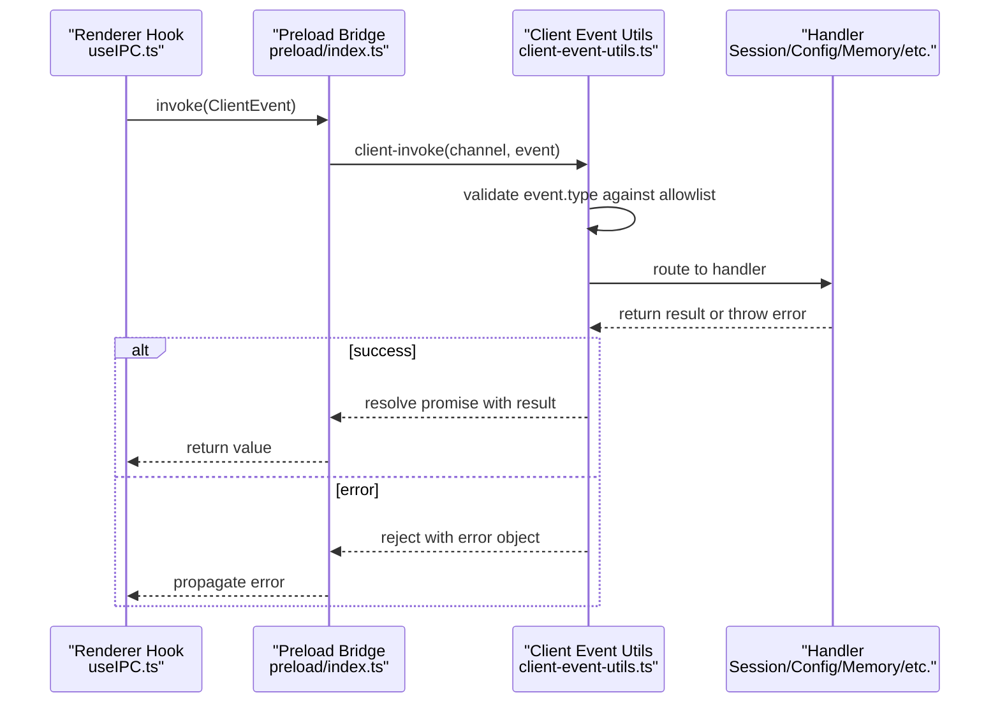
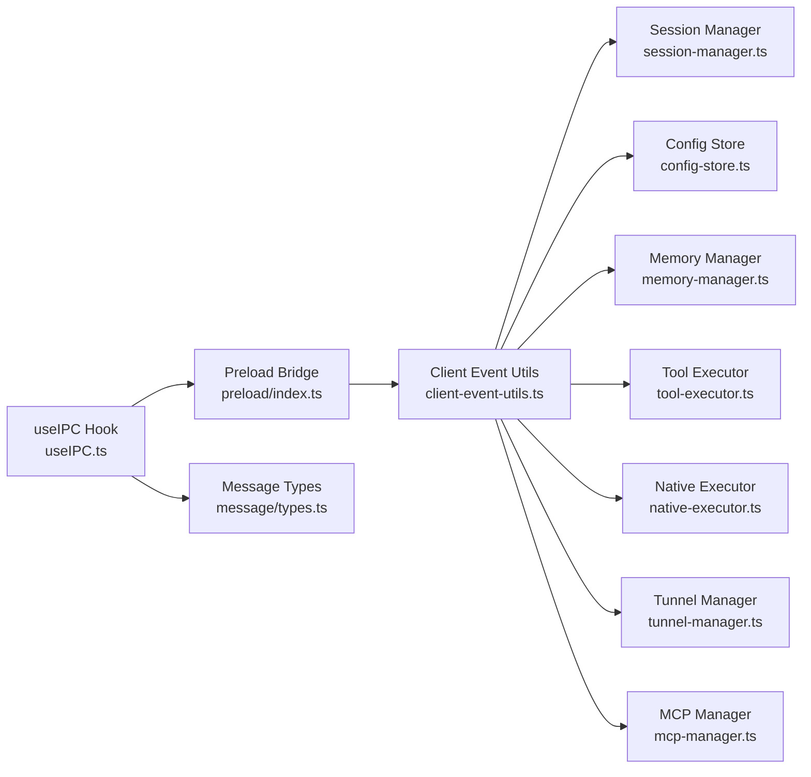

# IPC Communication

<cite>
**Referenced Files in This Document**
- [src/preload/index.ts](file://src/preload/index.ts)
- [src/main/client-event-utils.ts](file://src/main/client-event-utils.ts)
- [src/main/index.ts](file://src/main/index.ts)
- [src/renderer/hooks/useIPC.ts](file://src/renderer/hooks/useIPC.ts)
- [src/shared/ipc-types.ts](file://src/shared/ipc-types.ts)
- [src/main/sandbox/index.ts](file://src/main/sandbox/index.ts)
- [src/main/session/session-manager.ts](file://src/main/session/session-manager.ts)
- [src/main/config/config-store.ts](file://src/main/config/config-store.ts)
- [src/main/memory/memory-manager.ts](file://src/main/memory/memory-manager.ts)
- [src/main/tools/tool-executor.ts](file://src/main/tools/tool-executor.ts)
- [src/main/sandbox/native-executor.ts](file://src/main/sandbox/native-executor.ts)
- [src/main/remote/tunnel-manager.ts](file://src/main/remote/tunnel-manager.ts)
- [src/main/mcp/mcp-manager.ts](file://src/main/mcp/mcp-manager.ts)
- [src/main/utils/logger.ts](file://src/main/utils/logger.ts)
- [src/main/utils/retry.ts](file://src/main/utils/retry.ts)
- [src/main/utils/error-utils.ts](file://src/main/utils/error-utils.ts)
- [src/renderer/components/message/types.ts](file://src/renderer/components/message/types.ts)
- [src/renderer/utils/session-update.ts](file://src/renderer/utils/session-update.ts)
- [src/renderer/utils/renderer-diagnostics.ts](file://src/renderer/utils/renderer-diagnostics.ts)
</cite>

## Table of Contents

1. [Introduction](#introduction)
2. [Project Structure](#project-structure)
3. [Core Components](#core-components)
4. [Architecture Overview](#architecture-overview)
5. [Detailed Component Analysis](#detailed-component-analysis)
6. [Dependency Analysis](#dependency-analysis)
7. [Performance Considerations](#performance-considerations)
8. [Troubleshooting Guide](#troubleshooting-guide)
9. [Conclusion](#conclusion)

## Introduction

This document describes the Inter-Process Communication (IPC) system used by Open Cowork to coordinate between the Electron main process and renderer processes. It covers the IPC handler registration mechanism, message format schemas, bidirectional communication patterns, client-event utilities for routing, error propagation, and response handling. Practical examples illustrate common operations such as session management, configuration updates, and file operations. Security, timeouts, and debugging techniques are also documented to ensure robust and observable IPC behavior.

## Project Structure

The IPC system spans three primary areas:

- Preload bridge exposing safe IPC APIs to the renderer
- Main-process client-event utilities and handler dispatch
- Renderer-side hook for invoking handlers and managing listeners

```mermaid
graph TB
subgraph "Preload Layer"
PB["Preload Bridge<br/>src/preload/index.ts"]
end
subgraph "Main Process"
CEU["Client Event Utils<br/>src/main/client-event-utils.ts"]
SM["Session Manager<br/>src/main/session/session-manager.ts"]
CS["Config Store<br/>src/main/config/config-store.ts"]
MM["Memory Manager<br/>src/main/memory/memory-manager.ts"]
TE["Tool Executor<br/>src/main/tools/tool-executor.ts"]
NE["Native Executor<br/>src/main/sandbox/native-executor.ts"]
TM["Tunnel Manager<br/>src/main/remote/tunnel-manager.ts"]
MCP["MCP Manager<br/>src/main/mcp/mcp-manager.ts"]
SB["Sandbox Bootstrap<br/>src/main/sandbox/index.ts"]
end
subgraph "Renderer"
HOOK["useIPC Hook<br/>src/renderer/hooks/useIPC.ts"]
TYPES["Message Types<br/>src/renderer/components/message/types.ts"]
end
PB -- "client-event" | "client-invoke" | "server-event" --> CEU
CEU --> SM
CEU --> CS
CEU --> MM
CEU --> TE
CEU --> NE
CEU --> TM
CEU --> MCP
CEU --> SB
HOOK -- "invoke/send/on" --> PB
HOOK --> TYPES
```

**Diagram sources**

- [src/preload/index.ts:47-126](file://src/preload/index.ts#L47-L126)
- [src/main/client-event-utils.ts:1-200](file://src/main/client-event-utils.ts#L1-L200)
- [src/renderer/hooks/useIPC.ts:1-200](file://src/renderer/hooks/useIPC.ts#L1-L200)
- [src/main/session/session-manager.ts:1-200](file://src/main/session/session-manager.ts#L1-L200)
- [src/main/config/config-store.ts:1-200](file://src/main/config/config-store.ts#L1-L200)
- [src/main/memory/memory-manager.ts:1-200](file://src/main/memory/memory-manager.ts#L1-L200)
- [src/main/tools/tool-executor.ts:1-200](file://src/main/tools/tool-executor.ts#L1-L200)
- [src/main/sandbox/native-executor.ts:1-200](file://src/main/sandbox/native-executor.ts#L1-L200)
- [src/main/remote/tunnel-manager.ts:1-200](file://src/main/remote/tunnel-manager.ts#L1-L200)
- [src/main/mcp/mcp-manager.ts:1-200](file://src/main/mcp/mcp-manager.ts#L1-L200)
- [src/main/sandbox/index.ts:1-200](file://src/main/sandbox/index.ts#L1-L200)

**Section sources**

- [src/preload/index.ts:47-126](file://src/preload/index.ts#L47-L126)
- [src/main/client-event-utils.ts:1-200](file://src/main/client-event-utils.ts#L1-L200)
- [src/renderer/hooks/useIPC.ts:1-200](file://src/renderer/hooks/useIPC.ts#L1-L200)

## Core Components

- Preload bridge: Exposes a controlled subset of IPC APIs to renderer code, enforcing an allowlist of client events and preventing arbitrary channel usage.
- Client-event utilities: Central dispatcher that validates, routes, and executes handlers for incoming client events, returning structured responses or errors.
- Renderer hook: Provides a typed interface for invoking main-process handlers and subscribing to server events with lifecycle-aware cleanup.

Key responsibilities:

- Message schema enforcement via allowlists and typed event structures
- Bidirectional communication: renderer-to-main sends and main-to-renderer events
- Error propagation: exceptions are captured and returned as structured error responses
- Response handling: invoke-based calls return promises resolved with handler results

**Section sources**

- [src/preload/index.ts:47-126](file://src/preload/index.ts#L47-L126)
- [src/main/client-event-utils.ts:1-200](file://src/main/client-event-utils.ts#L1-L200)
- [src/renderer/hooks/useIPC.ts:1-200](file://src/renderer/hooks/useIPC.ts#L1-L200)

## Architecture Overview

The IPC architecture follows a strict contract:

- Renderer invokes handlers via the preload bridge using a typed client event
- Main process validates the event type against an allowlist and dispatches to the appropriate handler
- Handlers execute business logic and return a result or throw an error
- Responses are sent back to the renderer as server events or resolved promises
- Events can be emitted unidirectionally from main to renderer for real-time updates



**Diagram sources**

- [src/renderer/hooks/useIPC.ts:1-200](file://src/renderer/hooks/useIPC.ts#L1-L200)
- [src/preload/index.ts:109-117](file://src/preload/index.ts#L109-L117)
- [src/main/client-event-utils.ts:1-200](file://src/main/client-event-utils.ts#L1-L200)

## Detailed Component Analysis

### Preload Bridge: Security and Exposure

The preload bridge exposes a minimal API surface to renderer code:

- send(event): Validates event.type against an allowlist and forwards to main via a dedicated channel
- on(callback): Registers a single server-event listener with automatic cleanup and callback storage
- invoke<T>(event): Validates event.type, sends a request to main, and returns a typed Promise
- Additional platform/system queries exposed for convenience

Security controls:

- Allowlist prevents spoofing arbitrary IPC channels
- Single listener per window lifecycle prevents memory leaks
- Strict logging aids debugging

**Section sources**

- [src/preload/index.ts:47-126](file://src/preload/index.ts#L47-L126)

### Client-Event Utilities: Handler Registration and Dispatch

The main-process client-event utilities centralize IPC handling:

- Event validation: Ensures event.type matches allowed set
- Handler routing: Maps event types to specific handler functions
- Error wrapping: Catches exceptions and returns structured error responses
- Response formatting: Returns either a successful result or an error object

Handler registration pattern:

- Define handler functions for each supported event type
- Register handlers in a dispatch map keyed by event.type
- Dispatch to handlers based on validated event.type

Response handling:

- For invoke requests, resolve or reject based on handler outcome
- For send events, optionally emit a server event response

**Section sources**

- [src/main/client-event-utils.ts:1-200](file://src/main/client-event-utils.ts#L1-L200)

### Renderer Hook: Typed Invocation and Event Subscription

The renderer hook provides a typed interface:

- invoke(event): Sends a request and awaits a response
- on(callback): Subscribes to server events with automatic cleanup
- Lifecycle management: Returns a cleanup function to remove listeners

Integration points:

- Uses preload bridge methods under the hood
- Integrates with renderer-side message types for strong typing

**Section sources**

- [src/renderer/hooks/useIPC.ts:1-200](file://src/renderer/hooks/useIPC.ts#L1-L200)

### Message Format Schemas

IPC messages follow a consistent schema enforced by the allowlist and typed structures:

- ClientEvent: { type: string; payload?: Record<string, unknown> }
- ServerEvent: { type: string; payload?: Record<string, unknown> }
- Error envelope: { isError: true; message: string; code?: string; stack?: string }

Validation rules:

- event.type must be present and in the allowlist
- payload is optional but must be serializable
- Errors are normalized and propagated to the renderer

**Section sources**

- [src/shared/ipc-types.ts:1-200](file://src/shared/ipc-types.ts#L1-L200)
- [src/preload/index.ts:47-64](file://src/preload/index.ts#L47-L64)

### Bidirectional Communication Patterns

Patterns supported:

- Request-response: invoke-based calls for synchronous-like operations
- Unidirectional events: server-to-renderer emissions for real-time updates
- Listener lifecycle: automatic cleanup on hook unmount or explicit removal

Common flows:

- Session management: start/continue/stop/delete sessions
- Configuration updates: update settings and receive immediate feedback
- File operations: select folders, get/set working directory
- Memory operations: manage memory stores and retrievals
- Tool execution: invoke sandboxed or native tool commands

**Section sources**

- [src/main/client-event-utils.ts:1-200](file://src/main/client-event-utils.ts#L1-L200)
- [src/renderer/hooks/useIPC.ts:1-200](file://src/renderer/hooks/useIPC.ts#L1-L200)

### Handler Signatures, Validation, and Return Values

Handlers are registered per event type and must adhere to:

- Signature: (payload: Record<string, unknown>) => Promise<any> | any
- Parameter validation: Validate required fields and types
- Return value: Primitive, object, or array; avoid circular references
- Error handling: Throw typed errors or return error envelopes

Examples of typical handlers:

- Session handlers: start, continue, stop, delete, list, getMessages, getTraceSteps
- Config handlers: settings.update
- File handlers: folder.select, workdir.get, workdir.set, workdir.select
- Permission handlers: permission.response, sudo.password.response

**Section sources**

- [src/main/session/session-manager.ts:1-200](file://src/main/session/session-manager.ts#L1-L200)
- [src/main/config/config-store.ts:1-200](file://src/main/config/config-store.ts#L1-L200)
- [src/main/tools/tool-executor.ts:1-200](file://src/main/tools/tool-executor.ts#L1-L200)

### Practical Examples

#### Session Management

Operations:

- Start a new session
- Continue an existing session
- Stop or delete a session
- List sessions and fetch messages/trace steps

Typical flow:

- Renderer invokes a session handler via useIPC
- Main validates and routes to session manager
- Session manager executes operation and returns result
- Renderer receives result and updates UI

**Section sources**

- [src/main/session/session-manager.ts:1-200](file://src/main/session/session-manager.ts#L1-L200)
- [src/renderer/hooks/useIPC.ts:1-200](file://src/renderer/hooks/useIPC.ts#L1-L200)

#### Configuration Updates

Operations:

- Update settings
- Retrieve current configuration

Typical flow:

- Renderer sends settings.update with payload
- Main validates and updates config store
- Main emits a server event to confirm change
- Renderer reflects new settings

**Section sources**

- [src/main/config/config-store.ts:1-200](file://src/main/config/config-store.ts#L1-L200)
- [src/renderer/hooks/useIPC.ts:1-200](file://src/renderer/hooks/useIPC.ts#L1-L200)

#### File Operations

Operations:

- Select a folder
- Get or set working directory
- Select working directory

Typical flow:

- Renderer triggers a file operation handler
- Main resolves path constraints and returns result
- Renderer displays selected path or updates UI

**Section sources**

- [src/main/sandbox/native-executor.ts:1-200](file://src/main/sandbox/native-executor.ts#L1-L200)
- [src/renderer/hooks/useIPC.ts:1-200](file://src/renderer/hooks/useIPC.ts#L1-L200)

### Error Handling Strategies

- Centralized error wrapping: Exceptions are caught and returned as structured error objects
- Typed errors: Handlers may throw domain-specific errors with codes and messages
- Renderer propagation: Errors are surfaced to the renderer via rejected promises or error events
- Logging: Both main and renderer maintain logs for debugging IPC failures

**Section sources**

- [src/main/client-event-utils.ts:1-200](file://src/main/client-event-utils.ts#L1-L200)
- [src/main/utils/error-utils.ts:1-200](file://src/main/utils/error-utils.ts#L1-L200)
- [src/main/utils/logger.ts:1-200](file://src/main/utils/logger.ts#L1-L200)

### Timeout Mechanisms

- Invoke timeouts: Consider adding configurable timeouts around invoke calls to prevent hanging
- Handler timeouts: Optionally wrap long-running handlers with timeouts and cancellation
- Retry policies: For transient failures, apply exponential backoff retries

Note: Current implementation does not define global timeouts. Implement per-handler timeout policies as needed.

**Section sources**

- [src/main/utils/retry.ts:1-200](file://src/main/utils/retry.ts#L1-L200)

### Security Considerations

- Allowlist enforcement: Only approved event types are permitted
- Payload validation: Validate and sanitize payloads before processing
- Least privilege: Handlers operate with minimal required permissions
- Sandboxing: File and tool operations are constrained by sandbox policies

**Section sources**

- [src/preload/index.ts:47-64](file://src/preload/index.ts#L47-L64)
- [src/main/sandbox/native-executor.ts:1-200](file://src/main/sandbox/native-executor.ts#L1-L200)

### Debugging Techniques and Monitoring

- Preload logging: Track send/invoke calls and blocked unauthorized events
- Main logging: Log handler dispatch, execution time, and errors
- Renderer diagnostics: Monitor event subscriptions and response timing
- Error breadcrumbs: Capture stack traces and contextual metadata

**Section sources**

- [src/preload/index.ts:75-117](file://src/preload/index.ts#L75-L117)
- [src/main/utils/logger.ts:1-200](file://src/main/utils/logger.ts#L1-L200)
- [src/renderer/utils/renderer-diagnostics.ts:1-200](file://src/renderer/utils/renderer-diagnostics.ts#L1-L200)

## Dependency Analysis

The IPC system exhibits low coupling and high cohesion:

- Preload depends on Electron IPC and maintains a strict allowlist
- Client-event utilities depend on handler registries and dispatch logic
- Handlers depend on domain services (session, config, memory, tools)
- Renderer hook depends on preload bridge and message types



**Diagram sources**

- [src/preload/index.ts:47-126](file://src/preload/index.ts#L47-L126)
- [src/main/client-event-utils.ts:1-200](file://src/main/client-event-utils.ts#L1-L200)
- [src/renderer/hooks/useIPC.ts:1-200](file://src/renderer/hooks/useIPC.ts#L1-L200)
- [src/renderer/components/message/types.ts:1-200](file://src/renderer/components/message/types.ts#L1-L200)

**Section sources**

- [src/preload/index.ts:47-126](file://src/preload/index.ts#L47-L126)
- [src/main/client-event-utils.ts:1-200](file://src/main/client-event-utils.ts#L1-L200)
- [src/renderer/hooks/useIPC.ts:1-200](file://src/renderer/hooks/useIPC.ts#L1-L200)

## Performance Considerations

- Minimize payload sizes: Keep payloads compact to reduce serialization overhead
- Batch operations: Combine related operations to reduce IPC round-trips
- Debounce frequent events: Throttle UI-driven IPC to avoid overload
- Asynchronous handlers: Avoid blocking the main thread; offload heavy work to workers or background tasks

## Troubleshooting Guide

Common issues and resolutions:

- Unauthorized event type: Verify event.type is in the allowlist; check preload bridge configuration
- Handler not found: Ensure handler is registered in the dispatch map; confirm event.type spelling
- Serialization errors: Avoid sending non-serializable objects; use primitives or plain objects
- Memory leaks: Ensure listeners are cleaned up; use the returned cleanup function from on()
- Timeouts: Add per-invocation timeouts and retry logic for transient failures

**Section sources**

- [src/preload/index.ts:70-117](file://src/preload/index.ts#L70-L117)
- [src/main/client-event-utils.ts:1-200](file://src/main/client-event-utils.ts#L1-L200)
- [src/renderer/hooks/useIPC.ts:1-200](file://src/renderer/hooks/useIPC.ts#L1-L200)

## Conclusion

Open Cowork’s IPC system provides a secure, typed, and extensible foundation for inter-process communication. By enforcing allowlists, centralizing dispatch, and offering a clean renderer hook, it balances safety and usability. Extending the system involves registering new handlers, updating the allowlist, and ensuring proper error and logging coverage.
