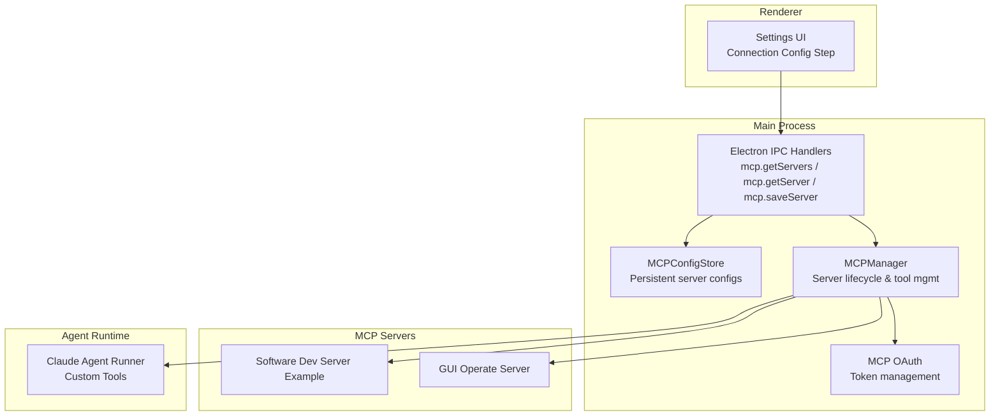
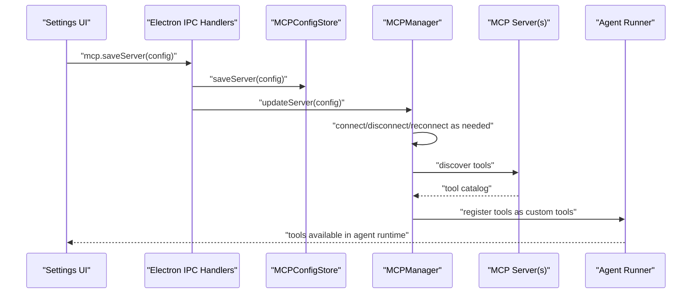
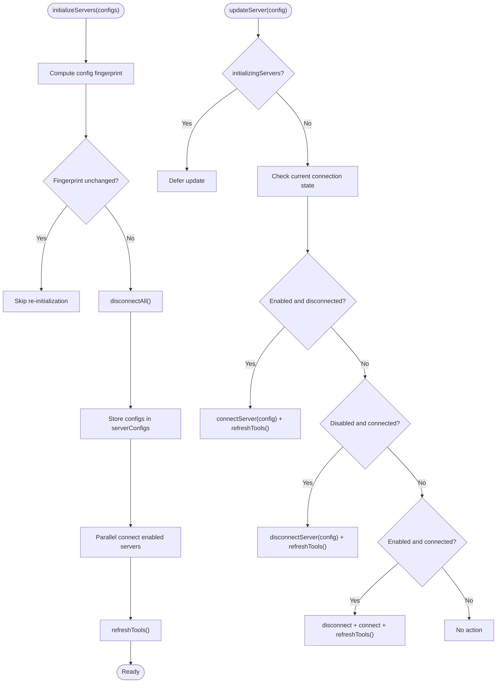
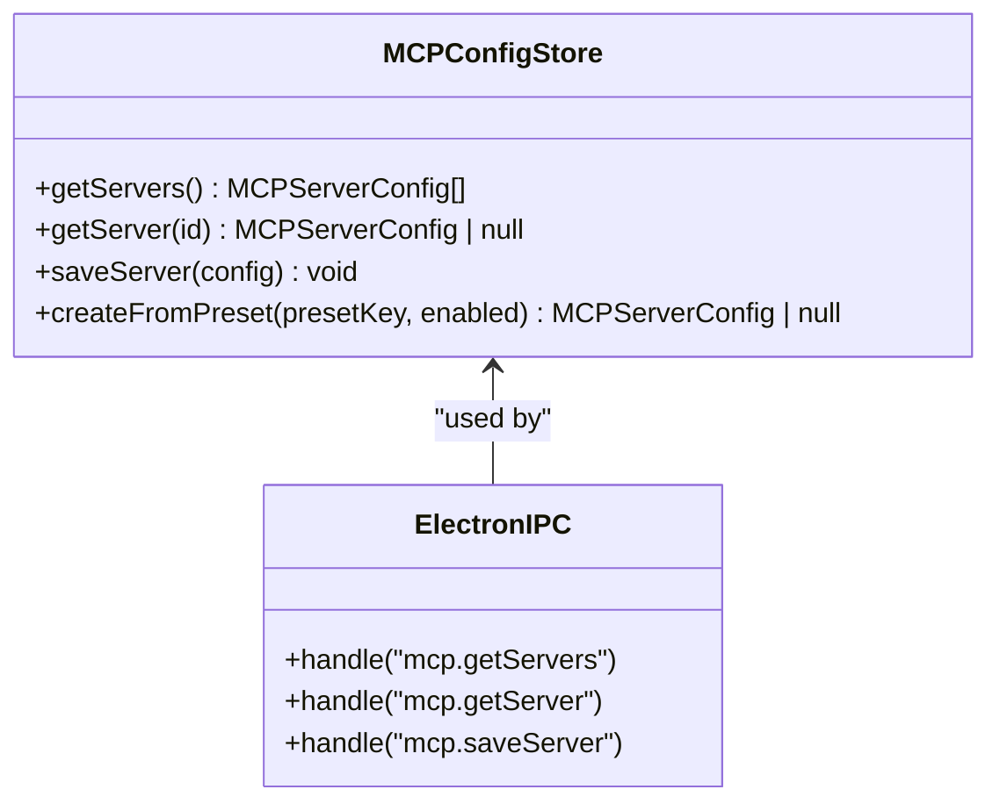
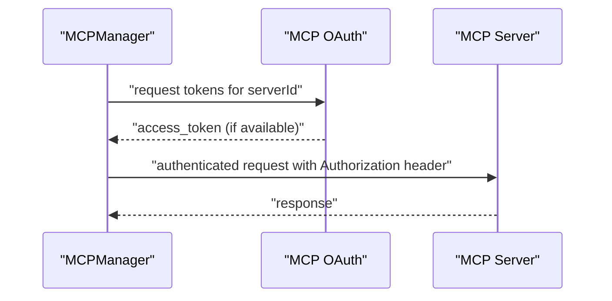
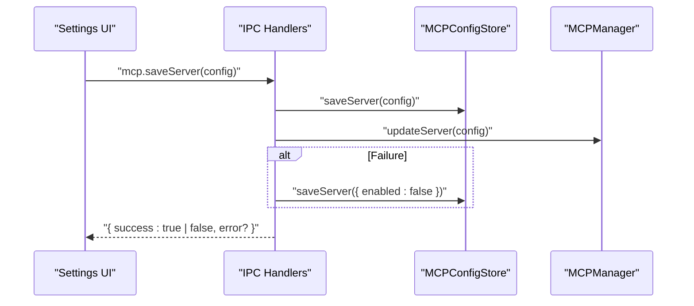
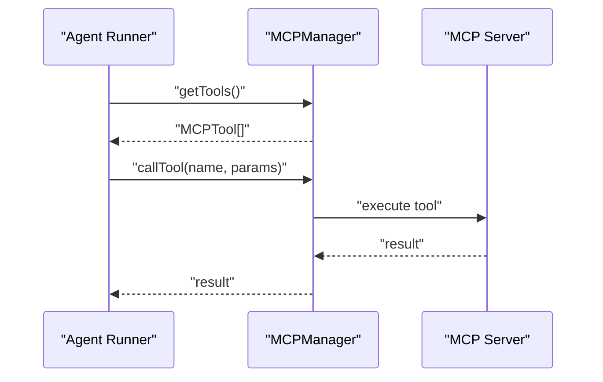
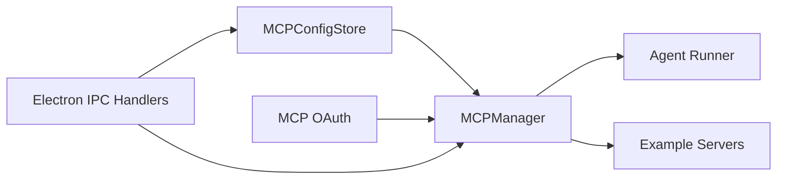

# MCP Protocol

<cite>
**Referenced Files in This Document**
- [mcp-manager.ts](file://src/main/mcp/mcp-manager.ts)
- [mcp-config-store.ts](file://src/main/mcp/mcp-config-store.ts)
- [mcp-oauth.ts](file://src/main/mcp/mcp-oauth.ts)
- [gui-operate-server.ts](file://src/main/mcp/gui-operate-server.ts)
- [software-dev-server-example.ts](file://src/main/mcp/software-dev-server-example.ts)
- [index.ts](file://src/main/index.ts)
- [agent-runner.ts](file://src/main/claude/agent-runner.ts)
- [mcp-manager.test.ts](file://src/tests/mcp/mcp-manager.test.ts)
- [mcp-oauth.test.ts](file://tests/mcp-oauth.test.ts)
- [bundle-mcp.js](file://scripts/bundle-mcp.js)
</cite>

## Table of Contents

1. [Introduction](#introduction)
2. [Project Structure](#project-structure)
3. [Core Components](#core-components)
4. [Architecture Overview](#architecture-overview)
5. [Detailed Component Analysis](#detailed-component-analysis)
6. [Dependency Analysis](#dependency-analysis)
7. [Performance Considerations](#performance-considerations)
8. [Troubleshooting Guide](#troubleshooting-guide)
9. [Conclusion](#conclusion)
10. [Appendices](#appendices)

## Introduction

This document provides comprehensive API documentation for the Model Context Protocol (MCP) implementation in the project. It covers the MCP Manager interface for server discovery, connection management, and tool execution; the MCP Configuration Store for server settings, authentication credentials, and connection parameters; OAuth integration for secure MCP server authentication and token management; message schemas for MCP requests and responses; protocol versioning and error codes; examples of custom MCP server development and client integration patterns; and security considerations, rate limiting, and performance optimization strategies. It also includes troubleshooting guidance for common MCP connectivity and authentication issues.

## Project Structure

The MCP implementation is organized around several core modules:

- MCP Manager: Orchestrates server lifecycle, connection management, tool discovery, and tool execution delegation.
- MCP Configuration Store: Manages persistent server configurations, presets, and credential storage.
- MCP OAuth: Handles OAuth flows and token management for secure server authentication.
- Example Servers: Reference implementations for common MCP server types (e.g., GUI operate, software development).
- Electron IPC Handlers: Expose configuration APIs to the renderer process.
- Agent Runner Integration: Bridges MCP tools into the Claude agent runtime as custom tools.

**Diagram sources**

- [index.ts:1583-1623](file://src/main/index.ts#L1583-L1623)
- [mcp-config-store.ts:213-251](file://src/main/mcp/mcp-config-store.ts#L213-L251)
- [mcp-manager.ts:526-650](file://src/main/mcp/mcp-manager.ts#L526-L650)
- [mcp-oauth.ts](file://src/main/mcp/mcp-oauth.ts)
- [software-dev-server-example.ts](file://src/main/mcp/software-dev-server-example.ts)
- [gui-operate-server.ts](file://src/main/mcp/gui-operate-server.ts)
- [agent-runner.ts:397-424](file://src/main/claude/agent-runner.ts#L397-L424)

**Section sources**

- [index.ts:1583-1623](file://src/main/index.ts#L1583-L1623)
- [mcp-manager.ts:526-650](file://src/main/mcp/mcp-manager.ts#L526-L650)
- [mcp-config-store.ts:213-251](file://src/main/mcp/mcp-config-store.ts#L213-L251)
- [mcp-oauth.ts](file://src/main/mcp/mcp-oauth.ts)
- [agent-runner.ts:397-424](file://src/main/claude/agent-runner.ts#L397-L424)

## Core Components

- MCP Manager
  - Initializes and manages MCP servers from configuration.
  - Establishes connections, handles reconnections, and maintains tool catalogs.
  - Executes tools via delegated calls and refreshes tool lists with timeouts.
  - Supports updating individual servers and removing servers cleanly.
- MCP Configuration Store
  - Stores and retrieves server configurations.
  - Provides presets for common server types with path resolution.
  - Integrates with Electron IPC for UI-driven updates.
- MCP OAuth
  - Manages OAuth providers per server and token lifecycles.
  - Coordinates with the MCP Manager for authenticated requests.
- Example Servers
  - Software Development Server Example: Demonstrates a typical MCP server implementation pattern.
  - GUI Operate Server: Reference implementation for GUI automation MCP server.
- Electron IPC Handlers
  - Expose server retrieval and saving endpoints to the renderer.
  - Trigger MCP Manager updates and handle rollback on failures.
- Agent Runner Integration
  - Converts MCP tools into custom tools with descriptive labels.
  - Delegates execution to MCP Manager and logs errors.

**Section sources**

- [mcp-manager.ts:526-650](file://src/main/mcp/mcp-manager.ts#L526-L650)
- [mcp-config-store.ts:213-251](file://src/main/mcp/mcp-config-store.ts#L213-L251)
- [mcp-oauth.ts](file://src/main/mcp/mcp-oauth.ts)
- [software-dev-server-example.ts](file://src/main/mcp/software-dev-server-example.ts)
- [gui-operate-server.ts](file://src/main/mcp/gui-operate-server.ts)
- [index.ts:1583-1623](file://src/main/index.ts#L1583-L1623)
- [agent-runner.ts:397-424](file://src/main/claude/agent-runner.ts#L397-L424)

## Architecture Overview

The MCP architecture integrates configuration, connection management, authentication, and tool execution across the main process and renderer. The renderer triggers configuration updates via IPC, which propagate to the MCP Manager. The MCP Manager connects to servers, discovers tools, and exposes them to the Agent Runner as custom tools.

**Diagram sources**

- [index.ts:1583-1623](file://src/main/index.ts#L1583-L1623)
- [mcp-manager.ts:591-638](file://src/main/mcp/mcp-manager.ts#L591-L638)
- [agent-runner.ts:397-424](file://src/main/claude/agent-runner.ts#L397-L424)

## Detailed Component Analysis

### MCP Manager

Responsibilities:

- Initialize servers from configuration arrays, deduplicate, and connect enabled servers in parallel.
- Maintain server configurations, clients, and tool catalogs.
- Update a single server (connect, disconnect, or reconnect) and refresh tools.
- Remove servers cleanly and invalidate OAuth providers.
- Discover tools with timeout protection and refresh tool catalogs.

Key behaviors:

- Config fingerprinting prevents redundant re-initialization.
- Parallel connection attempts improve startup performance.
- Timeout-based tool refresh ensures responsiveness.

**Diagram sources**

- [mcp-manager.ts:526-650](file://src/main/mcp/mcp-manager.ts#L526-L650)

**Section sources**

- [mcp-manager.ts:526-650](file://src/main/mcp/mcp-manager.ts#L526-L650)

### MCP Configuration Store

Responsibilities:

- Persist and retrieve server configurations.
- Provide presets for common server types with placeholder resolution.
- Generate unique IDs and optional enablement flags for new presets.

Integration points:

- Electron IPC handlers call into this store to save and fetch server configs.
- MCP Manager reads from this store to initialize and update servers.

**Diagram sources**

- [mcp-config-store.ts:213-251](file://src/main/mcp/mcp-config-store.ts#L213-L251)
- [index.ts:1583-1623](file://src/main/index.ts#L1583-L1623)

**Section sources**

- [mcp-config-store.ts:213-251](file://src/main/mcp/mcp-config-store.ts#L213-L251)
- [index.ts:1583-1623](file://src/main/index.ts#L1583-L1623)

### MCP OAuth

Responsibilities:

- Manage OAuth providers per server ID.
- Coordinate token acquisition and renewal for authenticated MCP server access.
- Integrate with MCP Manager to attach credentials to requests.

**Diagram sources**

- [mcp-oauth.ts](file://src/main/mcp/mcp-oauth.ts)
- [mcp-manager.ts:591-638](file://src/main/mcp/mcp-manager.ts#L591-L638)

**Section sources**

- [mcp-oauth.ts](file://src/main/mcp/mcp-oauth.ts)
- [mcp-manager.ts:591-638](file://src/main/mcp/mcp-manager.ts#L591-L638)

### Example MCP Servers

- Software Development Server Example: Reference implementation demonstrating MCP server capabilities.
- GUI Operate Server: Example MCP server for GUI automation tasks.

These examples illustrate how to implement MCP-compliant servers and integrate them with the MCP Manager.

**Section sources**

- [software-dev-server-example.ts](file://src/main/mcp/software-dev-server-example.ts)
- [gui-operate-server.ts](file://src/main/mcp/gui-operate-server.ts)

### Electron IPC Handlers

Expose configuration APIs to the renderer:

- Retrieve all servers or a specific server by ID.
- Save a server configuration and trigger MCP Manager updates.
- On failure, roll back to disabled state to prevent repeated failures.

**Diagram sources**

- [index.ts:1583-1623](file://src/main/index.ts#L1583-L1623)

**Section sources**

- [index.ts:1583-1623](file://src/main/index.ts#L1583-L1623)

### Agent Runner Integration

Converts MCP tools into custom tools:

- Retrieves tools from MCP Manager and builds custom tool definitions.
- Delegates execution to MCP Manager’s callTool method.
- Logs errors and surfaces tool metadata (name, description, server origin).

**Diagram sources**

- [agent-runner.ts:397-424](file://src/main/claude/agent-runner.ts#L397-L424)
- [mcp-manager.ts:1476-1487](file://src/main/mcp/mcp-manager.ts#L1476-L1487)

**Section sources**

- [agent-runner.ts:397-424](file://src/main/claude/agent-runner.ts#L397-L424)
- [mcp-manager.ts:1476-1487](file://src/main/mcp/mcp-manager.ts#L1476-L1487)

## Dependency Analysis

- MCP Manager depends on:
  - MCP Configuration Store for server configs.
  - MCP OAuth for authentication tokens.
  - Example servers for tool discovery and execution.
- Electron IPC Handlers depend on MCP Configuration Store and MCP Manager.
- Agent Runner depends on MCP Manager for tool execution.

**Diagram sources**

- [mcp-manager.ts:526-650](file://src/main/mcp/mcp-manager.ts#L526-L650)
- [mcp-config-store.ts:213-251](file://src/main/mcp/mcp-config-store.ts#L213-L251)
- [mcp-oauth.ts](file://src/main/mcp/mcp-oauth.ts)
- [index.ts:1583-1623](file://src/main/index.ts#L1583-L1623)
- [agent-runner.ts:397-424](file://src/main/claude/agent-runner.ts#L397-L424)

**Section sources**

- [mcp-manager.ts:526-650](file://src/main/mcp/mcp-manager.ts#L526-L650)
- [mcp-config-store.ts:213-251](file://src/main/mcp/mcp-config-store.ts#L213-L251)
- [mcp-oauth.ts](file://src/main/mcp/mcp-oauth.ts)
- [index.ts:1583-1623](file://src/main/index.ts#L1583-L1623)
- [agent-runner.ts:397-424](file://src/main/claude/agent-runner.ts#L397-L424)

## Performance Considerations

- Parallel Initialization: Enable parallel connections to multiple servers to reduce startup latency.
- Config Fingerprinting: Avoid redundant re-initializations by comparing fingerprints of server configurations.
- Timeout-Based Tool Discovery: Use timeouts when refreshing tools to prevent blocking the UI or agent runtime.
- Efficient Updates: Prefer updating a single server rather than reinitializing all servers when only one configuration changes.
- Bundling: Use the bundling script to package MCP servers efficiently for distribution.

**Section sources**

- [mcp-manager.ts:526-650](file://src/main/mcp/mcp-manager.ts#L526-L650)
- [bundle-mcp.js](file://scripts/bundle-mcp.js)

## Troubleshooting Guide

Common issues and resolutions:

- Connectivity Failures
  - Symptom: Servers fail to connect or remain disconnected.
  - Actions: Verify server commands/URLs, environment variables, and network access. Use MCP Manager’s updateServer to reconnect after fixing configuration.
- Authentication Errors
  - Symptom: Requests fail with unauthorized responses.
  - Actions: Confirm OAuth provider registration and token availability. Ensure tokens are attached to requests via MCP OAuth.
- Tool Discovery Failures
  - Symptom: Tools do not appear in the agent runtime.
  - Actions: Trigger tool refresh via MCP Manager and confirm server responses within timeout limits.
- Configuration Rollback
  - Symptom: After a failed update, the server remains disabled.
  - Actions: The IPC handler automatically disables the server to prevent retries; re-enable after correcting configuration.

**Section sources**

- [mcp-manager.ts:591-638](file://src/main/mcp/mcp-manager.ts#L591-L638)
- [mcp-oauth.ts](file://src/main/mcp/mcp-oauth.ts)
- [index.ts:1602-1623](file://src/main/index.ts#L1602-L1623)

## Conclusion

The MCP implementation provides a robust framework for discovering, connecting to, authenticating, and executing tools across MCP servers. The MCP Manager centralizes lifecycle management, while the Configuration Store and OAuth modules handle persistence and secure authentication. Electron IPC bridges UI-driven configuration changes to the main-process MCP Manager, and the Agent Runner integrates MCP tools into the Claude agent runtime. Following the best practices and troubleshooting steps outlined here will help ensure reliable and performant MCP communications.

## Appendices

### API Definitions

- Electron IPC Endpoints
  - mcp.getServers
    - Method: GET
    - Handler: Returns array of server configurations.
  - mcp.getServer(serverId)
    - Method: GET
    - Handler: Returns a single server configuration by ID or null.
  - mcp.saveServer(config)
    - Method: POST
    - Handler: Saves configuration, updates MCP Manager, and returns success or error with rollback on failure.

- MCP Manager Methods
  - initializeServers(configs)
    - Purpose: Initialize and connect enabled servers from configuration array.
  - updateServer(config)
    - Purpose: Update a single server (connect/disconnect/reconnect) and refresh tools.
  - removeServer(serverId)
    - Purpose: Disconnect and remove server tracking, clear OAuth provider, and refresh tools.
  - refreshTools()
    - Purpose: Discover tools from connected servers with timeout protection.

- MCP Configuration Store Methods
  - getServers()
  - getServer(id)
  - saveServer(config)
  - createFromPreset(presetKey, enabled)
    - Purpose: Create a server configuration from a preset with path resolution.

- MCP OAuth Methods
  - Manage OAuth providers and tokens per server ID.
  - Coordinate with MCP Manager for authenticated requests.

- Agent Runner Integration
  - Build custom tools from MCP tools.
  - Delegate execution to MCP Manager and log errors.

**Section sources**

- [index.ts:1583-1623](file://src/main/index.ts#L1583-L1623)
- [mcp-manager.ts:526-650](file://src/main/mcp/mcp-manager.ts#L526-L650)
- [mcp-config-store.ts:213-251](file://src/main/mcp/mcp-config-store.ts#L213-L251)
- [mcp-oauth.ts](file://src/main/mcp/mcp-oauth.ts)
- [agent-runner.ts:397-424](file://src/main/claude/agent-runner.ts#L397-L424)

### Message Schemas and Protocol Versioning

- Request/Response Contracts
  - Server Discovery: MCP Manager queries servers for tool catalogs; responses include tool metadata and server identity.
  - Tool Execution: Requests carry tool parameters; responses include structured results or error details.
- Protocol Versioning
  - Maintain compatibility by versioning server capabilities and adapting client behavior accordingly.
  - Use timeouts and graceful fallbacks when interacting with servers of varying versions.

**Section sources**

- [mcp-manager.ts:1476-1487](file://src/main/mcp/mcp-manager.ts#L1476-L1487)

### Security Considerations

- Credential Storage
  - Store sensitive configuration in the MCP Configuration Store; avoid exposing secrets in logs.
- Token Management
  - Use MCP OAuth to manage tokens securely; rotate tokens and handle expiration gracefully.
- Network Access
  - Restrict outbound connections to trusted servers; validate URLs and certificates.
- Rate Limiting
  - Apply rate limiting on tool execution and server discovery to prevent resource exhaustion.

**Section sources**

- [mcp-config-store.ts:213-251](file://src/main/mcp/mcp-config-store.ts#L213-L251)
- [mcp-oauth.ts](file://src/main/mcp/mcp-oauth.ts)
- [mcp-manager.ts:1476-1487](file://src/main/mcp/mcp-manager.ts#L1476-L1487)

### Examples and Best Practices

- Custom MCP Server Development
  - Implement server capabilities aligned with MCP tool discovery and execution.
  - Use presets and path resolution to simplify deployment.
- Client Integration Patterns
  - Register servers via Electron IPC; rely on MCP Manager for lifecycle management.
  - Convert discovered tools into custom tools for seamless agent integration.
- Tool Registration Processes
  - Ensure tools are refreshed after server updates; handle timeouts and partial failures.

**Section sources**

- [software-dev-server-example.ts](file://src/main/mcp/software-dev-server-example.ts)
- [gui-operate-server.ts](file://src/main/mcp/gui-operate-server.ts)
- [mcp-config-store.ts:213-251](file://src/main/mcp/mcp-config-store.ts#L213-L251)
- [agent-runner.ts:397-424](file://src/main/claude/agent-runner.ts#L397-L424)
