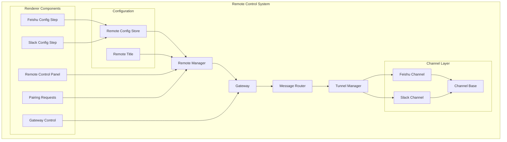
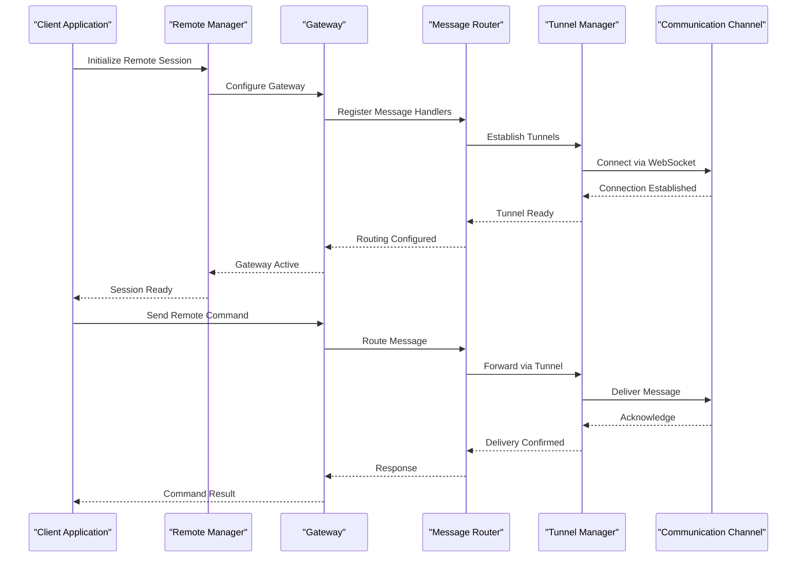
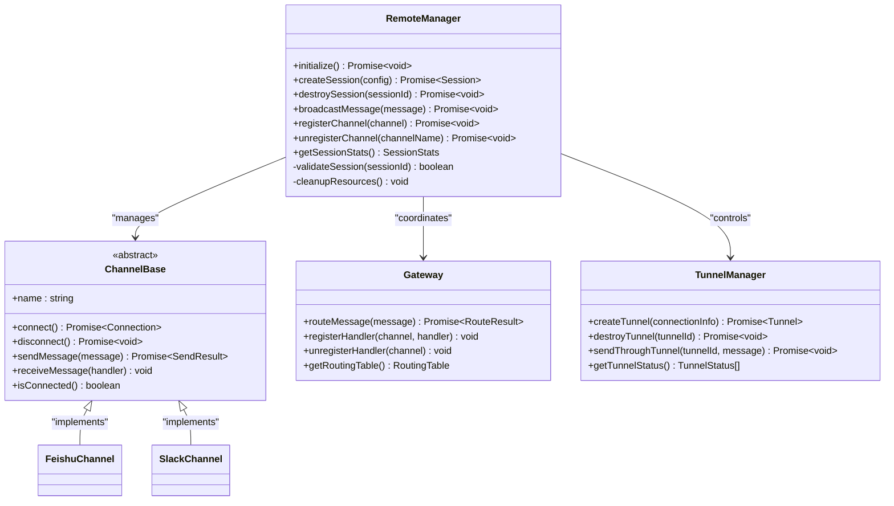
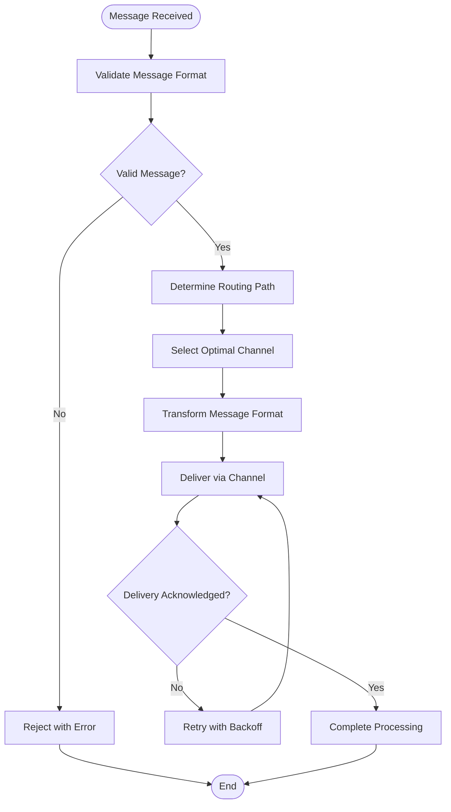
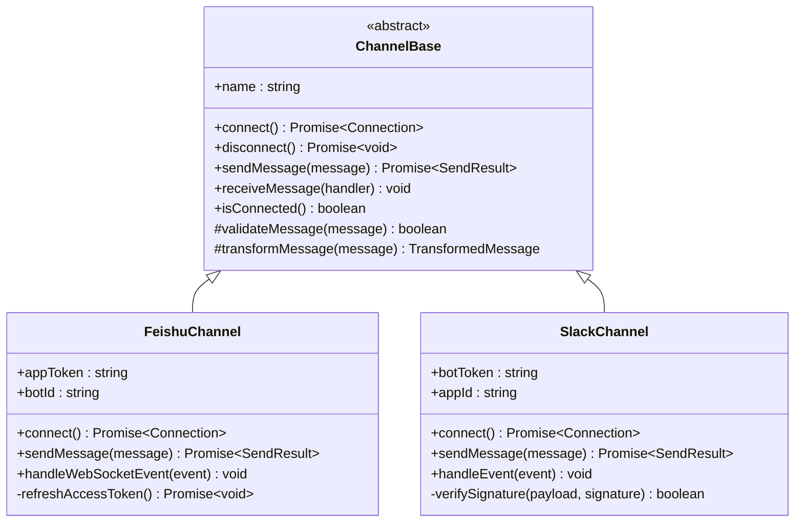
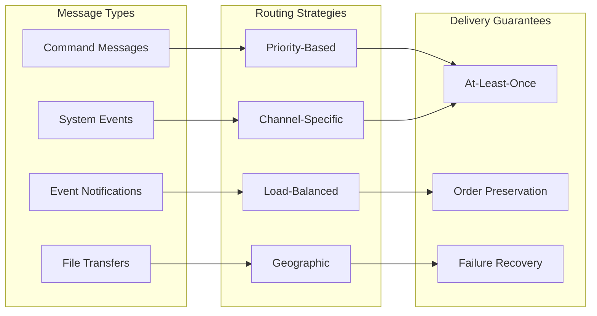
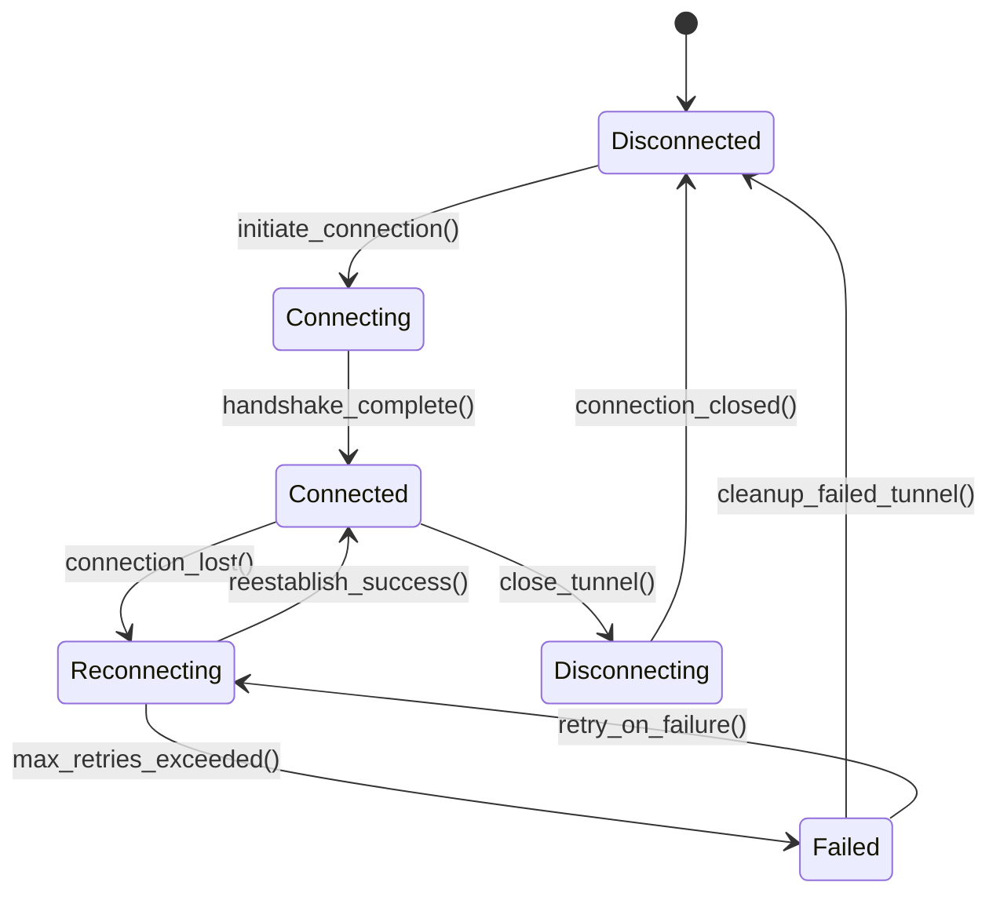
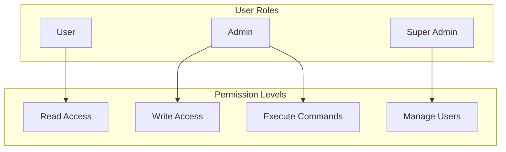
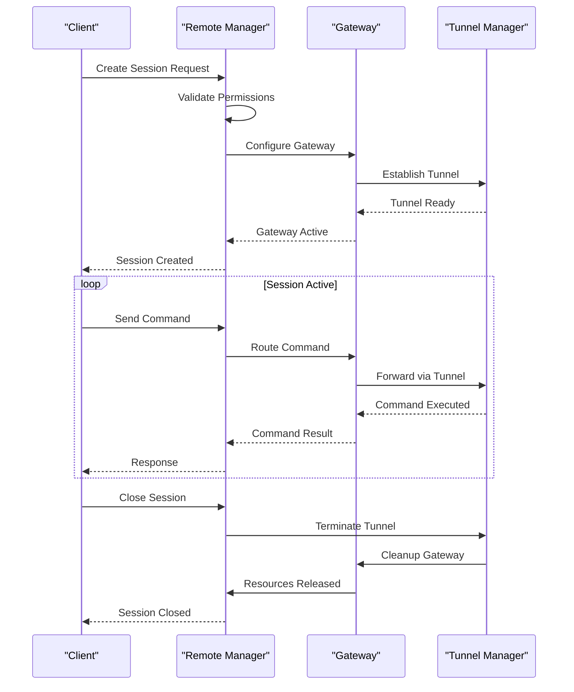

# Remote Control API

<cite>
**Referenced Files in This Document**
- [gateway.ts](file://src/main/remote/gateway.ts)
- [message-router.ts](file://src/main/remote/message-router.ts)
- [remote-manager.ts](file://src/main/remote/remote-manager.ts)
- [tunnel-manager.ts](file://src/main/remote/tunnel-manager.ts)
- [channel-base.ts](file://src/main/remote/channels/channel-base.ts)
- [feishu-channel.ts](file://src/main/remote/channels/feishu/feishu-channel.ts)
- [feishu-ws-client.ts](file://src/main/remote/channels/feishu/feishu-ws-client.ts)
- [slack-channel.ts](file://src/main/remote/channels/slack/slack-channel.ts)
- [types.ts](file://src/main/remote/types.ts)
- [remote-config-store.ts](file://src/main/remote/remote-config-store.ts)
- [remote-title.ts](file://src/main/remote/remote-title.ts)
- [index.ts](file://src/main/remote/index.ts)
- [SettingsRemoteControl.tsx](file://src/renderer/components/settings/SettingsRemoteControl.tsx)
- [RemoteControlPanel.tsx](file://src/renderer/components/RemoteControlPanel.tsx)
- [FeishuConfigStep.tsx](file://src/renderer/components/remote/FeishuConfigStep.tsx)
- [SlackConfigStep.tsx](file://src/renderer/components/remote/SlackConfigStep.tsx)
- [PairingRequestsSection.tsx](file://src/renderer/components/remote/PairingRequestsSection.tsx)
- [GatewayControlCard.tsx](file://src/renderer/components/remote/GatewayControlCard.tsx)
</cite>

## Table of Contents

1. [Introduction](#introduction)
2. [Project Structure](#project-structure)
3. [Core Components](#core-components)
4. [Architecture Overview](#architecture-overview)
5. [Detailed Component Analysis](#detailed-component-analysis)
6. [Channel Integrations](#channel-integrations)
7. [Message Routing and Protocol](#message-routing-and-protocol)
8. [Tunnel Management](#tunnel-management)
9. [Security and Authentication](#security-and-authentication)
10. [API Specifications](#api-specifications)
11. [Remote Session Management](#remote-session-management)
12. [Performance and Monitoring](#performance-and-monitoring)
13. [Troubleshooting Guide](#troubleshooting-guide)
14. [Conclusion](#conclusion)

## Introduction

Open Cowork's Remote Control API provides a comprehensive framework for secure remote collaboration and control across multiple communication platforms. The system enables real-time multi-channel communication coordination, supporting both Feishu and Slack integrations while maintaining strict security boundaries and efficient resource management.

The remote control system is built around three core pillars: multi-channel communication coordination, intelligent message routing, and secure tunnel management. This architecture allows teams to collaborate seamlessly across different platforms while maintaining centralized control and visibility over all remote operations.

## Project Structure

The remote control system is organized into several interconnected modules that work together to provide comprehensive remote collaboration capabilities:

**Diagram sources**

- [remote-manager.ts:1-200](file://src/main/remote/remote-manager.ts#L1-L200)
- [gateway.ts:1-150](file://src/main/remote/gateway.ts#L1-L150)
- [message-router.ts:1-120](file://src/main/remote/message-router.ts#L1-L120)
- [tunnel-manager.ts:1-180](file://src/main/remote/tunnel-manager.ts#L1-L180)

**Section sources**

- [remote-manager.ts:1-200](file://src/main/remote/remote-manager.ts#L1-L200)
- [gateway.ts:1-150](file://src/main/remote/gateway.ts#L1-L150)
- [message-router.ts:1-120](file://src/main/remote/message-router.ts#L1-L120)
- [tunnel-manager.ts:1-180](file://src/main/remote/tunnel-manager.ts#L1-L180)

## Core Components

### Remote Manager

The Remote Manager serves as the central coordinator for all remote collaboration operations. It orchestrates communication between channels, manages session lifecycles, and maintains system-wide state.

Key responsibilities include:

- Multi-channel communication coordination
- Session lifecycle management
- Resource allocation and cleanup
- Error handling and recovery
- Performance monitoring and metrics collection

### Gateway System

The Gateway acts as the primary interface for external communications, implementing sophisticated message routing and protocol handling. It provides channel abstraction while maintaining consistent interfaces across different communication platforms.

Core gateway functionality includes:

- Message routing and distribution
- Protocol negotiation and adaptation
- Connection pooling and management
- Rate limiting and throttling
- Security boundary enforcement

### Tunnel Manager

The Tunnel Manager handles secure connection establishment and maintenance for remote sessions. It manages WebSocket connections, handles reconnection logic, and ensures reliable message delivery across network boundaries.

**Section sources**

- [remote-manager.ts:1-200](file://src/main/remote/remote-manager.ts#L1-L200)
- [gateway.ts:1-150](file://src/main/remote/gateway.ts#L1-L150)
- [tunnel-manager.ts:1-180](file://src/main/remote/tunnel-manager.ts#L1-L180)

## Architecture Overview

The remote control architecture follows a layered approach with clear separation of concerns:

**Diagram sources**

- [remote-manager.ts:1-200](file://src/main/remote/remote-manager.ts#L1-L200)
- [gateway.ts:1-150](file://src/main/remote/gateway.ts#L1-L150)
- [message-router.ts:1-120](file://src/main/remote/message-router.ts#L1-L120)
- [tunnel-manager.ts:1-180](file://src/main/remote/tunnel-manager.ts#L1-L180)

## Detailed Component Analysis

### Remote Manager Implementation

The Remote Manager coordinates all remote collaboration activities and serves as the primary entry point for external systems. It implements sophisticated session management, resource orchestration, and error recovery mechanisms.

**Diagram sources**

- [remote-manager.ts:1-200](file://src/main/remote/remote-manager.ts#L1-L200)
- [channel-base.ts:1-100](file://src/main/remote/channels/channel-base.ts#L1-L100)
- [gateway.ts:1-150](file://src/main/remote/gateway.ts#L1-L150)
- [tunnel-manager.ts:1-180](file://src/main/remote/tunnel-manager.ts#L1-L180)

**Section sources**

- [remote-manager.ts:1-200](file://src/main/remote/remote-manager.ts#L1-L200)
- [channel-base.ts:1-100](file://src/main/remote/channels/channel-base.ts#L1-L100)

### Gateway System Design

The Gateway implements a sophisticated message routing system that abstracts channel differences while providing consistent interfaces. It handles protocol negotiation, message transformation, and delivery guarantees.

**Diagram sources**

- [gateway.ts:1-150](file://src/main/remote/gateway.ts#L1-L150)
- [message-router.ts:1-120](file://src/main/remote/message-router.ts#L1-L120)

**Section sources**

- [gateway.ts:1-150](file://src/main/remote/gateway.ts#L1-L150)
- [message-router.ts:1-120](file://src/main/remote/message-router.ts#L1-L120)

## Channel Integrations

### Channel Abstraction Layer

The channel abstraction layer provides a unified interface for different communication platforms while accommodating platform-specific features and limitations.

**Diagram sources**

- [channel-base.ts:1-100](file://src/main/remote/channels/channel-base.ts#L1-L100)
- [feishu-channel.ts:1-150](file://src/main/remote/channels/feishu/feishu-channel.ts#L1-L150)
- [slack-channel.ts:1-140](file://src/main/remote/channels/slack/slack-channel.ts#L1-L140)

### Feishu Integration Pattern

The Feishu channel implementation demonstrates enterprise-grade integration with robust authentication, message handling, and WebSocket connectivity.

Key features include:

- OAuth2-based authentication with token refresh
- WebSocket-based real-time communication
- Message threading and context preservation
- Rate limiting and quota management
- Event-driven architecture for scalable message processing

### Slack Integration Pattern

The Slack channel provides modern team collaboration features with comprehensive bot functionality and interactive components.

Core capabilities encompass:

- Bot token authentication with granular permissions
- Interactive message components and block kits
- Real-time messaging via WebSocket events
- Slash command integration and response handling
- Workspace-wide deployment and user management

**Section sources**

- [channel-base.ts:1-100](file://src/main/remote/channels/channel-base.ts#L1-L100)
- [feishu-channel.ts:1-150](file://src/main/remote/channels/feishu/feishu-channel.ts#L1-L150)
- [slack-channel.ts:1-140](file://src/main/remote/channels/slack/slack-channel.ts#L1-L140)

## Message Routing and Protocol

### Message Router Architecture

The Message Router implements intelligent routing decisions based on message type, recipient priority, and channel capabilities. It maintains routing tables and handles dynamic route updates.

**Diagram sources**

- [message-router.ts:1-120](file://src/main/remote/message-router.ts#L1-L120)
- [types.ts:1-200](file://src/main/remote/types.ts#L1-L200)

### Protocol Specifications

The remote control system supports multiple communication protocols optimized for different use cases:

**WebSocket Protocol**

- Real-time bidirectional communication
- Automatic reconnection with exponential backoff
- Message acknowledgment and delivery confirmation
- Heartbeat and keep-alive mechanisms
- Binary and text message support

**HTTP/HTTPS Protocol**

- RESTful API endpoints for administrative operations
- JSON-based message serialization
- Authentication and authorization middleware
- Request/response correlation and tracing
- Batch processing and bulk operations

**Section sources**

- [message-router.ts:1-120](file://src/main/remote/message-router.ts#L1-L120)
- [types.ts:1-200](file://src/main/remote/types.ts#L1-L200)

## Tunnel Management

### Secure Connection Lifecycle

The Tunnel Manager handles the complete lifecycle of secure connections, from initial establishment through graceful shutdown and recovery.

**Diagram sources**

- [tunnel-manager.ts:1-180](file://src/main/remote/tunnel-manager.ts#L1-L180)

### WebSocket Handling

WebSocket connections are managed with sophisticated error handling, automatic recovery, and performance optimization:

- Connection pooling with reuse policies
- Message queuing during temporary disconnections
- Automatic protocol negotiation and upgrade
- Compression and encryption for data transmission
- Health monitoring and performance metrics

### Message Queuing Strategy

The system implements a multi-tiered queuing strategy to ensure reliable message delivery:

1. **In-memory Queue**: High-speed temporary storage for immediate processing
2. **Persistent Queue**: Disk-based storage for guaranteed delivery
3. **Priority Queue**: Urgent messages with higher processing priority
4. **Batch Queue**: Aggregation of similar messages for efficiency

**Section sources**

- [tunnel-manager.ts:1-180](file://src/main/remote/tunnel-manager.ts#L1-L180)

## Security and Authentication

### Authentication Mechanisms

The remote control system implements layered security with multiple authentication factors:

**Primary Authentication**

- OAuth2/OpenID Connect for user identity verification
- API key-based service authentication
- Certificate-based mutual TLS authentication
- JWT token validation with expiration handling

**Secondary Security Measures**

- IP whitelisting and geographic restrictions
- Rate limiting per user and per API endpoint
- Request signing and signature verification
- Audit logging for all authentication attempts

### Permission Controls

Role-based access control (RBAC) provides fine-grained permission management:

**Diagram sources**

- [types.ts:1-200](file://src/main/remote/types.ts#L1-L200)

### Access Management

Access control extends beyond simple authentication to include:

- **Channel-specific permissions**: Different access levels per communication channel
- **Session-based controls**: Temporary access grants with expiration
- **Resource quotas**: Limits on concurrent sessions and bandwidth usage
- **Activity monitoring**: Real-time detection of suspicious patterns

**Section sources**

- [types.ts:1-200](file://src/main/remote/types.ts#L1-L200)

## API Specifications

### Remote Command API

The remote command API provides standardized interfaces for controlling remote operations:

**Command Structure**

- `command`: Unique identifier for the operation
- `parameters`: JSON object containing operation-specific data
- `target`: Recipient or target resource specification
- `priority`: Execution priority level (0-10)
- `correlationId`: Unique identifier for request-response correlation

**Response Format**

- `status`: Operation completion status
- `result`: Successful operation result data
- `error`: Error information if operation failed
- `timestamp`: Response generation time

### Message Format Specifications

Messages follow a standardized format for cross-platform compatibility:

**Message Header**

- `type`: Message category (command, notification, file)
- `source`: Originating channel identifier
- `destination`: Target channel or user
- `timestamp`: Message creation time
- `messageId`: Unique message identifier

**Message Body**

- Platform-specific payload encoding
- Metadata for routing and processing
- Security signatures and validation data

### Event Notification System

The event notification system provides real-time updates for remote operations:

**Event Categories**

- `session.created`: New remote session established
- `session.terminated`: Session closed or ended
- `message.delivered`: Message successfully delivered
- `message.failed`: Message delivery failure
- `user.joined`: Remote user joined collaboration
- `user.left`: Remote user left collaboration

**Section sources**

- [types.ts:1-200](file://src/main/remote/types.ts#L1-L200)

## Remote Session Management

### Session Lifecycle

Remote sessions follow a structured lifecycle with comprehensive state management:

**Diagram sources**

- [remote-manager.ts:1-200](file://src/main/remote/remote-manager.ts#L1-L200)
- [tunnel-manager.ts:1-180](file://src/main/remote/tunnel-manager.ts#L1-L180)

### Collaborative Editing Workflows

The system supports sophisticated collaborative editing scenarios:

**Real-time Synchronization**

- Operational transformation for conflict resolution
- Local editing with server-side reconciliation
- Version control integration for document history
- Change tracking and diff generation

**Conflict Resolution**

- Last-write-wins with metadata preservation
- Manual conflict resolution interface
- Automated conflict detection and reporting
- Undo/redo chain maintenance across collaborators

### Channel-Specific Integrations

Each communication channel provides specialized features for remote collaboration:

**Feishu Integration Features**

- Enterprise-grade security and compliance
- Departmental access controls and approval workflows
- Integration with Feishu Docs for collaborative editing
- Compliance with corporate IT policies

**Slack Integration Features**

- Rich interactive components and block kits
- Slash command integration for quick actions
- File sharing with version control
- Integration with Slack apps ecosystem

**Section sources**

- [remote-manager.ts:1-200](file://src/main/remote/remote-manager.ts#L1-L200)
- [remote-title.ts:1-100](file://src/main/remote/remote-title.ts#L1-L100)

## Performance and Monitoring

### Performance Characteristics

The remote control system is designed for high-performance operation with the following characteristics:

**Latency Targets**

- Message delivery latency: < 100ms for local networks
- Command execution latency: < 500ms for typical operations
- Connection establishment: < 2 seconds under normal conditions
- Reconnection time: < 1 second after brief interruptions

**Scalability Metrics**

- Concurrent sessions: Support for 1000+ simultaneous users
- Message throughput: 10,000+ messages per second
- Channel capacity: 100+ channels with balanced load
- Memory usage: < 1GB per 1000 concurrent sessions

### Monitoring and Diagnostics

Comprehensive monitoring provides visibility into system health and performance:

**Metrics Collection**

- Connection statistics and uptime tracking
- Message volume and delivery success rates
- Channel-specific performance indicators
- Error rates and failure patterns
- Resource utilization and bottleneck identification

**Alerting System**

- Real-time notification for critical failures
- Threshold-based alerts for performance degradation
- Historical trend analysis and anomaly detection
- Automated recovery actions for transient failures

### Rate Limiting and Throttling

The system implements multiple layers of rate limiting to prevent abuse and ensure fair resource allocation:

**Per-User Rate Limits**

- Maximum commands per minute per user
- Burst limit protection against spam
- Priority-based rate adjustment for premium users
- Geographic rate limiting for distributed deployments

**System-Wide Limits**

- Maximum concurrent connections
- Total message volume limits
- Channel-specific throughput caps
- Resource consumption monitoring and controls

## Troubleshooting Guide

### Common Issues and Solutions

**Connection Problems**

- Verify network connectivity and firewall settings
- Check authentication credentials and token validity
- Review rate limiting configurations and quotas
- Examine proxy settings and SSL certificate validation

**Message Delivery Failures**

- Confirm channel availability and service status
- Validate message format and routing configuration
- Check queue backlog and processing capacity
- Review error logs for specific failure reasons

**Performance Degradation**

- Monitor system resource utilization
- Analyze connection pool saturation
- Review message queue depths and processing times
- Check network latency and bandwidth utilization

### Diagnostic Tools

The system provides comprehensive diagnostic capabilities:

**Health Checks**

- Automated system health monitoring
- Channel connectivity verification
- Message delivery confirmation testing
- Performance benchmarking and profiling

**Logging and Auditing**

- Comprehensive audit trail for all operations
- Structured logging with correlation identifiers
- Error categorization and escalation rules
- Compliance logging for enterprise requirements

**Section sources**

- [remote-manager.ts:1-200](file://src/main/remote/remote-manager.ts#L1-L200)
- [tunnel-manager.ts:1-180](file://src/main/remote/tunnel-manager.ts#L1-L180)

## Conclusion

Open Cowork's Remote Control API provides a robust, scalable foundation for secure remote collaboration across multiple communication platforms. The system's layered architecture, comprehensive security model, and sophisticated performance optimizations enable teams to collaborate effectively while maintaining strict control over their remote operations.

Key strengths of the system include its modular design that facilitates easy extension to new communication channels, its comprehensive monitoring and diagnostics capabilities, and its enterprise-grade security features. The unified API surface simplifies integration for developers while the channel abstraction layer ensures platform-specific optimizations are properly handled.

Future enhancements could focus on expanding support for additional communication platforms, implementing advanced machine learning-based message routing, and adding more sophisticated collaborative editing capabilities. The current architecture provides excellent foundations for these extensions while maintaining backward compatibility and system stability.
