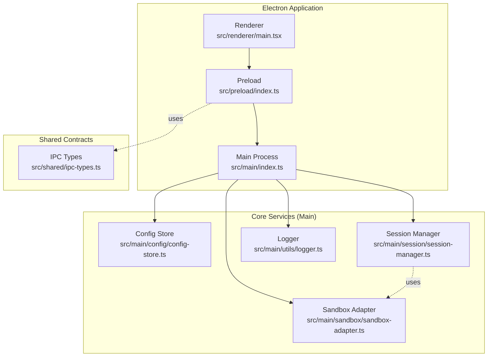
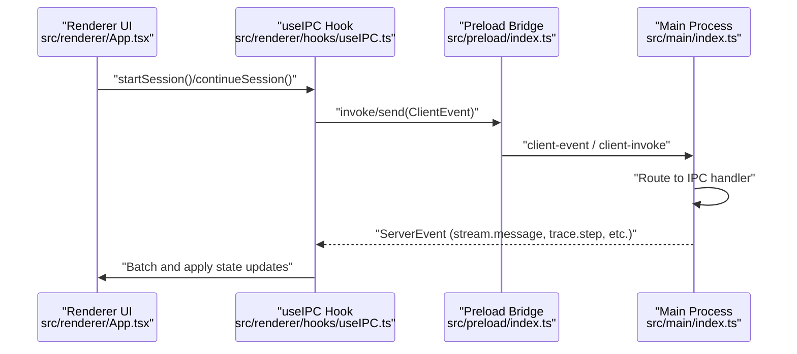
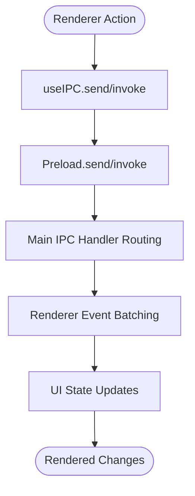
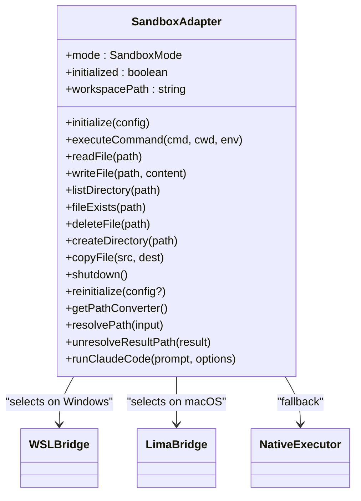
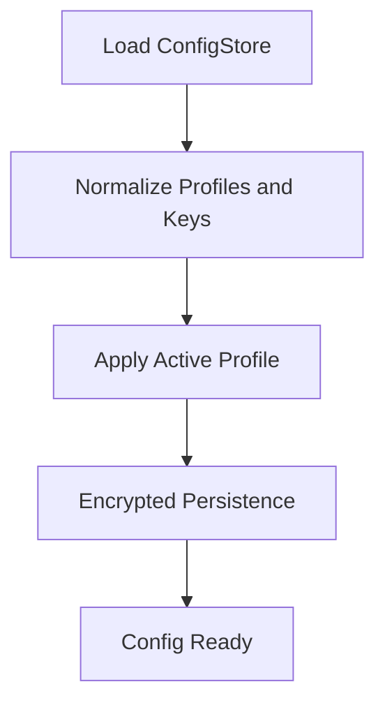
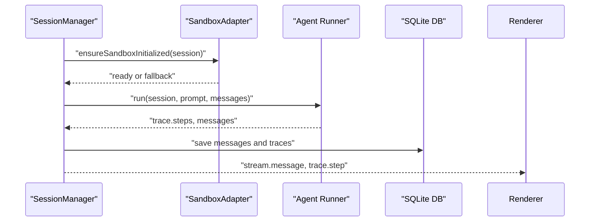
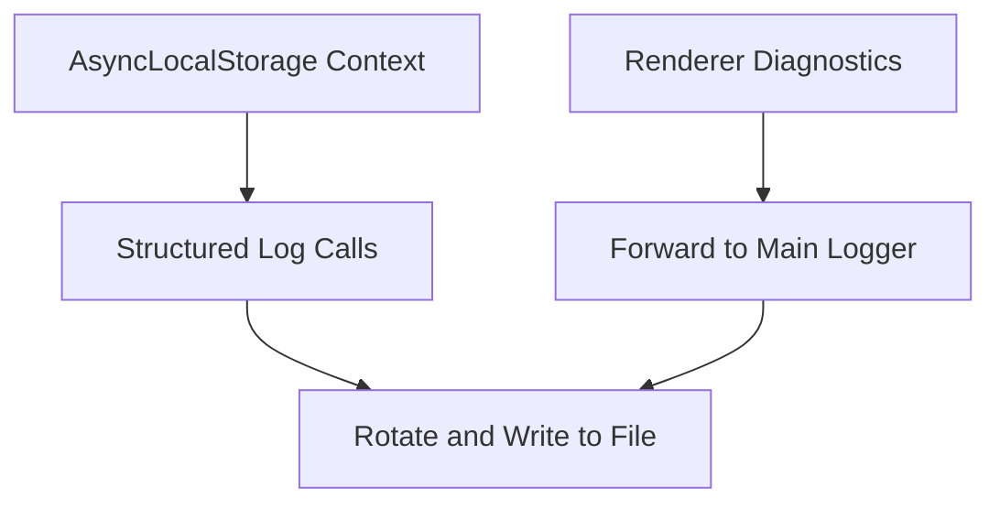
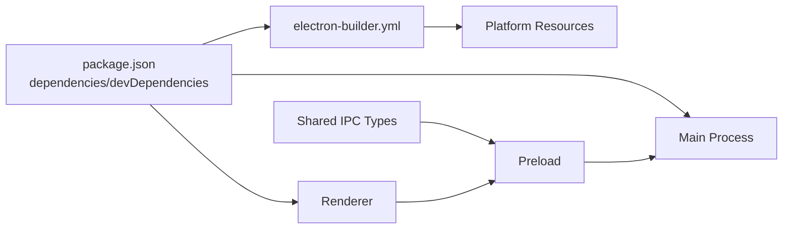
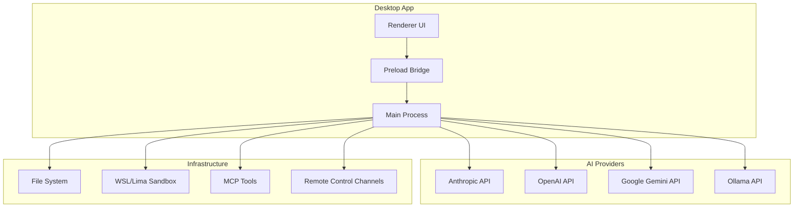

# Architecture & Design

<cite>
**Referenced Files in This Document**
- [src/main/index.ts](file://src/main/index.ts)
- [src/preload/index.ts](file://src/preload/index.ts)
- [src/renderer/main.tsx](file://src/renderer/main.tsx)
- [src/renderer/App.tsx](file://src/renderer/App.tsx)
- [src/renderer/hooks/useIPC.ts](file://src/renderer/hooks/useIPC.ts)
- [src/shared/ipc-types.ts](file://src/shared/ipc-types.ts)
- [src/main/sandbox/sandbox-adapter.ts](file://src/main/sandbox/sandbox-adapter.ts)
- [src/main/config/config-store.ts](file://src/main/config/config-store.ts)
- [src/main/session/session-manager.ts](file://src/main/session/session-manager.ts)
- [src/main/utils/logger.ts](file://src/main/utils/logger.ts)
- [package.json](file://package.json)
- [electron-builder.yml](file://electron-builder.yml)
</cite>

## Table of Contents

1. [Introduction](#introduction)
2. [Project Structure](#project-structure)
3. [Core Components](#core-components)
4. [Architecture Overview](#architecture-overview)
5. [Detailed Component Analysis](#detailed-component-analysis)
6. [Dependency Analysis](#dependency-analysis)
7. [Performance Considerations](#performance-considerations)
8. [Troubleshooting Guide](#troubleshooting-guide)
9. [Conclusion](#conclusion)
10. [Appendices](#appendices)

## Introduction

This document describes the architecture and design of Open Cowork, an Electron-based desktop application that orchestrates AI agent sessions, sandboxed tool execution, MCP (Model Context Protocol) tooling, and remote control integrations. The system emphasizes a clean separation of concerns across the main process, preload context, and renderer process, with robust IPC patterns, sandboxing strategies, and modular design patterns for extensibility.

## Project Structure

Open Cowork follows a layered Electron architecture:

- Main process: Orchestrates application lifecycle, IPC hubs, database, sandbox, sessions, and integrations.
- Preload: Exposes a controlled API surface to the renderer via contextBridge, enforcing allowlists and type safety.
- Renderer: React-based UI with a centralized store, IPC hooks, and component-driven views.
- Shared: IPC type definitions and cross-process contracts.
- Infrastructure: Build and packaging via electron-builder, with platform-specific resources and native module handling.

**Diagram sources**

- [src/main/index.ts:1-800](file://src/main/index.ts#L1-L800)
- [src/preload/index.ts:1-680](file://src/preload/index.ts#L1-L680)
- [src/renderer/main.tsx:1-84](file://src/renderer/main.tsx#L1-L84)
- [src/shared/ipc-types.ts:1-160](file://src/shared/ipc-types.ts#L1-L160)
- [src/main/config/config-store.ts:1-800](file://src/main/config/config-store.ts#L1-L800)
- [src/main/session/session-manager.ts:1-800](file://src/main/session/session-manager.ts#L1-L800)
- [src/main/sandbox/sandbox-adapter.ts:1-755](file://src/main/sandbox/sandbox-adapter.ts#L1-L755)
- [src/main/utils/logger.ts:1-560](file://src/main/utils/logger.ts#L1-L560)

**Section sources**

- [src/main/index.ts:1-800](file://src/main/index.ts#L1-L800)
- [src/preload/index.ts:1-680](file://src/preload/index.ts#L1-L680)
- [src/renderer/main.tsx:1-84](file://src/renderer/main.tsx#L1-L84)
- [src/shared/ipc-types.ts:1-160](file://src/shared/ipc-types.ts#L1-L160)

## Core Components

- Main process entry and lifecycle: Initializes app, creates BrowserWindow, sets up IPC handlers, and manages sandbox/bootstrap.
- Preload bridge: Exposes typed APIs to renderer, validates event types, and provides invoke/send wrappers.
- Renderer bootstrapping: Installs diagnostic hooks, initializes i18n, and renders the app shell.
- IPC hooks: Centralized event handling and batching for high-frequency streams, with a singleton IPC listener guard.
- Configuration store: Encrypted persistence of API keys, provider presets, and runtime settings.
- Session manager: Manages session lifecycle, delegates AI runs, sandbox initialization, and trace/message persistence.
- Sandbox adapter: Factory-like abstraction selecting WSL/Lima/native execution with path conversion and runtime orchestration.
- Logger: Structured logging with AsyncLocalStorage context propagation and file rotation.

**Section sources**

- [src/main/index.ts:1-800](file://src/main/index.ts#L1-L800)
- [src/preload/index.ts:1-680](file://src/preload/index.ts#L1-L680)
- [src/renderer/main.tsx:1-84](file://src/renderer/main.tsx#L1-L84)
- [src/renderer/hooks/useIPC.ts:1-800](file://src/renderer/hooks/useIPC.ts#L1-L800)
- [src/main/config/config-store.ts:1-800](file://src/main/config/config-store.ts#L1-L800)
- [src/main/session/session-manager.ts:1-800](file://src/main/session/session-manager.ts#L1-L800)
- [src/main/sandbox/sandbox-adapter.ts:1-755](file://src/main/sandbox/sandbox-adapter.ts#L1-L755)
- [src/main/utils/logger.ts:1-560](file://src/main/utils/logger.ts#L1-L560)

## Architecture Overview

The system uses a central IPC hub in the main process, with the renderer subscribing to server events and sending client events. The preload enforces a strict allowlist and sanitizes sensitive operations. Sessions are managed by the session manager, which coordinates sandbox initialization, MCP tooling, and agent execution.

**Diagram sources**

- [src/renderer/App.tsx:1-262](file://src/renderer/App.tsx#L1-L262)
- [src/renderer/hooks/useIPC.ts:1-800](file://src/renderer/hooks/useIPC.ts#L1-L800)
- [src/preload/index.ts:1-680](file://src/preload/index.ts#L1-L680)
- [src/main/index.ts:1-800](file://src/main/index.ts#L1-L800)

## Detailed Component Analysis

### Electron Process Model and IPC Patterns

- Main process responsibilities include app lifecycle, BrowserWindow creation, navigation policies, sandbox bootstrap, and a central IPC hub routing ~60+ handlers under namespaces (config._, mcp._, session._, sandbox._, logs._, remote._, schedule.\*).
- Preload exposes a typed API via contextBridge, with an allowlist of ClientEvent types and sanitized invoke/send wrappers. It also provides platform info, theme, version, and filesystem operations.
- Renderer bootstraps diagnostics and installs a singleton IPC listener guarded by a module-level flag to avoid duplicate listeners. It batches high-frequency events (partials, thinking, trace steps) using requestAnimationFrame.

**Diagram sources**

- [src/renderer/hooks/useIPC.ts:1-800](file://src/renderer/hooks/useIPC.ts#L1-L800)
- [src/preload/index.ts:1-680](file://src/preload/index.ts#L1-L680)
- [src/main/index.ts:1-800](file://src/main/index.ts#L1-L800)

**Section sources**

- [src/main/index.ts:1-800](file://src/main/index.ts#L1-L800)
- [src/preload/index.ts:1-680](file://src/preload/index.ts#L1-L680)
- [src/renderer/hooks/useIPC.ts:1-800](file://src/renderer/hooks/useIPC.ts#L1-L800)

### Sandbox Adapter: Factory and Strategy Patterns

- Factory pattern: Automatically selects the appropriate executor based on platform and configuration (Windows -> WSL, macOS -> Lima, others -> native). It encapsulates initialization, warnings, and fallbacks.
- Strategy pattern: Provides a unified interface for command execution, file operations, and path resolution, delegating to platform-specific bridges.
- Path conversion utilities: Converts between host and guest paths for seamless file access across environments.

**Diagram sources**

- [src/main/sandbox/sandbox-adapter.ts:1-755](file://src/main/sandbox/sandbox-adapter.ts#L1-L755)

**Section sources**

- [src/main/sandbox/sandbox-adapter.ts:1-755](file://src/main/sandbox/sandbox-adapter.ts#L1-L755)

### Configuration Store: Strategy and Persistence

- Strategy pattern: Provider profiles and presets guide model selection and credential resolution. Dynamic presets can be augmented from external registries.
- Persistence: Encrypted electron-store-backed configuration with key rotation and normalization routines for legacy and malformed data.
- Runtime overrides: Memory runtime configuration supports separate LLM/embedding settings and evaluation toggles.

**Diagram sources**

- [src/main/config/config-store.ts:1-800](file://src/main/config/config-store.ts#L1-L800)

**Section sources**

- [src/main/config/config-store.ts:1-800](file://src/main/config/config-store.ts#L1-L800)

### Session Manager: Orchestrator and Extension Point

- Orchestrates session lifecycle: create, continue, stop, delete, list.
- Integrates sandbox initialization per workspace and file attachment processing.
- Delegates AI execution to agent runners, manages permissions and sudo prompts, and persists traces/messages.
- Extension points: Agent runtime extension manager and MCP manager integration.

**Diagram sources**

- [src/main/session/session-manager.ts:1-800](file://src/main/session/session-manager.ts#L1-L800)
- [src/main/sandbox/sandbox-adapter.ts:1-755](file://src/main/sandbox/sandbox-adapter.ts#L1-L755)

**Section sources**

- [src/main/session/session-manager.ts:1-800](file://src/main/session/session-manager.ts#L1-L800)

### Logging and Diagnostics

- Structured logging with AsyncLocalStorage context propagation (sessionId, traceId).
- Automatic log rotation, truncation, and safe serialization of complex values.
- Renderer diagnostics capture console errors and unhandled rejections, forwarding them to main for logging.

**Diagram sources**

- [src/main/utils/logger.ts:1-560](file://src/main/utils/logger.ts#L1-L560)
- [src/renderer/main.tsx:1-84](file://src/renderer/main.tsx#L1-L84)

**Section sources**

- [src/main/utils/logger.ts:1-560](file://src/main/utils/logger.ts#L1-L560)
- [src/renderer/main.tsx:1-84](file://src/renderer/main.tsx#L1-L84)

## Dependency Analysis

- Technology stack: Electron, React, TypeScript, better-sqlite3, MCP SDK, AI providers (Anthropic, OpenAI, Gemini, Ollama), and platform-specific sandboxing (WSL/Lima).
- Build and packaging: electron-builder configures platform-specific targets, resource bundling, and asar unpacking for native modules.
- IPC type safety: Shared IPC types ensure consistent contracts between main and renderer/preload.

**Diagram sources**

- [package.json:1-148](file://package.json#L1-L148)
- [electron-builder.yml:1-170](file://electron-builder.yml#L1-L170)
- [src/shared/ipc-types.ts:1-160](file://src/shared/ipc-types.ts#L1-L160)

**Section sources**

- [package.json:1-148](file://package.json#L1-L148)
- [electron-builder.yml:1-170](file://electron-builder.yml#L1-L170)
- [src/shared/ipc-types.ts:1-160](file://src/shared/ipc-types.ts#L1-L160)

## Performance Considerations

- IPC batching: Renderer uses requestAnimationFrame to batch partials, thinking deltas, and trace updates, reducing render thrash and improving perceived responsiveness.
- Sandboxing initialization: Deferred and cached checks for WSL/Lima status to avoid repeated expensive probing.
- Logging overhead: Structured logging with truncation and rotation prevents excessive memory and disk usage.
- Renderer diagnostics: Captures and forwards only relevant diagnostics to avoid feedback loops.

[No sources needed since this section provides general guidance]

## Troubleshooting Guide

- IPC listener conflicts: The singleton guard in useIPC prevents duplicate listeners; ensure only one component registers the listener.
- Sandbox initialization failures: Warnings and fallbacks are surfaced to the UI; check sandbox progress and status events.
- Permission and sudo prompts: Renderer surfaces pending dialogs; ensure responses are sent back via IPC to resume agent execution.
- Logging: Use exported log APIs from renderer to capture diagnostics; review rotated log files in the logs directory.

**Section sources**

- [src/renderer/hooks/useIPC.ts:1-800](file://src/renderer/hooks/useIPC.ts#L1-L800)
- [src/main/index.ts:1-800](file://src/main/index.ts#L1-L800)
- [src/main/utils/logger.ts:1-560](file://src/main/utils/logger.ts#L1-L560)

## Conclusion

Open Cowork’s architecture balances modularity, security, and performance. The main process acts as a central orchestrator with strong IPC contracts, the preload enforces security boundaries, and the renderer focuses on UX with efficient event handling. The sandbox adapter abstracts platform differences, while the configuration store and session manager provide extensible strategies for AI providers and agent lifecycles.

[No sources needed since this section summarizes without analyzing specific files]

## Appendices

### System Context Diagram: Desktop App Integration

[No sources needed since this diagram shows conceptual workflow, not actual code structure]

### Security, Sandboxing, and Performance Notes

- Security: contextIsolation, sandbox, and nodeIntegration=false in BrowserWindow; preload allowlist for IPC; renderer diagnostics forwarding; encrypted config store.
- Sandboxing: Platform-aware adapter with path conversion; fallback to native with warnings; deferred initialization.
- Performance: IPC batching, log rotation, and renderer diagnostics capture.

[No sources needed since this section provides general guidance]
