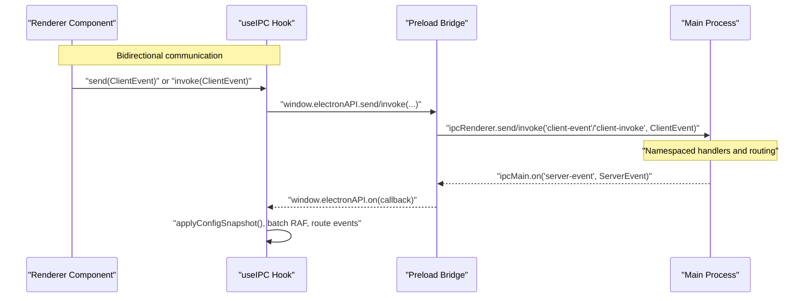
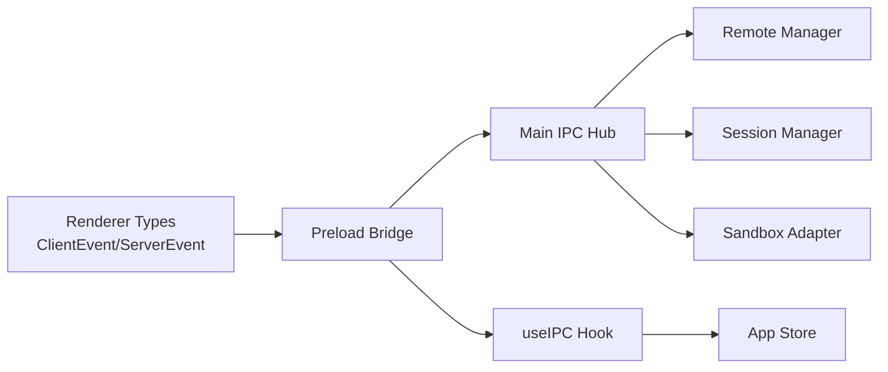

# IPC Communication Patterns

<cite>
**Referenced Files in This Document**
- [ipc-types.ts](file://src/shared/ipc-types.ts)
- [index.ts (preload)](file://src/preload/index.ts)
- [useIPC.ts](file://src/renderer/hooks/useIPC.ts)
- [index.ts (main)](file://src/main/index.ts)
- [client-event-utils.ts](file://src/main/client-event-utils.ts)
- [index.ts (renderer types)](file://src/renderer/types/index.ts)
- [types.ts (remote renderer)](file://src/renderer/components/remote/types.ts)
</cite>

## Table of Contents

1. [Introduction](#introduction)
2. [Project Structure](#project-structure)
3. [Core Components](#core-components)
4. [Architecture Overview](#architecture-overview)
5. [Detailed Component Analysis](#detailed-component-analysis)
6. [Dependency Analysis](#dependency-analysis)
7. [Performance Considerations](#performance-considerations)
8. [Troubleshooting Guide](#troubleshooting-guide)
9. [Conclusion](#conclusion)

## Introduction

This document describes the Inter-Process Communication (IPC) architecture used by Open Cowork. It focuses on the Electron IPC bridge built with preload scripts and context isolation, the message format specifications for ClientEvent and ServerEvent, bidirectional communication patterns between main and renderer processes, event routing and namespace organization, error propagation, security model, and reactive IPC hooks in the renderer. It also covers event filtering for remote sessions and permission handling.

## Project Structure

The IPC system spans three layers:

- Preload exposes a controlled API surface to the renderer under context isolation.
- Renderer hooks provide reactive, high-performance event handling and request/response orchestration.
- Main process acts as the central IPC hub, routing and transforming events, and enforcing security and permissions.

```mermaid
graph TB
subgraph "Renderer"
UI["React Components"]
Hook["useIPC() Hook"]
Types["Renderer Types<br/>ClientEvent/ServerEvent"]
end
subgraph "Preload"
Bridge["Preload Bridge<br/>contextBridge + allowlist"]
Exposed["Exposed API Surface"]
end
subgraph "Main"
Hub["IPC Hub<br/>Namespaced Handlers"]
Router["Event Router<br/>Remote Filtering"]
Managers["Session/Remote/Sandbox/etc."]
end
UI --> Hook
Hook --> Bridge
Bridge <- --> Hub
Hub --> Managers
Hub --> Router
Router --> Bridge
```

**Diagram sources**

- [index.ts (preload):68-441](file://src/preload/index.ts#L68-L441)
- [useIPC.ts:26-391](file://src/renderer/hooks/useIPC.ts#L26-L391)
- [index.ts (main):680-784](file://src/main/index.ts#L680-L784)
- [index.ts (renderer types):450-547](file://src/renderer/types/index.ts#L450-L547)

**Section sources**

- [index.ts (preload):1-680](file://src/preload/index.ts#L1-L680)
- [useIPC.ts:1-814](file://src/renderer/hooks/useIPC.ts#L1-L814)
- [index.ts (main):1-800](file://src/main/index.ts#L1-L800)
- [index.ts (renderer types):1-783](file://src/renderer/types/index.ts#L1-L783)

## Core Components

- Preload bridge: Provides a typed, allowlisted API to the renderer. It validates outbound events and manages a single shared listener for inbound events.
- Renderer hook: Centralizes event handling, batching, and request/response orchestration. It sets up a singleton listener and normalizes high-frequency streams.
- Main IPC hub: Registers namespaced handlers (config._, mcp._, session._, remote._, sandbox.\*, etc.), routes events, and transforms them for remote sessions.
- Shared types: Define ClientEvent and ServerEvent structures and related domain types for MCP, remote, and memory domains.

**Section sources**

- [index.ts (preload):43-107](file://src/preload/index.ts#L43-L107)
- [useIPC.ts:18-391](file://src/renderer/hooks/useIPC.ts#L18-L391)
- [index.ts (main):8-13](file://src/main/index.ts#L8-L13)
- [index.ts (renderer types):450-547](file://src/renderer/types/index.ts#L450-L547)
- [ipc-types.ts:1-160](file://src/shared/ipc-types.ts#L1-L160)

## Architecture Overview

The IPC architecture follows a strict context-isolation boundary. The preload script exposes a small, allowlisted surface to the renderer. The renderer consumes this surface via a custom hook that handles event routing, batching, and request/response semantics. The main process centralizes IPC handling and applies event filtering for remote sessions.



**Diagram sources**

- [index.ts (preload):68-117](file://src/preload/index.ts#L68-L117)
- [useIPC.ts:26-391](file://src/renderer/hooks/useIPC.ts#L26-L391)
- [index.ts (main):680-784](file://src/main/index.ts#L680-L784)
- [index.ts (renderer types):450-547](file://src/renderer/types/index.ts#L450-L547)

## Detailed Component Analysis

### Preload Bridge: Security and Exposure Model

- Context isolation enforced via webPreferences in BrowserWindow.
- contextBridge exposes a single object with typed methods and properties.
- Outbound events are validated against an allowlist to prevent spoofing.
- Inbound events are handled by a single listener; subsequent registrations reuse the same listener to avoid silent drops.

Security highlights:

- Allowlist of ClientEvent types prevents unauthorized channels.
- Single listener guard avoids race conditions and listener leaks.
- URL sanitization for external links (e.g., mailto) prevents unsafe query parameters.

**Section sources**

- [index.ts (main):416-422](file://src/main/index.ts#L416-L422)
- [index.ts (preload):43-107](file://src/preload/index.ts#L43-L107)
- [index.ts (preload):129-144](file://src/preload/index.ts#L129-L144)

### Renderer Hook: Reactive IPC and Batching

- Singleton listener installation guarded by a module-level flag to ensure only one listener is active.
- High-frequency event batching using requestAnimationFrame to reduce UI thrash.
- Event routing switches over ServerEvent types to update store state and drive UI.
- Request/response orchestration via invoke() for synchronous operations.

Key behaviors:

- Streaming message and thinking deltas are buffered and flushed efficiently.
- Permission and sudo dialogs are coordinated via dedicated events.
- Initial bootstrap reads configuration and theme, then syncs permission rules to main.

**Section sources**

- [useIPC.ts:18-391](file://src/renderer/hooks/useIPC.ts#L18-L391)
- [useIPC.ts:129-330](file://src/renderer/hooks/useIPC.ts#L129-L330)
- [useIPC.ts:407-424](file://src/renderer/hooks/useIPC.ts#L407-L424)

### Main IPC Hub: Namespaces and Routing

- Central IPC hub registers namespaced handlers for configuration, MCP, sessions, sandbox, logs, remote, schedules, and memory.
- sendToRenderer encapsulates event delivery and applies filters for remote sessions:
  - Intercepts stream.message to forward assistant text to remote channels.
  - Intercepts trace.step to emit tool progress to remote channels.
  - Intercepts session.status to clear buffers when idle/error.
  - Intercepts permission.request to delegate to remote manager and suppress local UI emission.

**Section sources**

- [index.ts (main):8-13](file://src/main/index.ts#L8-L13)
- [index.ts (main):680-784](file://src/main/index.ts#L680-L784)

### Message Format Specifications: ClientEvent and ServerEvent

ClientEvent covers session lifecycle, permissions, settings, file and working directory operations, and domain-specific features (MCP, skills, plugins, sandbox, logs, remote, schedule, memory).

ServerEvent covers streaming updates, session state, trace steps, permissions, sudo prompts, configuration status, sandbox progress/sync, skills storage changes, working directory changes, navigation, and errors.

Shared domain types (MCP, remote, memory) are defined centrally to avoid duplication and ensure type safety across processes.

**Section sources**

- [index.ts (renderer types):450-479](file://src/renderer/types/index.ts#L450-L479)
- [index.ts (renderer types):519-547](file://src/renderer/types/index.ts#L519-L547)
- [ipc-types.ts:15-160](file://src/shared/ipc-types.ts#L15-L160)

### Bidirectional Communication Patterns

- Request-response: Renderer invokes events (e.g., session.start, config.get) expecting a response.
- Fire-and-forget: Renderer sends events (e.g., session.stop) without expecting a response.
- Streaming: Main emits stream.message, stream.partial, stream.thinking, and trace.step updates; renderer batches and renders progressively.
- Navigation and UI state: Main can trigger UI actions (e.g., navigate, new-session) via server events.

**Section sources**

- [index.ts (preload):109-117](file://src/preload/index.ts#L109-L117)
- [useIPC.ts:407-424](file://src/renderer/hooks/useIPC.ts#L407-L424)
- [useIPC.ts:156-176](file://src/renderer/hooks/useIPC.ts#L156-L176)
- [index.ts (main):680-784](file://src/main/index.ts#L680-L784)

### Event Routing, Namespaces, and Filtering for Remote Sessions

- Namespaces: Handlers are grouped by functional areas (config._, mcp._, session._, remote._, sandbox._, logs._, schedule._, memory._).
- Remote filtering: sendToRenderer inspects sessionId and delegates to remoteManager for remote sessions:
  - Assistant text from stream.message is forwarded to remote channels.
  - Tool progress derived from trace.step is sent to remote channels.
  - Buffer clearing and permission delegation occur for remote sessions.
- Permission handling: permission.request is intercepted for remote sessions and delegated to remoteManager; local UI suppression ensures single-source-of-truth for decisions.

**Section sources**

- [index.ts (main):8-13](file://src/main/index.ts#L8-L13)
- [index.ts (main):680-784](file://src/main/index.ts#L680-L784)
- [client-event-utils.ts:3-18](file://src/main/client-event-utils.ts#L3-L18)

### Security Model: Context Isolation, Sandboxing, and Privilege Escalation Prevention

- Context isolation: Preload defines the entire API surface; renderer code cannot access Node.js APIs directly.
- Sandboxing: BrowserWindow sandbox is enabled.
- Allowlist enforcement: Only explicitly allowed ClientEvent types are permitted from renderer to main.
- URL sanitization: External link opening strips potentially dangerous query parameters.
- Single listener guard: Prevents multiple listeners and accidental event drops.
- Permission gating: Permission requests are centralized and can be delegated to remote managers for remote sessions.

**Section sources**

- [index.ts (main):416-422](file://src/main/index.ts#L416-L422)
- [index.ts (preload):47-77](file://src/preload/index.ts#L47-L77)
- [index.ts (preload):129-144](file://src/preload/index.ts#L129-L144)
- [index.ts (preload):43-107](file://src/preload/index.ts#L43-L107)

### IPC Hook Patterns in the Renderer: Reactive Communication

- useIPC establishes a singleton listener and provides:
  - send() for fire-and-forget events.
  - invoke() for request-response.
  - Higher-level actions (startSession, continueSession, stopSession, etc.) that coordinate UI state and session lifecycle.
- Batching: RAF-based buffering for stream.partial and stream.thinking to improve performance and UX.
- Error handling: Renderer surfaces errors via global notices and clears loading states appropriately.

**Section sources**

- [useIPC.ts:26-391](file://src/renderer/hooks/useIPC.ts#L26-L391)
- [useIPC.ts:427-552](file://src/renderer/hooks/useIPC.ts#L427-L552)
- [useIPC.ts:555-650](file://src/renderer/hooks/useIPC.ts#L555-L650)

### Event Filtering Logic for Remote Sessions and Permission Handling

- Filtering: sendToRenderer checks if a sessionId corresponds to a remote session and intercepts specific events (stream.message, trace.step, session.status, permission.request).
- Delegation: permission.request is delegated to remoteManager; upon resolution, main forwards the decision back to session manager.
- Buffering: Assistant responses are buffered and cleared on session idle/error to avoid stale data.

**Section sources**

- [index.ts (main):680-784](file://src/main/index.ts#L680-L784)

### Examples of Common IPC Patterns

- Request-response cycle:
  - Renderer: invoke({ type: 'session.start', payload }) -> Promise<Session>
  - Main: handler resolves and returns session; renderer adds to store and activates turns.
- Streaming updates:
  - Main: emits stream.partial/stream.thinking; renderer batches and flushes via RAF.
  - Main: emits stream.message; renderer adds message and clears buffers.
- Real-time notifications:
  - Main: emits trace.step/trace.update; renderer updates UI state and active turns.
  - Main: emits error; renderer displays global notice and clears loading.

**Section sources**

- [useIPC.ts:427-552](file://src/renderer/hooks/useIPC.ts#L427-L552)
- [useIPC.ts:555-650](file://src/renderer/hooks/useIPC.ts#L555-L650)
- [useIPC.ts:156-176](file://src/renderer/hooks/useIPC.ts#L156-L176)
- [index.ts (renderer types):519-547](file://src/renderer/types/index.ts#L519-L547)

## Dependency Analysis

The IPC system exhibits low coupling and high cohesion:

- Preload depends on shared types and renderer types for typing.
- Renderer hook depends on the preload bridge and the store for state updates.
- Main process depends on managers and stores; it centralizes routing and filtering.



**Diagram sources**

- [index.ts (renderer types):450-547](file://src/renderer/types/index.ts#L450-L547)
- [index.ts (preload):68-441](file://src/preload/index.ts#L68-L441)
- [index.ts (main):8-13](file://src/main/index.ts#L8-L13)
- [useIPC.ts:26-391](file://src/renderer/hooks/useIPC.ts#L26-L391)

**Section sources**

- [index.ts (renderer types):450-547](file://src/renderer/types/index.ts#L450-L547)
- [index.ts (preload):68-441](file://src/preload/index.ts#L68-L441)
- [index.ts (main):8-13](file://src/main/index.ts#L8-L13)
- [useIPC.ts:26-391](file://src/renderer/hooks/useIPC.ts#L26-L391)

## Performance Considerations

- Event batching: RAF-based buffering for stream.partial and stream.thinking reduces render pressure.
- Single listener: Prevents listener accumulation and improves stability.
- Minimal payloads: Shared types keep payloads minimal and structural to avoid runtime overhead.
- Streaming-first UI: Immediate activation of turns and queued messages improves perceived responsiveness.

## Troubleshooting Guide

Common issues and remedies:

- Unauthorized event type blocked: Ensure the event type is included in the preload allowlist.
- Listener not firing: Confirm that the singleton guard is respected and the listener is not prematurely cleaned up.
- Stale streaming updates: Verify RAF flushing and buffer clearing on session status changes.
- Remote session not responding: Check remote filtering logic and ensure permission delegation completes.

**Section sources**

- [index.ts (preload):47-77](file://src/preload/index.ts#L47-L77)
- [useIPC.ts:368-391](file://src/renderer/hooks/useIPC.ts#L368-L391)
- [index.ts (main):680-784](file://src/main/index.ts#L680-L784)

## Conclusion

Open Cowork’s IPC architecture leverages context isolation and a preload bridge to enforce a secure, typed API surface. The renderer hook provides reactive, high-performance event handling with batching and request/response orchestration. The main process centralizes IPC with namespaced handlers and sophisticated filtering for remote sessions, ensuring robustness, security, and scalability.
