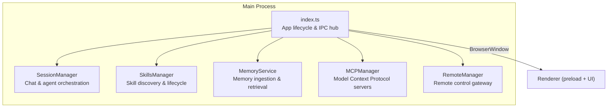
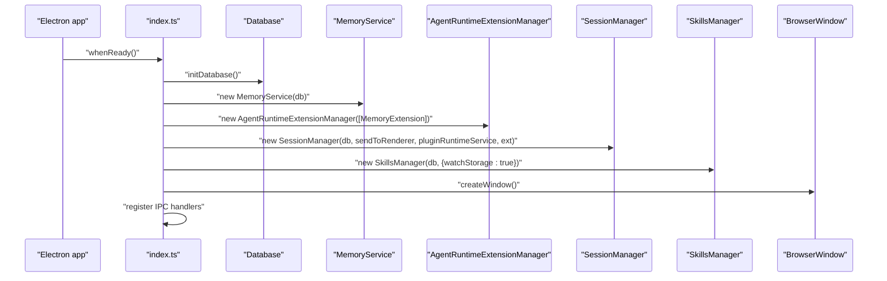
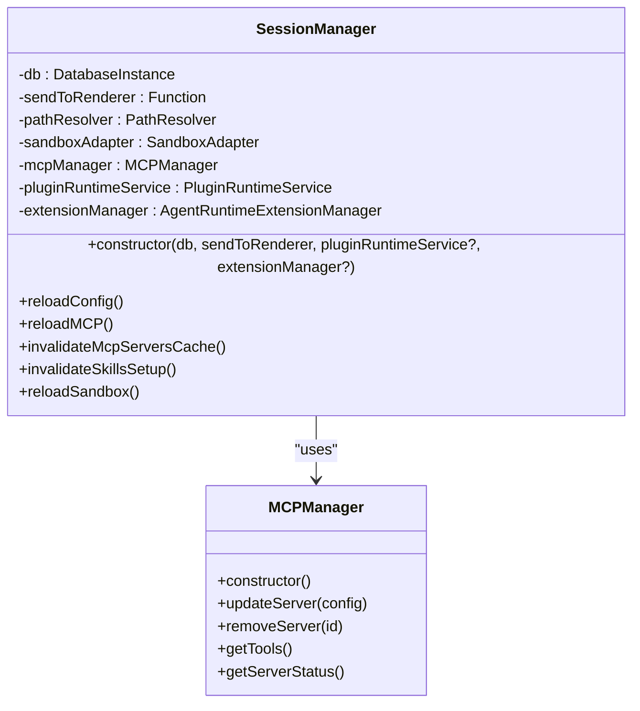
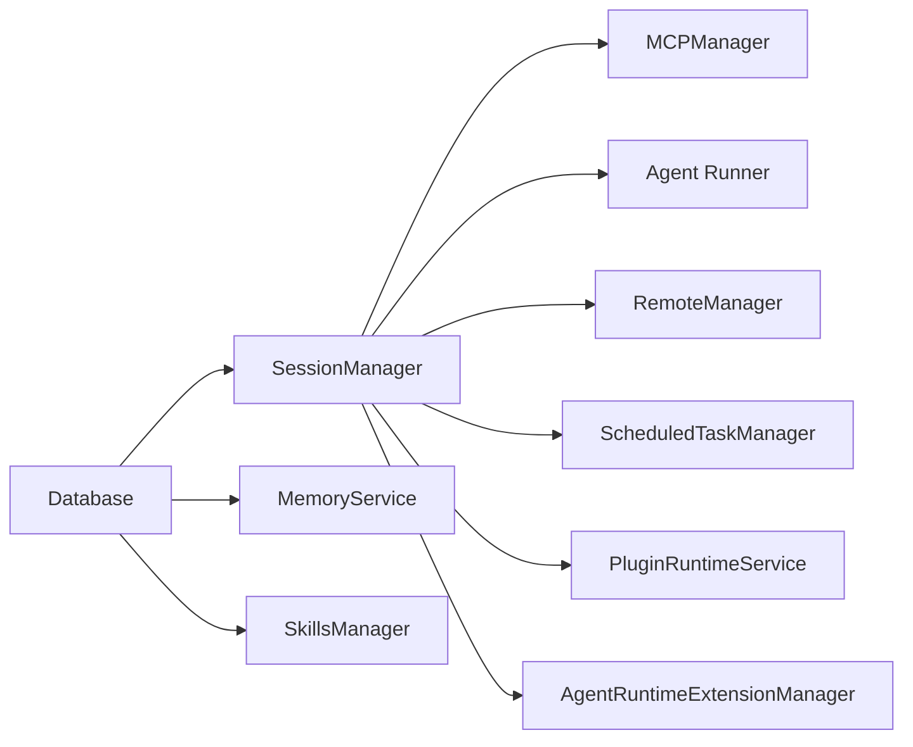

# Main Process Architecture

<cite>
**Referenced Files in This Document**
- [src/main/index.ts](file://src/main/index.ts)
- [src/main/session/session-manager.ts](file://src/main/session/session-manager.ts)
- [src/main/mcp/mcp-manager.ts](file://src/main/mcp/mcp-manager.ts)
- [src/main/memory/memory-service.ts](file://src/main/memory/memory-service.ts)
- [src/main/remote/remote-manager.ts](file://src/main/remote/remote-manager.ts)
- [src/main/skills/skills-manager.ts](file://src/main/skills/skills-manager.ts)
</cite>

## Table of Contents

1. [Introduction](#introduction)
2. [Project Structure](#project-structure)
3. [Core Components](#core-components)
4. [Architecture Overview](#architecture-overview)
5. [Detailed Component Analysis](#detailed-component-analysis)
6. [Dependency Analysis](#dependency-analysis)
7. [Performance Considerations](#performance-considerations)
8. [Troubleshooting Guide](#troubleshooting-guide)
9. [Conclusion](#conclusion)

## Introduction

This document describes the Electron main process architecture for Open Cowork. It covers the main entry point responsibilities, modular service architecture, IPC routing system, lifecycle hooks, window management, deep-link handling, sandbox security model, and service initialization order. The main process orchestrates SessionManager, SkillsManager, MemoryService, MCP Manager, and RemoteManager, coordinating them through a central IPC hub with ~60 handler namespaces.

## Project Structure

The main process entry point initializes core services, sets up the BrowserWindow, and registers IPC handlers grouped by functional domains:

- Lifecycle: ready, activate, before-quit, window-all-closed
- Window management: createWindow, navigation interception, external URL handling
- IPC hub: centralized event routing with namespaced handlers (config._, mcp._, session._, sandbox._, logs._, remote._, schedule.\*, etc.)
- Security: sandbox enforcement, privilege separation, contextIsolation, and protocol gating

**Diagram sources**

- [src/main/index.ts:787-1012](file://src/main/index.ts#L787-L1012)
- [src/main/session/session-manager.ts:71-123](file://src/main/session/session-manager.ts#L71-L123)
- [src/main/mcp/mcp-manager.ts:14-13](file://src/main/mcp/mcp-manager.ts#L14-L13)
- [src/main/memory/memory-service.ts:142-185](file://src/main/memory/memory-service.ts#L142-L185)
- [src/main/remote/remote-manager.ts:61-108](file://src/main/remote/remote-manager.ts#L61-L108)
- [src/main/skills/skills-manager.ts:98-121](file://src/main/skills/skills-manager.ts#L98-L121)

**Section sources**

- [src/main/index.ts:15-14](file://src/main/index.ts#L15-L14)
- [src/main/index.ts:787-1012](file://src/main/index.ts#L787-L1012)

## Core Components

- SessionManager: Manages session lifecycle, chat persistence, sandbox integration, and delegates AI execution to ClaudeAgentRunner. It initializes MCPManager and creates the agent runner based on configuration.
- SkillsManager: Discovers built-in skills, parses metadata, supports hot-reload via watchers, and manages plugin installs/uninstalls.
- MemoryService: Provides memory ingestion, extraction, navigation, retrieval, and tool generation. Integrates with AgentRuntimeExtensionManager via MemoryExtension.
- MCPManager: Manages MCP server configurations (stdio, SSE, Streamable HTTP), tool discovery, and transport handling.
- RemoteManager: Orchestrates Remote Gateway, Channels, and MessageRouter for remote-controlled sessions, with permission and interaction handling.

**Section sources**

- [src/main/session/session-manager.ts:71-123](file://src/main/session/session-manager.ts#L71-L123)
- [src/main/skills/skills-manager.ts:98-121](file://src/main/skills/skills-manager.ts#L98-L121)
- [src/main/memory/memory-service.ts:142-185](file://src/main/memory/memory-service.ts#L142-L185)
- [src/main/mcp/mcp-manager.ts:14-13](file://src/main/mcp/mcp-manager.ts#L14-L13)
- [src/main/remote/remote-manager.ts:61-108](file://src/main/remote/remote-manager.ts#L61-L108)

## Architecture Overview

The main process follows a modular initialization sequence:

1. Load environment and apply saved configuration
2. Initialize database and core services (PluginRuntimeService, MemoryService, AgentRuntimeExtensionManager)
3. Construct SessionManager (which creates MCPManager and agent runner)
4. Initialize SkillsManager and attach storage change notifications
5. Build macOS menu and tray
6. Create BrowserWindow and start navigation server
7. Initialize ScheduledTaskManager and RemoteManager
8. Register IPC handlers for all domains

**Diagram sources**

- [src/main/index.ts:834-843](file://src/main/index.ts#L834-L843)
- [src/main/index.ts:844-850](file://src/main/index.ts#L844-L850)
- [src/main/index.ts:863-864](file://src/main/index.ts#L863-L864)
- [src/main/index.ts:1151-1166](file://src/main/index.ts#L1151-L1166)

**Section sources**

- [src/main/index.ts:834-864](file://src/main/index.ts#L834-L864)

## Detailed Component Analysis

### Main Process Entry Point (index.ts)

Responsibilities:

- App lifecycle management: ready, activate, before-quit, window-all-closed
- Central IPC hub: ~60 handler namespaces (config._, mcp._, session._, sandbox._, logs._, remote._, schedule.\*, etc.)
- BrowserWindow creation and deep-link/protocol handling
- Service orchestration and initialization order

Key mechanisms:

- Single-instance lock with special handling in development
- Environment loading (.env) and saved config application
- Hardware acceleration disabled for compatibility
- Tray and macOS menu setup
- Window creation with contextIsolation, sandbox, and navigation interception
- Deep-link handling with allowed origins and protocols
- Central sendToRenderer with remote session interception and permission bridging

Lifecycle hooks:

- ready: initialize services, create window, start nav server, schedule tasks, remote control
- activate: show/create window if none exists
- before-quit: async cleanup of sandbox resources, MCP servers, database, logs
- window-all-closed: quit on Windows/Linux; on macOS keep app alive for clean shutdown

IPC routing highlights:

- Client events: session.start/continue/stop/delete/list, permissions, sudo passwords, workdir selection
- Config domain: get/save/createSet/renameSet/deleteSet/switchSet/isConfigured/test/diagnose
- MCP domain: getServers/getServer/saveServer/deleteServer/getTools/getServerStatus/getPresets
- Skills and Plugins: list/install/uninstall/setEnabled/setComponentEnabled
- Sandbox domain: status, WSL/Lima checks and setup
- Logs domain: path, directory, export, open, clear, enable/disable
- Remote domain: config/status/enabled updates, pairing, sessions, tunnel status
- Schedule domain: list/create/update/delete/toggle/runNow
- Memory domain: overview/search/read/rebuild/clear/list files

Security model:

- BrowserWindow webPreferences enforce contextIsolation and sandbox
- Navigation interception denies external URLs except allowed origins/protocols
- shell.openExternal restricted to http/https/mailto
- Permission requests bridged through RemoteManager for remote sessions
- Sandbox bootstrap and cleanup coordinated with graceful shutdown

**Section sources**

- [src/main/index.ts:15-14](file://src/main/index.ts#L15-L14)
- [src/main/index.ts:177-220](file://src/main/index.ts#L177-L220)
- [src/main/index.ts:382-556](file://src/main/index.ts#L382-L556)
- [src/main/index.ts:1151-1166](file://src/main/index.ts#L1151-L1166)
- [src/main/index.ts:1392-1581](file://src/main/index.ts#L1392-L1581)
- [src/main/index.ts:1583-1665](file://src/main/index.ts#L1583-L1665)
- [src/main/index.ts:1676-1781](file://src/main/index.ts#L1676-L1781)
- [src/main/index.ts:1873-2000](file://src/main/index.ts#L1873-L2000)
- [src/main/index.ts:2029-2262](file://src/main/index.ts#L2029-L2262)
- [src/main/index.ts:2264-2397](file://src/main/index.ts#L2264-L2397)
- [src/main/index.ts:2418-2592](file://src/main/index.ts#L2418-L2592)
- [src/main/index.ts:1000-1150](file://src/main/index.ts#L1000-L1150)
- [src/main/index.ts:1033-1149](file://src/main/index.ts#L1033-L1149)

### SessionManager

Responsibilities:

- Session CRUD: create, continue, stop, delete, list
- Chat history persistence to SQLite via DatabaseInstance
- Workspace-scoped sessions with sandbox integration
- Delegates AI execution to ClaudeAgentRunner

Initialization:

- Constructs with DatabaseInstance, sendToRenderer callback, optional PluginRuntimeService and AgentRuntimeExtensionManager
- Creates MCPManager and agent runner based on configuration
- Maintains active sessions, prompt queues, pending permissions, sudo password requests, and sandbox initialization promises

Key methods:

- reloadConfig: applies API config changes on next query
- reloadMCP: reinitializes MCP servers when configs change
- invalidateMcpServersCache: forces tool refresh on next query
- invalidateSkillsSetup: re-links skills after install/uninstall/toggle
- reloadSandbox: reinitializes sandbox adapter when config changes

**Diagram sources**

- [src/main/session/session-manager.ts:94-123](file://src/main/session/session-manager.ts#L94-L123)
- [src/main/mcp/mcp-manager.ts:14-13](file://src/main/mcp/mcp-manager.ts#L14-L13)

**Section sources**

- [src/main/session/session-manager.ts:71-123](file://src/main/session/session-manager.ts#L71-L123)
- [src/main/session/session-manager.ts:161-198](file://src/main/session/session-manager.ts#L161-L198)

### SkillsManager

Responsibilities:

- Discovers built-in skills from .claude/skills/ directories
- Parses SKILL.md front-matter for metadata (name, description, triggers)
- Hot-reload via chokidar file watcher
- Plugin install/uninstall from npm-style package specs

Initialization:

- Loads built-in skills from packaged locations
- Starts storage watcher if enabled
- Emits storage change events to renderer

**Section sources**

- [src/main/skills/skills-manager.ts:98-121](file://src/main/skills/skills-manager.ts#L98-L121)
- [src/main/skills/skills-manager.ts:126-174](file://src/main/skills/skills-manager.ts#L126-L174)

### MemoryService

Responsibilities:

- Memory ingestion, extraction, navigation, retrieval, and tool generation
- Integrates with LLM clients and stores core/experience memories
- Provides search and inspection APIs for sessions and workspaces

Initialization:

- Constructs with DatabaseInstance and optional LLM client/prompt overrides
- Builds CoreMemoryExtractor, ExperienceMemoryExtractor, MemoryNavigator, MemoryRetriever
- Creates memory tools bound to the service instance

**Section sources**

- [src/main/memory/memory-service.ts:142-185](file://src/main/memory/memory-service.ts#L142-L185)

### RemoteManager

Responsibilities:

- Remote control gateway, channels (Feishu, Slack), and message routing
- Session mapping between actual and remote session IDs
- Interaction handling (questions/permissions) with security verification
- Response buffering and deduplication for streaming-like updates

Initialization:

- Sets agent executor callback for session control
- Configures default working directory
- Starts gateway and message router when enabled

**Section sources**

- [src/main/remote/remote-manager.ts:61-108](file://src/main/remote/remote-manager.ts#L61-L108)
- [src/main/remote/remote-manager.ts:169-192](file://src/main/remote/remote-manager.ts#L169-L192)

## Dependency Analysis

Service initialization order ensures dependencies are satisfied:

- Database must be initialized before SessionManager, MemoryService, and SkillsManager
- SessionManager depends on MCPManager and agent runner; it is constructed before creating the interactive window
- RemoteManager requires SessionManager for agent callbacks and is started after configuration
- ScheduledTaskManager depends on SessionManager for task execution

**Diagram sources**

- [src/main/index.ts:834-864](file://src/main/index.ts#L834-L864)
- [src/main/session/session-manager.ts:115-123](file://src/main/session/session-manager.ts#L115-L123)

**Section sources**

- [src/main/index.ts:834-864](file://src/main/index.ts#L834-L864)
- [src/main/session/session-manager.ts:115-123](file://src/main/session/session-manager.ts#L115-L123)

## Performance Considerations

- IPC handler registration is centralized to minimize overhead and maintain consistency across namespaces
- Sandbox bootstrap runs asynchronously to avoid blocking UI startup
- Memory operations leverage queues and debounced updates to reduce I/O contention
- MCP tool cache invalidation is triggered selectively to balance freshness and performance
- Scheduled tasks are executed with bounds checking and title regeneration to avoid redundant work

## Troubleshooting Guide

Common issues and remedies:

- Sandbox setup failures: use retry endpoints for WSL/Lima; check bootstrap progress events
- MCP server misconfiguration: saveServer enables rollback to disabled state to prevent repeated failures
- Permission denials: verify RemoteManager permission bridging and session mapping
- Logging export failures: ensure log files exist and archiver dependencies are available
- Window navigation blocked: confirm allowed origins and protocols configuration

**Section sources**

- [src/main/index.ts:1602-1623](file://src/main/index.ts#L1602-L1623)
- [src/main/index.ts:2610-2638](file://src/main/index.ts#L2610-L2638)
- [src/main/index.ts:2057-2203](file://src/main/index.ts#L2057-L2203)

## Conclusion

Open Cowork’s main process implements a robust, modular architecture centered around a strong IPC hub and clear service boundaries. The initialization sequence ensures dependencies are met, the lifecycle hooks provide reliable operation across platforms, and the security model enforces sandboxing and privilege separation. The ~60 IPC handler namespaces cover all major domains, enabling a cohesive developer and user experience.
