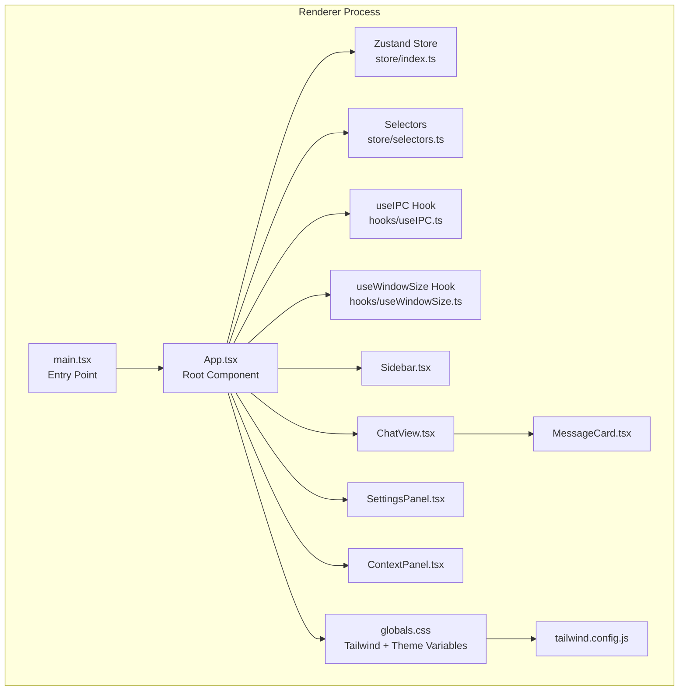
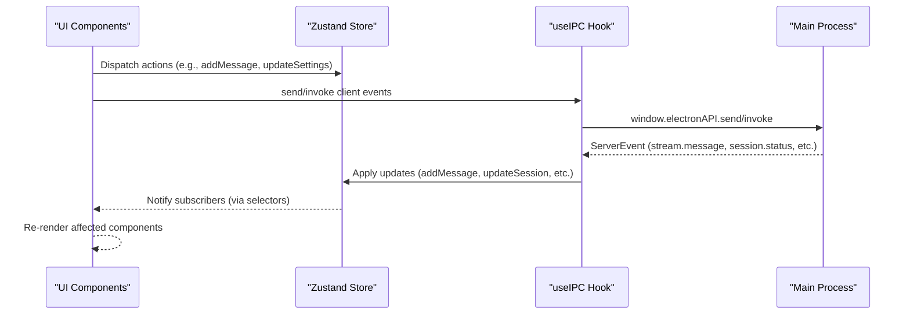
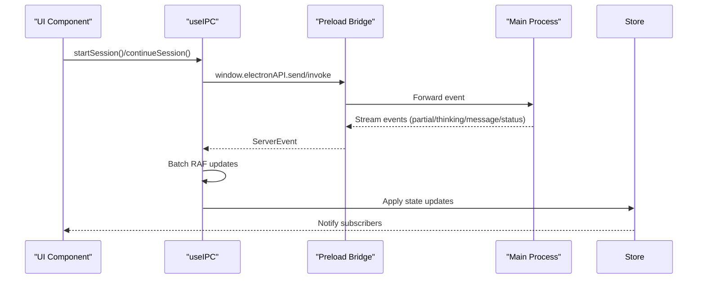
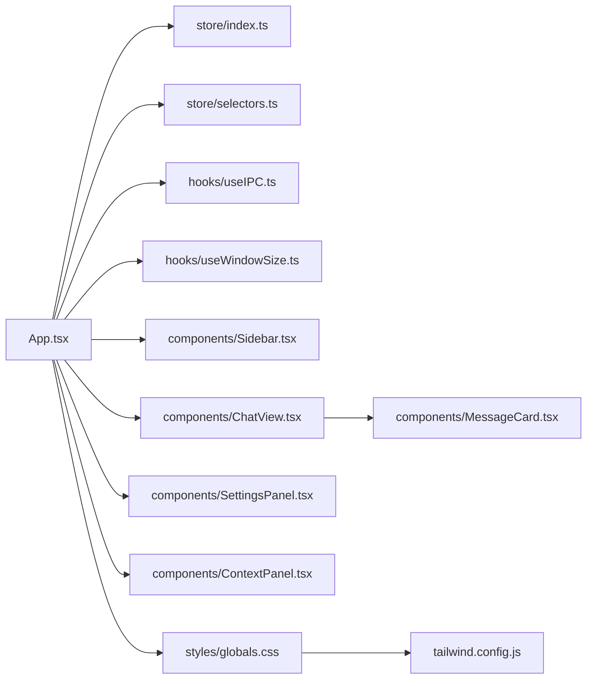

# Renderer Process Design

<cite>
**Referenced Files in This Document**
- [App.tsx](file://src/renderer/App.tsx)
- [main.tsx](file://src/renderer/main.tsx)
- [store/index.ts](file://src/renderer/store/index.ts)
- [store/selectors.ts](file://src/renderer/store/selectors.ts)
- [hooks/useIPC.ts](file://src/renderer/hooks/useIPC.ts)
- [hooks/useWindowSize.ts](file://src/renderer/hooks/useWindowSize.ts)
- [components/ChatView.tsx](file://src/renderer/components/ChatView.tsx)
- [components/Sidebar.tsx](file://src/renderer/components/Sidebar.tsx)
- [components/SettingsPanel.tsx](file://src/renderer/components/SettingsPanel.tsx)
- [components/MessageCard.tsx](file://src/renderer/components/MessageCard.tsx)
- [components/ContextPanel.tsx](file://src/renderer/components/ContextPanel.tsx)
- [styles/globals.css](file://src/renderer/styles/globals.css)
- [tailwind.config.js](file://src/renderer/tailwind.config.js)
- [types/index.ts](file://src/renderer/types/index.ts)
</cite>

## Table of Contents

1. [Introduction](#introduction)
2. [Project Structure](#project-structure)
3. [Core Components](#core-components)
4. [Architecture Overview](#architecture-overview)
5. [Detailed Component Analysis](#detailed-component-analysis)
6. [Dependency Analysis](#dependency-analysis)
7. [Performance Considerations](#performance-considerations)
8. [Troubleshooting Guide](#troubleshooting-guide)
9. [Conclusion](#conclusion)

## Introduction

This document describes the React-based renderer process for Open Cowork. It covers the component architecture with App.tsx as the root component and main.tsx as the entry point, state management using Zustand stores and selector patterns, component hierarchy (ChatView, SettingsPanel, Sidebar, MessageCard, ContextPanel), React hooks integration for IPC communication and window resizing, styling architecture using Tailwind CSS and theme management, component lifecycle, prop drilling patterns, event handling mechanisms, and the renderer process security model with context isolation.

## Project Structure

The renderer process follows a clear separation of concerns:

- Entry point: main.tsx initializes the app, error boundaries, logging diagnostics, and mounts the root App component.
- Root component: App.tsx orchestrates the UI layout, theme application, responsive behavior, and overlays.
- State management: A centralized Zustand store manages sessions, messages, UI state, permissions, sandbox setup/sync, and configuration.
- Selectors: Typed, minimal subscriptions to the store to avoid unnecessary re-renders.
- Components: Feature-focused components (ChatView, Sidebar, SettingsPanel, ContextPanel, MessageCard) with clear responsibilities.
- Hooks: useIPC for Electron IPC communication and useWindowSize for responsive behavior.
- Styling: Tailwind CSS with theme-aware CSS variables and custom utilities.



**Diagram sources**

- [main.tsx:1-84](file://src/renderer/main.tsx#L1-L84)
- [App.tsx:1-262](file://src/renderer/App.tsx#L1-L262)
- [store/index.ts:1-630](file://src/renderer/store/index.ts#L1-L630)
- [store/selectors.ts:1-298](file://src/renderer/store/selectors.ts#L1-L298)
- [hooks/useIPC.ts:1-814](file://src/renderer/hooks/useIPC.ts#L1-L814)
- [hooks/useWindowSize.ts:1-34](file://src/renderer/hooks/useWindowSize.ts#L1-L34)
- [components/Sidebar.tsx:1-535](file://src/renderer/components/Sidebar.tsx#L1-L535)
- [components/ChatView.tsx:1-861](file://src/renderer/components/ChatView.tsx#L1-L861)
- [components/SettingsPanel.tsx:1-293](file://src/renderer/components/SettingsPanel.tsx#L1-L293)
- [components/ContextPanel.tsx:1-665](file://src/renderer/components/ContextPanel.tsx#L1-L665)
- [components/MessageCard.tsx:1-136](file://src/renderer/components/MessageCard.tsx#L1-L136)
- [styles/globals.css:1-338](file://src/renderer/styles/globals.css#L1-L338)
- [tailwind.config.js:1-86](file://src/renderer/tailwind.config.js#L1-L86)

**Section sources**

- [main.tsx:1-84](file://src/renderer/main.tsx#L1-L84)
- [App.tsx:1-262](file://src/renderer/App.tsx#L1-L262)

## Core Components

- App.tsx: Orchestrates layout, theme, responsive behavior, overlays (dialogs/modals), and lazy-loading of heavy panels.
- Sidebar.tsx: Manages session list, search, selection, deletion, and theme toggling.
- ChatView.tsx: Renders messages, handles input, streaming, drag-and-drop/image attachment, MCP connectors, and execution timing.
- SettingsPanel.tsx: Multi-tab settings with lazy-loaded panels and responsive sidebar.
- ContextPanel.tsx: Displays artifacts, working directory, token usage, and MCP connectors.
- MessageCard.tsx: Renders individual message content blocks and supports copy actions.
- Zustand Store: Centralized state for sessions, messages, UI flags, permissions, sandbox setup/sync, and configuration.
- Selectors: Minimal, typed subscriptions to the store to reduce re-renders.
- Hooks: useIPC for IPC communication and useWindowSize for responsive behavior.

**Section sources**

- [App.tsx:59-262](file://src/renderer/App.tsx#L59-L262)
- [store/index.ts:75-597](file://src/renderer/store/index.ts#L75-L597)
- [store/selectors.ts:17-298](file://src/renderer/store/selectors.ts#L17-L298)
- [hooks/useIPC.ts:26-814](file://src/renderer/hooks/useIPC.ts#L26-L814)
- [hooks/useWindowSize.ts:8-34](file://src/renderer/hooks/useWindowSize.ts#L8-L34)

## Architecture Overview

The renderer process uses a unidirectional data flow:

- UI components subscribe to the Zustand store via selectors.
- Actions mutate the store state.
- IPC events from the main process update the store asynchronously.
- Effects in App.tsx and components manage side effects (theme, layout, dialogs).



**Diagram sources**

- [hooks/useIPC.ts:129-330](file://src/renderer/hooks/useIPC.ts#L129-L330)
- [store/index.ts:220-597](file://src/renderer/store/index.ts#L220-L597)
- [App.tsx:83-143](file://src/renderer/App.tsx#L83-L143)

## Detailed Component Analysis

### App.tsx: Root Component and Orchestration

Responsibilities:

- Subscribe to store via selectors for minimal re-renders.
- Manage theme application to document root based on settings and system theme.
- Handle responsive layout: auto-collapse panels based on window width.
- Control Settings panel visibility and sidebar behavior when settings opens.
- Handle configuration save and modal lifecycle.
- Render overlays: PermissionDialog, SudoPasswordDialog, ConfigModal, SandboxSetupDialog, SandboxSyncToast, GlobalNoticeToast.
- Lazy-load ChatView, ContextPanel, SettingsPanel, ConfigModal.

Key patterns:

- Selector-based subscriptions for active session, settings, layout flags, and notices.
- Action bindings via direct store access for UI actions.
- Effect-driven initialization and theme/application of layout rules.

**Section sources**

- [App.tsx:59-262](file://src/renderer/App.tsx#L59-L262)
- [store/selectors.ts:223-235](file://src/renderer/store/selectors.ts#L223-L235)
- [store/index.ts:120-190](file://src/renderer/store/index.ts#L120-L190)

### Zustand Store and Selectors

Store architecture:

- Centralized AppState with sessions, per-session states, UI flags, permissions, sandbox state, and configuration.
- Pure reducers for immutable updates and helper functions for session state patching.
- Actions for session CRUD, message streaming, trace steps, UI toggles, settings, sandbox setup/sync, and working directory.

Selectors:

- Derived state for active session, messages, partial content, execution state, trace steps, layout flags, settings, sandbox state, and notices.
- useShallow for multi-field subscriptions to minimize re-renders.

```mermaid
classDiagram
class AppState {
+sessions : Session[]
+activeSessionId : string|null
+sessionStates : Record<string, SessionState>
+isLoading : boolean
+sidebarCollapsed : boolean
+contextPanelCollapsed : boolean
+showSettings : boolean
+settingsTab : string|null
+pendingPermission : PermissionRequest|null
+pendingSudoPassword : SudoPasswordRequest|null
+settings : Settings
+appConfig : AppConfig|null
+isConfigured : boolean
+showConfigModal : boolean
+globalNotice : GlobalNotice|null
+workingDir : string|null
+sandboxSetupProgress : SandboxSetupProgress|null
+isSandboxSetupComplete : boolean
+sandboxSyncStatus : SandboxSyncStatus|null
+skillsStorageChangedAt : number
+skillsStorageChangeEvent : SkillsStorageChangeEvent|null
+systemDarkMode : boolean
+setSessions()
+addSession()
+updateSession()
+removeSession()
+setActiveSession()
+addMessage()
+updateMessage()
+setPartialMessage()
+setPartialThinking()
+activateNextTurn()
+updateActiveTurnStep()
+clearActiveTurn()
+addTraceStep()
+updateTraceStep()
+setLoading()
+toggleSidebar()
+toggleContextPanel()
+setSidebarCollapsed()
+setContextPanelCollapsed()
+setShowSettings()
+setSettings()
+updateSettings()
+setAppConfig()
+setIsConfigured()
+setShowConfigModal()
+setGlobalNotice()
+clearGlobalNotice()
+setWorkingDir()
+setSandboxSetupProgress()
+setSandboxSetupComplete()
+setSandboxSyncStatus()
+setSkillsStorageChangedAt()
+setSkillsStorageChangeEvent()
+setSystemDarkMode()
}
class SessionState {
+messages : Message[]
+partialMessage : string
+partialThinking : string
+pendingTurns : string[]
+activeTurn : {stepId,userMessageId}|null
+executionClock : SessionExecutionClock
+traceSteps : TraceStep[]
+contextWindow : number
}
AppState --> SessionState : "manages per-session state"
```

**Diagram sources**

- [store/index.ts:75-597](file://src/renderer/store/index.ts#L75-L597)

**Section sources**

- [store/index.ts:75-597](file://src/renderer/store/index.ts#L75-L597)
- [store/selectors.ts:17-298](file://src/renderer/store/selectors.ts#L17-L298)

### IPC Communication with Main Process

Hook responsibilities:

- Install a single, shared IPC listener once across all consumers.
- Batch high-frequency events (stream.partial, stream.thinking, trace updates) using requestAnimationFrame.
- Bootstrap configuration, theme, and permission rules on mount.
- Provide typed APIs: startSession, continueSession, stopSession, deleteSession, listSessions, getSessionMessages, getSessionTraceSteps, respondToPermission, respondToSudoPassword, and filesystem operations.

Security model and context isolation:

- Uses Electron’s preload bridge to expose only permitted APIs.
- Single listener guard prevents multiple registrations and ensures continuity of events.
- Browser mode fallbacks simulate behavior for development/testing.



**Diagram sources**

- [hooks/useIPC.ts:26-391](file://src/renderer/hooks/useIPC.ts#L26-L391)
- [hooks/useIPC.ts:407-814](file://src/renderer/hooks/useIPC.ts#L407-L814)

**Section sources**

- [hooks/useIPC.ts:26-391](file://src/renderer/hooks/useIPC.ts#L26-L391)
- [hooks/useIPC.ts:407-814](file://src/renderer/hooks/useIPC.ts#L407-L814)

### Sidebar.tsx: Session Management and Navigation

Responsibilities:

- Display and filter sessions by date and search query.
- Toggle selection mode for batch operations.
- Handle session click to load messages and trace steps if needed.
- Delete single or multiple sessions.
- Toggle theme and open settings.
- Responsive behavior: collapse to icons-only layout.

Patterns:

- Memoized filtering and grouping to avoid unnecessary recomputations.
- Immediate UI updates with delayed backend hydration.

**Section sources**

- [components/Sidebar.tsx:28-535](file://src/renderer/components/Sidebar.tsx#L28-L535)

### ChatView.tsx: Conversation Rendering and Interaction

Responsibilities:

- Render messages with streaming support (partial message and thinking).
- Manage input area with text, image paste/drop, file attachments.
- Handle drag-and-drop and paste events for images.
- Integrate with MCP connectors to show active connections.
- Compute and display execution time for the current session.
- Auto-scroll behavior with debouncing and conflict avoidance.

Patterns:

- useMemo to compute displayed messages including a synthetic streaming message.
- requestAnimationFrame-based debouncing for scroll operations.
- Controlled and uncontrolled input handling for prompt text.

**Section sources**

- [components/ChatView.tsx:27-861](file://src/renderer/components/ChatView.tsx#L27-L861)

### SettingsPanel.tsx: Multi-tab Settings

Responsibilities:

- Provide a tabbed settings UI with lazy-loaded content.
- Respect responsive layout and compact sidebar mode.
- Track and apply active tab from store for external navigation.

**Section sources**

- [components/SettingsPanel.tsx:65-293](file://src/renderer/components/SettingsPanel.tsx#L65-L293)

### ContextPanel.tsx: Context and Artifact Information

Responsibilities:

- Show session statistics, token usage, and context window utilization.
- List recent artifacts and workspace files with clickable reveal actions.
- Display MCP connectors and tool usage.
- Allow changing working directory with feedback and error handling.

**Section sources**

- [components/ContextPanel.tsx:38-665](file://src/renderer/components/ContextPanel.tsx#L38-L665)

### MessageCard.tsx: Individual Message Renderer

Responsibilities:

- Render content blocks (text, image, file, tool_use, tool_result, thinking).
- Support copy-to-clipboard for text content.
- Merge tool_result blocks with their corresponding tool_use when appropriate.

**Section sources**

- [components/MessageCard.tsx:14-136](file://src/renderer/components/MessageCard.tsx#L14-L136)

### Styling Architecture: Tailwind CSS and Theme Management

Styling approach:

- Tailwind CSS with custom theme variables mapped to CSS custom properties.
- Theme-aware colors, shadows, radii, fonts, and animations.
- Utilities for prose rendering, drag regions, and message bubbles.
- Responsive breakpoints and component-level styling.

Theme management:

- CSS variables define light and dark palettes.
- App.tsx applies theme class to document root based on settings and system theme.
- Tailwind config maps CSS variables to design tokens.

**Section sources**

- [styles/globals.css:1-338](file://src/renderer/styles/globals.css#L1-L338)
- [tailwind.config.js:1-86](file://src/renderer/tailwind.config.js#L1-L86)
- [App.tsx:98-108](file://src/renderer/App.tsx#L98-L108)

### Component Lifecycle, Prop Drilling, and Event Handling

Lifecycle:

- App.tsx mounts once and sets up IPC listener once (singleton guard).
- Components mount/unmount based on routing and settings visibility.
- Effects handle theme application, window resizing, and panel collapsing.

Prop drilling:

- Minimal prop drilling achieved via centralized store and selectors.
- Components access state directly through hooks; actions are bound locally where needed.

Event handling:

- IPC events are batched and applied to the store.
- UI events (clicks, form submissions, drag-and-drop) trigger actions or IPC calls.

**Section sources**

- [hooks/useIPC.ts:26-391](file://src/renderer/hooks/useIPC.ts#L26-L391)
- [App.tsx:83-126](file://src/renderer/App.tsx#L83-L126)

## Dependency Analysis

The renderer process exhibits low coupling and high cohesion:

- Components depend on selectors, not on the store internals.
- IPC is encapsulated in a single hook with a singleton listener.
- Styles are theme-variable driven and Tailwind-based.



**Diagram sources**

- [App.tsx:1-262](file://src/renderer/App.tsx#L1-L262)
- [store/index.ts:1-630](file://src/renderer/store/index.ts#L1-L630)
- [store/selectors.ts:1-298](file://src/renderer/store/selectors.ts#L1-L298)
- [hooks/useIPC.ts:1-814](file://src/renderer/hooks/useIPC.ts#L1-L814)
- [hooks/useWindowSize.ts:1-34](file://src/renderer/hooks/useWindowSize.ts#L1-L34)
- [components/Sidebar.tsx:1-535](file://src/renderer/components/Sidebar.tsx#L1-L535)
- [components/ChatView.tsx:1-861](file://src/renderer/components/ChatView.tsx#L1-L861)
- [components/SettingsPanel.tsx:1-293](file://src/renderer/components/SettingsPanel.tsx#L1-L293)
- [components/ContextPanel.tsx:1-665](file://src/renderer/components/ContextPanel.tsx#L1-L665)
- [components/MessageCard.tsx:1-136](file://src/renderer/components/MessageCard.tsx#L1-L136)
- [styles/globals.css:1-338](file://src/renderer/styles/globals.css#L1-L338)
- [tailwind.config.js:1-86](file://src/renderer/tailwind.config.js#L1-L86)

**Section sources**

- [App.tsx:1-262](file://src/renderer/App.tsx#L1-L262)
- [hooks/useIPC.ts:1-814](file://src/renderer/hooks/useIPC.ts#L1-L814)

## Performance Considerations

- Selector granularity: Use shallow selectors for multi-field subscriptions to minimize re-renders.
- Batching: useIPC batches high-frequency events using requestAnimationFrame to avoid excessive store updates.
- Lazy loading: Heavy panels (ChatView, ContextPanel, SettingsPanel, ConfigModal) are lazy-loaded with Suspense fallbacks.
- Memoization: Components use useMemo for derived data to avoid recomputation.
- Scroll optimization: ChatView uses debounced scroll with requestAnimationFrame to prevent jank during rapid updates.
- Theme application: Theme class is applied once via effect to avoid cascading style recalculations.

[No sources needed since this section provides general guidance]

## Troubleshooting Guide

Common issues and resolutions:

- IPC listener not receiving events:
  - Verify singleton installation guard and that the hook is called at least once.
  - Check browser mode fallbacks and ensure Electron APIs are available.
- Excessive re-renders:
  - Confirm selectors are scoped and use shallow where appropriate.
  - Avoid passing new object references as props; rely on selectors.
- Theme not applying:
  - Ensure theme class is toggled on document root and CSS variables are defined.
- Scroll conflicts:
  - Review scroll debouncing logic and ensure flags prevent concurrent scroll operations.
- Permission/Sudo dialogs not appearing:
  - Confirm pending state is set in the store and dialogs are rendered conditionally.

**Section sources**

- [hooks/useIPC.ts:26-391](file://src/renderer/hooks/useIPC.ts#L26-L391)
- [App.tsx:98-126](file://src/renderer/App.tsx#L98-L126)
- [components/ChatView.tsx:135-247](file://src/renderer/components/ChatView.tsx#L135-L247)

## Conclusion

The renderer process employs a clean, scalable architecture:

- A single root component orchestrates layout, theme, and overlays.
- Zustand provides a centralized, immutable state with typed selectors for efficient updates.
- IPC is encapsulated in a robust hook with batching and singleton guarantees.
- Tailwind CSS with theme variables enables consistent, responsive styling.
- Component responsibilities are clearly separated, minimizing prop drilling and improving maintainability.
