# Security Model

<cite>
**Referenced Files in This Document**
- [sandbox-adapter.ts](file://src/main/sandbox/sandbox-adapter.ts)
- [lima-bridge.ts](file://src/main/sandbox/lima-bridge.ts)
- [wsl-bridge.ts](file://src/main/sandbox/wsl-bridge.ts)
- [native-executor.ts](file://src/main/sandbox/native-executor.ts)
- [path-guard.ts](file://src/main/sandbox/path-guard.ts)
- [path-resolver.ts](file://src/main/sandbox/path-resolver.ts)
- [path-containment.ts](file://src/main/sandbox/path-containment.ts)
- [sandbox-tool-executor.ts](file://src/main/tools/sandbox-tool-executor.ts)
- [store-encryption.ts](file://src/main/utils/store-encryption.ts)
- [permission-rules-store.ts](file://src/main/config/permission-rules-store.ts)
- [mcp-oauth.ts](file://src/main/mcp/mcp-oauth.ts)
- [mcp-manager.ts](file://src/main/mcp/mcp-manager.ts)
- [gateway.ts](file://src/main/remote/gateway.ts)
- [remote-manager.ts](file://src/main/remote/remote-manager.ts)
- [tunnel-manager.ts](file://src/main/remote/tunnel-manager.ts)
- [channel-base.ts](file://src/main/remote/channels/channel-base.ts)
- [feishu-channel.ts](file://src/main/remote/channels/feishu/feishu-channel.ts)
- [slack-channel.ts](file://src/main/remote/channels/slack/slack-channel.ts)
- [index.ts](file://src/main/index.ts)
- [preload.ts](file://src/preload/index.ts)
- [ipc-types.ts](file://src/shared/ipc-types.ts)
- [loopback.ts](file://src/shared/network/loopback.ts)
- [sandbox-command-injection.test.ts](file://tests/sandbox-command-injection.test.ts)
- [sandbox-executor-containment.test.ts](file://tests/sandbox-executor-containment.test.ts)
- [store-encryption.test.ts](file://tests/store-encryption.test.ts)
- [mcp-oauth.test.ts](file://tests/mcp-oauth.test.ts)
</cite>

## Table of Contents

1. [Introduction](#introduction)
2. [Project Structure](#project-structure)
3. [Core Components](#core-components)
4. [Architecture Overview](#architecture-overview)
5. [Detailed Component Analysis](#detailed-component-analysis)
6. [Dependency Analysis](#dependency-analysis)
7. [Performance Considerations](#performance-considerations)
8. [Troubleshooting Guide](#troubleshooting-guide)
9. [Conclusion](#conclusion)
10. [Appendices](#appendices)

## Introduction

This document describes the security model and sandboxing architecture of Open Cowork. It explains multi-layered security across context isolation, sandbox enforcement, and privilege separation. It documents the sandbox adapter pattern with platform-specific implementations (WSL2, Lima, native), path containment mechanisms, file system access controls, and command execution restrictions. It also covers the permission rule system, user consent patterns for sensitive operations, encrypted storage architecture, and security boundaries between the main process, renderer process, and sandboxed execution environments. Threat modeling, attack surface analysis, and mitigation strategies are included, along with OAuth integration security, MCP protocol security, and remote collaboration security measures.

## Project Structure

Open Cowork’s security-critical components are organized around three main areas:

- Sandboxed execution and platform adapters
- Path containment and access control
- Encrypted storage and permission enforcement
- Remote collaboration and MCP integrations

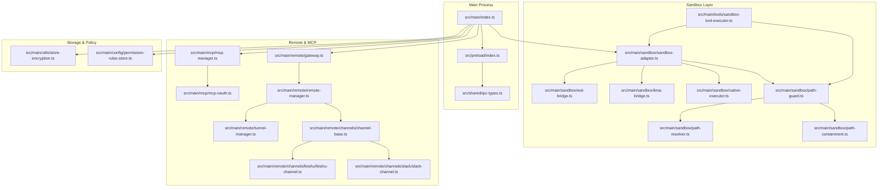

**Diagram sources**

- [index.ts](file://src/main/index.ts)
- [preload.ts](file://src/preload/index.ts)
- [ipc-types.ts](file://src/shared/ipc-types.ts)
- [sandbox-adapter.ts](file://src/main/sandbox/sandbox-adapter.ts)
- [wsl-bridge.ts](file://src/main/sandbox/wsl-bridge.ts)
- [lima-bridge.ts](file://src/main/sandbox/lima-bridge.ts)
- [native-executor.ts](file://src/main/sandbox/native-executor.ts)
- [path-guard.ts](file://src/main/sandbox/path-guard.ts)
- [path-resolver.ts](file://src/main/sandbox/path-resolver.ts)
- [path-containment.ts](file://src/main/sandbox/path-containment.ts)
- [sandbox-tool-executor.ts](file://src/main/tools/sandbox-tool-executor.ts)
- [mcp-manager.ts](file://src/main/mcp/mcp-manager.ts)
- [mcp-oauth.ts](file://src/main/mcp/mcp-oauth.ts)
- [gateway.ts](file://src/main/remote/gateway.ts)
- [remote-manager.ts](file://src/main/remote/remote-manager.ts)
- [tunnel-manager.ts](file://src/main/remote/tunnel-manager.ts)
- [channel-base.ts](file://src/main/remote/channels/channel-base.ts)
- [feishu-channel.ts](file://src/main/remote/channels/feishu/feishu-channel.ts)
- [slack-channel.ts](file://src/main/remote/channels/slack/slack-channel.ts)
- [store-encryption.ts](file://src/main/utils/store-encryption.ts)
- [permission-rules-store.ts](file://src/main/config/permission-rules-store.ts)

**Section sources**

- [index.ts](file://src/main/index.ts)
- [preload.ts](file://src/preload/index.ts)
- [ipc-types.ts](file://src/shared/ipc-types.ts)

## Core Components

- Sandbox Adapter Pattern: Provides a unified interface for platform-specific sandbox backends (WSL2, Lima, native) while enforcing consistent security policies.
- Path Containment and Guards: Enforce strict path resolution and containment rules to prevent path traversal and unauthorized filesystem access.
- Encrypted Storage Utilities: Securely store sensitive configuration and credentials using encryption primitives.
- Permission Rule Store: Centralized policy store for user-consented permissions and sensitive operation approvals.
- MCP and Remote Collaboration Security: Secure protocol handling, OAuth flows, and tunnel management for remote collaboration.
- Renderer/Main Boundary Controls: IPC type definitions and preload setup to enforce secure context isolation.

**Section sources**

- [sandbox-adapter.ts](file://src/main/sandbox/sandbox-adapter.ts)
- [path-guard.ts](file://src/main/sandbox/path-guard.ts)
- [path-resolver.ts](file://src/main/sandbox/path-resolver.ts)
- [path-containment.ts](file://src/main/sandbox/path-containment.ts)
- [store-encryption.ts](file://src/main/utils/store-encryption.ts)
- [permission-rules-store.ts](file://src/main/config/permission-rules-store.ts)
- [mcp-oauth.ts](file://src/main/mcp/mcp-oauth.ts)
- [gateway.ts](file://src/main/remote/gateway.ts)
- [remote-manager.ts](file://src/main/remote/remote-manager.ts)
- [tunnel-manager.ts](file://src/main/remote/tunnel-manager.ts)

## Architecture Overview

The security architecture separates concerns across layers:

- Main Process: Hosts trusted orchestration, permission enforcement, and secure storage.
- Renderer Process: User-facing UI with restricted capabilities via preload and IPC contracts.
- Sandboxed Execution Environment: Platform-specific containers/vms with strict path and command controls.
- Remote/MCP Layer: Secure channels for external integrations with OAuth and tunneling.

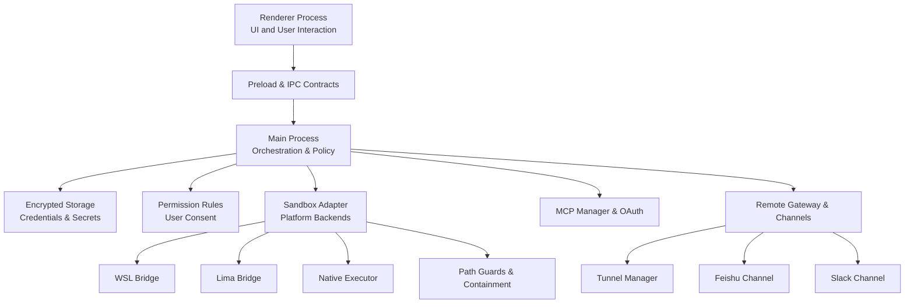

**Diagram sources**

- [index.ts](file://src/main/index.ts)
- [preload.ts](file://src/preload/index.ts)
- [sandbox-adapter.ts](file://src/main/sandbox/sandbox-adapter.ts)
- [wsl-bridge.ts](file://src/main/sandbox/wsl-bridge.ts)
- [lima-bridge.ts](file://src/main/sandbox/lima-bridge.ts)
- [native-executor.ts](file://src/main/sandbox/native-executor.ts)
- [path-guard.ts](file://src/main/sandbox/path-guard.ts)
- [store-encryption.ts](file://src/main/utils/store-encryption.ts)
- [permission-rules-store.ts](file://src/main/config/permission-rules-store.ts)
- [mcp-manager.ts](file://src/main/mcp/mcp-manager.ts)
- [mcp-oauth.ts](file://src/main/mcp/mcp-oauth.ts)
- [gateway.ts](file://src/main/remote/gateway.ts)
- [remote-manager.ts](file://src/main/remote/remote-manager.ts)
- [tunnel-manager.ts](file://src/main/remote/tunnel-manager.ts)
- [feishu-channel.ts](file://src/main/remote/channels/feishu/feishu-channel.ts)
- [slack-channel.ts](file://src/main/remote/channels/slack/slack-channel.ts)

## Detailed Component Analysis

### Sandbox Adapter Pattern and Platform-Specific Implementations

The sandbox adapter abstracts platform differences behind a single interface. It delegates to:

- WSL Bridge: Windows Subsystem for Linux backend with containerized execution.
- Lima Bridge: macOS virtual machine backend using Lima runtime.
- Native Executor: Local native execution with strict confinement.

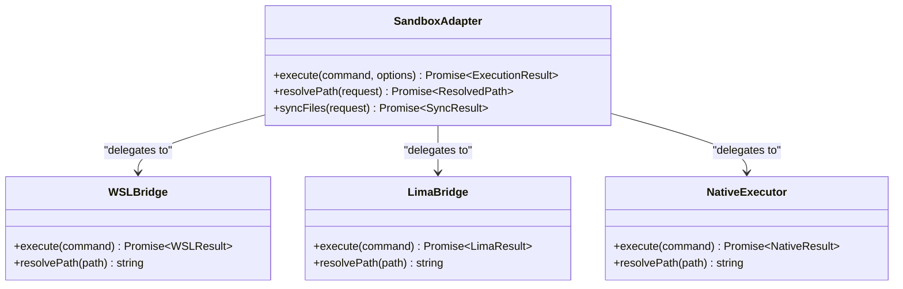

**Diagram sources**

- [sandbox-adapter.ts](file://src/main/sandbox/sandbox-adapter.ts)
- [wsl-bridge.ts](file://src/main/sandbox/wsl-bridge.ts)
- [lima-bridge.ts](file://src/main/sandbox/lima-bridge.ts)
- [native-executor.ts](file://src/main/sandbox/native-executor.ts)

Key security properties:

- Command normalization and escaping before delegation.
- Strict path resolution and containment enforced prior to execution.
- Isolation boundaries per platform backend to limit blast radius.

**Section sources**

- [sandbox-adapter.ts](file://src/main/sandbox/sandbox-adapter.ts)
- [wsl-bridge.ts](file://src/main/sandbox/wsl-bridge.ts)
- [lima-bridge.ts](file://src/main/sandbox/lima-bridge.ts)
- [native-executor.ts](file://src/main/sandbox/native-executor.ts)

### Path Containment Mechanisms and File System Access Controls

Path containment ensures that sandboxed commands and tools operate only within designated workspaces and approved directories. The system includes:

- Path Resolver: Validates and canonicalizes requested paths.
- Path Containment: Enforces allowlists and rejects out-of-scope paths.
- Path Guard: Intercepts and validates all path-based operations before execution.

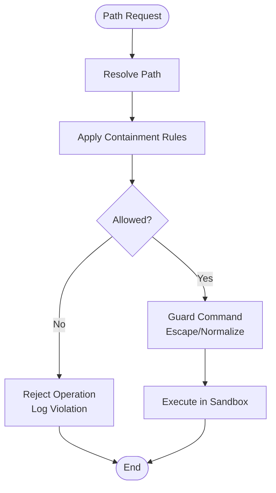

**Diagram sources**

- [path-resolver.ts](file://src/main/sandbox/path-resolver.ts)
- [path-containment.ts](file://src/main/sandbox/path-containment.ts)
- [path-guard.ts](file://src/main/sandbox/path-guard.ts)

Operational guarantees:

- All paths are resolved against a configured workspace root.
- Containment rules prevent traversal outside allowed scopes.
- Guards normalize and escape arguments to mitigate injection.

**Section sources**

- [path-resolver.ts](file://src/main/sandbox/path-resolver.ts)
- [path-containment.ts](file://src/main/sandbox/path-containment.ts)
- [path-guard.ts](file://src/main/sandbox/path-guard.ts)

### Command Execution Restrictions and Injection Mitigation

Command execution is tightly controlled:

- All commands pass through a guard that validates and sanitizes arguments.
- Tests demonstrate protections against command injection vectors in sandboxed contexts.

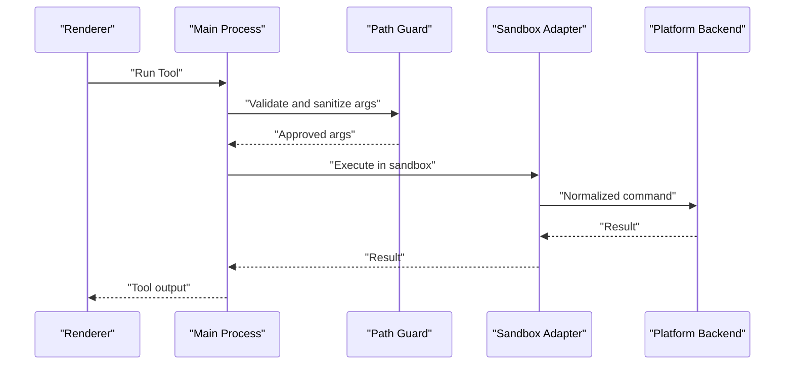

**Diagram sources**

- [sandbox-tool-executor.ts](file://src/main/tools/sandbox-tool-executor.ts)
- [path-guard.ts](file://src/main/sandbox/path-guard.ts)
- [sandbox-adapter.ts](file://src/main/sandbox/sandbox-adapter.ts)
- [sandbox-command-injection.test.ts](file://tests/sandbox-command-injection.test.ts)

**Section sources**

- [sandbox-tool-executor.ts](file://src/main/tools/sandbox-tool-executor.ts)
- [path-guard.ts](file://src/main/sandbox/path-guard.ts)
- [sandbox-command-injection.test.ts](file://tests/sandbox-command-injection.test.ts)

### Permission Rule System and User Consent Patterns

Sensitive operations require explicit user consent and are persisted in a permission rule store. The system:

- Presents user-consent dialogs for risky actions.
- Stores consent decisions securely.
- Enforces rules at runtime to block or escalate privileged operations.

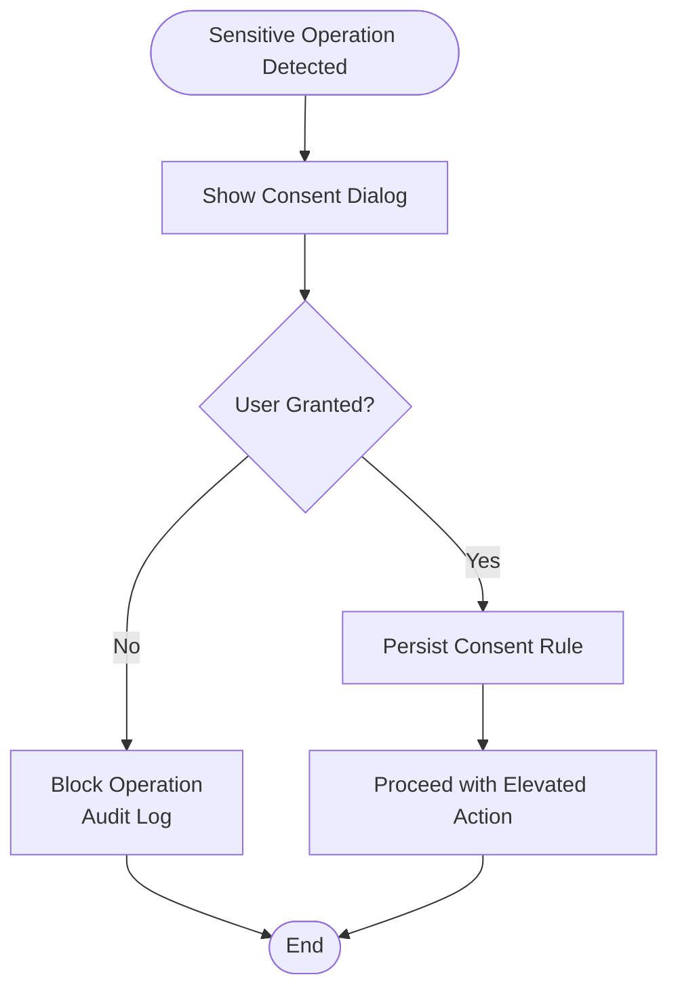

**Diagram sources**

- [permission-rules-store.ts](file://src/main/config/permission-rules-store.ts)

**Section sources**

- [permission-rules-store.ts](file://src/main/config/permission-rules-store.ts)

### Encrypted Storage Architecture Using Store-Encryption Utilities

Confidential configuration and secrets are stored encrypted on disk:

- Encryption keys are derived from secure system keystores or generated securely.
- Data is serialized and written atomically with integrity checks.
- Decryption occurs only during runtime when needed.

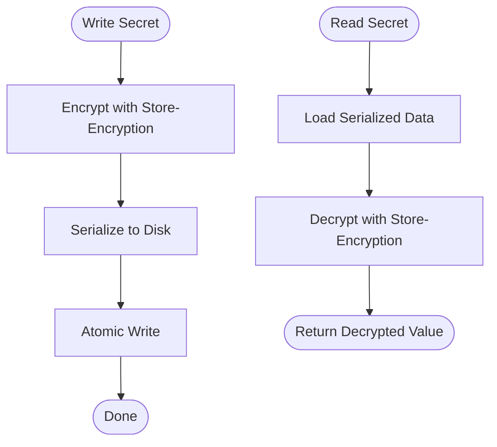

**Diagram sources**

- [store-encryption.ts](file://src/main/utils/store-encryption.ts)
- [store-encryption.test.ts](file://tests/store-encryption.test.ts)

**Section sources**

- [store-encryption.ts](file://src/main/utils/store-encryption.ts)
- [store-encryption.test.ts](file://tests/store-encryption.test.ts)

### Security Boundaries Between Main, Renderer, and Sandboxed Environments

- Main Process: Trusted orchestrator with elevated privileges; enforces policy and manages secure stores.
- Renderer Process: UI layer with restricted APIs via preload and typed IPC contracts.
- Sandboxed Environments: Isolated execution contexts per platform backend with strict path and command controls.

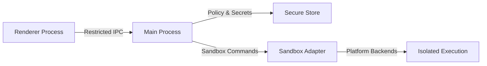

**Diagram sources**

- [index.ts](file://src/main/index.ts)
- [preload.ts](file://src/preload/index.ts)
- [ipc-types.ts](file://src/shared/ipc-types.ts)
- [sandbox-adapter.ts](file://src/main/sandbox/sandbox-adapter.ts)
- [store-encryption.ts](file://src/main/utils/store-encryption.ts)

**Section sources**

- [index.ts](file://src/main/index.ts)
- [preload.ts](file://src/preload/index.ts)
- [ipc-types.ts](file://src/shared/ipc-types.ts)

### OAuth Integration Security

OAuth flows for MCP and remote channels are handled with:

- Authorization code grants with PKCE where applicable.
- Loopback server endpoints for callbacks.
- Secure storage of tokens and refresh mechanisms.

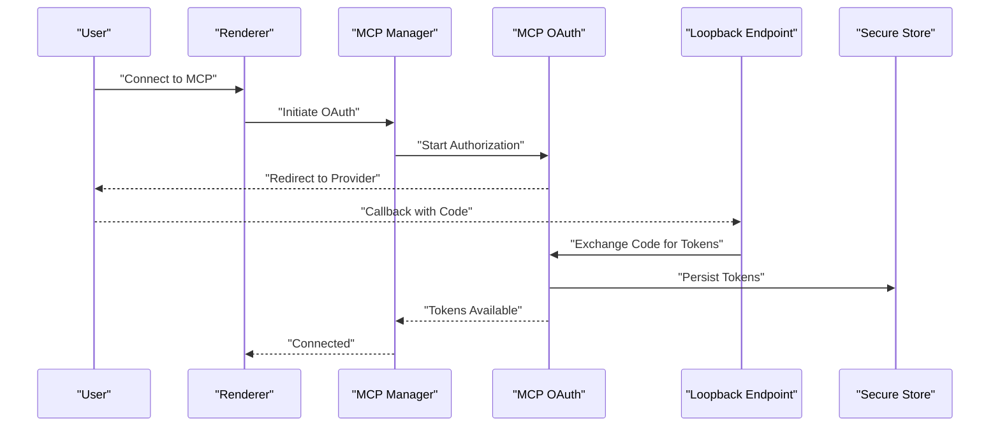

**Diagram sources**

- [mcp-manager.ts](file://src/main/mcp/mcp-manager.ts)
- [mcp-oauth.ts](file://src/main/mcp/mcp-oauth.ts)
- [loopback.ts](file://src/shared/network/loopback.ts)
- [store-encryption.ts](file://src/main/utils/store-encryption.ts)

**Section sources**

- [mcp-oauth.ts](file://src/main/mcp/mcp-oauth.ts)
- [mcp-manager.ts](file://src/main/mcp/mcp-manager.ts)
- [loopback.ts](file://src/shared/network/loopback.ts)

### MCP Protocol Security and Remote Collaboration Measures

- MCP Manager coordinates protocol communication with providers.
- Remote Manager and Tunnel Manager establish secure channels.
- Channels implement provider-specific integrations with shared base classes.

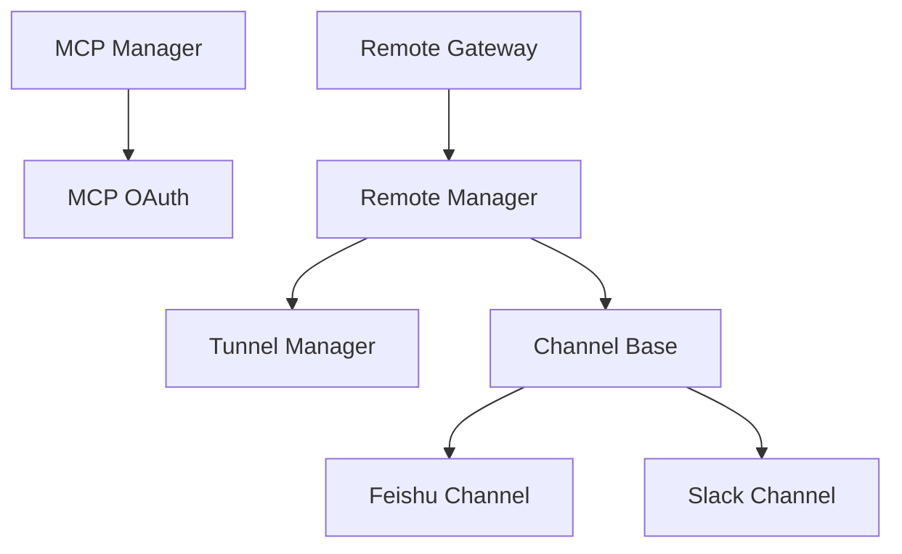

**Diagram sources**

- [mcp-manager.ts](file://src/main/mcp/mcp-manager.ts)
- [mcp-oauth.ts](file://src/main/mcp/mcp-oauth.ts)
- [gateway.ts](file://src/main/remote/gateway.ts)
- [remote-manager.ts](file://src/main/remote/remote-manager.ts)
- [tunnel-manager.ts](file://src/main/remote/tunnel-manager.ts)
- [channel-base.ts](file://src/main/remote/channels/channel-base.ts)
- [feishu-channel.ts](file://src/main/remote/channels/feishu/feishu-channel.ts)
- [slack-channel.ts](file://src/main/remote/channels/slack/slack-channel.ts)

**Section sources**

- [mcp-manager.ts](file://src/main/mcp/mcp-manager.ts)
- [mcp-oauth.ts](file://src/main/mcp/mcp-oauth.ts)
- [gateway.ts](file://src/main/remote/gateway.ts)
- [remote-manager.ts](file://src/main/remote/remote-manager.ts)
- [tunnel-manager.ts](file://src/main/remote/tunnel-manager.ts)
- [channel-base.ts](file://src/main/remote/channels/channel-base.ts)
- [feishu-channel.ts](file://src/main/remote/channels/feishu/feishu-channel.ts)
- [slack-channel.ts](file://src/main/remote/channels/slack/slack-channel.ts)

## Dependency Analysis

Security-critical dependencies and coupling:

- Main process depends on sandbox adapter and secure stores for policy and secrets.
- Renderer relies on preload and IPC contracts to maintain isolation.
- MCP and remote layers depend on OAuth and tunnel managers for secure connectivity.
- Path guards and resolvers are central dependencies for all sandboxed operations.

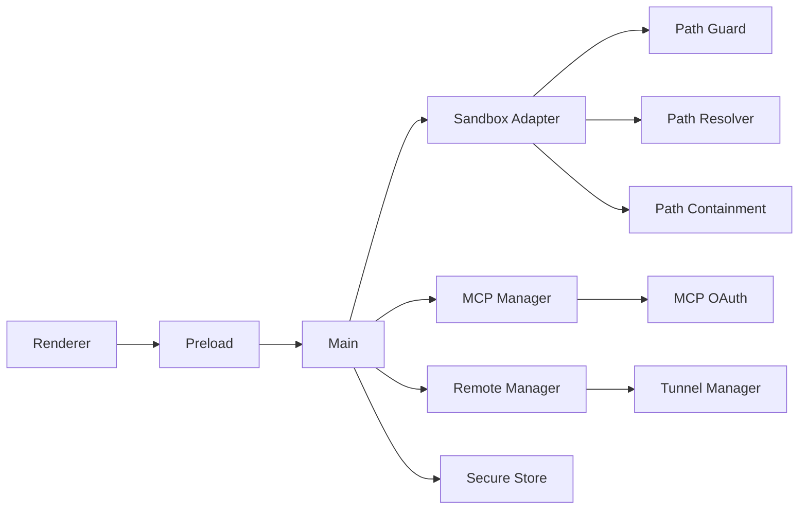

**Diagram sources**

- [index.ts](file://src/main/index.ts)
- [preload.ts](file://src/preload/index.ts)
- [sandbox-adapter.ts](file://src/main/sandbox/sandbox-adapter.ts)
- [path-guard.ts](file://src/main/sandbox/path-guard.ts)
- [path-resolver.ts](file://src/main/sandbox/path-resolver.ts)
- [path-containment.ts](file://src/main/sandbox/path-containment.ts)
- [mcp-manager.ts](file://src/main/mcp/mcp-manager.ts)
- [mcp-oauth.ts](file://src/main/mcp/mcp-oauth.ts)
- [remote-manager.ts](file://src/main/remote/remote-manager.ts)
- [tunnel-manager.ts](file://src/main/remote/tunnel-manager.ts)
- [store-encryption.ts](file://src/main/utils/store-encryption.ts)

**Section sources**

- [index.ts](file://src/main/index.ts)
- [preload.ts](file://src/preload/index.ts)
- [sandbox-adapter.ts](file://src/main/sandbox/sandbox-adapter.ts)
- [path-guard.ts](file://src/main/sandbox/path-guard.ts)
- [path-resolver.ts](file://src/main/sandbox/path-resolver.ts)
- [path-containment.ts](file://src/main/sandbox/path-containment.ts)
- [mcp-manager.ts](file://src/main/mcp/mcp-manager.ts)
- [mcp-oauth.ts](file://src/main/mcp/mcp-oauth.ts)
- [remote-manager.ts](file://src/main/remote/remote-manager.ts)
- [tunnel-manager.ts](file://src/main/remote/tunnel-manager.ts)
- [store-encryption.ts](file://src/main/utils/store-encryption.ts)

## Performance Considerations

- Path resolution and containment checks add minimal overhead compared to sandbox execution latency.
- Encrypted storage operations are optimized for small secret reads/writes; avoid frequent re-encryption.
- OAuth callback handling uses short-lived loopback endpoints to reduce exposure windows.
- Tunnel and channel operations should batch updates to minimize handshake overhead.

## Troubleshooting Guide

Common security-related issues and diagnostics:

- Path containment violations: Review containment rules and resolver logs; confirm workspace root configuration.
- Command injection attempts: Validate guard behavior and ensure all arguments are sanitized.
- Permission denial errors: Confirm user consent records and re-prompt if necessary.
- OAuth failures: Verify loopback endpoint accessibility and token persistence.
- Remote connection errors: Inspect tunnel manager logs and channel-specific error messages.

Evidence and tests:

- Command injection protections validated by dedicated test coverage.
- Sandbox executor containment validated by targeted tests.
- Store encryption correctness validated by unit tests.

**Section sources**

- [sandbox-command-injection.test.ts](file://tests/sandbox-command-injection.test.ts)
- [sandbox-executor-containment.test.ts](file://tests/sandbox-executor-containment.test.ts)
- [store-encryption.test.ts](file://tests/store-encryption.test.ts)
- [mcp-oauth.test.ts](file://tests/mcp-oauth.test.ts)

## Conclusion

Open Cowork employs a layered security model centered on strong isolation, strict path containment, and privilege separation. The sandbox adapter pattern enables consistent enforcement across platforms, while encrypted storage and permission rules protect sensitive data and user consent. OAuth, MCP, and remote collaboration features are secured through standardized protocols and secure channels. Together, these mechanisms form a robust defense-in-depth architecture suitable for collaborative AI development environments.

## Appendices

### Threat Modeling and Mitigation Strategies

- Command Injection: Mitigated by argument sanitization and containment guards.
- Path Traversal: Prevented by strict containment and resolver canonicalization.
- Privilege Escalation: Controlled by permission rule store and user consent prompts.
- Data Exposure: Protected by encrypted storage utilities.
- Man-in-the-Middle on OAuth: Mitigated by loopback endpoints and secure token storage.
- Remote Channel Compromise: Mitigated by tunnel manager and channel base abstractions.

### Examples of Security Policy Enforcement and Violation Detection

- Path containment enforcement: Rejects out-of-scope paths and logs violations.
- Permission rule enforcement: Blocks sensitive operations until user consent is recorded.
- Command injection detection: Tests validate guard behavior under adversarial inputs.
- OAuth callback validation: Loopback endpoint verifies authorization codes and persists tokens securely.
