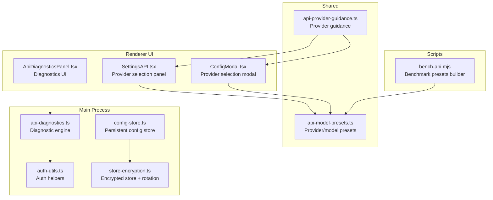
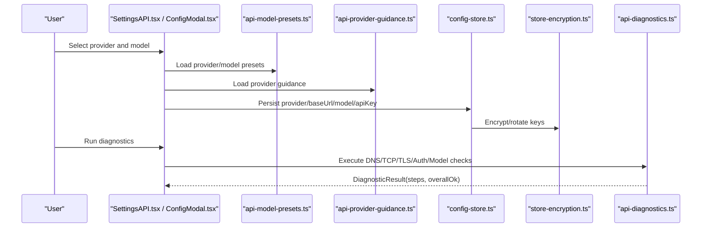
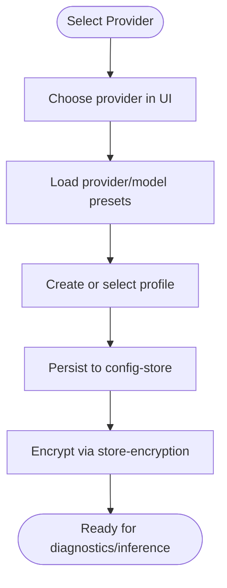
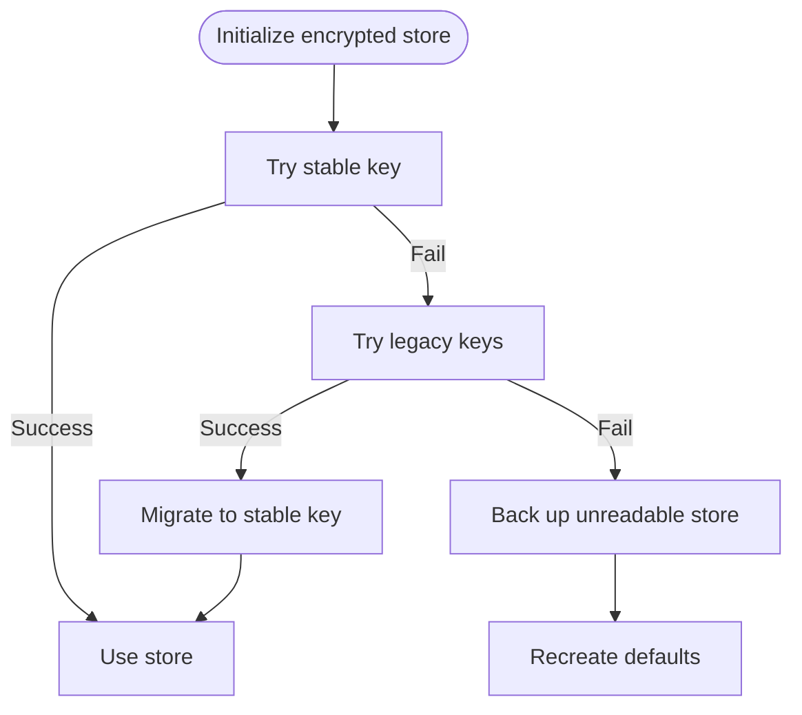
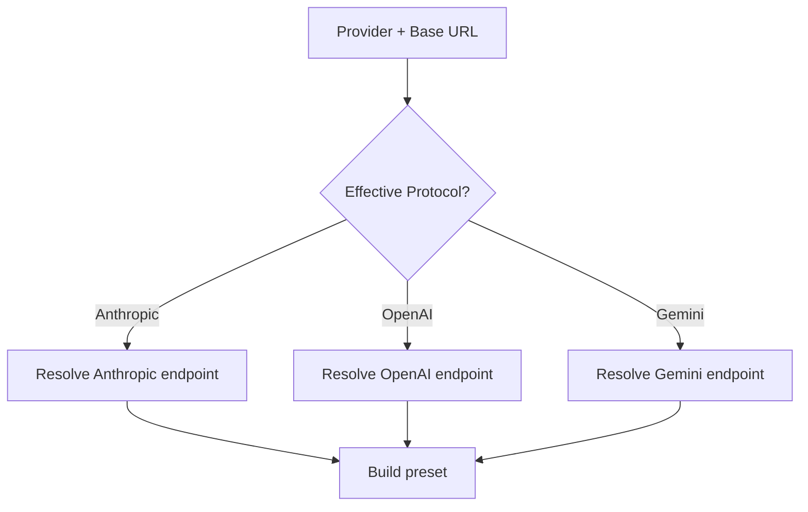
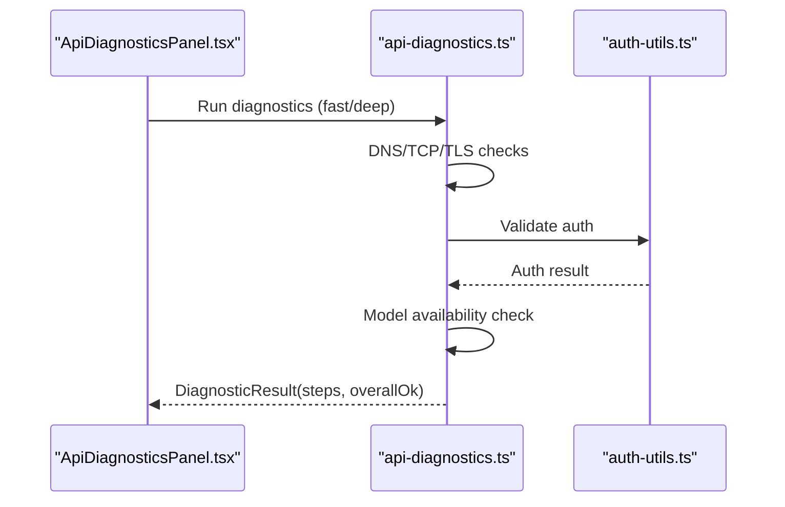
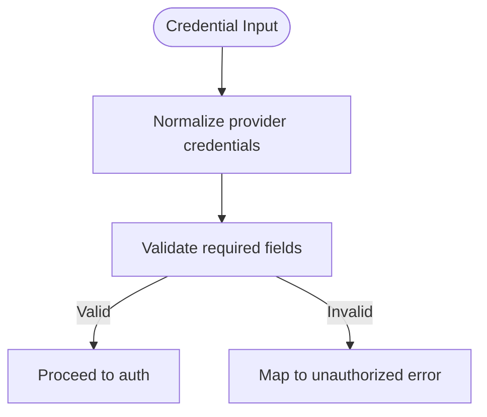
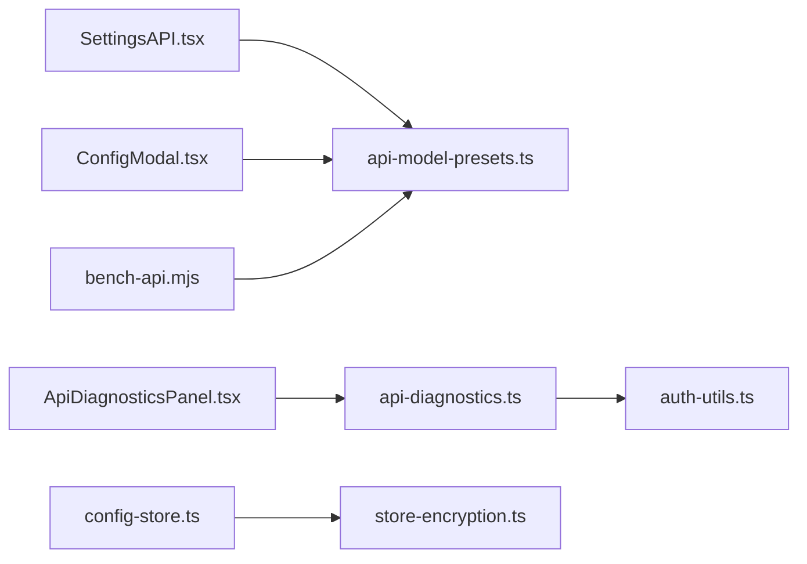

# AI Provider Integration

<cite>
**Referenced Files in This Document**
- [SettingsAPI.tsx](file://src/renderer/components/settings/SettingsAPI.tsx)
- [ConfigModal.tsx](file://src/renderer/components/ConfigModal.tsx)
- [ApiDiagnosticsPanel.tsx](file://src/renderer/components/ApiDiagnosticsPanel.tsx)
- [index.ts](file://src/renderer/types/index.ts)
- [api-model-presets.ts](file://src/shared/api-model-presets.ts)
- [api-provider-guidance.ts](file://src/shared/api-provider-guidance.ts)
- [config-store.ts](file://src/main/config/config-store.ts)
- [api-diagnostics.ts](file://src/main/config/api-diagnostics.ts)
- [auth-utils.ts](file://src/main/config/auth-utils.ts)
- [store-encryption.ts](file://src/main/utils/store-encryption.ts)
- [bench-api.mjs](file://scripts/bench-api.mjs)
- [claude-sdk-one-shot.test.ts](file://tests/claude-sdk-one-shot.test.ts)
- [config-test-routing.test.ts](file://tests/config-test-routing.test.ts)
- [session-manager-title-unified.test.ts](file://tests/session-manager-title-unified.test.ts)
- [api-config-state-config-sets.test.ts](file://tests/api-config-state-config-sets.test.ts)
</cite>

## Table of Contents

1. [Introduction](#introduction)
2. [Project Structure](#project-structure)
3. [Core Components](#core-components)
4. [Architecture Overview](#architecture-overview)
5. [Detailed Component Analysis](#detailed-component-analysis)
6. [Dependency Analysis](#dependency-analysis)
7. [Performance Considerations](#performance-considerations)
8. [Troubleshooting Guide](#troubleshooting-guide)
9. [Conclusion](#conclusion)
10. [Appendices](#appendices)

## Introduction

This document explains how Open Cowork integrates multiple AI providers (Claude, OpenAI, Gemini, Ollama, OpenRouter, and custom providers) through a unified configuration and runtime interface. It covers provider configuration, API key management, model selection and presets, diagnostics, authentication, and security considerations. Practical examples demonstrate switching providers and models, handling failures, and optimizing performance.

## Project Structure

Open Cowork organizes AI provider integration across renderer UI components, shared presets, and main-process configuration and diagnostics utilities. The renderer exposes provider selection and diagnostics panels, while the main process manages configuration persistence, encryption, and diagnostic probing.

**Diagram sources**

- [SettingsAPI.tsx:123-148](file://src/renderer/components/settings/SettingsAPI.tsx#L123-L148)
- [ConfigModal.tsx:197-222](file://src/renderer/components/ConfigModal.tsx#L197-L222)
- [ApiDiagnosticsPanel.tsx:1-248](file://src/renderer/components/ApiDiagnosticsPanel.tsx#L1-L248)
- [api-model-presets.ts](file://src/shared/api-model-presets.ts)
- [api-provider-guidance.ts](file://src/shared/api-provider-guidance.ts)
- [config-store.ts](file://src/main/config/config-store.ts)
- [auth-utils.ts](file://src/main/config/auth-utils.ts)
- [api-diagnostics.ts](file://src/main/config/api-diagnostics.ts)
- [store-encryption.ts:148-235](file://src/main/utils/store-encryption.ts#L148-L235)
- [bench-api.mjs:159-202](file://scripts/bench-api.mjs#L159-L202)

**Section sources**

- [SettingsAPI.tsx:123-148](file://src/renderer/components/settings/SettingsAPI.tsx#L123-L148)
- [ConfigModal.tsx:197-222](file://src/renderer/components/ConfigModal.tsx#L197-L222)
- [ApiDiagnosticsPanel.tsx:1-248](file://src/renderer/components/ApiDiagnosticsPanel.tsx#L1-L248)
- [api-model-presets.ts](file://src/shared/api-model-presets.ts)
- [api-provider-guidance.ts](file://src/shared/api-provider-guidance.ts)
- [config-store.ts](file://src/main/config/config-store.ts)
- [auth-utils.ts](file://src/main/config/auth-utils.ts)
- [api-diagnostics.ts](file://src/main/config/api-diagnostics.ts)
- [store-encryption.ts:148-235](file://src/main/utils/store-encryption.ts#L148-L235)
- [bench-api.mjs:159-202](file://scripts/bench-api.mjs#L159-L202)

## Core Components

- Provider selection UI: Two surfaces expose provider selection—settings and configuration modals—covering Anthropic, OpenAI, Gemini, OpenRouter, Ollama, and a custom option.
- Model presets and guidance: Shared presets define provider-friendly model names and guidance text for user education.
- Configuration store: Centralized persistent store for provider, base URL, model, and API keys, with encryption and key rotation.
- Diagnostics: A structured diagnostic pipeline validates DNS/TCP/TLS/Auth/Model connectivity and inference readiness.
- Authentication utilities: Helpers to normalize and validate credentials across providers.
- Benchmarking: A script constructs effective protocol-specific presets for performance testing.

**Section sources**

- [SettingsAPI.tsx:123-148](file://src/renderer/components/settings/SettingsAPI.tsx#L123-L148)
- [ConfigModal.tsx:197-222](file://src/renderer/components/ConfigModal.tsx#L197-L222)
- [api-model-presets.ts](file://src/shared/api-model-presets.ts)
- [api-provider-guidance.ts](file://src/shared/api-provider-guidance.ts)
- [config-store.ts](file://src/main/config/config-store.ts)
- [api-diagnostics.ts](file://src/main/config/api-diagnostics.ts)
- [auth-utils.ts](file://src/main/config/auth-utils.ts)
- [bench-api.mjs:159-202](file://scripts/bench-api.mjs#L159-L202)

## Architecture Overview

Open Cowork routes provider configuration through a unified state and UI, then executes diagnostics and inference via a shared runtime. The renderer composes configuration sets and displays diagnostics; the main process persists and secures secrets and runs diagnostic checks.

**Diagram sources**

- [SettingsAPI.tsx:123-148](file://src/renderer/components/settings/SettingsAPI.tsx#L123-L148)
- [ConfigModal.tsx:197-222](file://src/renderer/components/ConfigModal.tsx#L197-L222)
- [api-model-presets.ts](file://src/shared/api-model-presets.ts)
- [api-provider-guidance.ts](file://src/shared/api-provider-guidance.ts)
- [config-store.ts](file://src/main/config/config-store.ts)
- [store-encryption.ts:148-235](file://src/main/utils/store-encryption.ts#L148-L235)
- [api-diagnostics.ts](file://src/main/config/api-diagnostics.ts)

## Detailed Component Analysis

### Provider Configuration System

- Provider selection: Users choose among supported providers in settings and configuration modals. The UI reflects provider presets and labels.
- Profiles and config sets: The system supports multiple named profiles and generates config sets for testing and runtime routing.
- Base URL and model: Each profile carries provider, base URL, and model identifiers. A custom protocol field allows overriding the effective protocol for compatibility.

**Diagram sources**

- [SettingsAPI.tsx:123-148](file://src/renderer/components/settings/SettingsAPI.tsx#L123-L148)
- [ConfigModal.tsx:197-222](file://src/renderer/components/ConfigModal.tsx#L197-L222)
- [api-model-presets.ts](file://src/shared/api-model-presets.ts)
- [config-store.ts](file://src/main/config/config-store.ts)
- [store-encryption.ts:148-235](file://src/main/utils/store-encryption.ts#L148-L235)

**Section sources**

- [SettingsAPI.tsx:123-148](file://src/renderer/components/settings/SettingsAPI.tsx#L123-L148)
- [ConfigModal.tsx:197-222](file://src/renderer/components/ConfigModal.tsx#L197-L222)
- [api-config-state-config-sets.test.ts:51-101](file://tests/api-config-state-config-sets.test.ts#L51-L101)

### API Key Management and Encryption

- Encrypted store: The configuration store is encrypted and supports key rotation across legacy seeds to maintain backward compatibility.
- Backup and recovery: When decryption fails, unreadable stores are backed up and replaced with defaults to prevent data loss.
- Secure scrypt options: Uses higher memory cost parameters to harden key derivation.

**Diagram sources**

- [store-encryption.ts:148-235](file://src/main/utils/store-encryption.ts#L148-L235)

**Section sources**

- [store-encryption.ts:52-235](file://src/main/utils/store-encryption.ts#L52-L235)
- [config-store.ts](file://src/main/config/config-store.ts)

### Model Selection and Presets

- Preset-driven UX: Shared presets map provider-specific model identifiers to friendly names and provide guidance text.
- Effective protocol resolution: Benchmarks and routing infer the effective protocol (Anthropic/OpenAI/Gemini) from provider and base URL to construct appropriate endpoints.

**Diagram sources**

- [bench-api.mjs:159-202](file://scripts/bench-api.mjs#L159-L202)
- [api-model-presets.ts](file://src/shared/api-model-presets.ts)

**Section sources**

- [api-model-presets.ts](file://src/shared/api-model-presets.ts)
- [bench-api.mjs:159-202](file://scripts/bench-api.mjs#L159-L202)

### Diagnostics and Connectivity Checks

- Diagnostic pipeline: The UI triggers DNS/TCP/TLS/Auth/Model checks and presents step-by-step results with icons and statuses.
- Error categorization: Results classify errors (e.g., unauthorized, rate_limited, server_error, network_error) and surface advisories for remediation.
- Deep vs fast verification: Optional deep inference checks validate model readiness.

**Diagram sources**

- [ApiDiagnosticsPanel.tsx:1-248](file://src/renderer/components/ApiDiagnosticsPanel.tsx#L1-L248)
- [index.ts:696-748](file://src/renderer/types/index.ts#L696-L748)
- [api-diagnostics.ts](file://src/main/config/api-diagnostics.ts)
- [auth-utils.ts](file://src/main/config/auth-utils.ts)

**Section sources**

- [ApiDiagnosticsPanel.tsx:1-248](file://src/renderer/components/ApiDiagnosticsPanel.tsx#L1-L248)
- [index.ts:696-748](file://src/renderer/types/index.ts#L696-L748)
- [api-diagnostics.ts](file://src/main/config/api-diagnostics.ts)
- [auth-utils.ts](file://src/main/config/auth-utils.ts)

### Authentication Mechanisms

- Credential normalization: Authentication utilities normalize provider-specific credential formats and validate required fields.
- Unauthorized mapping: Tests confirm that provider-specific errors (e.g., API_KEY_INVALID, PERMISSION_DENIED) are mapped to standardized unauthorized error types.

**Diagram sources**

- [auth-utils.ts](file://src/main/config/auth-utils.ts)
- [claude-sdk-one-shot.test.ts:472-512](file://tests/claude-sdk-one-shot.test.ts#L472-L512)

**Section sources**

- [auth-utils.ts](file://src/main/config/auth-utils.ts)
- [claude-sdk-one-shot.test.ts:472-512](file://tests/claude-sdk-one-shot.test.ts#L472-L512)

### Provider-Specific Features and Routing

- Unified title generation: Even when unified mode is disabled, title generation for Gemini is routed through the Claude SDK path, ensuring consistent behavior.
- OpenRouter compatibility: Benchmarks treat OpenRouter as an OpenAI-compatible endpoint for routing.

**Section sources**

- [session-manager-title-unified.test.ts:122-147](file://tests/session-manager-title-unified.test.ts#L122-L147)
- [bench-api.mjs:166-168](file://scripts/bench-api.mjs#L166-L168)

### Practical Examples

#### Configure a Provider

- Select provider in the settings panel or configuration modal.
- Enter API key and base URL; choose a model from presets or specify a custom model.
- Save the profile; the system encrypts and persists it.

**Section sources**

- [SettingsAPI.tsx:123-148](file://src/renderer/components/settings/SettingsAPI.tsx#L123-L148)
- [ConfigModal.tsx:197-222](file://src/renderer/components/ConfigModal.tsx#L197-L222)
- [config-store.ts](file://src/main/config/config-store.ts)
- [store-encryption.ts:148-235](file://src/main/utils/store-encryption.ts#L148-L235)

#### Switch Between Models

- Choose a provider and model in the UI; the system resolves the effective protocol and constructs the appropriate endpoint.
- For OpenRouter, the effective protocol is treated as OpenAI-compatible.

**Section sources**

- [bench-api.mjs:159-202](file://scripts/bench-api.mjs#L159-L202)

#### Handle Provider Failures

- Use the diagnostics panel to identify failing steps (DNS/TCP/TLS/Auth/Model).
- Unauthorized errors are surfaced consistently across providers; rate limits and server errors are categorized accordingly.

**Section sources**

- [ApiDiagnosticsPanel.tsx:1-248](file://src/renderer/components/ApiDiagnosticsPanel.tsx#L1-L248)
- [index.ts:696-748](file://src/renderer/types/index.ts#L696-L748)
- [claude-sdk-one-shot.test.ts:450-534](file://tests/claude-sdk-one-shot.test.ts#L450-L534)

## Dependency Analysis

The AI provider integration exhibits layered dependencies: UI components depend on shared presets and guidance; the main process depends on the configuration store and encryption utilities; diagnostics rely on authentication helpers.

**Diagram sources**

- [SettingsAPI.tsx:123-148](file://src/renderer/components/settings/SettingsAPI.tsx#L123-L148)
- [ConfigModal.tsx:197-222](file://src/renderer/components/ConfigModal.tsx#L197-L222)
- [ApiDiagnosticsPanel.tsx:1-248](file://src/renderer/components/ApiDiagnosticsPanel.tsx#L1-L248)
- [api-model-presets.ts](file://src/shared/api-model-presets.ts)
- [api-diagnostics.ts](file://src/main/config/api-diagnostics.ts)
- [auth-utils.ts](file://src/main/config/auth-utils.ts)
- [config-store.ts](file://src/main/config/config-store.ts)
- [store-encryption.ts:148-235](file://src/main/utils/store-encryption.ts#L148-L235)
- [bench-api.mjs:159-202](file://scripts/bench-api.mjs#L159-L202)

**Section sources**

- [SettingsAPI.tsx:123-148](file://src/renderer/components/settings/SettingsAPI.tsx#L123-L148)
- [ConfigModal.tsx:197-222](file://src/renderer/components/ConfigModal.tsx#L197-L222)
- [ApiDiagnosticsPanel.tsx:1-248](file://src/renderer/components/ApiDiagnosticsPanel.tsx#L1-L248)
- [api-model-presets.ts](file://src/shared/api-model-presets.ts)
- [api-diagnostics.ts](file://src/main/config/api-diagnostics.ts)
- [auth-utils.ts](file://src/main/config/auth-utils.ts)
- [config-store.ts](file://src/main/config/config-store.ts)
- [store-encryption.ts:148-235](file://src/main/utils/store-encryption.ts#L148-L235)
- [bench-api.mjs:159-202](file://scripts/bench-api.mjs#L159-L202)

## Performance Considerations

- Prefer fast diagnostics during routine checks; use deep diagnostics for thorough model readiness validation.
- Use provider-specific base URLs and models from presets to minimize endpoint misconfiguration overhead.
- Leverage benchmark presets to compare effective protocol routing and identify optimal configurations.

[No sources needed since this section provides general guidance]

## Troubleshooting Guide

- Unauthorized errors: Verify API keys and permissions; provider-specific errors are normalized to unauthorized.
- Rate limit handling: Diagnostics classify rate_limited; adjust concurrency or retry policies.
- Network issues: Use DNS/TCP/TLS steps to isolate connectivity problems.
- Model loading: Deep diagnostics surface advisories for model-loading states.
- OpenRouter routing: Confirm effective protocol is resolved as OpenAI-compatible.

**Section sources**

- [index.ts:696-748](file://src/renderer/types/index.ts#L696-L748)
- [ApiDiagnosticsPanel.tsx:1-248](file://src/renderer/components/ApiDiagnosticsPanel.tsx#L1-L248)
- [claude-sdk-one-shot.test.ts:472-512](file://tests/claude-sdk-one-shot.test.ts#L472-L512)
- [config-test-routing.test.ts:110-129](file://tests/config-test-routing.test.ts#L110-L129)

## Conclusion

Open Cowork’s AI provider integration unifies configuration, diagnostics, and runtime behavior across multiple providers. The system emphasizes secure key storage, structured diagnostics, and provider-neutral UX, enabling reliable switching between providers and models while surfacing actionable insights for troubleshooting.

[No sources needed since this section summarizes without analyzing specific files]

## Appendices

### Security Considerations

- Encrypted configuration store with key rotation ensures long-term protection against key compromise.
- Backups of unreadable stores prevent data loss during migration.
- Secure scrypt parameters increase resistance to brute-force key derivation.

**Section sources**

- [store-encryption.ts:52-235](file://src/main/utils/store-encryption.ts#L52-L235)
- [config-store.ts](file://src/main/config/config-store.ts)

### Provider and Endpoint Resolution Reference

- Effective protocol inference: Anthropic, OpenAI, Gemini, and OpenRouter are mapped to compatible endpoints.
- Custom protocol override: Allows explicit protocol selection for compatibility scenarios.

**Section sources**

- [bench-api.mjs:159-202](file://scripts/bench-api.mjs#L159-L202)
