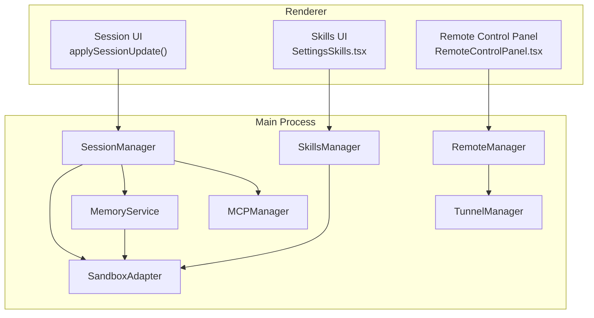
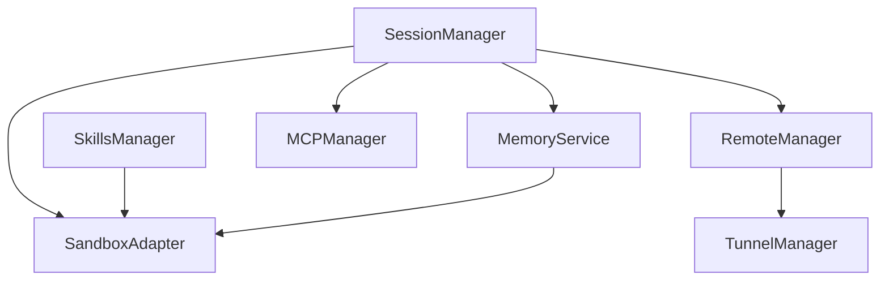
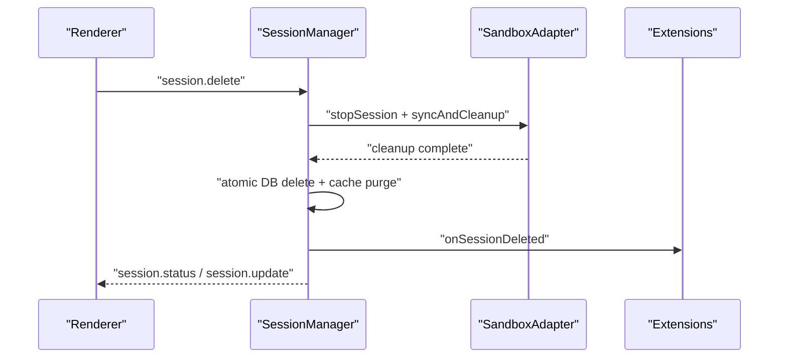
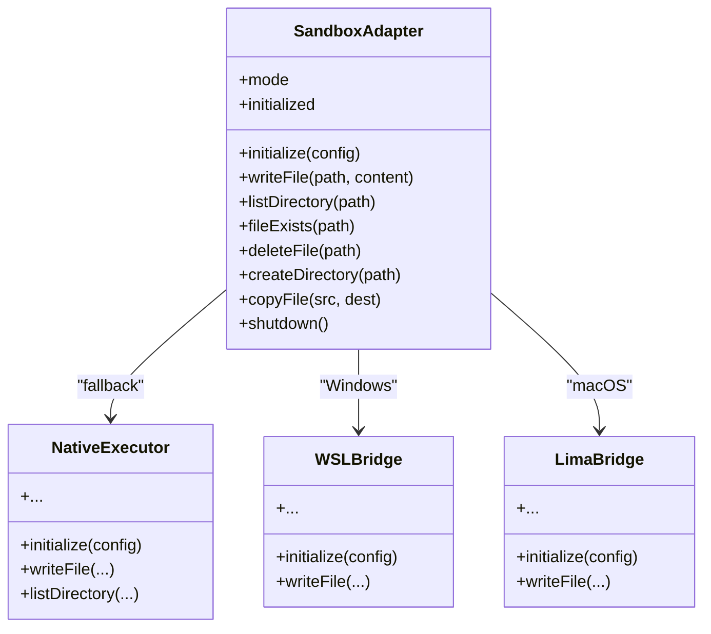
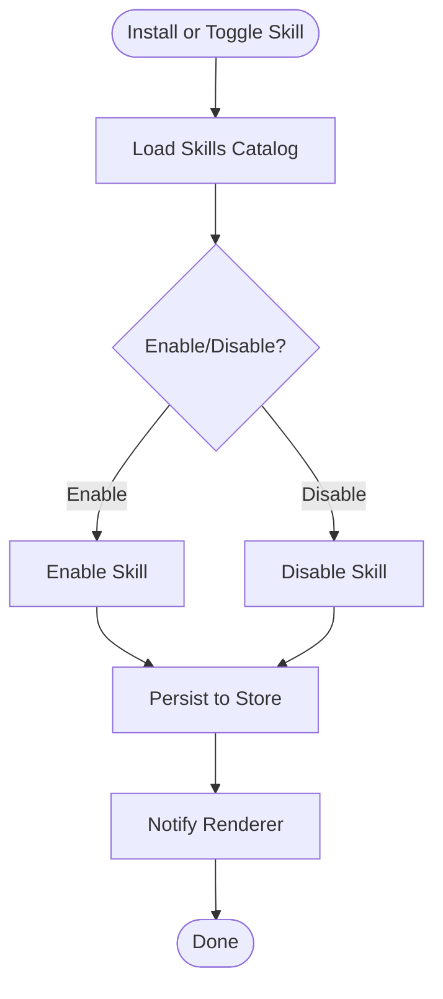
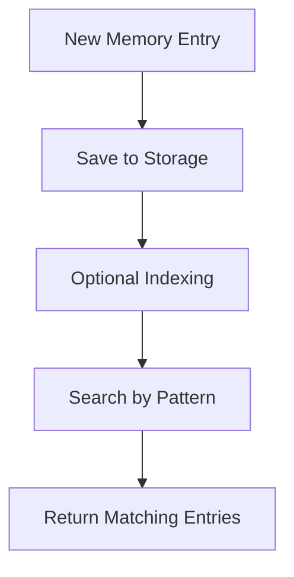
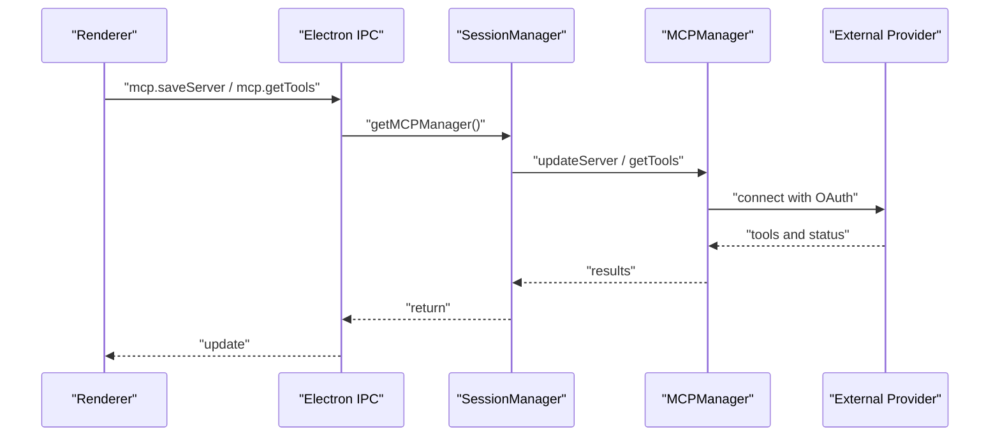
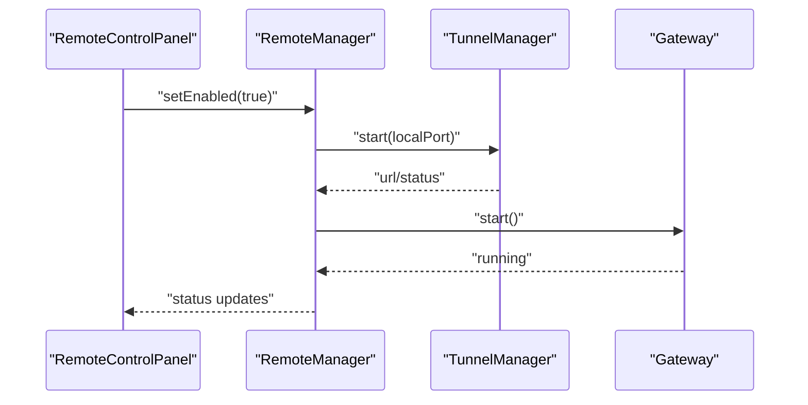
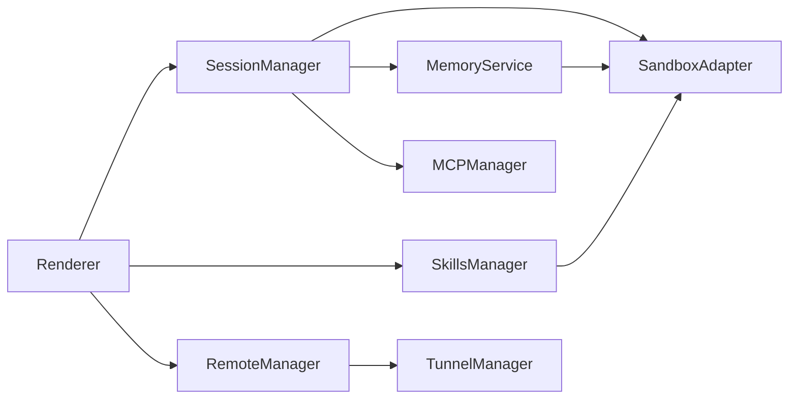

# Core Features

<cite>
**Referenced Files in This Document**
- [README.md](file://README.md)
- [src/main/session/session-manager.ts](file://src/main/session/session-manager.ts)
- [src/main/sandbox/sandbox-adapter.ts](file://src/main/sandbox/sandbox-adapter.ts)
- [src/main/sandbox/index.ts](file://src/main/sandbox/index.ts)
- [src/main/skills/skills-manager.ts](file://src/main/skills/skills-manager.ts)
- [src/main/memory/memory-service.ts](file://src/main/memory/memory-service.ts)
- [src/main/mcp/mcp-manager.ts](file://src/main/mcp/mcp-manager.ts)
- [src/main/index.ts](file://src/main/index.ts)
- [src/main/remote/remote-manager.ts](file://src/main/remote/remote-manager.ts)
- [src/main/remote/tunnel-manager.ts](file://src/main/remote/tunnel-manager.ts)
- [src/renderer/components/RemoteControlPanel.tsx](file://src/renderer/components/RemoteControlPanel.tsx)
- [src/renderer/components/settings/SettingsSkills.tsx](file://src/renderer/components/settings/SettingsSkills.tsx)
- [src/renderer/utils/session-update.ts](file://src/renderer/utils/session-update.ts)
- [src/main/client-event-utils.ts](file://src/main/client-event-utils.ts)
- [scripts/bundle-mcp.js](file://scripts/bundle-mcp.js)
</cite>

## Table of Contents

1. [Introduction](#introduction)
2. [Project Structure](#project-structure)
3. [Core Components](#core-components)
4. [Architecture Overview](#architecture-overview)
5. [Detailed Component Analysis](#detailed-component-analysis)
6. [Dependency Analysis](#dependency-analysis)
7. [Performance Considerations](#performance-considerations)
8. [Troubleshooting Guide](#troubleshooting-guide)
9. [Conclusion](#conclusion)

## Introduction

Open Cowork delivers a cohesive AI agent desktop experience by integrating several foundational systems:

- AI provider integration via session management and MCP protocol support
- Sandboxed execution through a unified sandbox adapter
- Persistent session management for continuity and state
- Extensible skills system for tooling and plugins
- Memory management for recall and grounding
- Remote collaboration via tunnels and gateway channels

These features work together to enable secure, reproducible, and collaborative AI workflows across local and remote environments.

## Project Structure

The core features are implemented primarily in the main process under src/main, with renderer-side UI components and utilities that orchestrate user interactions. Key modules include:

- Session management for lifecycle and state
- Sandbox adapter for isolated execution
- Skills manager for plugin and tool catalog
- Memory service for ingestion and retrieval
- MCP manager for standardized protocol integration
- Remote manager for tunneling and gateway connectivity

**Diagram sources**

- [src/renderer/utils/session-update.ts:1-31](file://src/renderer/utils/session-update.ts#L1-L31)
- [src/renderer/components/settings/SettingsSkills.tsx:406-757](file://src/renderer/components/settings/SettingsSkills.tsx#L406-L757)
- [src/renderer/components/RemoteControlPanel.tsx:112-146](file://src/renderer/components/RemoteControlPanel.tsx#L112-L146)
- [src/main/session/session-manager.ts:984-1048](file://src/main/session/session-manager.ts#L984-L1048)
- [src/main/sandbox/sandbox-adapter.ts:42-606](file://src/main/sandbox/sandbox-adapter.ts#L42-L606)
- [src/main/skills/skills-manager.ts](file://src/main/skills/skills-manager.ts)
- [src/main/memory/memory-service.ts](file://src/main/memory/memory-service.ts)
- [src/main/mcp/mcp-manager.ts:987-1048](file://src/main/mcp/mcp-manager.ts#L987-L1048)
- [src/main/remote/remote-manager.ts:253-318](file://src/main/remote/remote-manager.ts#L253-L318)
- [src/main/remote/tunnel-manager.ts:1-52](file://src/main/remote/tunnel-manager.ts#L1-L52)

**Section sources**

- [README.md](file://README.md)
- [src/main/session/session-manager.ts:984-1048](file://src/main/session/session-manager.ts#L984-L1048)
- [src/main/sandbox/sandbox-adapter.ts:42-606](file://src/main/sandbox/sandbox-adapter.ts#L42-L606)
- [src/main/skills/skills-manager.ts](file://src/main/skills/skills-manager.ts)
- [src/main/memory/memory-service.ts](file://src/main/memory/memory-service.ts)
- [src/main/mcp/mcp-manager.ts:987-1048](file://src/main/mcp/mcp-manager.ts#L987-L1048)
- [src/main/remote/remote-manager.ts:253-318](file://src/main/remote/remote-manager.ts#L253-L318)
- [src/main/remote/tunnel-manager.ts:1-52](file://src/main/remote/tunnel-manager.ts#L1-L52)
- [src/renderer/utils/session-update.ts:1-31](file://src/renderer/utils/session-update.ts#L1-L31)
- [src/renderer/components/settings/SettingsSkills.tsx:406-757](file://src/renderer/components/settings/SettingsSkills.tsx#L406-L757)
- [src/renderer/components/RemoteControlPanel.tsx:112-146](file://src/renderer/components/RemoteControlPanel.tsx#L112-L146)

## Core Components

This section introduces each core feature, its responsibilities, and how it integrates with others.

- Session Manager
  - Maintains session lifecycle, persistence, and status updates
  - Coordinates sandbox cleanup and extension hooks during deletion
  - Emits renderer events for UI synchronization

- Sandbox Adapter
  - Provides a unified interface for isolated execution across platforms
  - Supports native, WSL, and Lima modes with graceful fallback
  - Exposes file operations and path containment

- Skills Manager
  - Manages built-in and custom skills/plugins
  - Integrates with sandbox for safe tool execution
  - Powers the skills UI for enabling/disabling and installation

- Memory Service
  - Handles memory ingestion, storage, retrieval, and navigation
  - Works with sandbox for file-backed operations
  - Supports optional full-text search and fallback mechanisms

- MCP Manager
  - Connects to external providers via standardized transports
  - Manages server configurations, OAuth, and tool discovery
  - Bridges UI actions to session-scoped MCP operations

- Remote Manager
  - Starts/stops gateway and manages tunnel connectivity
  - Provides tunnel status and webhook URLs for channels
  - Integrates with renderer for control panel UX

**Section sources**

- [src/main/session/session-manager.ts:984-1048](file://src/main/session/session-manager.ts#L984-L1048)
- [src/main/sandbox/sandbox-adapter.ts:42-606](file://src/main/sandbox/sandbox-adapter.ts#L42-L606)
- [src/main/skills/skills-manager.ts](file://src/main/skills/skills-manager.ts)
- [src/main/memory/memory-service.ts](file://src/main/memory/memory-service.ts)
- [src/main/mcp/mcp-manager.ts:987-1048](file://src/main/mcp/mcp-manager.ts#L987-L1048)
- [src/main/remote/remote-manager.ts:253-318](file://src/main/remote/remote-manager.ts#L253-L318)
- [src/main/remote/tunnel-manager.ts:1-52](file://src/main/remote/tunnel-manager.ts#L1-L52)

## Architecture Overview

The following diagram shows how the core modules collaborate around a session-centric runtime.

**Diagram sources**

- [src/main/session/session-manager.ts:984-1048](file://src/main/session/session-manager.ts#L984-L1048)
- [src/main/sandbox/sandbox-adapter.ts:42-606](file://src/main/sandbox/sandbox-adapter.ts#L42-L606)
- [src/main/skills/skills-manager.ts](file://src/main/skills/skills-manager.ts)
- [src/main/memory/memory-service.ts](file://src/main/memory/memory-service.ts)
- [src/main/mcp/mcp-manager.ts:987-1048](file://src/main/mcp/mcp-manager.ts#L987-L1048)
- [src/main/remote/remote-manager.ts:253-318](file://src/main/remote/remote-manager.ts#L253-L318)
- [src/main/remote/tunnel-manager.ts:1-52](file://src/main/remote/tunnel-manager.ts#L1-L52)

## Detailed Component Analysis

### Session Management

- Lifecycle and state
  - Creation, continuation, stopping, and deletion of sessions
  - Atomic batch deletion with sandbox cleanup and extension notifications
  - Status updates and renderer synchronization

- Integration points
  - Renderer updates via applySessionUpdate
  - Event routing via eventRequiresSessionManager
  - MCP and sandbox coordination during lifecycle transitions

**Diagram sources**

- [src/main/session/session-manager.ts:984-1048](file://src/main/session/session-manager.ts#L984-L1048)
- [src/renderer/utils/session-update.ts:1-31](file://src/renderer/utils/session-update.ts#L1-L31)
- [src/main/client-event-utils.ts:1-18](file://src/main/client-event-utils.ts#L1-L18)

**Section sources**

- [src/main/session/session-manager.ts:984-1048](file://src/main/session/session-manager.ts#L984-L1048)
- [src/renderer/utils/session-update.ts:1-31](file://src/renderer/utils/session-update.ts#L1-L31)
- [src/main/client-event-utils.ts:1-18](file://src/main/client-event-utils.ts#L1-L18)

### Sandboxed Execution Environment

- Unified adapter
  - Selects platform-specific executor (WSL, Lima, Native) with fallback
  - Exposes consistent file operations and path resolution
  - Tracks initialization state and mode

- Security and isolation
  - Path guard and resolver for containment
  - Sandbox sync for coordinated cleanup per session

**Diagram sources**

- [src/main/sandbox/sandbox-adapter.ts:42-606](file://src/main/sandbox/sandbox-adapter.ts#L42-L606)
- [src/main/sandbox/index.ts:1-26](file://src/main/sandbox/index.ts#L1-L26)

**Section sources**

- [src/main/sandbox/sandbox-adapter.ts:42-606](file://src/main/sandbox/sandbox-adapter.ts#L42-L606)
- [src/main/sandbox/index.ts:1-26](file://src/main/sandbox/index.ts#L1-L26)

### Skills System

- Catalog and runtime
  - Built-in and custom skills with enable/disable controls
  - Plugin installation and deduplication
  - Integration with sandbox for tool execution

- UI integration
  - SettingsSkills renders lists and modals for plugins and skills
  - Toast feedback for successful operations

**Diagram sources**

- [src/renderer/components/settings/SettingsSkills.tsx:406-757](file://src/renderer/components/settings/SettingsSkills.tsx#L406-L757)
- [src/main/skills/skills-manager.ts](file://src/main/skills/skills-manager.ts)

**Section sources**

- [src/renderer/components/settings/SettingsSkills.tsx:406-757](file://src/renderer/components/settings/SettingsSkills.tsx#L406-L757)
- [src/main/skills/skills-manager.ts](file://src/main/skills/skills-manager.ts)

### Memory Management

- Ingestion and storage
  - Save entries with metadata and tags
  - Search without requiring full-text search tables (fallback behavior verified)

- Retrieval and navigation
  - Retrieve and navigate memory entries per session
  - Optional prompt optimization and evaluation harnesses

**Diagram sources**

- [src/main/memory/memory-service.ts](file://src/main/memory/memory-service.ts)

**Section sources**

- [src/main/memory/memory-service.ts](file://src/main/memory/memory-service.ts)

### MCP Protocol Integration

- Transport and connection
  - Supports stdio and streamable HTTP transports
  - Manages OAuth providers and connection timeouts
  - Registers process listeners and logs stderr/stdout safely

- IPC and session scoping
  - Electron IPC handlers delegate to session-scoped MCP manager
  - Server updates invalidate caches and handle rollback on failure

**Diagram sources**

- [src/main/index.ts:1583-1674](file://src/main/index.ts#L1583-L1674)
- [src/main/mcp/mcp-manager.ts:987-1048](file://src/main/mcp/mcp-manager.ts#L987-L1048)

**Section sources**

- [src/main/index.ts:1583-1674](file://src/main/index.ts#L1583-L1674)
- [src/main/mcp/mcp-manager.ts:987-1048](file://src/main/mcp/mcp-manager.ts#L987-L1048)
- [scripts/bundle-mcp.js:239-270](file://scripts/bundle-mcp.js#L239-L270)

### Remote Collaboration

- Tunneling and gateway
  - TunnelManager starts/stops tunnels and exposes status
  - RemoteManager orchestrates gateway lifecycle and channel integration
  - UI control panel toggles remote features and displays status

**Diagram sources**

- [src/renderer/components/RemoteControlPanel.tsx:112-146](file://src/renderer/components/RemoteControlPanel.tsx#L112-L146)
- [src/main/remote/remote-manager.ts:253-318](file://src/main/remote/remote-manager.ts#L253-L318)
- [src/main/remote/tunnel-manager.ts:1-52](file://src/main/remote/tunnel-manager.ts#L1-L52)

**Section sources**

- [src/renderer/components/RemoteControlPanel.tsx:112-146](file://src/renderer/components/RemoteControlPanel.tsx#L112-L146)
- [src/main/remote/remote-manager.ts:253-318](file://src/main/remote/remote-manager.ts#L253-L318)
- [src/main/remote/tunnel-manager.ts:1-52](file://src/main/remote/tunnel-manager.ts#L1-L52)

## Dependency Analysis

Key relationships:

- SessionManager depends on SandboxAdapter for execution isolation and on MCPManager for provider integration
- SkillsManager coordinates with SandboxAdapter for tool execution
- MemoryService relies on SandboxAdapter for file-backed operations
- RemoteManager depends on TunnelManager for connectivity
- Renderer components depend on main-process IPC handlers and session updates

**Diagram sources**

- [src/main/session/session-manager.ts:984-1048](file://src/main/session/session-manager.ts#L984-L1048)
- [src/main/sandbox/sandbox-adapter.ts:42-606](file://src/main/sandbox/sandbox-adapter.ts#L42-L606)
- [src/main/skills/skills-manager.ts](file://src/main/skills/skills-manager.ts)
- [src/main/memory/memory-service.ts](file://src/main/memory/memory-service.ts)
- [src/main/mcp/mcp-manager.ts:987-1048](file://src/main/mcp/mcp-manager.ts#L987-L1048)
- [src/main/remote/remote-manager.ts:253-318](file://src/main/remote/remote-manager.ts#L253-L318)
- [src/main/remote/tunnel-manager.ts:1-52](file://src/main/remote/tunnel-manager.ts#L1-L52)

**Section sources**

- [src/main/session/session-manager.ts:984-1048](file://src/main/session/session-manager.ts#L984-L1048)
- [src/main/sandbox/sandbox-adapter.ts:42-606](file://src/main/sandbox/sandbox-adapter.ts#L42-L606)
- [src/main/skills/skills-manager.ts](file://src/main/skills/skills-manager.ts)
- [src/main/memory/memory-service.ts](file://src/main/memory/memory-service.ts)
- [src/main/mcp/mcp-manager.ts:987-1048](file://src/main/mcp/mcp-manager.ts#L987-L1048)
- [src/main/remote/remote-manager.ts:253-318](file://src/main/remote/remote-manager.ts#L253-L318)
- [src/main/remote/tunnel-manager.ts:1-52](file://src/main/remote/tunnel-manager.ts#L1-L52)

## Performance Considerations

- Sandboxed execution adds overhead; prefer native mode when appropriate and rely on sandbox fallback for isolation-sensitive tasks
- Batch operations in SessionManager minimize database contention
- MCP connections should reuse transports and avoid frequent reconnects
- Memory queries avoid heavy indexing when FTS is unavailable, trading accuracy for availability
- Remote tunnels incur network latency; configure tunnel providers appropriately

## Troubleshooting Guide

- Session deletion failures
  - Verify sandbox cleanup completion and extension hooks firing
  - Check atomic transaction boundaries and renderer notifications

- Sandbox initialization
  - Confirm platform detection and fallback behavior
  - Review warnings for native fallback on Windows

- Skills installation
  - Ensure plugin directories are valid and deduplication logic applies
  - Check UI toast feedback for success/error states

- Memory search
  - Validate fallback behavior when FTS tables are absent
  - Confirm LIKE-based queries return expected results

- MCP server updates
  - Inspect rollback behavior when enabling fails
  - Verify server status and tool discovery via IPC

- Remote connectivity
  - Monitor tunnel status and gateway port conflicts
  - Use UI control panel to toggle and observe status updates

**Section sources**

- [src/main/session/session-manager.ts:984-1048](file://src/main/session/session-manager.ts#L984-L1048)
- [src/main/sandbox/sandbox-adapter.ts:42-606](file://src/main/sandbox/sandbox-adapter.ts#L42-L606)
- [src/renderer/components/settings/SettingsSkills.tsx:406-757](file://src/renderer/components/settings/SettingsSkills.tsx#L406-L757)
- [src/main/memory/memory-service.ts](file://src/main/memory/memory-service.ts)
- [src/main/index.ts:1583-1674](file://src/main/index.ts#L1583-L1674)
- [src/main/remote/remote-manager.ts:253-318](file://src/main/remote/remote-manager.ts#L253-L318)
- [src/main/remote/tunnel-manager.ts:1-52](file://src/main/remote/tunnel-manager.ts#L1-L52)

## Conclusion

Open Cowork’s core features form a cohesive AI agent desktop environment:

- Sessions unify lifecycle, state, and integrations
- Sandboxed execution ensures safety and portability
- Skills expand capability with a robust catalog and UI
- Memory enables grounded recall and retrieval
- MCP standardizes provider integration
- Remote collaboration extends reach via tunnels and gateways

Together, they deliver a secure, extensible, and collaborative AI workspace tailored for desktop use.
