# MCP Protocol Integration

<cite>
**Referenced Files in This Document**
- [mcp-manager.ts](file://src/main/mcp/mcp-manager.ts)
- [gui-operate-server.ts](file://src/main/mcp/gui-operate-server.ts)
- [software-dev-server-example.ts](file://src/main/mcp/software-dev-server-example.ts)
- [mcp-config-store.ts](file://src/main/mcp/mcp-config-store.ts)
- [mcp-oauth.ts](file://src/main/mcp/mcp-oauth.ts)
- [mcp-logger.ts](file://src/main/mcp/mcp-logger.ts)
- [bundle-mcp.js](file://scripts/bundle-mcp.js)
- [mcp-manager.test.ts](file://src/tests/mcp/mcp-manager.test.ts)
- [mcp-oauth.test.ts](file://tests/mcp-oauth.test.ts)
- [mcp-manager-env-merge.test.ts](file://tests/mcp-manager-env-merge.test.ts)
- [mcp-manager-streamable-http-oauth.test.ts](file://tests/mcp-manager-streamable-http-oauth.test.ts)
- [mcp-npx-resolution.test.ts](file://tests/mcp-npx-resolution.test.ts)
- [bundle-mcp-script.test.ts](file://tests/bundle-mcp-script.test.ts)
</cite>

## Table of Contents

1. [Introduction](#introduction)
2. [Project Structure](#project-structure)
3. [Core Components](#core-components)
4. [Architecture Overview](#architecture-overview)
5. [Detailed Component Analysis](#detailed-component-analysis)
6. [Protocol Specification](#protocol-specification)
7. [Message Handling](#message-handling)
8. [Authentication and Security](#authentication-and-security)
9. [Server Management](#server-management)
10. [Client Integration Patterns](#client-integration-patterns)
11. [Deployment and Configuration](#deployment-and-configuration)
12. [Development Examples](#development-examples)
13. [Debugging Techniques](#debugging-techniques)
14. [Extensions and Compatibility](#extensions-and-compatibility)
15. [Troubleshooting Guide](#troubleshooting-guide)
16. [Conclusion](#conclusion)

## Introduction

Open Cowork implements comprehensive Model Context Protocol (MCP) integration to enable seamless communication between AI models and external tools. The MCP protocol allows applications to dynamically discover and invoke capabilities from various services, creating a flexible ecosystem for AI-powered workflows.

The MCP implementation in Open Cowork consists of several key components that work together to provide a robust framework for managing MCP servers, handling protocol communications, and integrating with existing tools and services.

## Project Structure

The MCP implementation is organized within the `src/main/mcp/` directory, containing all core components necessary for MCP protocol support:

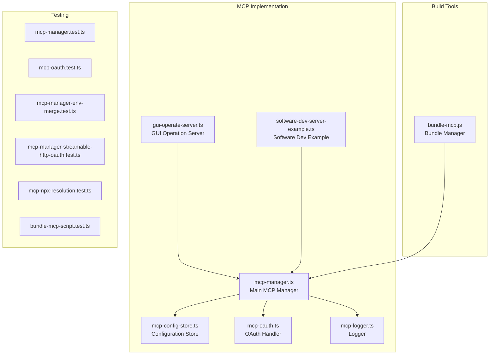

**Diagram sources**

- [mcp-manager.ts](file://src/main/mcp/mcp-manager.ts)
- [gui-operate-server.ts](file://src/main/mcp/gui-operate-server.ts)
- [software-dev-server-example.ts](file://src/main/mcp/software-dev-server-example.ts)
- [mcp-config-store.ts](file://src/main/mcp/mcp-config-store.ts)
- [mcp-oauth.ts](file://src/main/mcp/mcp-oauth.ts)
- [mcp-logger.ts](file://src/main/mcp/mcp-logger.ts)
- [bundle-mcp.js](file://scripts/bundle-mcp.js)

**Section sources**

- [mcp-manager.ts](file://src/main/mcp/mcp-manager.ts)
- [gui-operate-server.ts](file://src/main/mcp/gui-operate-server.ts)
- [software-dev-server-example.ts](file://src/main/mcp/software-dev-server-example.ts)
- [mcp-config-store.ts](file://src/main/mcp/mcp-config-store.ts)
- [mcp-oauth.ts](file://src/main/mcp/mcp-oauth.ts)
- [mcp-logger.ts](file://src/main/mcp/mcp-logger.ts)

## Core Components

The MCP implementation consists of several interconnected components that handle different aspects of MCP protocol support:

### MCP Manager

The central orchestrator that manages MCP server lifecycle, configuration, and communication protocols.

### GUI Operation Server

Provides GUI-based operation capabilities for MCP servers, enabling visual interaction with MCP services.

### Software Development Server Example

Demonstrates practical implementation patterns for MCP servers in software development contexts.

### Configuration Store

Manages MCP server configurations, environment variables, and runtime settings.

### OAuth Handler

Handles authentication and authorization for MCP servers requiring secure access.

### Logger

Provides structured logging for MCP operations, debugging, and monitoring.

**Section sources**

- [mcp-manager.ts](file://src/main/mcp/mcp-manager.ts)
- [gui-operate-server.ts](file://src/main/mcp/gui-operate-server.ts)
- [software-dev-server-example.ts](file://src/main/mcp/software-dev-server-example.ts)
- [mcp-config-store.ts](file://src/main/mcp/mcp-config-store.ts)
- [mcp-oauth.ts](file://src/main/mcp/mcp-oauth.ts)
- [mcp-logger.ts](file://src/main/mcp/mcp-logger.ts)

## Architecture Overview

The MCP architecture follows a modular design pattern that separates concerns between server management, client integration, and protocol handling:

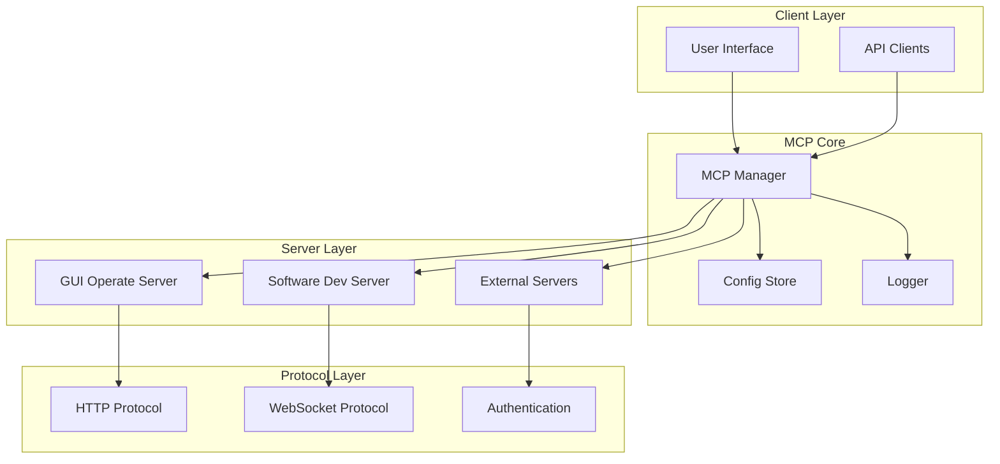

**Diagram sources**

- [mcp-manager.ts](file://src/main/mcp/mcp-manager.ts)
- [mcp-config-store.ts](file://src/main/mcp/mcp-config-store.ts)
- [mcp-logger.ts](file://src/main/mcp/mcp-logger.ts)
- [gui-operate-server.ts](file://src/main/mcp/gui-operate-server.ts)
- [software-dev-server-example.ts](file://src/main/mcp/software-dev-server-example.ts)

## Detailed Component Analysis

### MCP Manager Architecture

The MCP Manager serves as the central coordinator for all MCP operations, implementing sophisticated server lifecycle management and protocol handling:

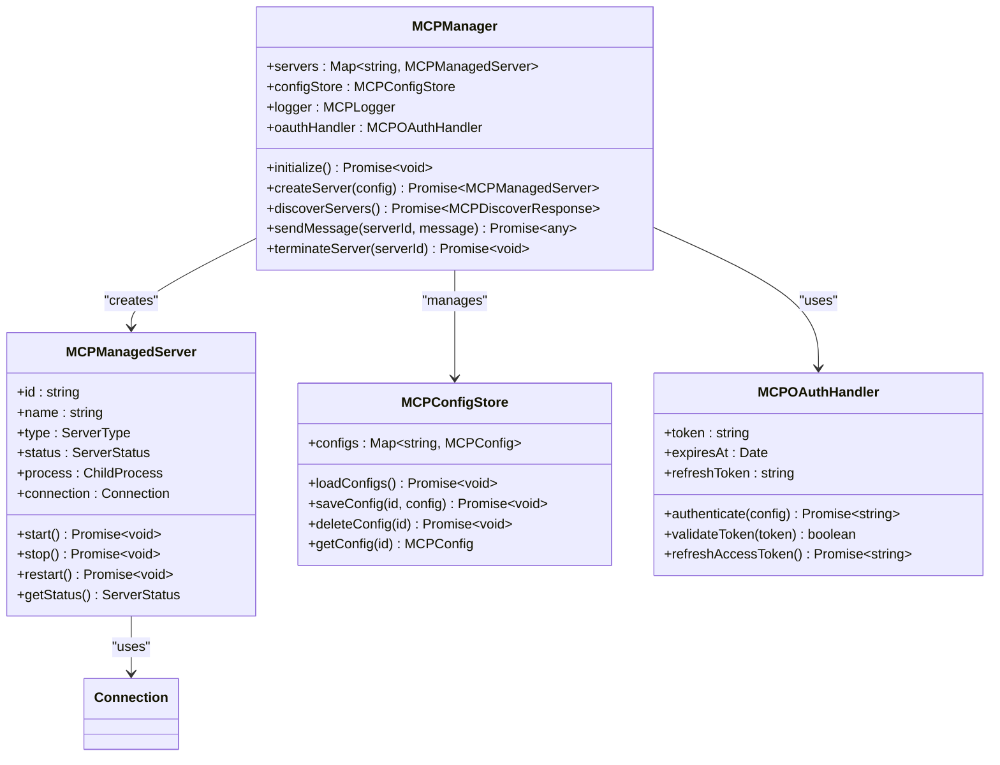

**Diagram sources**

- [mcp-manager.ts](file://src/main/mcp/mcp-manager.ts)
- [mcp-config-store.ts](file://src/main/mcp/mcp-config-store.ts)
- [mcp-oauth.ts](file://src/main/mcp/mcp-oauth.ts)

### GUI Operation Server Implementation

The GUI Operate Server provides visual interface capabilities for MCP server management and operation:

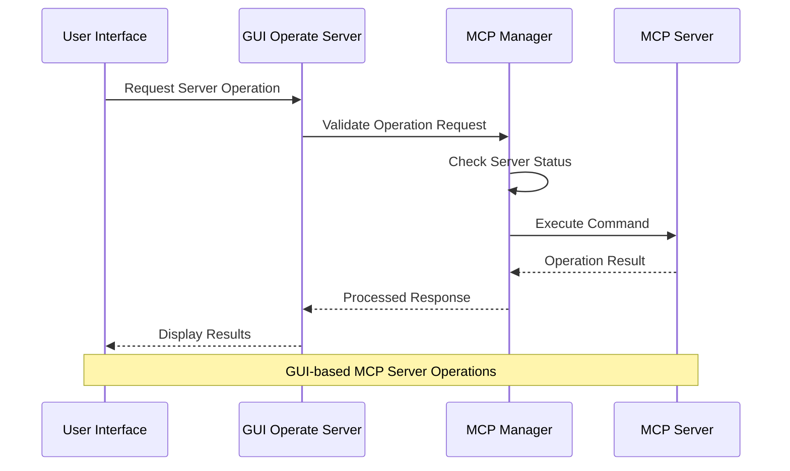

**Diagram sources**

- [gui-operate-server.ts](file://src/main/mcp/gui-operate-server.ts)
- [mcp-manager.ts](file://src/main/mcp/mcp-manager.ts)

**Section sources**

- [mcp-manager.ts](file://src/main/mcp/mcp-manager.ts)
- [gui-operate-server.ts](file://src/main/mcp/gui-operate-server.ts)

### Software Development Server Example

The Software Development Server Example demonstrates practical implementation patterns for development-focused MCP servers:

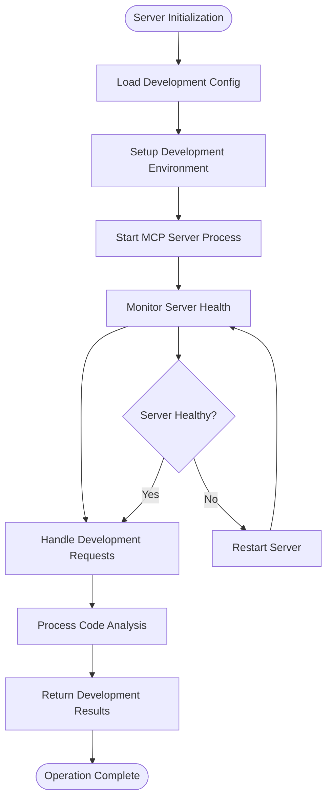

**Diagram sources**

- [software-dev-server-example.ts](file://src/main/mcp/software-dev-server-example.ts)

**Section sources**

- [software-dev-server-example.ts](file://src/main/mcp/software-dev-server-example.ts)

## Protocol Specification

The MCP implementation supports multiple protocol variants to accommodate different use cases and environments:

### Core Protocol Features

| Feature                | Description                                              | Implementation               |
| ---------------------- | -------------------------------------------------------- | ---------------------------- |
| Server Discovery       | Dynamic discovery of available MCP servers               | Built-in discovery mechanism |
| Capability Negotiation | Runtime capability negotiation between client and server | Protocol negotiation handler |
| Authentication         | Secure authentication for protected MCP servers          | OAuth 2.0 integration        |
| Streaming              | Real-time streaming of server responses                  | WebSocket and HTTP streaming |
| Error Handling         | Comprehensive error propagation and handling             | Structured error responses   |

### Message Format Specifications

The MCP protocol uses JSON-RPC 2.0 compatible messaging with MCP-specific extensions:

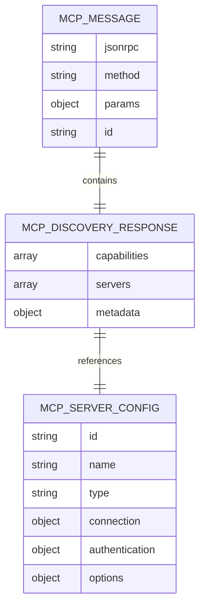

**Section sources**

- [mcp-manager.ts](file://src/main/mcp/mcp-manager.ts)
- [mcp-config-store.ts](file://src/main/mcp/mcp-config-store.ts)

## Message Handling

The MCP message handling system implements robust communication patterns for reliable server-client interaction:

### Message Processing Pipeline

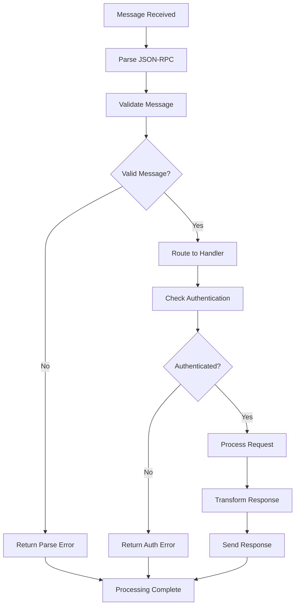

### Error Propagation Mechanism

The system implements comprehensive error handling with structured error responses:

| Error Type       | Code        | Description           | Recovery Action          |
| ---------------- | ----------- | --------------------- | ------------------------ |
| Parse Error      | -32700      | Invalid JSON received | Validate input format    |
| Invalid Request  | -32600      | Malformed request     | Fix request structure    |
| Method Not Found | -32601      | Unknown method        | Check available methods  |
| Invalid Params   | -32602      | Wrong parameters      | Validate parameter types |
| Internal Error   | -32603      | Server error          | Check server logs        |
| Server Error     | 40000-40999 | Custom server errors  | Handle specific error    |

**Section sources**

- [mcp-manager.ts](file://src/main/mcp/mcp-manager.ts)
- [mcp-logger.ts](file://src/main/mcp/mcp-logger.ts)

## Authentication and Security

The MCP implementation provides comprehensive security features including authentication, authorization, and secure communication:

### Authentication Methods

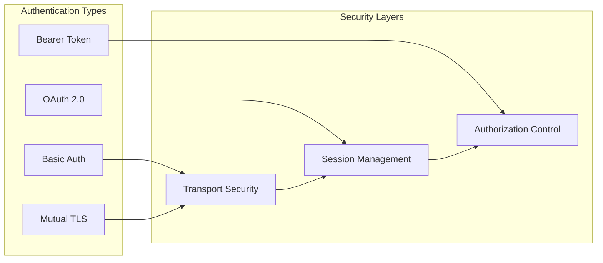

**Diagram sources**

- [mcp-oauth.ts](file://src/main/mcp/mcp-oauth.ts)
- [mcp-manager.ts](file://src/main/mcp/mcp-manager.ts)

### Security Implementation Details

The authentication system implements multiple security layers:

1. **Transport Security**: HTTPS/TLS encryption for all communications
2. **Session Management**: JWT token handling with refresh mechanisms
3. **Authorization Control**: Role-based access control for MCP operations
4. **Input Validation**: Comprehensive validation for all incoming requests
5. **Rate Limiting**: Protection against abuse and denial-of-service attacks

**Section sources**

- [mcp-oauth.ts](file://src/main/mcp/mcp-oauth.ts)
- [mcp-manager.ts](file://src/main/mcp/mcp-manager.ts)

## Server Management

The MCP server management system provides comprehensive lifecycle management for MCP servers:

### Server Lifecycle Management

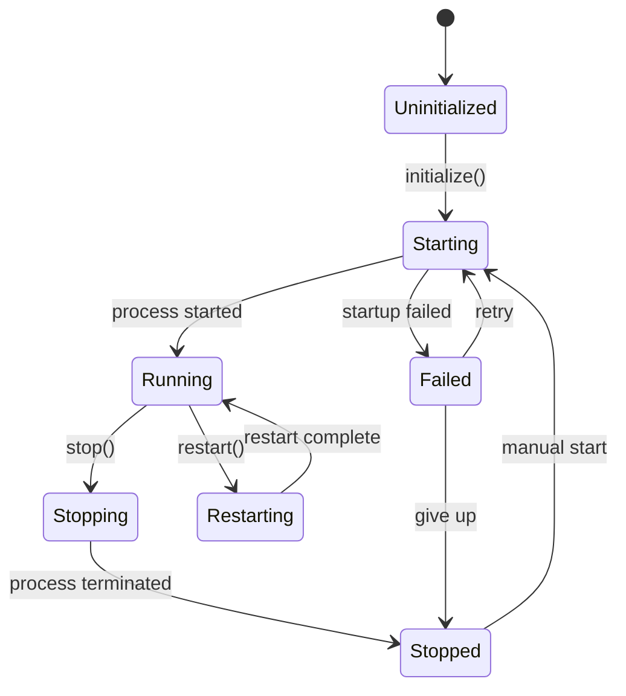

### Server Configuration Management

The system supports dynamic configuration updates and environment variable injection:

| Configuration Type    | Purpose                   | Example Settings           |
| --------------------- | ------------------------- | -------------------------- |
| Connection Config     | Server connection details | Host, port, protocol       |
| Authentication Config | Security credentials      | Tokens, certificates       |
| Performance Config    | Resource limits           | Memory, CPU, timeout       |
| Logging Config        | Debugging and monitoring  | Log levels, output targets |

**Section sources**

- [mcp-manager.ts](file://src/main/mcp/mcp-manager.ts)
- [mcp-config-store.ts](file://src/main/mcp/mcp-config-store.ts)

## Client Integration Patterns

The MCP implementation supports multiple client integration patterns for different use cases:

### Client Types and Patterns

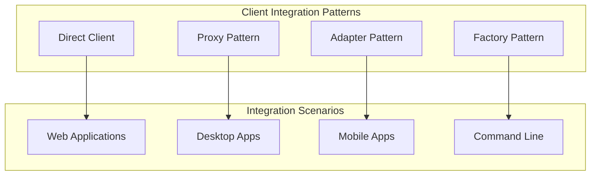

### Client Implementation Examples

The system provides flexible patterns for different client scenarios:

1. **Direct Integration**: Native client libraries for direct MCP server communication
2. **Proxy Pattern**: Intermediate services for complex routing and load balancing
3. **Adapter Pattern**: Protocol adapters for legacy system integration
4. **Factory Pattern**: Automated server creation and management for scalable deployments

**Section sources**

- [mcp-manager.ts](file://src/main/mcp/mcp-manager.ts)
- [mcp-manager.test.ts](file://src/tests/mcp/mcp-manager.test.ts)

## Deployment and Configuration

The MCP deployment system provides comprehensive configuration management and deployment automation:

### Deployment Architecture

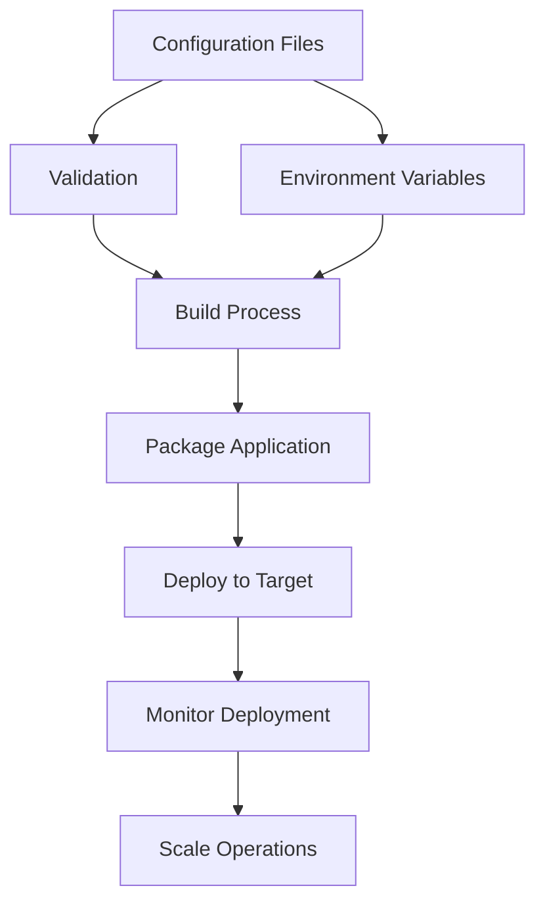

### Configuration Management

The system implements hierarchical configuration management:

| Configuration Level | Priority | Purpose                        |
| ------------------- | -------- | ------------------------------ |
| System Defaults     | Lowest   | Base system configuration      |
| Environment Config  | Medium   | Environment-specific overrides |
| User Config         | High     | User-specific preferences      |
| Runtime Config      | Highest  | Temporary runtime settings     |

**Section sources**

- [mcp-config-store.ts](file://src/main/mcp/mcp-config-store.ts)
- [bundle-mcp.js](file://scripts/bundle-mcp.js)

## Development Examples

The MCP implementation includes comprehensive examples for different development scenarios:

### GUI Operation Server Example

The GUI Operate Server demonstrates visual MCP server management:

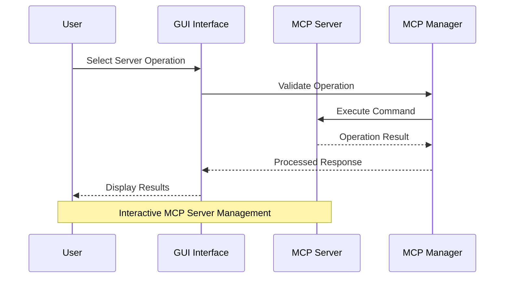

**Diagram sources**

- [gui-operate-server.ts](file://src/main/mcp/gui-operate-server.ts)

### Software Development Server Example

The Software Development Server Example showcases development-focused MCP implementations:

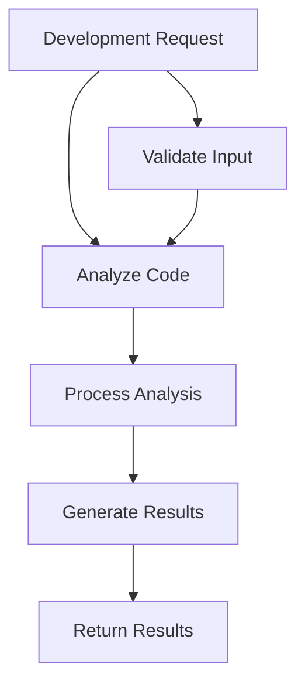

**Diagram sources**

- [software-dev-server-example.ts](file://src/main/mcp/software-dev-server-example.ts)

**Section sources**

- [gui-operate-server.ts](file://src/main/mcp/gui-operate-server.ts)
- [software-dev-server-example.ts](file://src/main/mcp/software-dev-server-example.ts)

## Debugging Techniques

The MCP implementation provides comprehensive debugging and monitoring capabilities:

### Debugging Architecture

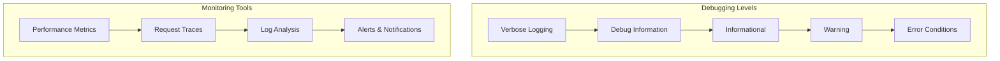

### Debugging Features

The system implements comprehensive debugging capabilities:

1. **Structured Logging**: Hierarchical log levels with contextual information
2. **Performance Monitoring**: Real-time metrics collection and analysis
3. **Request Tracing**: End-to-end request tracking across server boundaries
4. **Error Analysis**: Comprehensive error reporting and diagnostic information
5. **Interactive Debugging**: Live debugging sessions for development and testing

**Section sources**

- [mcp-logger.ts](file://src/main/mcp/mcp-logger.ts)
- [mcp-manager.ts](file://src/main/mcp/mcp-manager.ts)

## Extensions and Compatibility

The MCP implementation supports extensible architecture with forward compatibility considerations:

### Extension Points

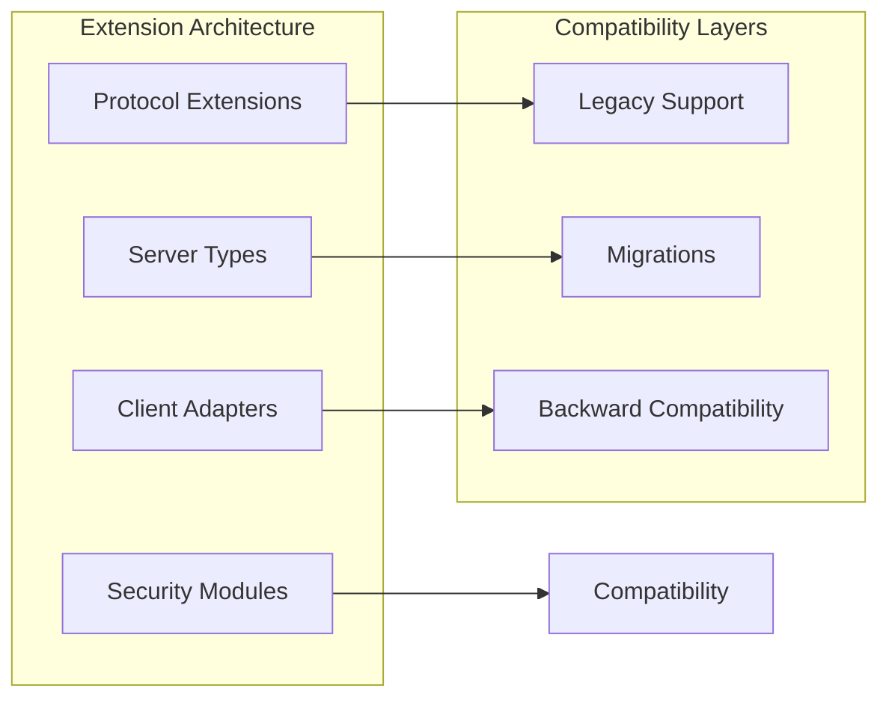

### Compatibility Strategies

The system implements multiple compatibility strategies:

1. **Version Negotiation**: Automatic version detection and compatibility checking
2. **Feature Detection**: Runtime capability discovery and adaptation
3. **Graceful Degradation**: Fallback mechanisms for unsupported features
4. **Migration Paths**: Clear upgrade paths between protocol versions
5. **Backward Compatibility**: Maintained support for older protocol versions

**Section sources**

- [mcp-manager.ts](file://src/main/mcp/mcp-manager.ts)
- [mcp-manager.test.ts](file://src/tests/mcp/mcp-manager.test.ts)

## Troubleshooting Guide

Common MCP integration issues and their solutions:

### Server Connection Issues

| Issue                   | Symptoms                           | Solution                                         |
| ----------------------- | ---------------------------------- | ------------------------------------------------ |
| Server not responding   | Timeout errors, connection refused | Check server status, verify network connectivity |
| Authentication failures | 401/403 errors                     | Verify credentials, check token validity         |
| Protocol mismatch       | Version negotiation errors         | Ensure protocol compatibility                    |
| Resource exhaustion     | Out of memory, timeout errors      | Increase resource limits, optimize queries       |

### Performance Issues

| Issue               | Symptoms                          | Solution                                     |
| ------------------- | --------------------------------- | -------------------------------------------- |
| Slow response times | High latency, timeouts            | Optimize queries, add caching                |
| Memory leaks        | Increasing memory usage           | Review resource cleanup, monitor connections |
| High CPU usage      | Server overload, poor performance | Scale horizontally, optimize algorithms      |

### Configuration Problems

| Issue                   | Symptoms                                   | Solution                                                  |
| ----------------------- | ------------------------------------------ | --------------------------------------------------------- |
| Incorrect server config | Connection failures, authentication errors | Validate configuration files, check environment variables |
| Missing dependencies    | Import errors, module not found            | Install required packages, verify PATH                    |
| Port conflicts          | Binding errors, service unavailable        | Change port numbers, check for conflicts                  |

**Section sources**

- [mcp-manager.ts](file://src/main/mcp/mcp-manager.ts)
- [mcp-config-store.ts](file://src/main/mcp/mcp-config-store.ts)
- [mcp-oauth.ts](file://src/main/mcp/mcp-oauth.ts)

## Conclusion

The MCP integration in Open Cowork provides a comprehensive, production-ready framework for Model Context Protocol implementation. The modular architecture supports flexible deployment patterns, robust security measures, and extensive customization capabilities.

Key strengths of the implementation include:

- **Modular Design**: Clean separation of concerns enables easy maintenance and extension
- **Robust Security**: Multi-layered authentication and authorization mechanisms
- **Flexible Deployment**: Support for various deployment scenarios and scaling patterns
- **Comprehensive Testing**: Extensive test coverage ensures reliability and stability
- **Developer-Friendly**: Well-documented APIs and clear integration patterns

The implementation serves as a solid foundation for building AI-powered applications that require flexible, extensible MCP server integration while maintaining high standards for security, performance, and maintainability.
