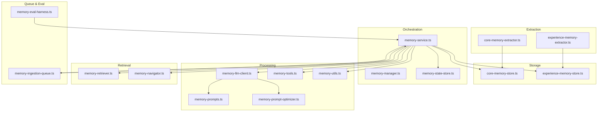
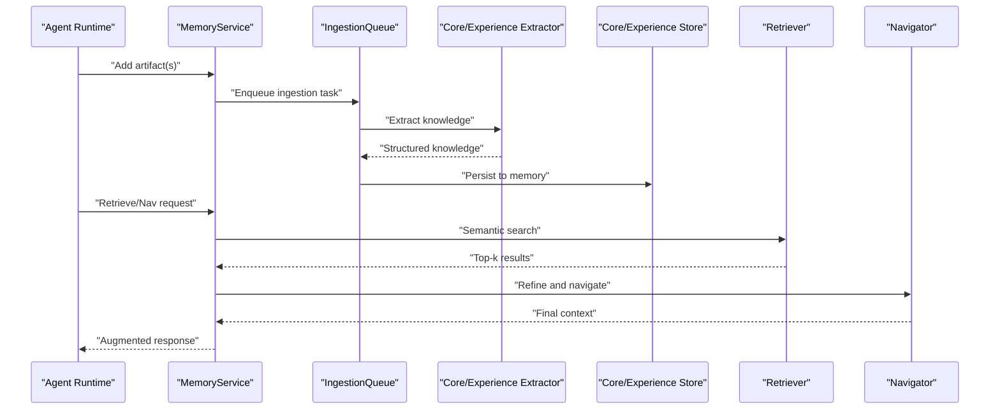
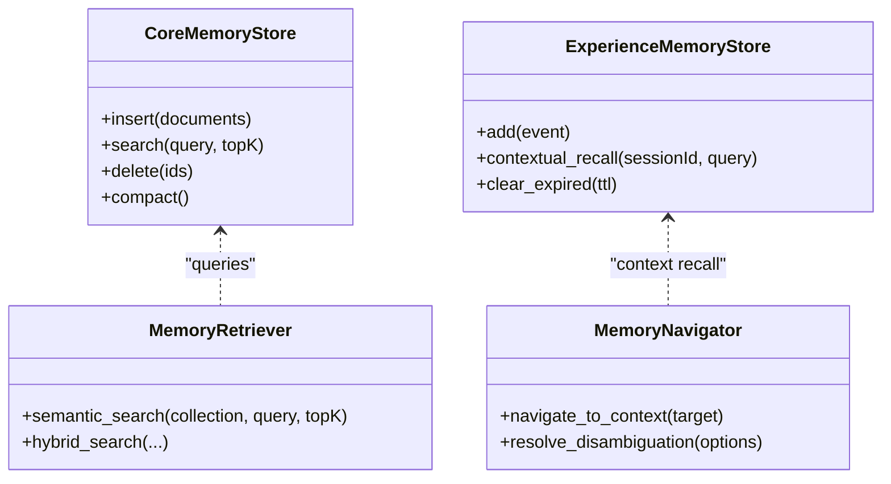
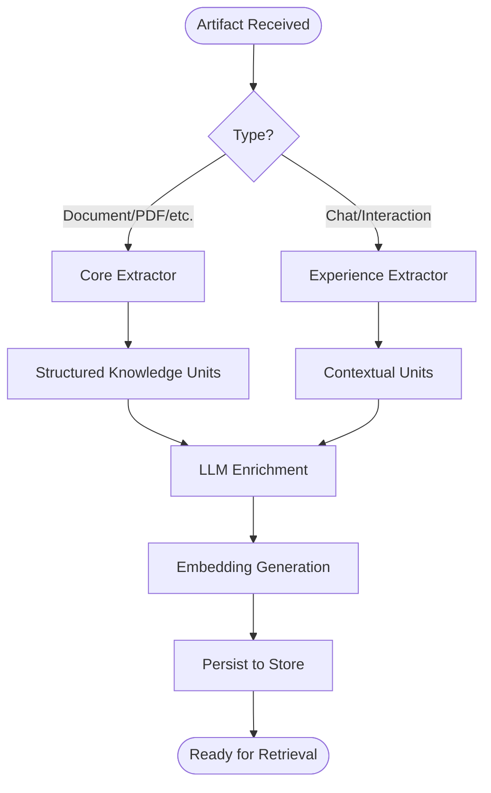
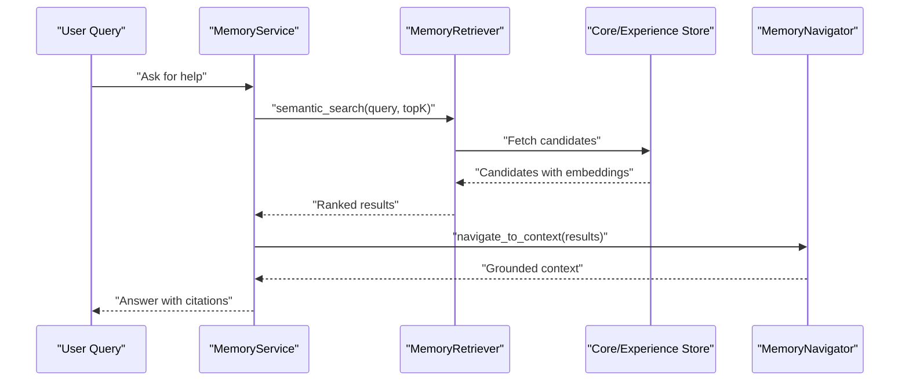
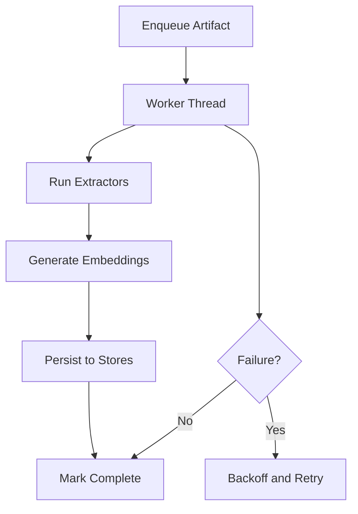
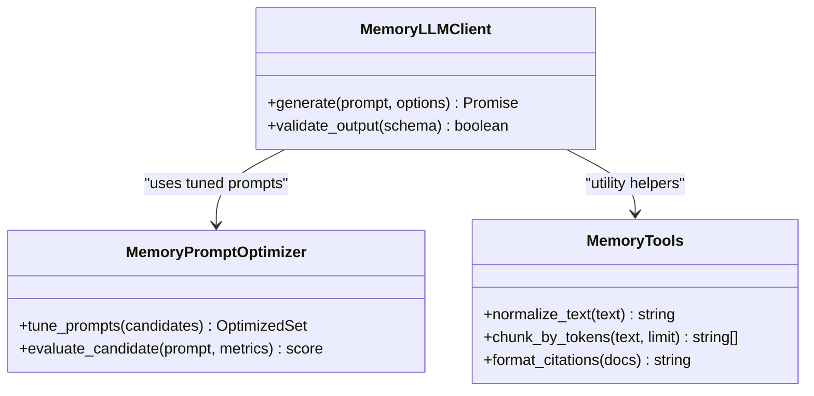
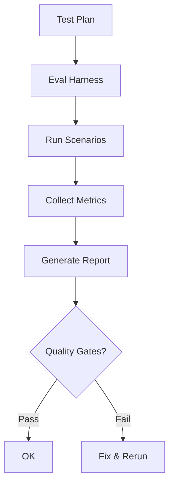
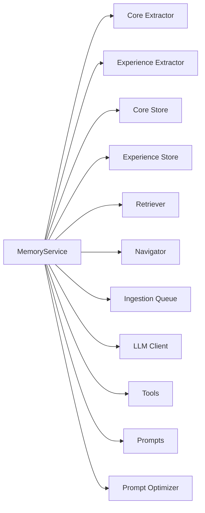

# Memory and Knowledge Base

<cite>
**Referenced Files in This Document**
- [memory-manager.ts](file://src/main/memory/memory-manager.ts)
- [memory-service.ts](file://src/main/memory/memory-service.ts)
- [memory-state-store.ts](file://src/main/memory/memory-state-store.ts)
- [memory-ingestion-queue.ts](file://src/main/memory/memory-ingestion-queue.ts)
- [memory-llm-client.ts](file://src/main/memory/memory-llm-client.ts)
- [memory-retriever.ts](file://src/main/memory/memory-retriever.ts)
- [memory-navigator.ts](file://src/main/memory/memory-navigator.ts)
- [memory-prompts.ts](file://src/main/memory/memory-prompts.ts)
- [memory-prompt-optimizer.ts](file://src/main/memory/memory-prompt-optimizer.ts)
- [memory-tools.ts](file://src/main/memory/memory-tools.ts)
- [memory-types.ts](file://src/main/memory/memory-types.ts)
- [memory-utils.ts](file://src/main/memory/memory-utils.ts)
- [core-memory-extractor.ts](file://src/main/memory/core-memory-extractor.ts)
- [experience-memory-extractor.ts](file://src/main/memory/experience-memory-extractor.ts)
- [core-memory-store.ts](file://src/main/memory/core-memory-store.ts)
- [experience-memory-store.ts](file://src/main/memory/experience-memory-store.ts)
- [memory-eval-harness.ts](file://src/main/memory/memory-eval-harness.ts)
- [memory-extension.ts](file://src/main/memory/memory-extension.ts)
- [SettingsMemory.tsx](file://src/renderer/components/settings/SettingsMemory.tsx)
- [memory-integration-files.test.ts](file://src/tests/memory/memory-integration-files.test.ts)
- [memory-llm-client.test.ts](file://src/tests/memory/memory-llm-client.test.ts)
- [memory-eval-harness.test.ts](file://src/tests/memory/memory-eval-harness.test.ts)
- [memory-smoke-harness.test.ts](file://src/tests/memory/memory-smoke-harness.test.ts)
</cite>

## Table of Contents

1. [Introduction](#introduction)
2. [Project Structure](#project-structure)
3. [Core Components](#core-components)
4. [Architecture Overview](#architecture-overview)
5. [Detailed Component Analysis](#detailed-component-analysis)
6. [Dependency Analysis](#dependency-analysis)
7. [Performance Considerations](#performance-considerations)
8. [Troubleshooting Guide](#troubleshooting-guide)
9. [Conclusion](#conclusion)
10. [Appendices](#appendices)

## Introduction

This document explains Open Cowork’s memory and knowledge base system. It covers the dual memory architecture (core and experience memory), knowledge extraction, embedding generation, and retrieval mechanisms. It also documents the memory store architecture, LLM client integration, memory evaluation harness, ingestion queue, prompt optimization, and tool integration. Practical usage patterns, workflows, performance optimization, storage considerations, privacy controls, debugging, evaluation procedures, and guidance for custom memory implementations are included.

## Project Structure

Open Cowork organizes memory-related functionality under a dedicated module with clear separation of concerns:

- Extraction pipeline: transforms raw artifacts into structured knowledge
- Storage: persists core and experience memory with distinct semantics
- Retrieval: semantic search and navigation across stored memories
- Orchestration: service, manager, and state coordination
- Tools and prompts: reusable utilities and optimized prompts for memory tasks
- Evaluation: test harnesses for correctness and performance validation

**Diagram sources**

- [memory-manager.ts](file://src/main/memory/memory-manager.ts)
- [memory-service.ts](file://src/main/memory/memory-service.ts)
- [memory-state-store.ts](file://src/main/memory/memory-state-store.ts)
- [memory-ingestion-queue.ts](file://src/main/memory/memory-ingestion-queue.ts)
- [memory-llm-client.ts](file://src/main/memory/memory-llm-client.ts)
- [memory-retriever.ts](file://src/main/memory/memory-retriever.ts)
- [memory-navigator.ts](file://src/main/memory/memory-navigator.ts)
- [memory-prompts.ts](file://src/main/memory/memory-prompts.ts)
- [memory-prompt-optimizer.ts](file://src/main/memory/memory-prompt-optimizer.ts)
- [memory-tools.ts](file://src/main/memory/memory-tools.ts)
- [memory-utils.ts](file://src/main/memory/memory-utils.ts)
- [core-memory-extractor.ts](file://src/main/memory/core-memory-extractor.ts)
- [experience-memory-extractor.ts](file://src/main/memory/experience-memory-extractor.ts)
- [core-memory-store.ts](file://src/main/memory/core-memory-store.ts)
- [experience-memory-store.ts](file://src/main/memory/experience-memory-store.ts)
- [memory-eval-harness.ts](file://src/main/memory/memory-eval-harness.ts)

**Section sources**

- [memory-manager.ts](file://src/main/memory/memory-manager.ts)
- [memory-service.ts](file://src/main/memory/memory-service.ts)
- [memory-state-store.ts](file://src/main/memory/memory-state-store.ts)
- [memory-ingestion-queue.ts](file://src/main/memory/memory-ingestion-queue.ts)
- [memory-llm-client.ts](file://src/main/memory/memory-llm-client.ts)
- [memory-retriever.ts](file://src/main/memory/memory-retriever.ts)
- [memory-navigator.ts](file://src/main/memory/memory-navigator.ts)
- [memory-prompts.ts](file://src/main/memory/memory-prompts.ts)
- [memory-prompt-optimizer.ts](file://src/main/memory/memory-prompt-optimizer.ts)
- [memory-tools.ts](file://src/main/memory/memory-tools.ts)
- [memory-utils.ts](file://src/main/memory/memory-utils.ts)
- [core-memory-extractor.ts](file://src/main/memory/core-memory-extractor.ts)
- [experience-memory-extractor.ts](file://src/main/memory/experience-memory-extractor.ts)
- [core-memory-store.ts](file://src/main/memory/core-memory-store.ts)
- [experience-memory-store.ts](file://src/main/memory/experience-memory-store.ts)
- [memory-eval-harness.ts](file://src/main/memory/memory-eval-harness.ts)

## Core Components

- Dual memory stores:
  - Core memory: factual, persistent knowledge extracted from artifacts
  - Experience memory: contextual, session-bound experiences and interactions
- Extraction pipeline:
  - Core extractor: identifies facts, entities, and structured knowledge
  - Experience extractor: captures interaction history and contextual insights
- Retrieval engine:
  - Semantic search and navigation across memories
- Ingestion queue:
  - Asynchronous processing of artifacts into memory
- LLM client:
  - Structured prompting and optimization for memory tasks
- Tools and prompts:
  - Reusable utilities and optimized prompt templates
- Evaluation harness:
  - Automated testing and benchmarking of memory behavior

**Section sources**

- [core-memory-extractor.ts](file://src/main/memory/core-memory-extractor.ts)
- [experience-memory-extractor.ts](file://src/main/memory/experience-memory-extractor.ts)
- [core-memory-store.ts](file://src/main/memory/core-memory-store.ts)
- [experience-memory-store.ts](file://src/main/memory/experience-memory-store.ts)
- [memory-retriever.ts](file://src/main/memory/memory-retriever.ts)
- [memory-navigator.ts](file://src/main/memory/memory-navigator.ts)
- [memory-ingestion-queue.ts](file://src/main/memory/memory-ingestion-queue.ts)
- [memory-llm-client.ts](file://src/main/memory/memory-llm-client.ts)
- [memory-prompts.ts](file://src/main/memory/memory-prompts.ts)
- [memory-prompt-optimizer.ts](file://src/main/memory/memory-prompt-optimizer.ts)
- [memory-tools.ts](file://src/main/memory/memory-tools.ts)
- [memory-utils.ts](file://src/main/memory/memory-utils.ts)
- [memory-eval-harness.ts](file://src/main/memory/memory-eval-harness.ts)

## Architecture Overview

The memory subsystem orchestrates ingestion, extraction, storage, retrieval, and evaluation. The service acts as the central coordinator, delegating specialized tasks to extractors, stores, retriever, navigator, queue, LLM client, and tools/prompts. State persistence ensures continuity across sessions.

**Diagram sources**

- [memory-service.ts](file://src/main/memory/memory-service.ts)
- [memory-ingestion-queue.ts](file://src/main/memory/memory-ingestion-queue.ts)
- [core-memory-extractor.ts](file://src/main/memory/core-memory-extractor.ts)
- [experience-memory-extractor.ts](file://src/main/memory/experience-memory-extractor.ts)
- [core-memory-store.ts](file://src/main/memory/core-memory-store.ts)
- [experience-memory-store.ts](file://src/main/memory/experience-memory-store.ts)
- [memory-retriever.ts](file://src/main/memory/memory-retriever.ts)
- [memory-navigator.ts](file://src/main/memory/memory-navigator.ts)

## Detailed Component Analysis

### Dual Memory Stores

- Core memory store:
  - Purpose: long-term factual knowledge
  - Schema: documents, chunks, embeddings, metadata
  - Indexing: vector and keyword-based
  - Persistence: disk-backed with periodic compaction
- Experience memory store:
  - Purpose: session-bound contextual experiences
  - Schema: events, timestamps, embeddings, relevance scores
  - Indexing: temporal and semantic
  - Persistence: ephemeral with retention policies

**Diagram sources**

- [core-memory-store.ts](file://src/main/memory/core-memory-store.ts)
- [experience-memory-store.ts](file://src/main/memory/experience-memory-store.ts)
- [memory-retriever.ts](file://src/main/memory/memory-retriever.ts)
- [memory-navigator.ts](file://src/main/memory/memory-navigator.ts)

**Section sources**

- [core-memory-store.ts](file://src/main/memory/core-memory-store.ts)
- [experience-memory-store.ts](file://src/main/memory/experience-memory-store.ts)
- [memory-retriever.ts](file://src/main/memory/memory-retriever.ts)
- [memory-navigator.ts](file://src/main/memory/memory-navigator.ts)

### Extraction Pipeline

- Core extractor:
  - Identifies entities, relations, facts, and categorizations
  - Produces structured knowledge units with confidence scores
- Experience extractor:
  - Captures interaction context, sentiment, and outcome signals
  - Generates lightweight embeddings for temporal proximity

**Diagram sources**

- [core-memory-extractor.ts](file://src/main/memory/core-memory-extractor.ts)
- [experience-memory-extractor.ts](file://src/main/memory/experience-memory-extractor.ts)
- [memory-llm-client.ts](file://src/main/memory/memory-llm-client.ts)
- [memory-utils.ts](file://src/main/memory/memory-utils.ts)

**Section sources**

- [core-memory-extractor.ts](file://src/main/memory/core-memory-extractor.ts)
- [experience-memory-extractor.ts](file://src/main/memory/experience-memory-extractor.ts)
- [memory-llm-client.ts](file://src/main/memory/memory-llm-client.ts)
- [memory-utils.ts](file://src/main/memory/memory-utils.ts)

### Retrieval and Navigation

- Retrieval:
  - Semantic search with hybrid reranking
  - Filters by relevance, recency, and metadata
- Navigation:
  - Context-aware navigation across related memories
  - Disambiguation and grounding of references

**Diagram sources**

- [memory-service.ts](file://src/main/memory/memory-service.ts)
- [memory-retriever.ts](file://src/main/memory/memory-retriever.ts)
- [memory-navigator.ts](file://src/main/memory/memory-navigator.ts)
- [core-memory-store.ts](file://src/main/memory/core-memory-store.ts)
- [experience-memory-store.ts](file://src/main/memory/experience-memory-store.ts)

**Section sources**

- [memory-service.ts](file://src/main/memory/memory-service.ts)
- [memory-retriever.ts](file://src/main/memory/memory-retriever.ts)
- [memory-navigator.ts](file://src/main/memory/memory-navigator.ts)

### Ingestion Queue and Processing

- Asynchronous ingestion:
  - Queues artifacts for processing
  - Batch and rate-limit extraction and embedding
- Backpressure and retries:
  - Configurable concurrency and failure handling

**Diagram sources**

- [memory-ingestion-queue.ts](file://src/main/memory/memory-ingestion-queue.ts)
- [memory-manager.ts](file://src/main/memory/memory-manager.ts)

**Section sources**

- [memory-ingestion-queue.ts](file://src/main/memory/memory-ingestion-queue.ts)
- [memory-manager.ts](file://src/main/memory/memory-manager.ts)

### LLM Client Integration and Prompt Optimization

- LLM client:
  - Structured prompting for extraction and enrichment
  - Streaming and error handling
- Prompt optimizer:
  - Iterative refinement of prompts for accuracy and efficiency
- Tools:
  - Utility functions for memory-specific operations

**Diagram sources**

- [memory-llm-client.ts](file://src/main/memory/memory-llm-client.ts)
- [memory-prompt-optimizer.ts](file://src/main/memory/memory-prompt-optimizer.ts)
- [memory-tools.ts](file://src/main/memory/memory-tools.ts)
- [memory-utils.ts](file://src/main/memory/memory-utils.ts)

**Section sources**

- [memory-llm-client.ts](file://src/main/memory/memory-llm-client.ts)
- [memory-prompt-optimizer.ts](file://src/main/memory/memory-prompt-optimizer.ts)
- [memory-tools.ts](file://src/main/memory/memory-tools.ts)
- [memory-utils.ts](file://src/main/memory/memory-utils.ts)

### Memory Evaluation Harness

- Automated evaluation:
  - Smoke tests, integration tests, and targeted harnesses
- Metrics:
  - Recall, precision, latency, and quality gates

**Diagram sources**

- [memory-eval-harness.ts](file://src/main/memory/memory-eval-harness.ts)
- [memory-integration-files.test.ts](file://src/tests/memory/memory-integration-files.test.ts)
- [memory-llm-client.test.ts](file://src/tests/memory/memory-llm-client.test.ts)
- [memory-eval-harness.test.ts](file://src/tests/memory/memory-eval-harness.test.ts)
- [memory-smoke-harness.test.ts](file://src/tests/memory/memory-smoke-harness.test.ts)

**Section sources**

- [memory-eval-harness.ts](file://src/main/memory/memory-eval-harness.ts)
- [memory-integration-files.test.ts](file://src/tests/memory/memory-integration-files.test.ts)
- [memory-llm-client.test.ts](file://src/tests/memory/memory-llm-client.test.ts)
- [memory-eval-harness.test.ts](file://src/tests/memory/memory-eval-harness.test.ts)
- [memory-smoke-harness.test.ts](file://src/tests/memory/memory-smoke-harness.test.ts)

### Memory Types and Utilities

- Types:
  - Unified interfaces for memory entries, queries, and results
- Utilities:
  - Text normalization, chunking, and citation formatting

**Section sources**

- [memory-types.ts](file://src/main/memory/memory-types.ts)
- [memory-utils.ts](file://src/main/memory/memory-utils.ts)

### Memory Extension and Settings

- Extension points:
  - Pluggable extractors, stores, and retrievers
- Settings:
  - UI controls for memory configuration and toggles

**Section sources**

- [memory-extension.ts](file://src/main/memory/memory-extension.ts)
- [SettingsMemory.tsx](file://src/renderer/components/settings/SettingsMemory.tsx)

## Dependency Analysis

The memory subsystem exhibits low coupling and high cohesion:

- Centralized service coordinates orchestration
- Extractors and stores are interchangeable via interfaces
- Retrieval and navigation are decoupled from ingestion
- Tools and prompts are shared utilities

**Diagram sources**

- [memory-service.ts](file://src/main/memory/memory-service.ts)
- [core-memory-extractor.ts](file://src/main/memory/core-memory-extractor.ts)
- [experience-memory-extractor.ts](file://src/main/memory/experience-memory-extractor.ts)
- [core-memory-store.ts](file://src/main/memory/core-memory-store.ts)
- [experience-memory-store.ts](file://src/main/memory/experience-memory-store.ts)
- [memory-retriever.ts](file://src/main/memory/memory-retriever.ts)
- [memory-navigator.ts](file://src/main/memory/memory-navigator.ts)
- [memory-ingestion-queue.ts](file://src/main/memory/memory-ingestion-queue.ts)
- [memory-llm-client.ts](file://src/main/memory/memory-llm-client.ts)
- [memory-tools.ts](file://src/main/memory/memory-tools.ts)
- [memory-prompts.ts](file://src/main/memory/memory-prompts.ts)
- [memory-prompt-optimizer.ts](file://src/main/memory/memory-prompt-optimizer.ts)

**Section sources**

- [memory-manager.ts](file://src/main/memory/memory-manager.ts)
- [memory-service.ts](file://src/main/memory/memory-service.ts)

## Performance Considerations

- Embedding efficiency:
  - Batch embedding requests and cache computed vectors
  - Use quantization or dimensionality reduction when appropriate
- Retrieval optimization:
  - Apply filters early to reduce candidate sets
  - Use approximate nearest neighbor (ANN) indices for large corpora
- Ingestion throughput:
  - Tune queue concurrency and worker pool sizes
  - Implement backpressure and exponential retries
- Storage:
  - Compact and prune old experience memory regularly
  - Use efficient serialization formats and indexing strategies
- Latency:
  - Warm caches and pre-load frequently accessed knowledge
  - Minimize cross-process boundaries in hot paths

[No sources needed since this section provides general guidance]

## Troubleshooting Guide

- Extraction failures:
  - Validate artifact formats and extractor logs
  - Inspect LLM client errors and prompt tuning
- Retrieval issues:
  - Verify embeddings and index health
  - Confirm query preprocessing and filters
- Ingestion bottlenecks:
  - Monitor queue depth and worker utilization
  - Adjust batch sizes and retry policies
- Evaluation regressions:
  - Run smoke and integration tests
  - Compare metrics against baselines

**Section sources**

- [memory-eval-harness.ts](file://src/main/memory/memory-eval-harness.ts)
- [memory-llm-client.test.ts](file://src/tests/memory/memory-llm-client.test.ts)
- [memory-eval-harness.test.ts](file://src/tests/memory/memory-eval-harness.test.ts)
- [memory-smoke-harness.test.ts](file://src/tests/memory/memory-smoke-harness.test.ts)

## Conclusion

Open Cowork’s memory system combines a dual-memory architecture with robust extraction, storage, retrieval, and evaluation capabilities. Its modular design enables customization, scalability, and reliable operation across diverse knowledge domains. By following the guidelines in this document, teams can optimize performance, ensure privacy, and extend the system with custom implementations.

[No sources needed since this section summarizes without analyzing specific files]

## Appendices

### Practical Usage Patterns

- Knowledge extraction workflows:
  - Upload artifacts → enqueue → extract → embed → persist
  - Periodic enrichment and compact operations
- Retrieval strategies:
  - Hybrid search combining vector and metadata filters
  - Context-aware navigation for grounded answers
- Prompt optimization:
  - Iterate on extraction and summarization prompts
  - Evaluate impact on downstream retrieval quality

[No sources needed since this section provides general guidance]

### Privacy Controls

- Data minimization:
  - Scope extraction to necessary content
  - Avoid storing sensitive identifiers
- Access control:
  - Restrict memory store access to trusted components
- Retention and deletion:
  - Implement TTL for experience memory
  - Provide explicit deletion APIs for user data

[No sources needed since this section provides general guidance]

### Custom Memory Implementations

- Extending stores:
  - Implement memory store interface for new backends
- Adding extractors:
  - Comply with extractor contract and return structured units
- Integrating tools:
  - Provide utility functions for preprocessing and formatting

**Section sources**

- [memory-extension.ts](file://src/main/memory/memory-extension.ts)
- [memory-types.ts](file://src/main/memory/memory-types.ts)
