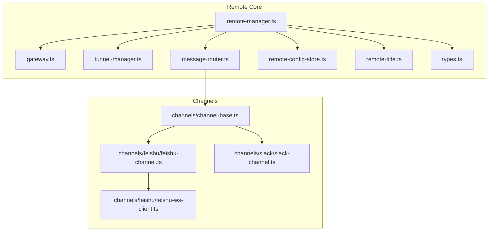
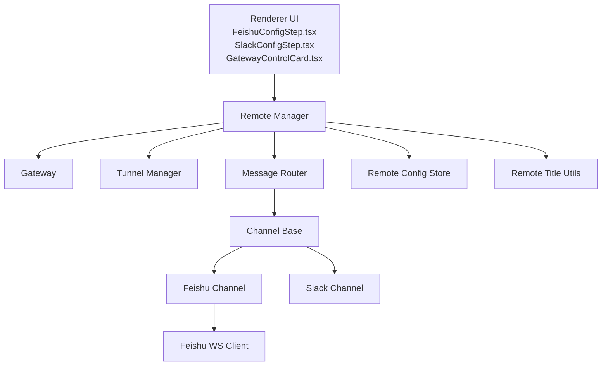
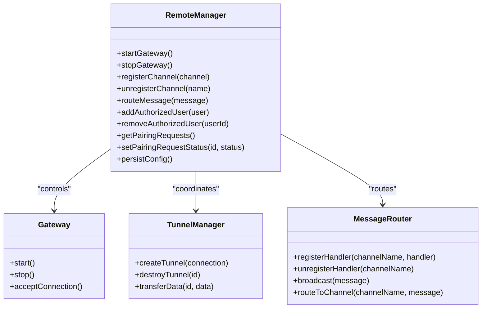
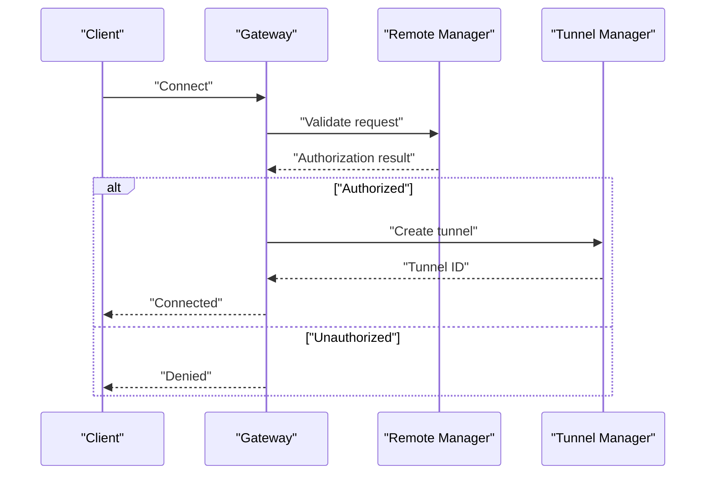
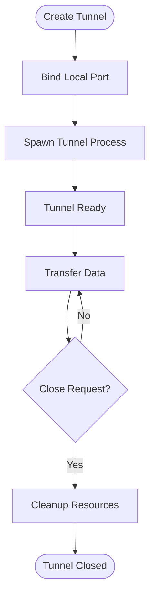
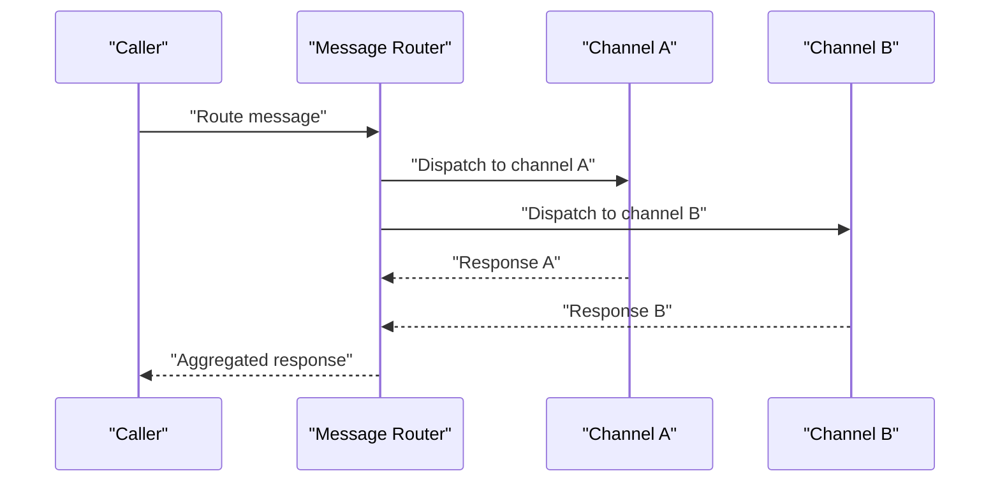
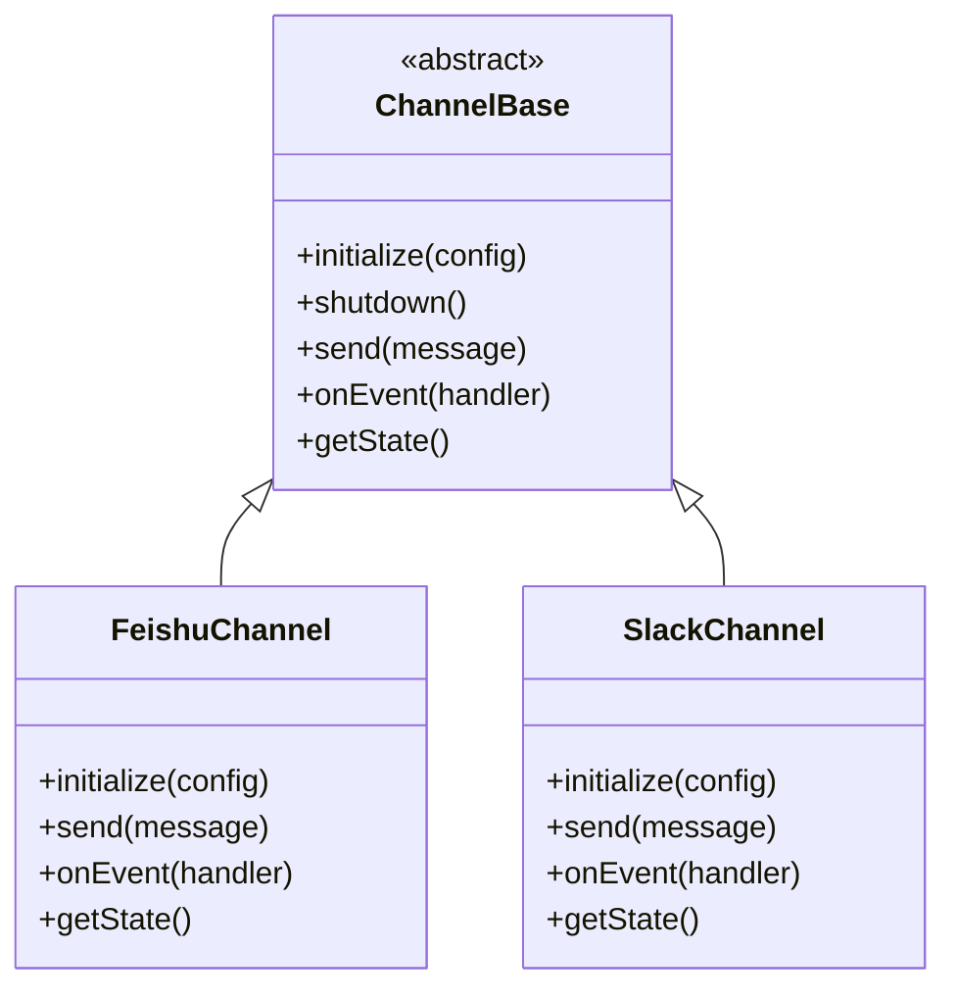
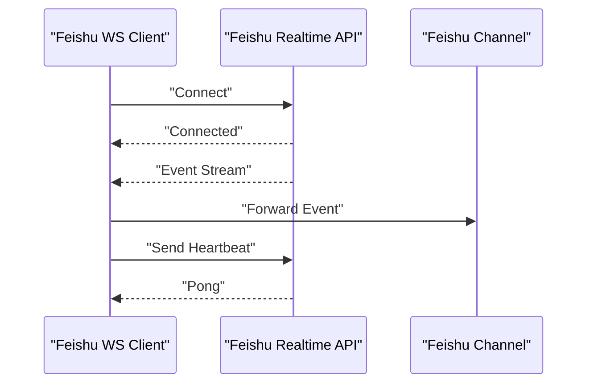
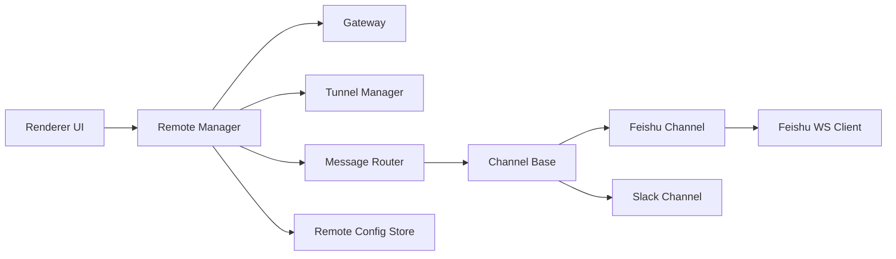

# Remote Collaboration

<cite>
**Referenced Files in This Document**
- [gateway.ts](file://src/main/remote/gateway.ts)
- [remote-manager.ts](file://src/main/remote/remote-manager.ts)
- [tunnel-manager.ts](file://src/main/remote/tunnel-manager.ts)
- [message-router.ts](file://src/main/remote/message-router.ts)
- [channel-base.ts](file://src/main/remote/channels/channel-base.ts)
- [feishu-channel.ts](file://src/main/remote/channels/feishu/feishu-channel.ts)
- [feishu-ws-client.ts](file://src/main/remote/channels/feishu/feishu-ws-client.ts)
- [slack-channel.ts](file://src/main/remote/channels/slack/slack-channel.ts)
- [types.ts](file://src/main/remote/types.ts)
- [remote-config-store.ts](file://src/main/remote/remote-config-store.ts)
- [remote-title.ts](file://src/main/remote/remote-title.ts)
- [index.ts](file://src/main/remote/index.ts)
- [FeishuConfigStep.tsx](file://src/renderer/components/remote/FeishuConfigStep.tsx)
- [SlackConfigStep.tsx](file://src/renderer/components/remote/SlackConfigStep.tsx)
- [GatewayControlCard.tsx](file://src/renderer/components/remote/GatewayControlCard.tsx)
- [PairingRequestsSection.tsx](file://src/renderer/components/remote/PairingRequestsSection.tsx)
- [AuthorizedUsersSection.tsx](file://src/renderer/components/remote/AuthorizedUsersSection.tsx)
- [SettingsConnectors.tsx](file://src/renderer/components/settings/SettingsConnectors.tsx)
</cite>

## Table of Contents

1. [Introduction](#introduction)
2. [Project Structure](#project-structure)
3. [Core Components](#core-components)
4. [Architecture Overview](#architecture-overview)
5. [Detailed Component Analysis](#detailed-component-analysis)
6. [Dependency Analysis](#dependency-analysis)
7. [Performance Considerations](#performance-considerations)
8. [Security and Authorization](#security-and-authorization)
9. [Practical Setup and Workflows](#practical-setup-and-workflows)
10. [Troubleshooting Guide](#troubleshooting-guide)
11. [Conclusion](#conclusion)

## Introduction

Open Cowork provides secure, multi-channel remote collaboration capabilities that enable teams to coordinate work sessions across platforms such as Feishu and Slack. The system integrates real-time messaging via WebSocket connections, manages persistent tunnels for secure remote access, and routes messages efficiently across channels. The remote manager orchestrates gateway operations, tunnel lifecycle, and authorization policies, while channel implementations encapsulate platform-specific protocols and APIs.

## Project Structure

The remote collaboration subsystem resides under src/main/remote and includes:

- Channel implementations for Feishu and Slack
- Gateway and tunnel management
- Message routing and configuration stores
- Types and utilities for remote operations

**Diagram sources**

- [remote-manager.ts](file://src/main/remote/remote-manager.ts)
- [gateway.ts](file://src/main/remote/gateway.ts)
- [tunnel-manager.ts](file://src/main/remote/tunnel-manager.ts)
- [message-router.ts](file://src/main/remote/message-router.ts)
- [remote-config-store.ts](file://src/main/remote/remote-config-store.ts)
- [remote-title.ts](file://src/main/remote/remote-title.ts)
- [types.ts](file://src/main/remote/types.ts)
- [channel-base.ts](file://src/main/remote/channels/channel-base.ts)
- [feishu-channel.ts](file://src/main/remote/channels/feishu/feishu-channel.ts)
- [feishu-ws-client.ts](file://src/main/remote/channels/feishu/feishu-ws-client.ts)
- [slack-channel.ts](file://src/main/remote/channels/slack/slack-channel.ts)

**Section sources**

- [index.ts](file://src/main/remote/index.ts)
- [types.ts](file://src/main/remote/types.ts)

## Core Components

- Remote Manager: Central orchestrator for gateway startup/shutdown, tunnel lifecycle, and coordination of channel operations.
- Gateway: Exposes a local endpoint for incoming connections and manages tunnel establishment.
- Tunnel Manager: Handles bidirectional data transfer, connection pooling, and resource cleanup.
- Message Router: Routes inbound/outbound messages to appropriate channels and handles cross-channel broadcasting.
- Channel Base: Defines the interface and common behavior for all channel implementations.
- Channel Implementations: Platform-specific adapters for Feishu and Slack, including WebSocket clients for real-time updates.
- Configuration Store: Persists and retrieves remote collaboration settings and credentials.
- Remote Title Utilities: Provides human-readable identifiers for remote sessions and contexts.

**Section sources**

- [remote-manager.ts](file://src/main/remote/remote-manager.ts)
- [gateway.ts](file://src/main/remote/gateway.ts)
- [tunnel-manager.ts](file://src/main/remote/tunnel-manager.ts)
- [message-router.ts](file://src/main/remote/message-router.ts)
- [channel-base.ts](file://src/main/remote/channels/channel-base.ts)
- [feishu-channel.ts](file://src/main/remote/channels/feishu/feishu-channel.ts)
- [slack-channel.ts](file://src/main/remote/channels/slack/slack-channel.ts)
- [remote-config-store.ts](file://src/main/remote/remote-config-store.ts)
- [remote-title.ts](file://src/main/remote/remote-title.ts)

## Architecture Overview

The remote collaboration system follows a layered architecture:

- Presentation Layer: Renderer components for configuration and control (Feishu/Slack steps, gateway controls).
- Application Layer: Remote manager coordinates operations and delegates to specialized managers.
- Transport Layer: Gateway and tunnel manager handle network connectivity and data transport.
- Channel Layer: Platform-specific channels implement protocol-specific message handling.
- Persistence Layer: Configuration store maintains settings and credentials.

**Diagram sources**

- [FeishuConfigStep.tsx](file://src/renderer/components/remote/FeishuConfigStep.tsx)
- [SlackConfigStep.tsx](file://src/renderer/components/remote/SlackConfigStep.tsx)
- [GatewayControlCard.tsx](file://src/renderer/components/remote/GatewayControlCard.tsx)
- [remote-manager.ts](file://src/main/remote/remote-manager.ts)
- [gateway.ts](file://src/main/remote/gateway.ts)
- [tunnel-manager.ts](file://src/main/remote/tunnel-manager.ts)
- [message-router.ts](file://src/main/remote/message-router.ts)
- [channel-base.ts](file://src/main/remote/channels/channel-base.ts)
- [feishu-channel.ts](file://src/main/remote/channels/feishu/feishu-channel.ts)
- [slack-channel.ts](file://src/main/remote/channels/slack/slack-channel.ts)
- [feishu-ws-client.ts](file://src/main/remote/channels/feishu/feishu-ws-client.ts)
- [remote-config-store.ts](file://src/main/remote/remote-config-store.ts)
- [remote-title.ts](file://src/main/remote/remote-title.ts)

## Detailed Component Analysis

### Remote Manager

Responsibilities:

- Initialize and shut down the gateway and tunnel manager
- Manage channel registration and lifecycle
- Coordinate message routing and broadcast
- Enforce authorization policies and maintain pairing requests
- Persist configuration via the remote config store

Key behaviors:

- Starts the gateway and establishes listening endpoints
- Spawns tunnel instances for active connections
- Routes messages to channels and aggregates responses
- Maintains authorized users and pairing requests lists
- Generates remote-friendly titles for sessions

**Diagram sources**

- [remote-manager.ts](file://src/main/remote/remote-manager.ts)
- [gateway.ts](file://src/main/remote/gateway.ts)
- [tunnel-manager.ts](file://src/main/remote/tunnel-manager.ts)
- [message-router.ts](file://src/main/remote/message-router.ts)

**Section sources**

- [remote-manager.ts](file://src/main/remote/remote-manager.ts)

### Gateway

Responsibilities:

- Provide a local endpoint for incoming connections
- Validate incoming requests against authorization rules
- Establish secure tunnel bindings for accepted connections
- Manage concurrent connections and resource limits

Operational flow:

- Accept new connections and validate credentials
- Create tunnel instances for authenticated sessions
- Forward traffic to/from the tunnel manager
- Clean up resources on disconnect

**Diagram sources**

- [gateway.ts](file://src/main/remote/gateway.ts)
- [remote-manager.ts](file://src/main/remote/remote-manager.ts)
- [tunnel-manager.ts](file://src/main/remote/tunnel-manager.ts)

**Section sources**

- [gateway.ts](file://src/main/remote/gateway.ts)

### Tunnel Manager

Responsibilities:

- Create and destroy tunnels on demand
- Transfer data bi-directionally between clients and channels
- Maintain tunnel state and handle errors
- Implement connection pooling and resource reuse

**Diagram sources**

- [tunnel-manager.ts](file://src/main/remote/tunnel-manager.ts)

**Section sources**

- [tunnel-manager.ts](file://src/main/remote/tunnel-manager.ts)

### Message Router

Responsibilities:

- Register handlers per channel
- Route messages to specific channels or broadcast to all
- Aggregate responses and deliver to callers
- Maintain handler registry and error propagation

**Diagram sources**

- [message-router.ts](file://src/main/remote/message-router.ts)

**Section sources**

- [message-router.ts](file://src/main/remote/message-router.ts)

### Channel Base and Implementations

Channel Base defines the contract for all channels:

- Initialization and shutdown
- Sending outbound messages
- Receiving inbound events
- Managing channel-specific state

Feishu Channel:

- Integrates with Feishu APIs for message retrieval and posting
- Uses a WebSocket client for real-time event streaming
- Implements thread/topic-aware routing

Slack Channel:

- Integrates with Slack APIs for message exchange
- Manages RTM or Websocket connections depending on platform requirements
- Supports workspace/team scoping and channel visibility

**Diagram sources**

- [channel-base.ts](file://src/main/remote/channels/channel-base.ts)
- [feishu-channel.ts](file://src/main/remote/channels/feishu/feishu-channel.ts)
- [slack-channel.ts](file://src/main/remote/channels/slack/slack-channel.ts)

**Section sources**

- [channel-base.ts](file://src/main/remote/channels/channel-base.ts)
- [feishu-channel.ts](file://src/main/remote/channels/feishu/feishu-channel.ts)
- [slack-channel.ts](file://src/main/remote/channels/slack/slack-channel.ts)

### Feishu WebSocket Client

The Feishu WebSocket client:

- Establishes and maintains a persistent connection to Feishu’s real-time API
- Handles reconnection logic and heartbeat mechanisms
- Parses incoming events and forwards them to the channel for processing
- Emits connection state changes for monitoring and recovery

**Diagram sources**

- [feishu-ws-client.ts](file://src/main/remote/channels/feishu/feishu-ws-client.ts)
- [feishu-channel.ts](file://src/main/remote/channels/feishu/feishu-channel.ts)

**Section sources**

- [feishu-ws-client.ts](file://src/main/remote/channels/feishu/feishu-ws-client.ts)

### Remote Configuration Store

Responsibilities:

- Persist and load remote collaboration settings
- Store platform credentials securely
- Maintain channel configurations and preferences
- Support migration and validation of stored data

Integration points:

- Remote manager reads/writes configuration during startup/shutdown
- Renderer components update settings via IPC or store updates

**Section sources**

- [remote-config-store.ts](file://src/main/remote/remote-config-store.ts)

### Remote Title Utilities

Provides human-readable identifiers for remote sessions and contexts, aiding in user experience and debugging.

**Section sources**

- [remote-title.ts](file://src/main/remote/remote-title.ts)

## Dependency Analysis

The remote collaboration system exhibits low coupling and high cohesion:

- Remote Manager depends on Gateway, Tunnel Manager, Message Router, and Configuration Store
- Channels depend on Channel Base and platform-specific clients
- Message Router depends on Channel Base implementations
- Renderer components depend on Remote Manager for orchestration and configuration

**Diagram sources**

- [remote-manager.ts](file://src/main/remote/remote-manager.ts)
- [gateway.ts](file://src/main/remote/gateway.ts)
- [tunnel-manager.ts](file://src/main/remote/tunnel-manager.ts)
- [message-router.ts](file://src/main/remote/message-router.ts)
- [channel-base.ts](file://src/main/remote/channels/channel-base.ts)
- [feishu-channel.ts](file://src/main/remote/channels/feishu/feishu-channel.ts)
- [slack-channel.ts](file://src/main/remote/channels/slack/slack-channel.ts)
- [feishu-ws-client.ts](file://src/main/remote/channels/feishu/feishu-ws-client.ts)
- [remote-config-store.ts](file://src/main/remote/remote-config-store.ts)

**Section sources**

- [index.ts](file://src/main/remote/index.ts)

## Performance Considerations

- Connection pooling: Reuse established tunnels and channels to minimize overhead
- Backpressure handling: Implement flow control in the tunnel manager to prevent buffer overruns
- Batch operations: Group outbound messages to reduce API call frequency
- Caching: Cache channel metadata and user permissions to avoid repeated lookups
- Resource limits: Enforce connection caps and rate limits per channel/platform
- Monitoring: Track latency, throughput, and error rates for each channel

## Security and Authorization

Authorization patterns:

- Credential storage: Use encrypted configuration store for platform tokens and secrets
- Access control: Maintain authorized users list and enforce permissions per session
- Pairing requests: Approve/deny remote access requests with audit trails
- Audit logging: Record all remote access attempts, successful connections, and message routing events
- Network isolation: Restrict gateway binding to localhost or VPN-scoped interfaces
- TLS enforcement: Prefer encrypted WebSocket connections and HTTPS for API integrations

Permission management:

- Role-based access: Define roles for collaborators (viewer, editor, admin)
- Scope limitations: Limit channel visibility and message posting rights
- Session-based tokens: Issue short-lived tokens for ephemeral access

Audit logging:

- Log all gateway connections with timestamps and identifiers
- Record message routing decisions and channel delivery outcomes
- Capture authorization failures and pairing request actions

**Section sources**

- [remote-manager.ts](file://src/main/remote/remote-manager.ts)
- [remote-config-store.ts](file://src/main/remote/remote-config-store.ts)
- [PairingRequestsSection.tsx](file://src/renderer/components/remote/PairingRequestsSection.tsx)
- [AuthorizedUsersSection.tsx](file://src/renderer/components/remote/AuthorizedUsersSection.tsx)

## Practical Setup and Workflows

### Setting Up Team Channels

- Configure Feishu:
  - Navigate to the Feishu configuration step in the Remote Control Panel
  - Enter workspace/app credentials and select target groups/channels
  - Enable real-time event streaming and save configuration
- Configure Slack:
  - Navigate to the Slack configuration step in the Remote Control Panel
  - Connect workspace and select channels for collaboration
  - Enable bot scopes and message event subscriptions

- Persist configuration:
  - Use the remote configuration store to save settings
  - Restart remote manager to apply changes

**Section sources**

- [FeishuConfigStep.tsx](file://src/renderer/components/remote/FeishuConfigStep.tsx)
- [SlackConfigStep.tsx](file://src/renderer/components/remote/SlackConfigStep.tsx)
- [remote-config-store.ts](file://src/main/remote/remote-config-store.ts)

### Managing Collaboration Workflows

- Start gateway:
  - Use the Gateway Control Card to start the local endpoint
  - Monitor connection status and tunnel health
- Invite collaborators:
  - Share pairing links or invite codes generated by the system
  - Review and approve pairing requests in the Pairing Requests section
- Assign roles:
  - Manage authorized users and their permissions
  - Restrict sensitive operations to administrators

**Section sources**

- [GatewayControlCard.tsx](file://src/renderer/components/remote/GatewayControlCard.tsx)
- [PairingRequestsSection.tsx](file://src/renderer/components/remote/PairingRequestsSection.tsx)
- [AuthorizedUsersSection.tsx](file://src/renderer/components/remote/AuthorizedUsersSection.tsx)

### Handling Multi-User Interactions

- Message routing:
  - Use the message router to broadcast to all channels or route to specific recipients
  - Implement fan-out strategies for team-wide announcements
- Channel synchronization:
  - Ensure real-time updates are propagated across Feishu and Slack
  - Handle offline scenarios with message queuing and retry logic

**Section sources**

- [message-router.ts](file://src/main/remote/message-router.ts)
- [feishu-ws-client.ts](file://src/main/remote/channels/feishu/feishu-ws-client.ts)
- [slack-channel.ts](file://src/main/remote/channels/slack/slack-channel.ts)

## Troubleshooting Guide

Common connection issues:

- Gateway fails to start:
  - Verify port availability and firewall rules
  - Check configuration store for malformed settings
- Unauthorized access:
  - Confirm authorized users list and pairing approvals
  - Review audit logs for failed attempts
- Channel connectivity:
  - Inspect Feishu/Slack API credentials and scopes
  - Validate WebSocket connections and reconnection logic
- Performance bottlenecks:
  - Monitor tunnel utilization and adjust pooling parameters
  - Implement batching and backpressure controls

Diagnostic steps:

- Inspect gateway logs for connection errors
- Validate channel initialization sequences
- Check message router handler registrations
- Review tunnel manager resource usage

**Section sources**

- [gateway.ts](file://src/main/remote/gateway.ts)
- [remote-manager.ts](file://src/main/remote/remote-manager.ts)
- [feishu-ws-client.ts](file://src/main/remote/channels/feishu/feishu-ws-client.ts)
- [slack-channel.ts](file://src/main/remote/channels/slack/slack-channel.ts)
- [tunnel-manager.ts](file://src/main/remote/tunnel-manager.ts)

## Conclusion

Open Cowork’s remote collaboration system provides a robust, extensible framework for multi-channel team coordination. By combining a centralized remote manager, secure gateway and tunnel infrastructure, and platform-specific channel implementations, it enables seamless real-time collaboration across Feishu and Slack. Proper configuration, strict authorization, and comprehensive auditing ensure secure and reliable operations, while performance optimizations support scalable multi-user workflows.
