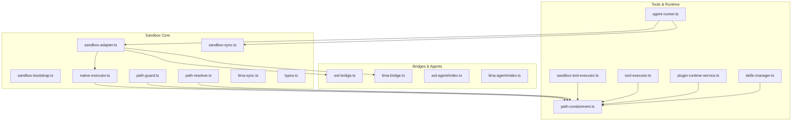
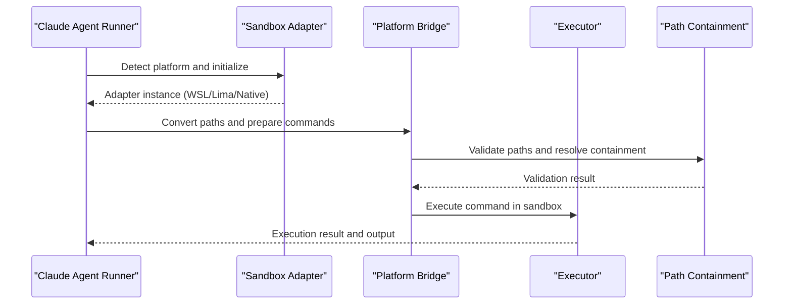
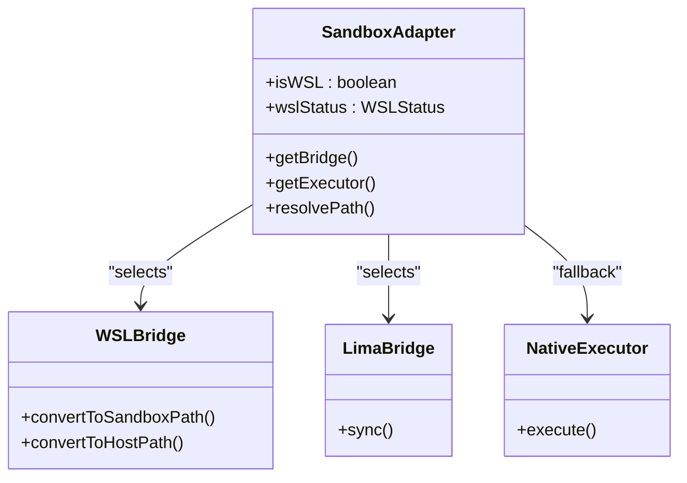
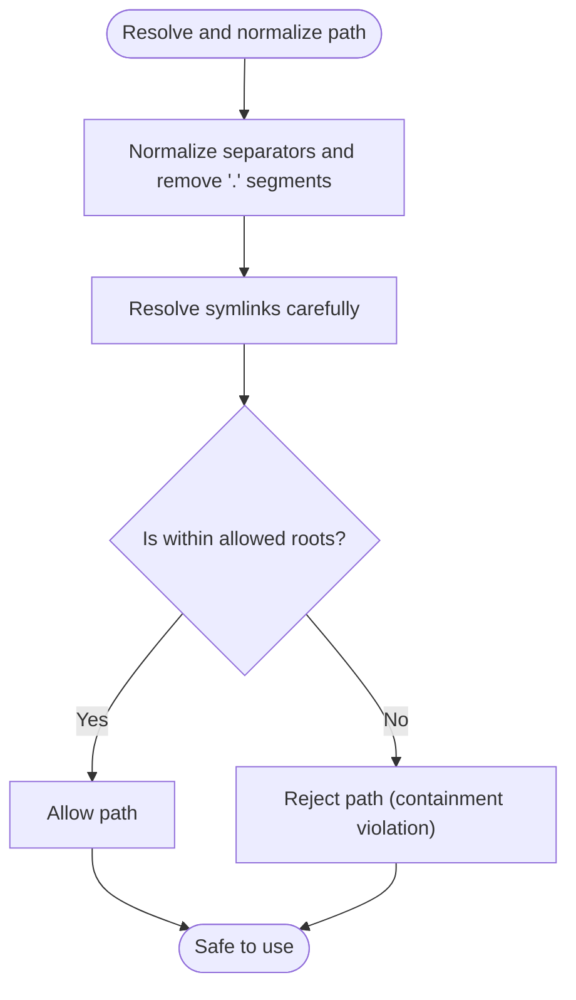
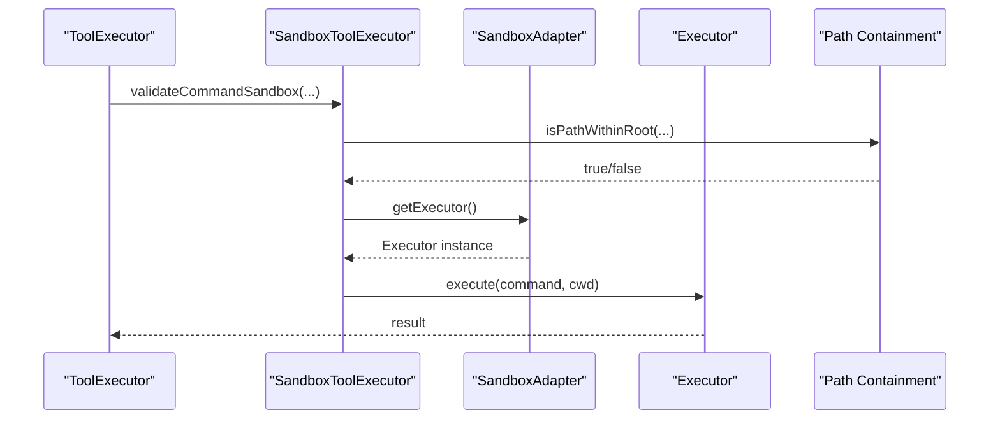
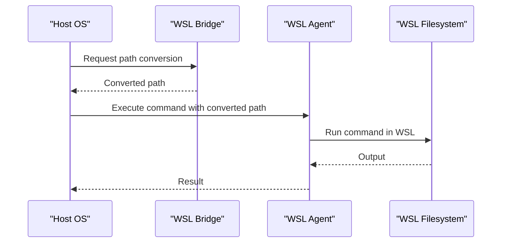
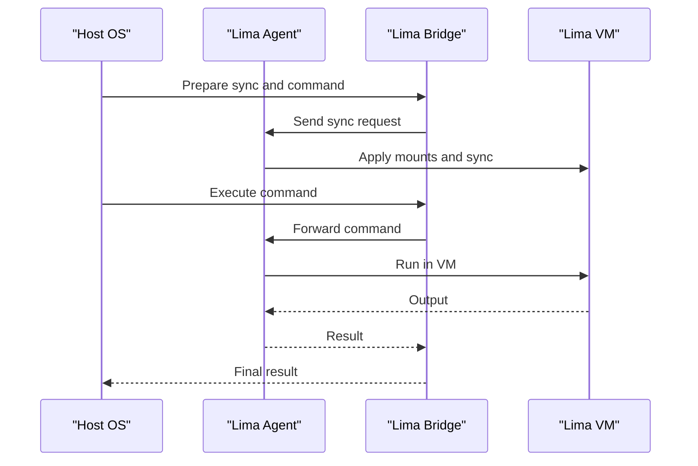
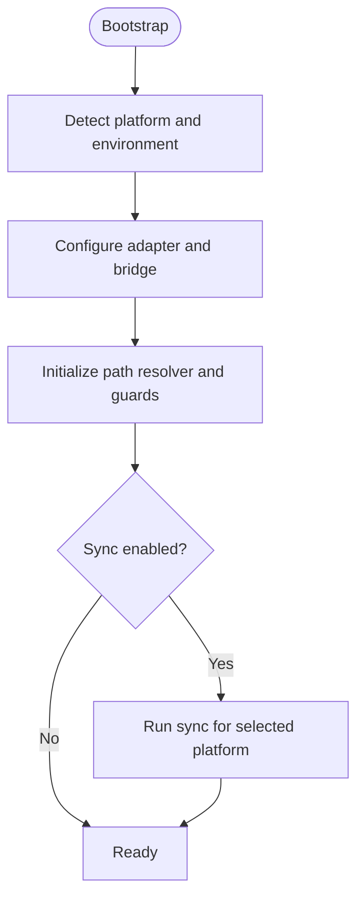
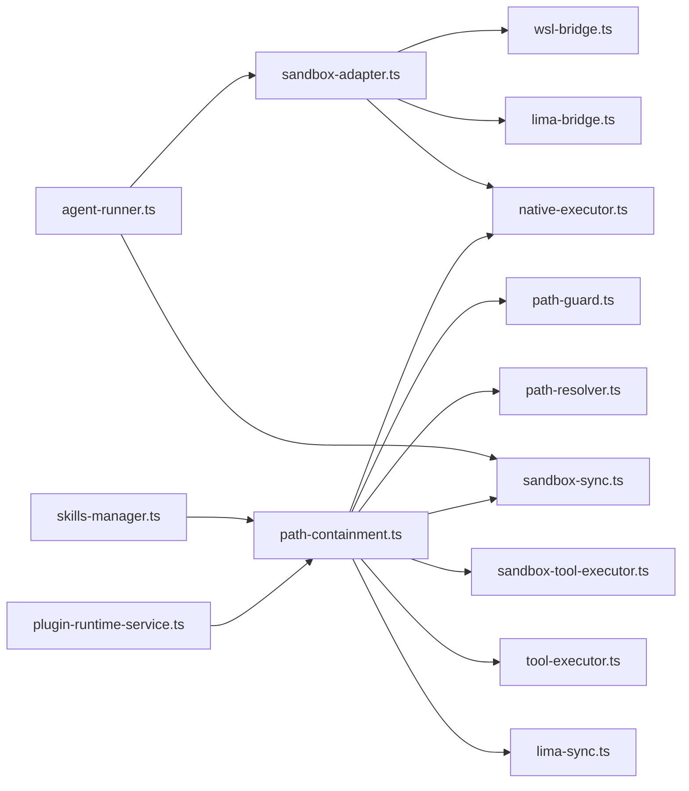

# Sandbox Execution Environment

<cite>
**Referenced Files in This Document**
- [index.ts](file://src/main/sandbox/index.ts)
- [sandbox-adapter.ts](file://src/main/sandbox/sandbox-adapter.ts)
- [sandbox-bootstrap.ts](file://src/main/sandbox/sandbox-bootstrap.ts)
- [native-executor.ts](file://src/main/sandbox/native-executor.ts)
- [wsl-bridge.ts](file://src/main/sandbox/wsl-bridge.ts)
- [lima-bridge.ts](file://src/main/sandbox/lima-bridge.ts)
- [path-guard.ts](file://src/main/sandbox/path-guard.ts)
- [path-resolver.ts](file://src/main/sandbox/path-resolver.ts)
- [sandbox-sync.ts](file://src/main/sandbox/sandbox-sync.ts)
- [lima-sync.ts](file://src/main/sandbox/lima-sync.ts)
- [types.ts](file://src/main/sandbox/types.ts)
- [path-containment.ts](file://src/main/tools/path-containment.ts)
- [sandbox-tool-executor.ts](file://src/main/tools/sandbox-tool-executor.ts)
- [tool-executor.ts](file://src/main/tools/tool-executor.ts)
- [agent-runner.ts](file://src/main/claude/agent-runner.ts)
- [plugin-runtime-service.ts](file://src/main/skills/plugin-runtime-service.ts)
- [skills-manager.ts](file://src/main/skills/skills-manager.ts)
- [settings-sandbox-status.test.ts](file://tests/settings-sandbox-status.test.ts)
- [sandbox-executor-containment.test.ts](file://tests/sandbox-executor-containment.test.ts)
- [sandbox-command-injection.test.ts](file://tests/sandbox-command-injection.test.ts)
- [path-guard-command-conversion.test.ts](file://tests/path-guard-command-conversion.test.ts)
- [sandbox-i18n.ts](file://src/renderer/utils/sandbox-i18n.ts)
</cite>

## Table of Contents

1. [Introduction](#introduction)
2. [Project Structure](#project-structure)
3. [Core Components](#core-components)
4. [Architecture Overview](#architecture-overview)
5. [Detailed Component Analysis](#detailed-component-analysis)
6. [Dependency Analysis](#dependency-analysis)
7. [Performance Considerations](#performance-considerations)
8. [Troubleshooting Guide](#troubleshooting-guide)
9. [Conclusion](#conclusion)
10. [Appendices](#appendices)

## Introduction

This document explains the sandbox execution environment in Open Cowork. It covers the security model, platform-specific implementations (WSL2, Lima, native), path containment mechanisms, sandbox adapter architecture, executor patterns, and cross-platform compatibility. It also documents security restrictions, permission controls, isolation guarantees, practical configuration examples, troubleshooting, performance considerations, and debugging guidance.

## Project Structure

The sandbox subsystem resides under src/main/sandbox and integrates with tool executors, Claude agent runtime, and skills managers. Key areas:

- Platform bridges and agents (WSL and Lima)
- Native executor and bootstrap
- Path containment and guards
- Sync utilities and types
- Renderer-side sandbox UI helpers

**Diagram sources**

- [sandbox-adapter.ts](file://src/main/sandbox/sandbox-adapter.ts)
- [sandbox-bootstrap.ts](file://src/main/sandbox/sandbox-bootstrap.ts)
- [native-executor.ts](file://src/main/sandbox/native-executor.ts)
- [wsl-bridge.ts](file://src/main/sandbox/wsl-bridge.ts)
- [lima-bridge.ts](file://src/main/sandbox/lima-bridge.ts)
- [path-guard.ts](file://src/main/sandbox/path-guard.ts)
- [path-resolver.ts](file://src/main/sandbox/path-resolver.ts)
- [sandbox-sync.ts](file://src/main/sandbox/sandbox-sync.ts)
- [lima-sync.ts](file://src/main/sandbox/lima-sync.ts)
- [types.ts](file://src/main/sandbox/types.ts)
- [path-containment.ts](file://src/main/tools/path-containment.ts)
- [sandbox-tool-executor.ts](file://src/main/tools/sandbox-tool-executor.ts)
- [tool-executor.ts](file://src/main/tools/tool-executor.ts)
- [agent-runner.ts](file://src/main/claude/agent-runner.ts)
- [plugin-runtime-service.ts](file://src/main/skills/plugin-runtime-service.ts)
- [skills-manager.ts](file://src/main/skills/skills-manager.ts)

**Section sources**

- [index.ts](file://src/main/sandbox/index.ts)
- [types.ts](file://src/main/sandbox/types.ts)

## Core Components

- Sandbox Adapter: Central factory/selector for platform-specific sandboxes (WSL/Lima/native). Provides runtime detection and orchestration.
- Executors: Native executor for host OS commands; platform bridges connect to WSL/Lima environments.
- Path Containment: Guards and validators prevent path traversal and symlink escapes; resolver normalizes paths for safe usage.
- Sync Utilities: File synchronization helpers for Lima and WSL to keep sandbox content aligned with the host workspace.
- Tools Integration: Tool executors enforce containment and delegate execution to the appropriate sandbox backend.

Key responsibilities:

- Security: Enforce path containment, guard command construction, and isolate execution.
- Compatibility: Support Windows (WSL2), Linux/macOS (Lima), and native platforms.
- UX: Hide real sandbox paths from model-visible output; present a virtualized workspace path.

**Section sources**

- [sandbox-adapter.ts](file://src/main/sandbox/sandbox-adapter.ts)
- [native-executor.ts](file://src/main/sandbox/native-executor.ts)
- [path-guard.ts](file://src/main/sandbox/path-guard.ts)
- [path-resolver.ts](file://src/main/sandbox/path-resolver.ts)
- [sandbox-sync.ts](file://src/main/sandbox/sandbox-sync.ts)
- [lima-sync.ts](file://src/main/sandbox/lima-sync.ts)
- [path-containment.ts](file://src/main/tools/path-containment.ts)
- [sandbox-tool-executor.ts](file://src/main/tools/sandbox-tool-executor.ts)
- [tool-executor.ts](file://src/main/tools/tool-executor.ts)

## Architecture Overview

The sandbox architecture separates concerns across adapters, executors, bridges, and containment utilities. The adapter selects the backend based on platform and configuration. Executors run commands safely via containment checks. Bridges translate host paths and commands to target environments. Sync utilities maintain parity between host and sandbox workspaces.

**Diagram sources**

- [agent-runner.ts](file://src/main/claude/agent-runner.ts)
- [sandbox-adapter.ts](file://src/main/sandbox/sandbox-adapter.ts)
- [wsl-bridge.ts](file://src/main/sandbox/wsl-bridge.ts)
- [lima-bridge.ts](file://src/main/sandbox/lima-bridge.ts)
- [native-executor.ts](file://src/main/sandbox/native-executor.ts)
- [path-containment.ts](file://src/main/tools/path-containment.ts)

## Detailed Component Analysis

### Sandbox Adapter

The adapter encapsulates platform selection and exposes a unified interface for sandbox operations. It detects whether WSL or Lima is active and provides configuration for path conversion and synchronization.

**Diagram sources**

- [sandbox-adapter.ts](file://src/main/sandbox/sandbox-adapter.ts)
- [wsl-bridge.ts](file://src/main/sandbox/wsl-bridge.ts)
- [lima-bridge.ts](file://src/main/sandbox/lima-bridge.ts)
- [native-executor.ts](file://src/main/sandbox/native-executor.ts)

**Section sources**

- [sandbox-adapter.ts](file://src/main/sandbox/sandbox-adapter.ts)

### Path Containment and Guards

Path containment prevents traversal and symlink escapes by validating that a resolved path remains within configured roots. Guards construct safe command arguments and sanitize inputs.

**Diagram sources**

- [path-containment.ts](file://src/main/tools/path-containment.ts)
- [path-guard.ts](file://src/main/sandbox/path-guard.ts)
- [path-resolver.ts](file://src/main/sandbox/path-resolver.ts)

**Section sources**

- [path-containment.ts](file://src/main/tools/path-containment.ts)
- [path-guard.ts](file://src/main/sandbox/path-guard.ts)
- [path-resolver.ts](file://src/main/sandbox/path-resolver.ts)

### Executors and Command Safety

Executors enforce containment and delegate to platform-specific backends. They validate arguments and ensure commands operate within constrained paths.

**Diagram sources**

- [tool-executor.ts](file://src/main/tools/tool-executor.ts)
- [sandbox-tool-executor.ts](file://src/main/tools/sandbox-tool-executor.ts)
- [sandbox-adapter.ts](file://src/main/sandbox/sandbox-adapter.ts)
- [native-executor.ts](file://src/main/sandbox/native-executor.ts)
- [path-containment.ts](file://src/main/tools/path-containment.ts)

**Section sources**

- [tool-executor.ts](file://src/main/tools/tool-executor.ts)
- [sandbox-tool-executor.ts](file://src/main/tools/sandbox-tool-executor.ts)
- [native-executor.ts](file://src/main/sandbox/native-executor.ts)

### Platform-Specific Implementations

#### WSL2 Implementation

- Bridge translates host paths to WSL paths and vice versa.
- Agent runs within the WSL environment to execute commands securely.
- Sync ensures workspace files are available inside WSL.

**Diagram sources**

- [wsl-bridge.ts](file://src/main/sandbox/wsl-bridge.ts)
- [wsl-agent/index.ts](file://src/main/sandbox/wsl-agent/index.ts)
- [agent-runner.ts](file://src/main/claude/agent-runner.ts)

**Section sources**

- [wsl-bridge.ts](file://src/main/sandbox/wsl-bridge.ts)
- [wsl-agent/index.ts](file://src/main/sandbox/wsl-agent/index.ts)
- [agent-runner.ts](file://src/main/claude/agent-runner.ts)

#### Lima Implementation

- Bridge and agent coordinate with the Lima VM to execute commands.
- Sync utilities copy or mirror workspace content into the guest environment.
- Path containment is enforced on both host and guest sides.

**Diagram sources**

- [lima-bridge.ts](file://src/main/sandbox/lima-bridge.ts)
- [lima-agent/index.ts](file://src/main/sandbox/lima-agent/index.ts)
- [lima-sync.ts](file://src/main/sandbox/lima-sync.ts)

**Section sources**

- [lima-bridge.ts](file://src/main/sandbox/lima-bridge.ts)
- [lima-agent/index.ts](file://src/main/sandbox/lima-agent/index.ts)
- [lima-sync.ts](file://src/main/sandbox/lima-sync.ts)

#### Native Implementation

- Executes commands directly on the host OS with strict containment checks.
- Uses path containment utilities to validate all inputs and working directories.

**Section sources**

- [native-executor.ts](file://src/main/sandbox/native-executor.ts)
- [path-containment.ts](file://src/main/tools/path-containment.ts)

### Sandbox Bootstrap and Initialization

Bootstrap initializes sandbox configuration, sets up adapters, and prepares environment-specific components. It coordinates with the agent runner to configure virtual workspace paths and optional sync flows.

**Diagram sources**

- [sandbox-bootstrap.ts](file://src/main/sandbox/sandbox-bootstrap.ts)
- [agent-runner.ts](file://src/main/claude/agent-runner.ts)

**Section sources**

- [sandbox-bootstrap.ts](file://src/main/sandbox/sandbox-bootstrap.ts)
- [agent-runner.ts](file://src/main/claude/agent-runner.ts)

### Cross-Platform Compatibility

- Path normalization and containment are enforced consistently across platforms.
- Bridges abstract environment differences (Windows paths vs Unix paths).
- Sync utilities adapt to platform-specific filesystem semantics.

**Section sources**

- [path-resolver.ts](file://src/main/sandbox/path-resolver.ts)
- [path-containment.ts](file://src/main/tools/path-containment.ts)
- [wsl-bridge.ts](file://src/main/sandbox/wsl-bridge.ts)
- [lima-bridge.ts](file://src/main/sandbox/lima-bridge.ts)

## Dependency Analysis

The sandbox subsystem exhibits low coupling and high cohesion:

- Path containment is a shared dependency across executors and bridges.
- Adapter centralizes platform selection, reducing duplication.
- Sync utilities depend on containment to ensure safe transfers.

**Diagram sources**

- [path-containment.ts](file://src/main/tools/path-containment.ts)
- [path-guard.ts](file://src/main/sandbox/path-guard.ts)
- [path-resolver.ts](file://src/main/sandbox/path-resolver.ts)
- [native-executor.ts](file://src/main/sandbox/native-executor.ts)
- [sandbox-tool-executor.ts](file://src/main/tools/sandbox-tool-executor.ts)
- [tool-executor.ts](file://src/main/tools/tool-executor.ts)
- [lima-sync.ts](file://src/main/sandbox/lima-sync.ts)
- [sandbox-sync.ts](file://src/main/sandbox/sandbox-sync.ts)
- [sandbox-adapter.ts](file://src/main/sandbox/sandbox-adapter.ts)
- [wsl-bridge.ts](file://src/main/sandbox/wsl-bridge.ts)
- [lima-bridge.ts](file://src/main/sandbox/lima-bridge.ts)
- [agent-runner.ts](file://src/main/claude/agent-runner.ts)
- [plugin-runtime-service.ts](file://src/main/skills/plugin-runtime-service.ts)
- [skills-manager.ts](file://src/main/skills/skills-manager.ts)

**Section sources**

- [sandbox-adapter.ts](file://src/main/sandbox/sandbox-adapter.ts)
- [path-containment.ts](file://src/main/tools/path-containment.ts)
- [tool-executor.ts](file://src/main/tools/tool-executor.ts)

## Performance Considerations

- Minimize sync frequency: Batch file changes and sync only when necessary to reduce overhead.
- Prefer native execution on the same filesystem to avoid translation costs.
- Use path normalization early to reduce repeated computation and false positives.
- Cache adapter instances to avoid repeated platform detection.
- Limit the number of allowed roots to reduce containment checks.

[No sources needed since this section provides general guidance]

## Troubleshooting Guide

Common issues and resolutions:

- Path containment failures: Verify allowed roots and ensure paths are normalized before validation.
- WSL/Lima sync errors: Confirm mounts and permissions; re-run sync and check logs.
- Command injection attempts: Review guard logic and ensure all arguments are sanitized.
- Sandbox status visibility: Use settings UI to inspect sandbox status and reset configuration if needed.

Diagnostic references:

- Sandbox status UI and tests
- Containment enforcement in executors
- Guarded command conversion tests

**Section sources**

- [settings-sandbox-status.test.ts](file://tests/settings-sandbox-status.test.ts)
- [sandbox-executor-containment.test.ts](file://tests/sandbox-executor-containment.test.ts)
- [sandbox-command-injection.test.ts](file://tests/sandbox-command-injection.test.ts)
- [path-guard-command-conversion.test.ts](file://tests/path-guard-command-conversion.test.ts)

## Conclusion

Open Cowork’s sandbox execution environment provides strong isolation and portability across Windows (WSL2), Linux/macOS (Lima), and native platforms. Its architecture centers on a robust containment model, a unified adapter, and platform bridges that translate host operations into secure sandbox executions. By enforcing path safety, normalizing inputs, and synchronizing workspaces, the system balances security, usability, and performance.

[No sources needed since this section summarizes without analyzing specific files]

## Appendices

### Practical Configuration Examples

- Enable sandbox for a session: Use the settings panel to select the sandbox backend and confirm status.
- Adjust allowed roots: Configure containment roots to include workspace directories while excluding sensitive system paths.
- WSL sync: Ensure the distribution is running and mounts are set; trigger sync from the agent runner when needed.
- Lima sync: Verify VM is started and mounts configured; run sync to populate sandbox content.

**Section sources**

- [agent-runner.ts](file://src/main/claude/agent-runner.ts)
- [sandbox-sync.ts](file://src/main/sandbox/sandbox-sync.ts)
- [lima-sync.ts](file://src/main/sandbox/lima-sync.ts)

### Debugging Sandbox Operations

- Inspect sandbox status: Use the settings UI to review current backend and configuration.
- Trace path conversions: Log path resolver outputs and containment decisions.
- Monitor executor flows: Add logging around command validation and execution steps.
- Validate guards: Run unit tests covering containment and command conversion scenarios.

**Section sources**

- [sandbox-i18n.ts](file://src/renderer/utils/sandbox-i18n.ts)
- [sandbox-executor-containment.test.ts](file://tests/sandbox-executor-containment.test.ts)
- [path-guard-command-conversion.test.ts](file://tests/path-guard-command-conversion.test.ts)
