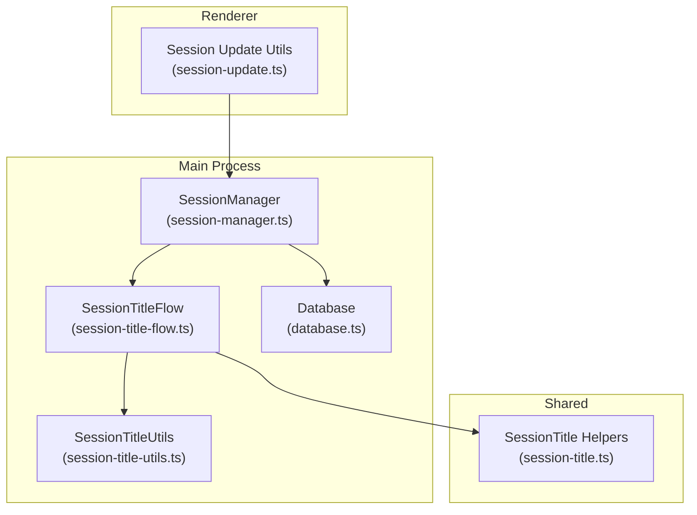
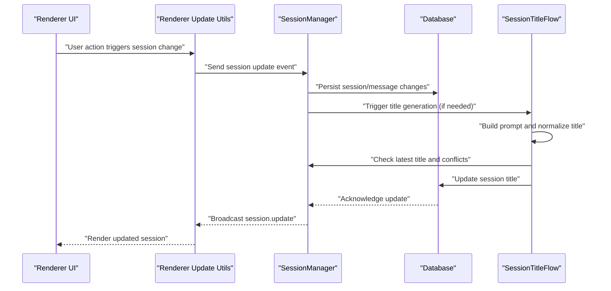
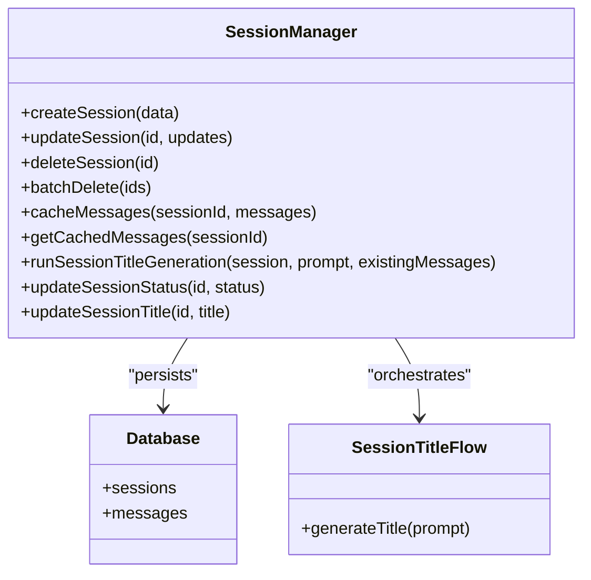
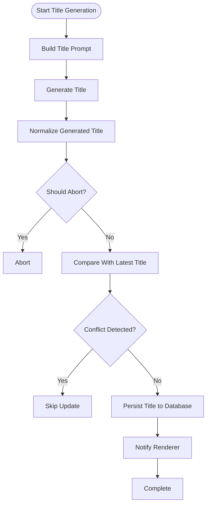
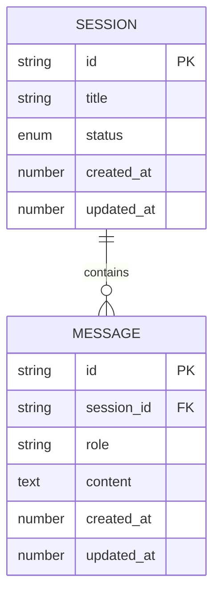
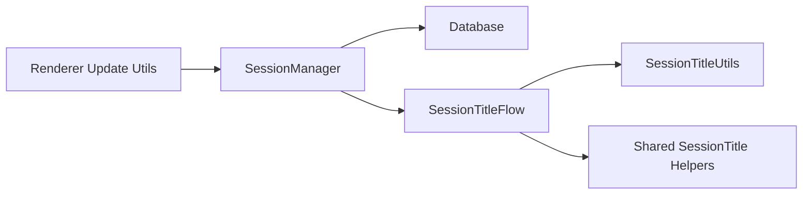

# Session Management

<cite>
**Referenced Files in This Document**
- [session-manager.ts](file://src/main/session/session-manager.ts)
- [session-title-flow.ts](file://src/main/session/session-title-flow.ts)
- [session-title-utils.ts](file://src/main/session/session-title-utils.ts)
- [session-title.ts](file://src/shared/session-title.ts)
- [database.ts](file://src/main/db/database.ts)
- [session-update.ts](file://src/renderer/utils/session-update.ts)
- [nav-server-session-id-validation.test.ts](file://tests/nav-server-session-id-validation.test.ts)
- [session-manager-crud.test.ts](file://tests/session-manager-crud.test.ts)
- [session-manager-message-cache.test.ts](file://tests/session-manager-message-cache.test.ts)
- [session-manager-scheduled-title.test.ts](file://tests/session-manager-scheduled-title.test.ts)
- [session-title-flow.test.ts](file://tests/session-title-flow.test.ts)
- [session-title-defaults.test.ts](file://tests/session-title-defaults.test.ts)
- [session-title-utils.test.ts](file://tests/session-title-utils.test.ts)
</cite>

## Table of Contents

1. [Introduction](#introduction)
2. [Project Structure](#project-structure)
3. [Core Components](#core-components)
4. [Architecture Overview](#architecture-overview)
5. [Detailed Component Analysis](#detailed-component-analysis)
6. [Dependency Analysis](#dependency-analysis)
7. [Performance Considerations](#performance-considerations)
8. [Troubleshooting Guide](#troubleshooting-guide)
9. [Conclusion](#conclusion)
10. [Appendices](#appendices)

## Introduction

This document explains session management in Open Cowork, focusing on the conversation orchestration system, session persistence, automatic title generation, and history management. It covers the session lifecycle, message caching, recovery mechanisms, database schema for session storage, workspace path handling, session state synchronization, security considerations, data retention policies, and performance optimization for large conversation histories. Practical examples and troubleshooting guidance are included to help developers and operators manage sessions effectively.

## Project Structure

Open Cowork organizes session-related logic primarily under the main process session module and shared utilities. The renderer communicates session updates via IPC. Tests validate CRUD operations, message caching, scheduled title generation, and title normalization.

**Diagram sources**

- [session-manager.ts](file://src/main/session/session-manager.ts)
- [session-title-flow.ts](file://src/main/session/session-title-flow.ts)
- [session-title-utils.ts](file://src/main/session/session-title-utils.ts)
- [session-title.ts](file://src/shared/session-title.ts)
- [database.ts](file://src/main/db/database.ts)
- [session-update.ts](file://src/renderer/utils/session-update.ts)

**Section sources**

- [session-manager.ts](file://src/main/session/session-manager.ts)
- [session-title-flow.ts](file://src/main/session/session-title-flow.ts)
- [session-title-utils.ts](file://src/main/session/session-title-utils.ts)
- [session-title.ts](file://src/shared/session-title.ts)
- [database.ts](file://src/main/db/database.ts)
- [session-update.ts](file://src/renderer/utils/session-update.ts)

## Core Components

- SessionManager: Orchestrates session lifecycle, message caching, persistence, and automatic title generation. It coordinates with the database and renderer for state synchronization.
- SessionTitleFlow: Implements the automatic title generation pipeline, including prompt construction, generation, normalization, conflict checks, and updates.
- SessionTitleUtils: Provides utilities for generating normalized titles and default title derivation from prompts.
- Database: Defines the persistent schema for sessions and messages, including indexing and constraints.
- Shared SessionTitle Helpers: Supplies prompt builders and default title logic used across flows.
- Renderer Session Update Utilities: Handles renderer-side updates and event dispatch for UI synchronization.

Key responsibilities:

- Lifecycle: creation, updates, deletion, and batch operations.
- Persistence: storing sessions and messages with timestamps and status.
- Title generation: automated, conflict-aware, and throttled updates.
- History management: message caching and retrieval for efficient UI rendering.
- Recovery: abort tokens and timeout guards to prevent stale updates.

**Section sources**

- [session-manager.ts](file://src/main/session/session-manager.ts)
- [session-title-flow.ts](file://src/main/session/session-title-flow.ts)
- [session-title-utils.ts](file://src/main/session/session-title-utils.ts)
- [session-title.ts](file://src/shared/session-title.ts)
- [database.ts](file://src/main/db/database.ts)
- [session-update.ts](file://src/renderer/utils/session-update.ts)

## Architecture Overview

The session subsystem integrates the main process, database, and renderer. The SessionManager manages state transitions and delegates title generation to SessionTitleFlow, which uses SessionTitleUtils and shared helpers. Renderer utilities propagate updates to the UI.

**Diagram sources**

- [session-manager.ts](file://src/main/session/session-manager.ts)
- [session-title-flow.ts](file://src/main/session/session-title-flow.ts)
- [session-update.ts](file://src/renderer/utils/session-update.ts)
- [database.ts](file://src/main/db/database.ts)

## Detailed Component Analysis

### SessionManager

Responsibilities:

- Session lifecycle: create, update, delete, batch delete.
- Message caching: maintain in-memory cache for efficient rendering and navigation.
- Persistence: write/read sessions and messages to/from the database.
- Status updates: broadcast status changes to the renderer.
- Automatic title generation: trigger, abort, and update titles with conflict checks.
- Concurrency control: per-session tokens to abort stale generations.

Key behaviors:

- Title generation runs with a timeout guard and abort checks to avoid updating deleted or superseded sessions.
- Attempts are tracked to prevent repeated attempts for the same session.
- Renderer notifications are sent for session.status and session.update events.

**Diagram sources**

- [session-manager.ts](file://src/main/session/session-manager.ts)
- [database.ts](file://src/main/db/database.ts)
- [session-title-flow.ts](file://src/main/session/session-title-flow.ts)

**Section sources**

- [session-manager.ts](file://src/main/session/session-manager.ts)

### SessionTitleFlow

Responsibilities:

- Build a title prompt from the initial user prompt.
- Generate a normalized title using external generation and normalization steps.
- Check for abort conditions and latest title changes to avoid conflicts.
- Update the session title in the database and notify the renderer.

**Diagram sources**

- [session-title-flow.ts](file://src/main/session/session-title-flow.ts)
- [session-title-utils.ts](file://src/main/session/session-title-utils.ts)
- [session-title.ts](file://src/shared/session-title.ts)

**Section sources**

- [session-title-flow.ts](file://src/main/session/session-title-flow.ts)
- [session-title-utils.ts](file://src/main/session/session-title-utils.ts)
- [session-title.ts](file://src/shared/session-title.ts)

### SessionTitleUtils

Responsibilities:

- Provide normalized titles from raw LLM outputs.
- Derive default titles from prompts when no generation occurs.
- Support conflict detection by comparing against the latest stored title.

**Section sources**

- [session-title-utils.ts](file://src/main/session/session-title-utils.ts)
- [session-title.ts](file://src/shared/session-title.ts)

### Database Schema for Sessions and Messages

The database defines the persistent schema for sessions and messages. Typical fields include identifiers, content, roles, timestamps, and status. Indexes and constraints ensure fast queries and data integrity.

**Diagram sources**

- [database.ts](file://src/main/db/database.ts)

**Section sources**

- [database.ts](file://src/main/db/database.ts)

### Renderer Session Update Utilities

The renderer utilities listen for session.update and session.status events and update the UI accordingly. They ensure the UI reflects the latest session state without blocking the main thread.

**Section sources**

- [session-update.ts](file://src/renderer/utils/session-update.ts)

## Dependency Analysis

- SessionManager depends on Database for persistence and on SessionTitleFlow for title generation.
- SessionTitleFlow depends on SessionTitleUtils and shared helpers for prompt building and normalization.
- Renderer utilities depend on SessionManager events to synchronize UI state.

**Diagram sources**

- [session-manager.ts](file://src/main/session/session-manager.ts)
- [session-title-flow.ts](file://src/main/session/session-title-flow.ts)
- [session-title-utils.ts](file://src/main/session/session-title-utils.ts)
- [session-title.ts](file://src/shared/session-title.ts)
- [session-update.ts](file://src/renderer/utils/session-update.ts)
- [database.ts](file://src/main/db/database.ts)

**Section sources**

- [session-manager.ts](file://src/main/session/session-manager.ts)
- [session-title-flow.ts](file://src/main/session/session-title-flow.ts)
- [session-title-utils.ts](file://src/main/session/session-title-utils.ts)
- [session-title.ts](file://src/shared/session-title.ts)
- [session-update.ts](file://src/renderer/utils/session-update.ts)
- [database.ts](file://src/main/db/database.ts)

## Performance Considerations

- Message caching: Maintain an in-memory cache keyed by session ID to reduce database reads during UI rendering and navigation.
- Batch operations: Use batch delete for bulk cleanup to minimize transaction overhead.
- Title generation timeouts: Apply timeouts to prevent long-running title generation from blocking the main thread.
- Conflict checks: Avoid redundant updates by comparing with the latest stored title before persisting.
- Indexing: Ensure database indexes on frequently queried fields (e.g., session_id, created_at) to optimize lookups.
- Large histories: Paginate or limit message retrieval for very large conversations to keep UI responsive.

[No sources needed since this section provides general guidance]

## Troubleshooting Guide

Common issues and resolutions:

- Session not found: Verify session existence before attempting updates. Use abort checks to prevent stale updates.
- Title conflicts: If another process changes the title concurrently, skip updates and rely on the latest stored value.
- Timeout errors: Increase timeout thresholds or reduce prompt complexity for title generation.
- Stale updates: Ensure abort tokens are checked before persisting changes to avoid overwriting newer titles.
- Database corruption: Validate session IDs and use recovery procedures to rebuild histories from persisted messages.

Validation references:

- Session ID validation tests ensure robustness against malformed IDs.
- CRUD and message cache tests validate persistence and retrieval correctness.
- Scheduled title tests confirm reliable title generation scheduling.

**Section sources**

- [nav-server-session-id-validation.test.ts](file://tests/nav-server-session-id-validation.test.ts)
- [session-manager-crud.test.ts](file://tests/session-manager-crud.test.ts)
- [session-manager-message-cache.test.ts](file://tests/session-manager-message-cache.test.ts)
- [session-manager-scheduled-title.test.ts](file://tests/session-manager-scheduled-title.test.ts)

## Conclusion

Open Cowork’s session management system provides a robust foundation for conversation orchestration, persistence, and automatic title generation. By leveraging message caching, conflict-aware updates, and strict abort controls, it ensures reliability and performance even with large conversation histories. The modular design enables customization of title generation logic while maintaining strong data integrity and secure state synchronization.

[No sources needed since this section summarizes without analyzing specific files]

## Appendices

### Practical Examples

- Creating a new session:
  - Use the session manager to create a session with initial metadata and status.
  - Persist messages incrementally as they arrive.
  - Trigger title generation after the first user message.

- Managing session conflicts:
  - Before updating a session title, fetch the latest stored title and compare.
  - If the title changed, skip the update to avoid overwriting newer content.

- Implementing custom title generation logic:
  - Extend the title generation pipeline by customizing the prompt builder and normalization steps.
  - Add retry logic and fallback defaults when generation fails.

- Handling session recovery:
  - On startup, rebuild session histories from persisted messages.
  - Validate session IDs and prune orphaned entries.

**Section sources**

- [session-manager.ts](file://src/main/session/session-manager.ts)
- [session-title-flow.ts](file://src/main/session/session-title-flow.ts)
- [session-title-utils.ts](file://src/main/session/session-title-utils.ts)
- [session-title.ts](file://src/shared/session-title.ts)

### Security and Data Retention

- Security: Validate and sanitize prompts and titles. Enforce abort checks to prevent race conditions.
- Data retention: Implement policies to archive or purge old sessions and messages based on organizational needs. Use batch operations for efficient cleanup.

[No sources needed since this section provides general guidance]
