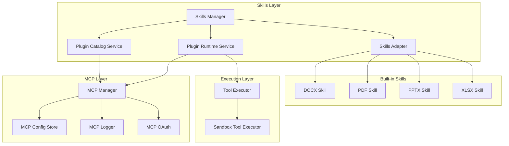
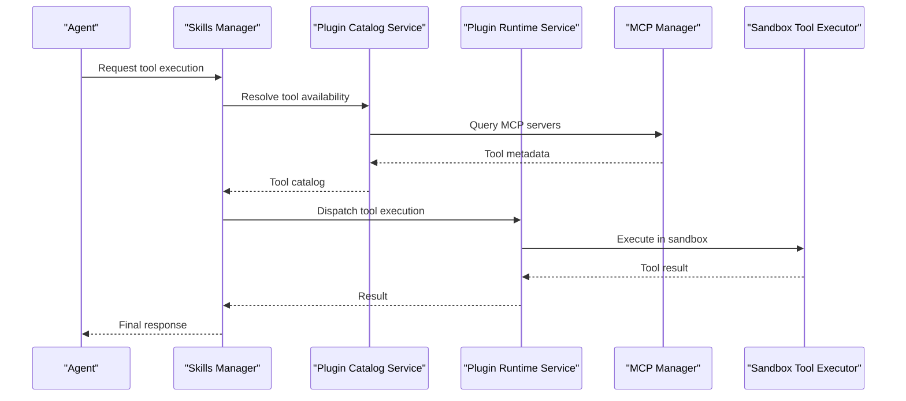
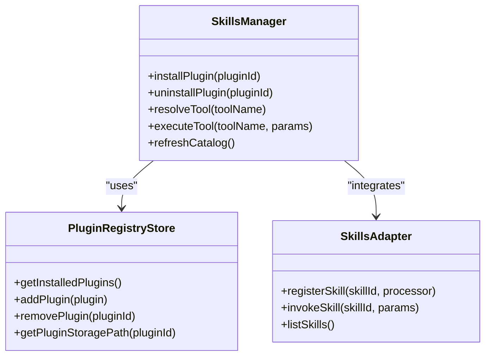
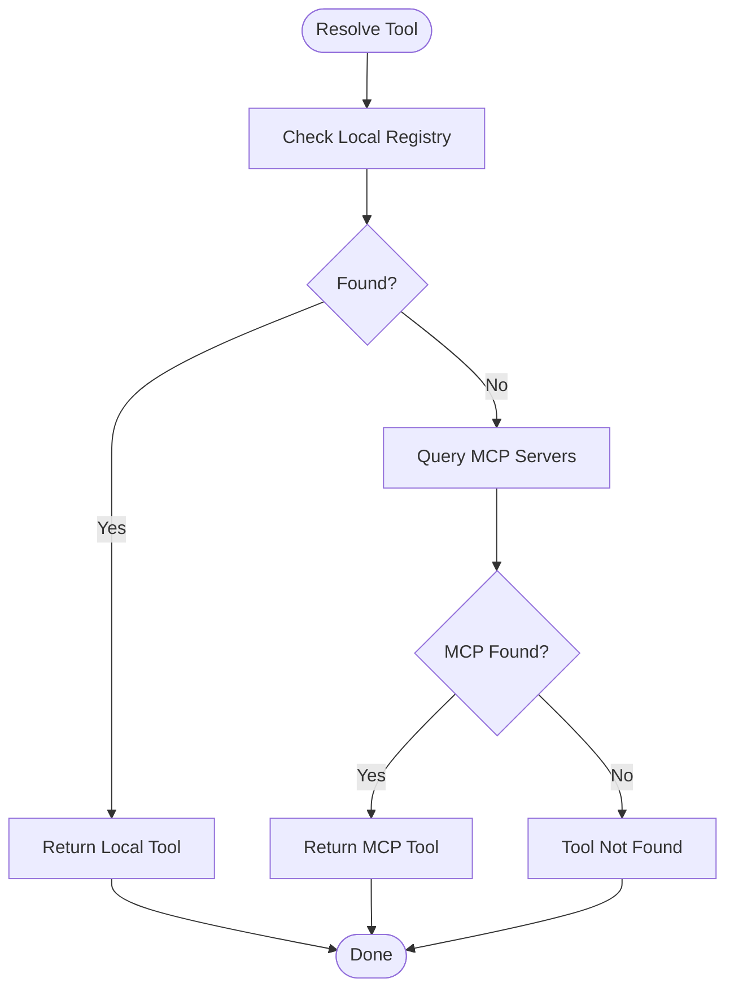
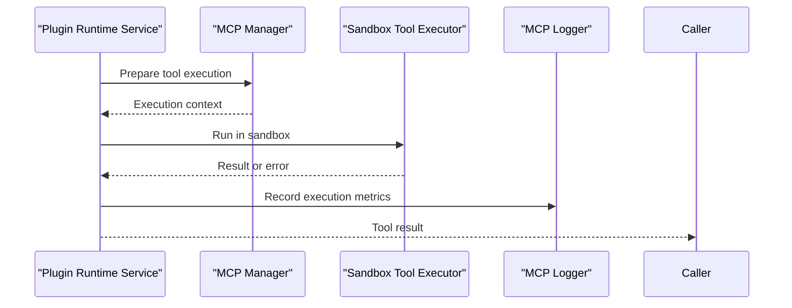
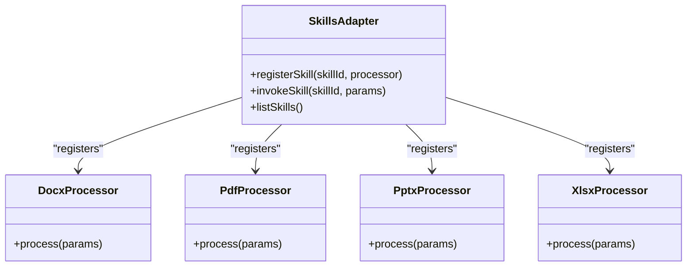
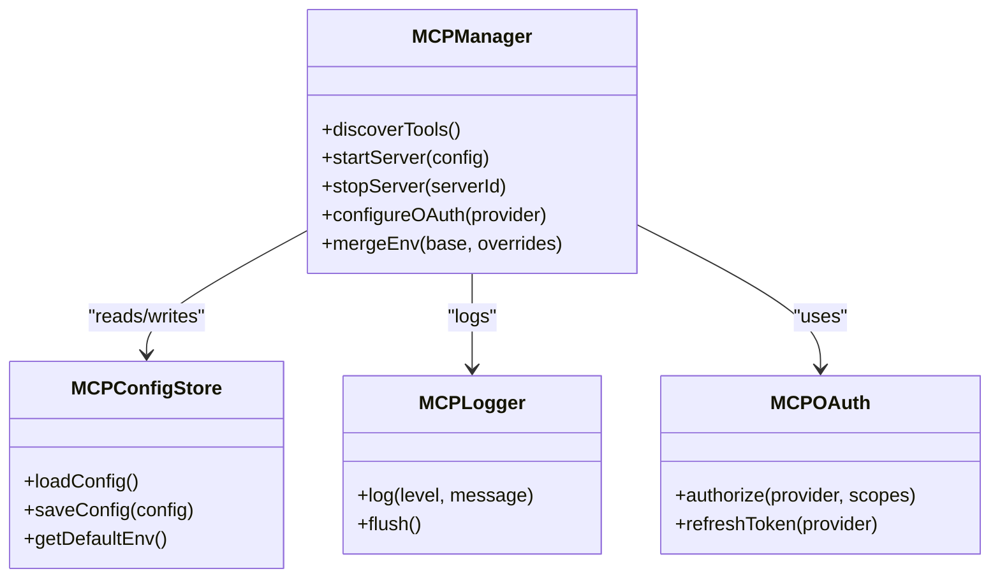
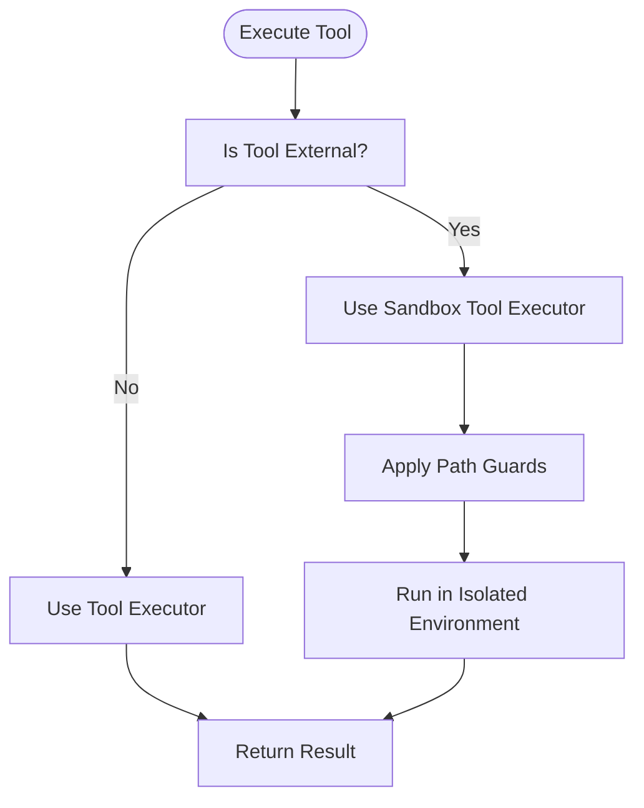
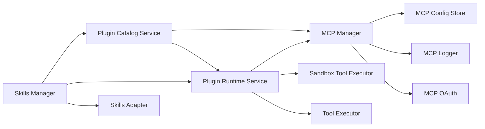

# Skills and Tools System

<cite>
**Referenced Files in This Document**
- [skills-manager.ts](file://src/main/skills/skills-manager.ts)
- [plugin-catalog-service.ts](file://src/main/skills/plugin-catalog-service.ts)
- [plugin-runtime-service.ts](file://src/main/skills/plugin-runtime-service.ts)
- [plugin-registry-store.ts](file://src/main/skills/plugin-registry-store.ts)
- [skills-adapter.ts](file://src/main/skills/skills-adapter.ts)
- [mcp-manager.ts](file://src/main/mcp/mcp-manager.ts)
- [mcp-config-store.ts](file://src/main/mcp/mcp-config-store.ts)
- [mcp-logger.ts](file://src/main/mcp/mcp-logger.ts)
- [mcp-oauth.ts](file://src/main/mcp/mcp-oauth.ts)
- [tool-executor.ts](file://src/main/tools/tool-executor.ts)
- [sandbox-tool-executor.ts](file://src/main/tools/sandbox-tool-executor.ts)
- [docx/SKILL.md](file://.claude/skills/docx/SKILL.md)
- [pdf/SKILL.md](file://.claude/skills/pdf/SKILL.md)
- [pptx/SKILL.md](file://.claude/skills/pptx/SKILL.md)
- [xlsx/SKILL.md](file://.claude/skills/xlsx/SKILL.md)
- [skill-creator/SKILL.md](file://.claude/skills/skill-creator/SKILL.md)
- [plugin-catalog-service.test.ts](file://tests/skills/plugin-catalog-service.test.ts)
- [plugin-runtime-service.test.ts](file://tests/skills/plugin-runtime-service.test.ts)
- [skills-manager-plugin-install.test.ts](file://tests/skills/skills-manager-plugin-install.test.ts)
- [plugin-catalog-dev-impl.test.ts](file://tests/plugin-catalog-dev-impl.test.ts)
</cite>

## Table of Contents

1. [Introduction](#introduction)
2. [Project Structure](#project-structure)
3. [Core Components](#core-components)
4. [Architecture Overview](#architecture-overview)
5. [Detailed Component Analysis](#detailed-component-analysis)
6. [Dependency Analysis](#dependency-analysis)
7. [Performance Considerations](#performance-considerations)
8. [Troubleshooting Guide](#troubleshooting-guide)
9. [Conclusion](#conclusion)
10. [Appendices](#appendices)

## Introduction

Open Cowork's skills and tools system enables dynamic, extensible document processing and external tool integration. It provides:

- Built-in skills for DOCX, PDF, PPTX, and XLSX processing
- MCP-based tool discovery and execution
- Plugin management via a catalog and runtime services
- Sandboxed execution for security and isolation
- Developer-friendly tool creation and packaging workflows

This document explains the system architecture, implementation patterns, and operational guidance for using and extending the skills and tools framework.

## Project Structure

The skills and tools system spans several modules:

- Skills Manager: orchestrates plugin lifecycle and tool resolution
- Plugin Catalog Service: discovers and catalogs available plugins
- Plugin Runtime Service: executes plugin-provided tools
- MCP Integration: manages MCP servers and tool discovery
- Tool Executors: execute tools inside sandboxed environments
- Built-in Skills: specialized processors for office documents and spreadsheets

**Diagram sources**

- [skills-manager.ts](file://src/main/skills/skills-manager.ts)
- [plugin-catalog-service.ts](file://src/main/skills/plugin-catalog-service.ts)
- [plugin-runtime-service.ts](file://src/main/skills/plugin-runtime-service.ts)
- [skills-adapter.ts](file://src/main/skills/skills-adapter.ts)
- [mcp-manager.ts](file://src/main/mcp/mcp-manager.ts)
- [mcp-config-store.ts](file://src/main/mcp/mcp-config-store.ts)
- [mcp-logger.ts](file://src/main/mcp/mcp-logger.ts)
- [mcp-oauth.ts](file://src/main/mcp/mcp-oauth.ts)
- [tool-executor.ts](file://src/main/tools/tool-executor.ts)
- [sandbox-tool-executor.ts](file://src/main/tools/sandbox-tool-executor.ts)

**Section sources**

- [skills-manager.ts](file://src/main/skills/skills-manager.ts)
- [plugin-catalog-service.ts](file://src/main/skills/plugin-catalog-service.ts)
- [plugin-runtime-service.ts](file://src/main/skills/plugin-runtime-service.ts)
- [mcp-manager.ts](file://src/main/mcp/mcp-manager.ts)

## Core Components

- Skills Manager: central coordinator for plugin installation, catalog synchronization, and tool resolution
- Plugin Catalog Service: queries MCP servers and local registries to discover available tools
- Plugin Runtime Service: executes tools with proper sandboxing and resource management
- Skills Adapter: bridges built-in document processors to the unified skills interface
- MCP Manager: manages MCP server lifecycles, configuration, logging, and OAuth flows
- Tool Executors: provide non-sandboxed and sandboxed execution contexts

Key responsibilities:

- Dynamic loading of plugins and built-in skills
- Secure execution via sandboxed tool executor
- Unified tool discovery and invocation across MCP and local skills
- Persistent plugin registry and storage management

**Section sources**

- [skills-manager.ts](file://src/main/skills/skills-manager.ts)
- [plugin-catalog-service.ts](file://src/main/skills/plugin-catalog-service.ts)
- [plugin-runtime-service.ts](file://src/main/skills/plugin-runtime-service.ts)
- [skills-adapter.ts](file://src/main/skills/skills-adapter.ts)
- [mcp-manager.ts](file://src/main/mcp/mcp-manager.ts)
- [tool-executor.ts](file://src/main/tools/tool-executor.ts)
- [sandbox-tool-executor.ts](file://src/main/tools/sandbox-tool-executor.ts)

## Architecture Overview

The system integrates three pillars:

- Skills Manager coordinates plugin lifecycle and tool resolution
- Plugin Catalog Service discovers tools from MCP servers and local sources
- Plugin Runtime Service executes tools with sandboxing and resource controls

**Diagram sources**

- [skills-manager.ts](file://src/main/skills/skills-manager.ts)
- [plugin-catalog-service.ts](file://src/main/skills/plugin-catalog-service.ts)
- [plugin-runtime-service.ts](file://src/main/skills/plugin-runtime-service.ts)
- [mcp-manager.ts](file://src/main/mcp/mcp-manager.ts)
- [sandbox-tool-executor.ts](file://src/main/tools/sandbox-tool-executor.ts)

## Detailed Component Analysis

### Skills Manager

The Skills Manager is the central orchestrator responsible for:

- Installing and managing plugins
- Resolving tools across MCP and built-in skills
- Coordinating with the plugin registry store
- Integrating with the skills adapter for document processors

**Diagram sources**

- [skills-manager.ts](file://src/main/skills/skills-manager.ts)
- [plugin-registry-store.ts](file://src/main/skills/plugin-registry-store.ts)
- [skills-adapter.ts](file://src/main/skills/skills-adapter.ts)

**Section sources**

- [skills-manager.ts](file://src/main/skills/skills-manager.ts)
- [plugin-registry-store.ts](file://src/main/skills/plugin-registry-store.ts)

### Plugin Catalog Service

The Plugin Catalog Service discovers tools from:

- MCP servers (remote discovery)
- Local plugin registry (installed plugins)
- Built-in skills (document processors)

It aggregates tool metadata and exposes a unified interface for tool resolution.

**Diagram sources**

- [plugin-catalog-service.ts](file://src/main/skills/plugin-catalog-service.ts)
- [mcp-manager.ts](file://src/main/mcp/mcp-manager.ts)

**Section sources**

- [plugin-catalog-service.ts](file://src/main/skills/plugin-catalog-service.ts)

### Plugin Runtime Service

The Plugin Runtime Service executes tools with:

- Resource limits and timeouts
- Sandboxed execution via Sandbox Tool Executor
- Proper error handling and logging

**Diagram sources**

- [plugin-runtime-service.ts](file://src/main/skills/plugin-runtime-service.ts)
- [mcp-manager.ts](file://src/main/mcp/mcp-manager.ts)
- [sandbox-tool-executor.ts](file://src/main/tools/sandbox-tool-executor.ts)
- [mcp-logger.ts](file://src/main/mcp/mcp-logger.ts)

**Section sources**

- [plugin-runtime-service.ts](file://src/main/skills/plugin-runtime-service.ts)
- [sandbox-tool-executor.ts](file://src/main/tools/sandbox-tool-executor.ts)

### Skills Adapter and Built-in Skills

The Skills Adapter registers and invokes built-in document processors:

- DOCX: document parsing, validation, and manipulation
- PDF: form extraction, annotation handling, and image conversion
- PPTX: slide inventory, rearrangement, and thumbnail generation
- XLSX: spreadsheet recalculation and data processing

**Diagram sources**

- [skills-adapter.ts](file://src/main/skills/skills-adapter.ts)
- [docx/SKILL.md](file://.claude/skills/docx/SKILL.md)
- [pdf/SKILL.md](file://.claude/skills/pdf/SKILL.md)
- [pptx/SKILL.md](file://.claude/skills/pptx/SKILL.md)
- [xlsx/SKILL.md](file://.claude/skills/xlsx/SKILL.md)

**Section sources**

- [skills-adapter.ts](file://src/main/skills/skills-adapter.ts)
- [docx/SKILL.md](file://.claude/skills/docx/SKILL.md)
- [pdf/SKILL.md](file://.claude/skills/pdf/SKILL.md)
- [pptx/SKILL.md](file://.claude/skills/pptx/SKILL.md)
- [xlsx/SKILL.md](file://.claude/skills/xlsx/SKILL.md)

### MCP Integration

The MCP Manager handles:

- Server lifecycle and configuration
- OAuth flows for secure tool access
- Logging and diagnostics
- Environment variable merging and streamable HTTP support

**Diagram sources**

- [mcp-manager.ts](file://src/main/mcp/mcp-manager.ts)
- [mcp-config-store.ts](file://src/main/mcp/mcp-config-store.ts)
- [mcp-logger.ts](file://src/main/mcp/mcp-logger.ts)
- [mcp-oauth.ts](file://src/main/mcp/mcp-oauth.ts)

**Section sources**

- [mcp-manager.ts](file://src/main/mcp/mcp-manager.ts)
- [mcp-config-store.ts](file://src/main/mcp/mcp-config-store.ts)
- [mcp-logger.ts](file://src/main/mcp/mcp-logger.ts)
- [mcp-oauth.ts](file://src/main/mcp/mcp-oauth.ts)

### Tool Execution and Sandboxing

Tool execution follows a secure path:

- Non-sandboxed executor for trusted operations
- Sandboxed executor for untrusted or external tools
- Path containment and resource guards

**Diagram sources**

- [tool-executor.ts](file://src/main/tools/tool-executor.ts)
- [sandbox-tool-executor.ts](file://src/main/tools/sandbox-tool-executor.ts)

**Section sources**

- [tool-executor.ts](file://src/main/tools/tool-executor.ts)
- [sandbox-tool-executor.ts](file://src/main/tools/sandbox-tool-executor.ts)

## Dependency Analysis

The system exhibits layered dependencies:

- Skills Manager depends on Plugin Catalog Service, Plugin Runtime Service, and Skills Adapter
- Plugin Catalog Service depends on MCP Manager and Plugin Registry Store
- Plugin Runtime Service depends on MCP Manager and Sandbox Tool Executor
- MCP Manager depends on Config Store, Logger, and OAuth modules
- Tool Executors depend on Sandbox infrastructure

**Diagram sources**

- [skills-manager.ts](file://src/main/skills/skills-manager.ts)
- [plugin-catalog-service.ts](file://src/main/skills/plugin-catalog-service.ts)
- [plugin-runtime-service.ts](file://src/main/skills/plugin-runtime-service.ts)
- [mcp-manager.ts](file://src/main/mcp/mcp-manager.ts)
- [mcp-config-store.ts](file://src/main/mcp/mcp-config-store.ts)
- [mcp-logger.ts](file://src/main/mcp/mcp-logger.ts)
- [mcp-oauth.ts](file://src/main/mcp/mcp-oauth.ts)
- [tool-executor.ts](file://src/main/tools/tool-executor.ts)
- [sandbox-tool-executor.ts](file://src/main/tools/sandbox-tool-executor.ts)

**Section sources**

- [skills-manager.ts](file://src/main/skills/skills-manager.ts)
- [plugin-catalog-service.ts](file://src/main/skills/plugin-catalog-service.ts)
- [plugin-runtime-service.ts](file://src/main/skills/plugin-runtime-service.ts)
- [mcp-manager.ts](file://src/main/mcp/mcp-manager.ts)

## Performance Considerations

- Tool caching: reuse results for repeated tool invocations when safe
- Asynchronous execution: run long-running tools concurrently with proper resource limits
- Sandboxing overhead: minimize sandbox initialization costs by reusing containers where feasible
- MCP server pooling: maintain a small pool of MCP servers to reduce startup latency
- Built-in skills: leverage optimized libraries for document processing to reduce CPU and memory usage

## Troubleshooting Guide

Common issues and resolutions:

- Tool not found: verify plugin installation and MCP server connectivity
- Execution failures: inspect MCP logs and sandbox executor diagnostics
- Permission errors: review path containment and sandbox permissions
- Performance bottlenecks: profile tool execution and optimize resource limits

Relevant test coverage:

- Plugin catalog service behavior under various scenarios
- Plugin runtime service execution and error handling
- Skills manager plugin install/uninstall flows
- Development implementation validations

**Section sources**

- [plugin-catalog-service.test.ts](file://tests/skills/plugin-catalog-service.test.ts)
- [plugin-runtime-service.test.ts](file://tests/skills/plugin-runtime-service.test.ts)
- [skills-manager-plugin-install.test.ts](file://tests/skills/skills-manager-plugin-install.test.ts)
- [plugin-catalog-dev-impl.test.ts](file://tests/plugin-catalog-dev-impl.test.ts)

## Conclusion

Open Cowork’s skills and tools system combines dynamic plugin management, MCP-based discovery, and sandboxed execution to deliver a secure, extensible platform for document processing and tool integration. The modular architecture supports both built-in capabilities and community-driven plugins, enabling flexible workflows tailored to diverse use cases.

## Appendices

### Built-in Skills Reference

- DOCX: document parsing, validation, and manipulation
- PDF: form extraction, annotation handling, and image conversion
- PPTX: slide inventory, rearrangement, and thumbnail generation
- XLSX: spreadsheet recalculation and data processing

**Section sources**

- [docx/SKILL.md](file://.claude/skills/docx/SKILL.md)
- [pdf/SKILL.md](file://.claude/skills/pdf/SKILL.md)
- [pptx/SKILL.md](file://.claude/skills/pptx/SKILL.md)
- [xlsx/SKILL.md](file://.claude/skills/xlsx/SKILL.md)

### MCP Protocol Integration

- Discovery: query MCP servers for available tools
- Authentication: OAuth flows for secure access
- Logging: structured logs for diagnostics
- Environment: merged environment variables for tool execution

**Section sources**

- [mcp-manager.ts](file://src/main/mcp/mcp-manager.ts)
- [mcp-oauth.ts](file://src/main/mcp/mcp-oauth.ts)
- [mcp-logger.ts](file://src/main/mcp/mcp-logger.ts)

### Plugin Management Workflow

- Install plugins via Skills Manager
- Discover tools through Plugin Catalog Service
- Execute tools via Plugin Runtime Service
- Persist plugin state using Plugin Registry Store

**Section sources**

- [skills-manager.ts](file://src/main/skills/skills-manager.ts)
- [plugin-catalog-service.ts](file://src/main/skills/plugin-catalog-service.ts)
- [plugin-runtime-service.ts](file://src/main/skills/plugin-runtime-service.ts)
- [plugin-registry-store.ts](file://src/main/skills/plugin-registry-store.ts)

### Custom Skill Creation

- Use the skill creator toolkit for scaffolding new skills
- Package and distribute skills for community use
- Follow best practices for tool naming, documentation, and testing

**Section sources**

- [skill-creator/SKILL.md](file://.claude/skills/skill-creator/SKILL.md)
