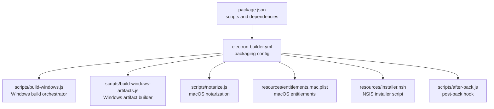
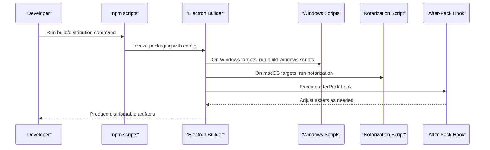
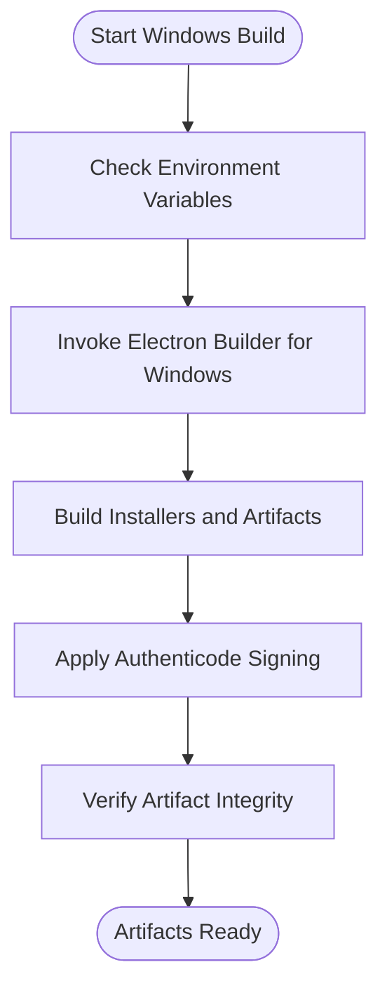
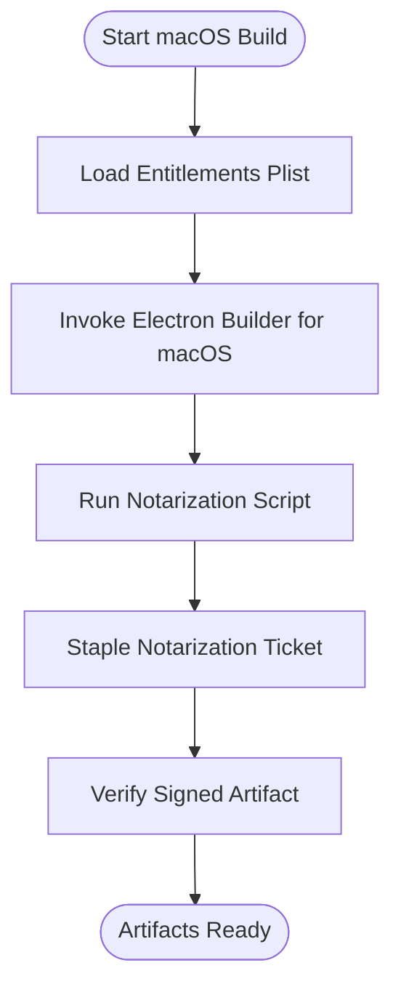
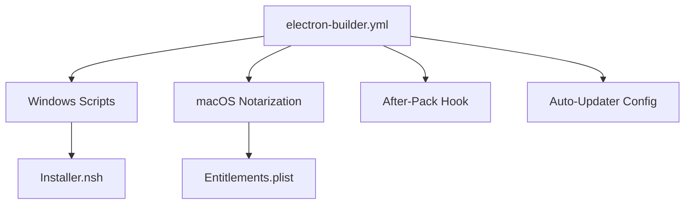

# Deployment & Distribution

<cite>
**Referenced Files in This Document**
- [electron-builder.yml](file://electron-builder.yml)
- [package.json](file://package.json)
- [scripts/build-windows.js](file://scripts/build-windows.js)
- [scripts/build-windows-artifacts.js](file://scripts/build-windows-artifacts.js)
- [scripts/notarize.js](file://scripts/notarize.js)
- [resources/entitlements.mac.plist](file://resources/entitlements.mac.plist)
- [resources/installer.nsh](file://resources/installer.nsh)
- [scripts/after-pack.js](file://scripts/after-pack.js)
- [README_zh.md](file://README_zh.md)
- [readme.md](file://readme.md)
</cite>

## Table of Contents

1. [Introduction](#introduction)
2. [Project Structure](#project-structure)
3. [Core Components](#core-components)
4. [Architecture Overview](#architecture-overview)
5. [Detailed Component Analysis](#detailed-component-analysis)
6. [Dependency Analysis](#dependency-analysis)
7. [Performance Considerations](#performance-considerations)
8. [Troubleshooting Guide](#troubleshooting-guide)
9. [Conclusion](#conclusion)
10. [Appendices](#appendices)

## Introduction

This document explains how to build, package, sign, and distribute Open Cowork across Windows, macOS, and Linux. It covers the Electron-based packaging configuration, asset bundling, code signing, notarization, and update mechanisms. It also documents distribution channels (Homebrew for macOS, direct downloads, and enterprise options), platform-specific packaging requirements, and troubleshooting guidance for common build and distribution issues.

## Project Structure

Open Cowork uses Electron Builder for cross-platform packaging and a set of Node scripts to orchestrate builds, signing, and notarization. The repository includes:

- Packaging configuration via electron-builder YAML
- Build scripts for Windows artifacts and packaging
- macOS entitlements and NSIS installer script
- Notarization automation for Apple platforms
- Post-packaging hook for asset adjustments

**Diagram sources**

- [electron-builder.yml](file://electron-builder.yml)
- [package.json](file://package.json)
- [scripts/build-windows.js](file://scripts/build-windows.js)
- [scripts/build-windows-artifacts.js](file://scripts/build-windows-artifacts.js)
- [scripts/notarize.js](file://scripts/notarize.js)
- [resources/entitlements.mac.plist](file://resources/entitlements.mac.plist)
- [resources/installer.nsh](file://resources/installer.nsh)
- [scripts/after-pack.js](file://scripts/after-pack.js)

**Section sources**

- [electron-builder.yml](file://electron-builder.yml)
- [package.json](file://package.json)

## Core Components

- Electron Builder configuration defines targets, icons, extra resources, and signing/notarization steps.
- Windows build scripts assemble artifacts and produce installers.
- macOS entitlements and notarization scripts handle hardened runtime and Apple notarization.
- Post-pack hook adjusts packaged assets for distribution consistency.
- Installer script configures NSIS-based installers on Windows.

**Section sources**

- [electron-builder.yml](file://electron-builder.yml)
- [scripts/build-windows.js](file://scripts/build-windows.js)
- [scripts/build-windows-artifacts.js](file://scripts/build-windows-artifacts.js)
- [scripts/notarize.js](file://scripts/notarize.js)
- [resources/entitlements.mac.plist](file://resources/entitlements.mac.plist)
- [resources/installer.nsh](file://resources/installer.nsh)
- [scripts/after-pack.js](file://scripts/after-pack.js)

## Architecture Overview

The build and distribution pipeline integrates Node scripts with Electron Builder to produce platform-specific packages. Signing and notarization are automated for macOS, while Windows uses Authenticode signing. After packaging, a post-pack hook ensures assets are correctly bundled.

**Diagram sources**

- [electron-builder.yml](file://electron-builder.yml)
- [scripts/build-windows.js](file://scripts/build-windows.js)
- [scripts/notarize.js](file://scripts/notarize.js)
- [scripts/after-pack.js](file://scripts/after-pack.js)

## Detailed Component Analysis

### Electron Builder Configuration

- Defines targets per OS, icon sets, extra resources, and post-pack processing.
- Specifies signing and notarization for macOS and Windows.
- Controls output directories and artifact naming.

Key areas to review:

- Targets and output configuration
- Extra resources and files included in bundles
- Code signing and notarization settings
- Post-pack hook integration

**Section sources**

- [electron-builder.yml](file://electron-builder.yml)

### Windows Build and Packaging

- Orchestrates Windows-specific build steps and artifact creation.
- Coordinates with Electron Builder to produce MSI/NSIS installers.
- Integrates with installer script for NSIS customization.

**Diagram sources**

- [scripts/build-windows.js](file://scripts/build-windows.js)
- [scripts/build-windows-artifacts.js](file://scripts/build-windows-artifacts.js)
- [resources/installer.nsh](file://resources/installer.nsh)

**Section sources**

- [scripts/build-windows.js](file://scripts/build-windows.js)
- [scripts/build-windows-artifacts.js](file://scripts/build-windows-artifacts.js)
- [resources/installer.nsh](file://resources/installer.nsh)

### macOS Packaging, Entitlements, and Notarization

- Hardened runtime enabled via entitlements plist.
- Notarization script handles Apple ID credentials and staple results.
- Post-pack hook ensures entitlements are applied during packaging.

**Diagram sources**

- [resources/entitlements.mac.plist](file://resources/entitlements.mac.plist)
- [scripts/notarize.js](file://scripts/notarize.js)
- [scripts/after-pack.js](file://scripts/after-pack.js)

**Section sources**

- [resources/entitlements.mac.plist](file://resources/entitlements.mac.plist)
- [scripts/notarize.js](file://scripts/notarize.js)
- [scripts/after-pack.js](file://scripts/after-pack.js)

### Post-Packaging Hook

- Runs after Electron Builder completes packaging.
- Adjusts assets or metadata to align with distribution requirements.

**Section sources**

- [scripts/after-pack.js](file://scripts/after-pack.js)

### Distribution Channels and Version Management

- Direct downloads: Platform-specific artifacts produced by Electron Builder.
- Homebrew (macOS): Submit a formula to the Homebrew repository referencing the downloadable artifact.
- Enterprise deployment: Provide signed artifacts and maintain version catalogs for internal distribution systems.

Note: Specific Homebrew formula content and enterprise catalog configurations are not present in the repository and must be prepared externally.

**Section sources**

- [electron-builder.yml](file://electron-builder.yml)

### Auto-Updater Implementation and Update Mechanism

- Electron Updater is configured via Electron Builder settings.
- Provide update server endpoints and signing verification for secure updates.
- Maintain version catalogs and signature verification for enterprise environments.

Note: Auto-updater configuration is defined in the packaging configuration and requires an external update server endpoint.

**Section sources**

- [electron-builder.yml](file://electron-builder.yml)

## Dependency Analysis

The build and distribution pipeline depends on:

- Electron Builder for packaging and target-specific outputs
- Platform-specific signing and notarization tools
- NSIS for Windows installer customization
- Post-pack hook for asset adjustments

**Diagram sources**

- [electron-builder.yml](file://electron-builder.yml)
- [scripts/build-windows.js](file://scripts/build-windows.js)
- [scripts/notarize.js](file://scripts/notarize.js)
- [resources/installer.nsh](file://resources/installer.nsh)
- [resources/entitlements.mac.plist](file://resources/entitlements.mac.plist)
- [scripts/after-pack.js](file://scripts/after-pack.js)

**Section sources**

- [electron-builder.yml](file://electron-builder.yml)
- [package.json](file://package.json)

## Performance Considerations

- Minimize extra resources included in bundles to reduce artifact size.
- Parallelize independent build tasks where possible.
- Cache signing certificates and notarization credentials securely to avoid repeated authentication overhead.

## Troubleshooting Guide

Common issues and resolutions:

- Certificate problems (Apple):
  - Verify Apple ID credentials and two-factor authentication settings.
  - Confirm hardened runtime entitlements match the app’s capabilities.
  - Re-run notarization stapling after successful submission.
- Platform-specific packaging failures:
  - Windows: Ensure Authenticode certificate and timestamp server are reachable.
  - macOS: Confirm entitlements plist path and permissions are correct.
- Update delivery challenges:
  - Validate update server endpoint and SSL/TLS configuration.
  - Ensure auto-updater is configured with the correct publish provider and secret key verification.

**Section sources**

- [scripts/notarize.js](file://scripts/notarize.js)
- [resources/entitlements.mac.plist](file://resources/entitlements.mac.plist)
- [electron-builder.yml](file://electron-builder.yml)

## Conclusion

Open Cowork’s distribution pipeline leverages Electron Builder with platform-specific scripts for Windows and macOS. Signing and notarization are automated, while post-packaging ensures consistent asset bundling. Distribute via direct downloads, Homebrew for macOS, and enterprise catalogs. Maintain secure update channels with verified signatures and robust error handling.

## Appendices

### Platform-Specific Packaging Requirements

- Windows:
  - Authenticode signing with timestamp server.
  - NSIS installer customization via installer script.
- macOS:
  - Hardened runtime entitlements.
  - Apple notarization and ticket stapling.
- Linux:
  - Review Electron Builder targets and repository-specific packaging notes.

**Section sources**

- [electron-builder.yml](file://electron-builder.yml)
- [resources/installer.nsh](file://resources/installer.nsh)
- [resources/entitlements.mac.plist](file://resources/entitlements.mac.plist)

### Enterprise Deployment Considerations

- Provide signed artifacts with version catalogs.
- Configure auto-updater endpoints with enterprise proxy and TLS policies.
- Support silent installation options via installer arguments where applicable.

**Section sources**

- [electron-builder.yml](file://electron-builder.yml)
