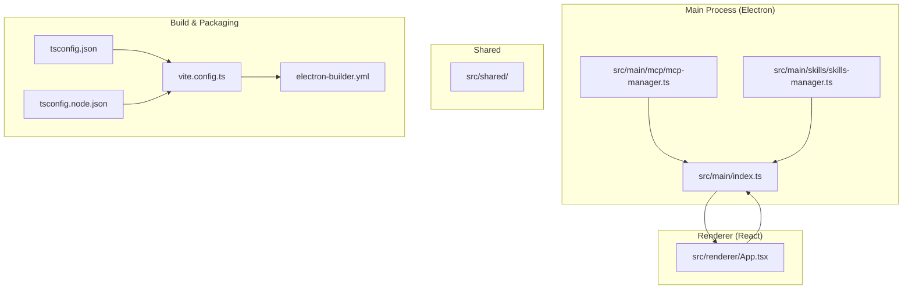
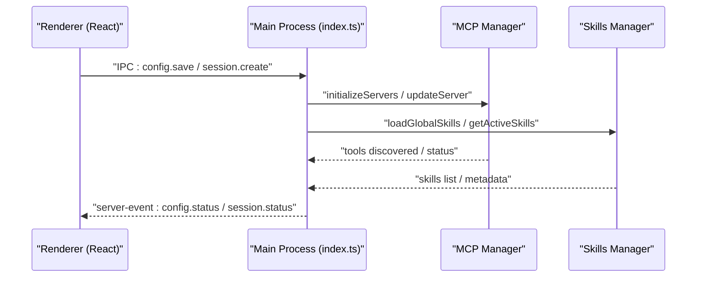
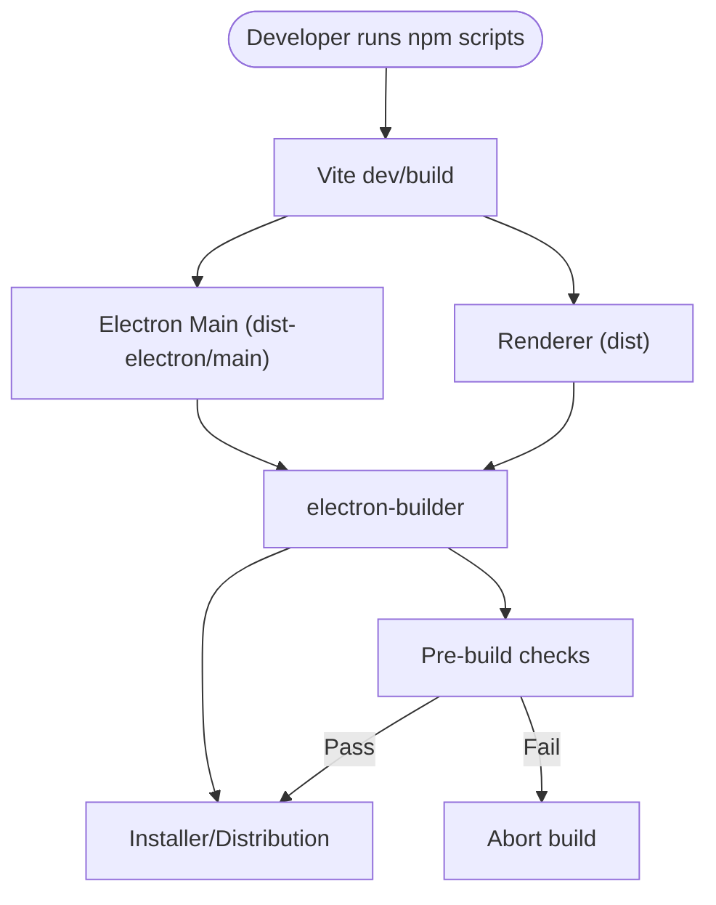
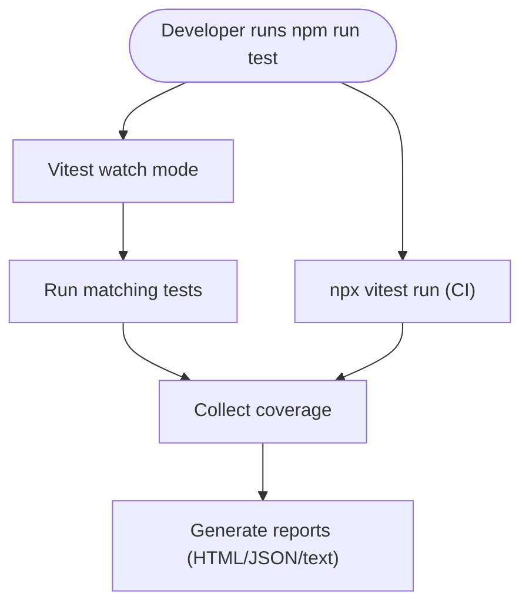
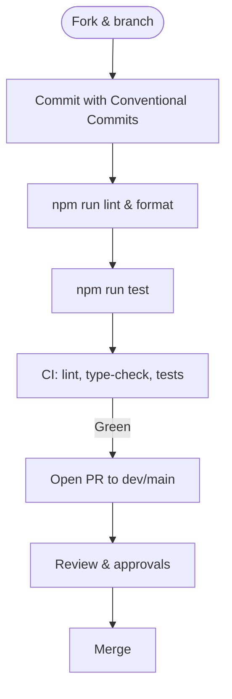
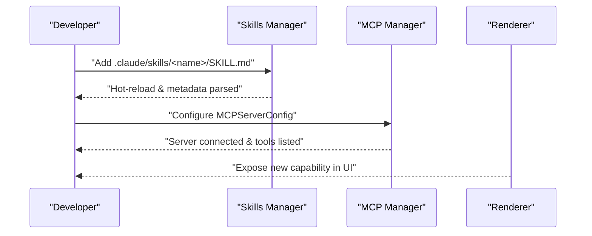
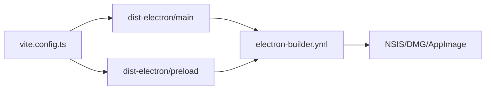

# Development Guide

<cite>
**Referenced Files in This Document**
- [package.json](file://package.json)
- [vite.config.ts](file://vite.config.ts)
- [tsconfig.json](file://tsconfig.json)
- [tsconfig.node.json](file://tsconfig.node.json)
- [electron-builder.yml](file://electron-builder.yml)
- [vitest.config.mts](file://vitest.config.mts)
- [.eslintrc.cjs](file://.eslintrc.cjs)
- [.prettierrc](file://.prettierrc)
- [.husky/pre-commit](file://.husky/pre-commit)
- [scripts/pre-build-check.js](file://scripts/pre-build-check.js)
- [CONTRIBUTING.md](file://CONTRIBUTING.md)
- [README.md](file://README.md)
- [src/main/index.ts](file://src/main/index.ts)
- [src/renderer/App.tsx](file://src/renderer/App.tsx)
- [src/main/mcp/mcp-manager.ts](file://src/main/mcp/mcp-manager.ts)
- [src/main/skills/skills-manager.ts](file://src/main/skills/skills-manager.ts)
</cite>

## Table of Contents

1. [Introduction](#introduction)
2. [Project Structure](#project-structure)
3. [Core Components](#core-components)
4. [Architecture Overview](#architecture-overview)
5. [Detailed Component Analysis](#detailed-component-analysis)
6. [Dependency Analysis](#dependency-analysis)
7. [Performance Considerations](#performance-considerations)
8. [Troubleshooting Guide](#troubleshooting-guide)
9. [Conclusion](#conclusion)
10. [Appendices](#appendices)

## Introduction

This development guide provides a comprehensive overview of the project’s conventions, build system, testing strategy, contribution workflow, and development practices. It is intended for contributors and maintainers to understand how the codebase is organized, how to develop safely and efficiently, and how to extend functionality while preserving backward compatibility.

## Project Structure

The repository follows a layered architecture with Electron main process, a React renderer, TypeScript strictness, and a modular feature layout. The main directories and responsibilities are:

- src/main: Electron main process, including agent orchestration, MCP management, skills, sandbox, session management, and integrations.
- src/renderer: React frontend with components, hooks, stores, i18n, and styles.
- src/shared: Shared utilities and types used across main and renderer.
- src/tests: Unit and integration tests mirroring the source structure.
- scripts: Build, packaging, and platform-specific preparation utilities.
- .claude/skills: Built-in skills library and developer tooling.
- website: VitePress documentation site.

**Diagram sources**

- [src/main/index.ts:1-200](file://src/main/index.ts#L1-L200)
- [src/main/mcp/mcp-manager.ts:1-120](file://src/main/mcp/mcp-manager.ts#L1-L120)
- [src/main/skills/skills-manager.ts:1-120](file://src/main/skills/skills-manager.ts#L1-L120)
- [src/renderer/App.tsx:1-120](file://src/renderer/App.tsx#L1-L120)
- [vite.config.ts:1-94](file://vite.config.ts#L1-L94)
- [electron-builder.yml:1-170](file://electron-builder.yml#L1-L170)
- [tsconfig.json:1-32](file://tsconfig.json#L1-L32)
- [tsconfig.node.json:1-16](file://tsconfig.node.json#L1-L16)

**Section sources**

- [README.md:214-273](file://README.md#L214-L273)
- [CONTRIBUTING.md:36-59](file://CONTRIBUTING.md#L36-L59)

## Core Components

- Electron main process entry initializes app lifecycle, IPC, window management, and integrates subsystems like MCP, skills, sandbox, and remote control.
- Renderer root component orchestrates routing between Welcome, Settings, and Chat views, and manages dialogs and panels.
- MCP manager handles server lifecycle, transport selection (stdio, SSE, Streamable HTTP), OAuth flows, and tool discovery.
- Skills manager discovers built-in and user-defined skills, supports hot reload, and manages MCP server lifecycles for skills.

**Section sources**

- [src/main/index.ts:1-200](file://src/main/index.ts#L1-L200)
- [src/renderer/App.tsx:1-120](file://src/renderer/App.tsx#L1-L120)
- [src/main/mcp/mcp-manager.ts:1-120](file://src/main/mcp/mcp-manager.ts#L1-L120)
- [src/main/skills/skills-manager.ts:1-120](file://src/main/skills/skills-manager.ts#L1-L120)

## Architecture Overview

The system uses Electron with a React renderer. The main process coordinates IPC, sandboxing, MCP servers, and skills. The renderer renders UI, manages state, and communicates with the main process via typed IPC.

**Diagram sources**

- [src/main/index.ts:786-880](file://src/main/index.ts#L786-L880)
- [src/main/mcp/mcp-manager.ts:526-585](file://src/main/mcp/mcp-manager.ts#L526-L585)
- [src/main/skills/skills-manager.ts:491-514](file://src/main/skills/skills-manager.ts#L491-L514)

## Detailed Component Analysis

### Build System and Packaging

- Vite configuration:
  - React plugin, Electron plugin, aliases for @, @main, @renderer.
  - Main process externalizes Node built-ins and large CJS dependencies; preload externalizes Electron.
  - Output directories: dist for renderer, dist-electron for main/preload.
  - Ignored watch paths to speed up dev.
- TypeScript:
  - Strict mode, ESNext modules, bundler resolution, JSX transform, path aliases.
  - Separate tsconfig.node for Vite config typing.
- Electron Builder:
  - Cross-platform targets (NSIS/mac DMG/AppImage), extraResources for MCP, Node, Python, tools, and skills.
  - Asar unpack rules for native modules and buffer utilities.
  - Post-pack and post-all-artifact hooks.
- Scripts:
  - Pre-build validation checks presence of required artifacts and resources.
  - Platform-specific preparation and bundling steps.

**Diagram sources**

- [vite.config.ts:1-94](file://vite.config.ts#L1-L94)
- [electron-builder.yml:1-170](file://electron-builder.yml#L1-L170)
- [scripts/pre-build-check.js:1-210](file://scripts/pre-build-check.js#L1-L210)

**Section sources**

- [vite.config.ts:1-94](file://vite.config.ts#L1-L94)
- [tsconfig.json:1-32](file://tsconfig.json#L1-L32)
- [tsconfig.node.json:1-16](file://tsconfig.node.json#L1-L16)
- [electron-builder.yml:1-170](file://electron-builder.yml#L1-L170)
- [scripts/pre-build-check.js:1-210](file://scripts/pre-build-check.js#L1-L210)

### Testing Strategy

- Test runner: Vitest with Node environment.
- Coverage: v8 provider, HTML/JSON/text reporters, thresholds.
- Aliasing and mock resolution for Electron and electron-store.
- Test discovery: src/**/\*.{test,spec}.{js,ts} and tests/**/\*.{test,spec}.{js,ts}.
- Exclusions: node_modules, dist, dist-electron, renderer, test fixtures, config files, and type definitions.

**Diagram sources**

- [vitest.config.mts:1-51](file://vitest.config.mts#L1-L51)

**Section sources**

- [vitest.config.mts:1-51](file://vitest.config.mts#L1-L51)
- [CONTRIBUTING.md:160-184](file://CONTRIBUTING.md#L160-L184)

### Contribution Workflow

- Branching: feature/<name>, fix/<name>, targeting dev for features/fixes; main reserved for releases.
- Conventional Commits enforced by commitlint and Husky.
- Linting and formatting via ESLint and Prettier; staged via lint-staged.
- Tests required for feat/fix; single component file limit guidance; no implicit any.
- Dependency management tiers: auto-merge for CI actions and dev deps; manual review for prod deps; critical packages reviewed strictly.

**Diagram sources**

- [CONTRIBUTING.md:73-115](file://CONTRIBUTING.md#L73-L115)
- [.husky/pre-commit:1-28](file://.husky/pre-commit#L1-L28)
- [.eslintrc.cjs:1-28](file://.eslintrc.cjs#L1-L28)
- [.prettierrc:1-10](file://.prettierrc#L1-L10)

**Section sources**

- [CONTRIBUTING.md:73-158](file://CONTRIBUTING.md#L73-L158)

### Developing New Features and Extensions

- Adding a new skill:
  - Place SKILL.md and implementation under .claude/skills/<name>/.
  - Use the Skills Manager to discover and expose the skill; leverage hot reload and metadata parsing.
- Implementing an MCP server:
  - Define server configuration (stdio, SSE, Streamable HTTP) in MCP manager.
  - Use OAuth providers and transport abstractions; ensure environment resolution and PATH merging.
- Extending UI components:
  - Add components under src/renderer/components/.
  - Use hooks from src/renderer/hooks/, state from src/renderer/store/, and i18n from src/renderer/i18n/.

**Diagram sources**

- [src/main/skills/skills-manager.ts:126-174](file://src/main/skills/skills-manager.ts#L126-L174)
- [src/main/mcp/mcp-manager.ts:38-65](file://src/main/mcp/mcp-manager.ts#L38-L65)

**Section sources**

- [src/main/skills/skills-manager.ts:126-174](file://src/main/skills/skills-manager.ts#L126-L174)
- [src/main/mcp/mcp-manager.ts:38-65](file://src/main/mcp/mcp-manager.ts#L38-L65)

### Backward Compatibility and Maintenance

- Strict TypeScript configuration prevents implicit any and enforces unused locals/params.
- ESLint and Prettier enforce consistent style and catch common pitfalls.
- Pre-build checks ensure required artifacts exist before packaging.
- Dependency tiers and critical dependency policies reduce risk of breaking changes.

**Section sources**

- [tsconfig.json:1-32](file://tsconfig.json#L1-L32)
- [.eslintrc.cjs:1-28](file://.eslintrc.cjs#L1-L28)
- [.prettierrc:1-10](file://.prettierrc#L1-L10)
- [scripts/pre-build-check.js:1-210](file://scripts/pre-build-check.js#L1-L210)
- [CONTRIBUTING.md:118-147](file://CONTRIBUTING.md#L118-L147)

## Dependency Analysis

- Main process externalization: Node built-ins and large CJS dependencies are externalized to improve load times and compatibility.
- Electron packaging: extraResources and asarUnpack ensure MCP servers, Node runtime, Python, and native modules are available at runtime.
- Aliases: @, @main, @renderer simplify imports across the codebase.

**Diagram sources**

- [vite.config.ts:1-94](file://vite.config.ts#L1-L94)
- [electron-builder.yml:1-170](file://electron-builder.yml#L1-L170)

**Section sources**

- [vite.config.ts:27-74](file://vite.config.ts#L27-L74)
- [electron-builder.yml:13-59](file://electron-builder.yml#L13-L59)

## Performance Considerations

- Keep component files under 500 lines as recommended to maintain readability and testability.
- Use lazy loading for heavy components (as seen in App.tsx).
- Leverage preloading and externalization to minimize main process bundle size.
- Avoid unnecessary re-renders by using selective state subscriptions and memoization.

## Troubleshooting Guide

- Pre-build failures:
  - The pre-build check validates presence of renderer output, main process output, built-in skills, MCP bundles, and platform-specific resources. Fix missing artifacts before packaging.
- Native module issues:
  - Rebuild native modules for Electron using the provided rebuild script.
- Lint/format errors:
  - Run npm run lint and npm run format; ensure Husky hooks pass before committing.
- Test coverage thresholds:
  - Adjust implementation or add tests to meet coverage thresholds.

**Section sources**

- [scripts/pre-build-check.js:1-210](file://scripts/pre-build-check.js#L1-L210)
- [package.json:49-65](file://package.json#L49-L65)
- [.husky/pre-commit:1-28](file://.husky/pre-commit#L1-L28)
- [vitest.config.mts:20-41](file://vitest.config.mts#L20-L41)

## Conclusion

This guide consolidates the project’s conventions, build pipeline, testing strategy, and contribution practices. By following the outlined patterns—strict TypeScript, modular architecture, robust packaging, and disciplined testing—you can confidently extend the application while maintaining reliability and performance.

## Appendices

### Development Environment Setup

- Requirements: Node.js 22, npm 10+, macOS or Windows.
- Install dependencies and prepare platform resources:
  - npm install
  - npm run rebuild (native modules)
  - npm run dev (start Vite + Electron)
- Optional: Prepare Python and GUI tools for advanced features:
  - npm run prepare:python
  - npm run prepare:gui-tools

**Section sources**

- [CONTRIBUTING.md:7-33](file://CONTRIBUTING.md#L7-L33)
- [package.json:39-65](file://package.json#L39-L65)

### Debugging Techniques

- DevTools: Development mode enables remote debugging on a dedicated port.
- Logs: Centralized logging utilities in the main process for diagnostics.
- Renderer inspection: Use React DevTools and browser DevTools for UI debugging.

**Section sources**

- [src/main/index.ts:182-191](file://src/main/index.ts#L182-L191)
- [src/main/utils/logger.ts:1-50](file://src/main/utils/logger.ts#L1-L50)

### Templates and Examples

- Adding a new skill:
  - Create .claude/skills/<name>/SKILL.md and implementation; rely on Skills Manager discovery and hot reload.
- Implementing an MCP server:
  - Define MCPServerConfig with stdio/SSE/streamable-http; use MCP manager to connect and refresh tools.
- Extending UI components:
  - Add components under src/renderer/components/; integrate with existing hooks, store, and i18n.

**Section sources**

- [src/main/skills/skills-manager.ts:126-174](file://src/main/skills/skills-manager.ts#L126-L174)
- [src/main/mcp/mcp-manager.ts:38-65](file://src/main/mcp/mcp-manager.ts#L38-L65)
- [src/renderer/App.tsx:1-120](file://src/renderer/App.tsx#L1-L120)
