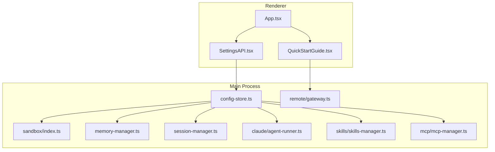
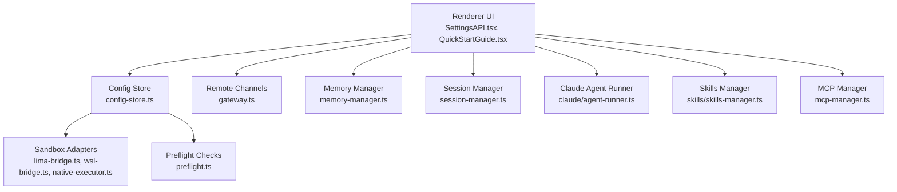
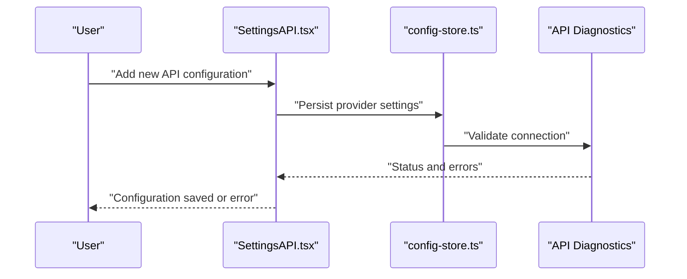
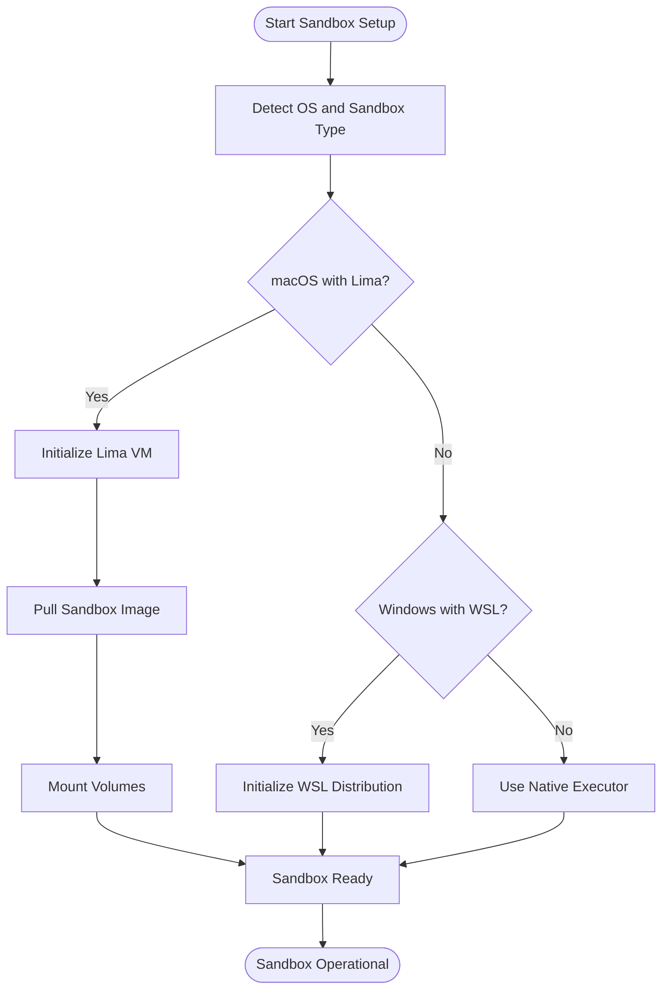
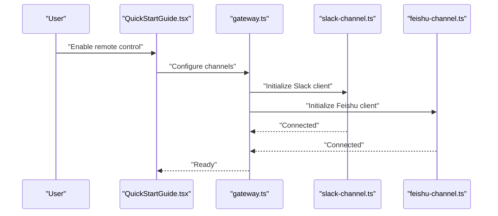
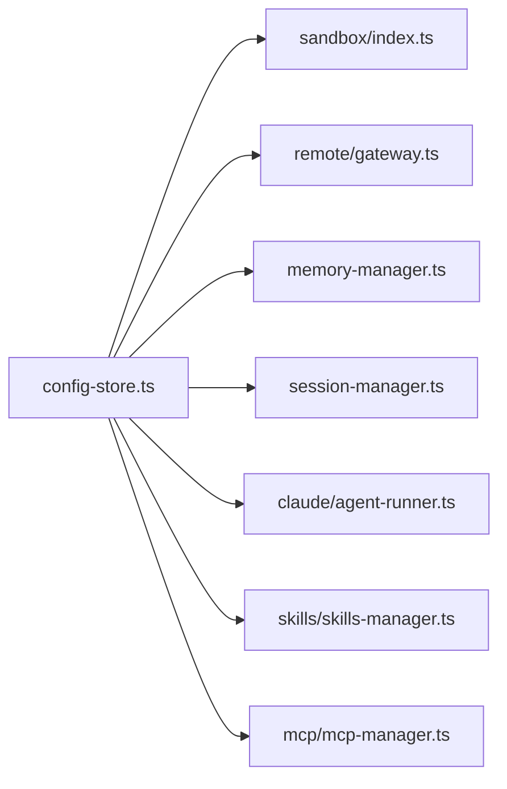

# Getting Started

<cite>
**Referenced Files in This Document**
- [package.json](file://package.json)
- [electron-builder.yml](file://electron-builder.yml)
- [src/main/preflight.ts](file://src/main/preflight.ts)
- [src/main/config/config-store.ts](file://src/main/config/config-store.ts)
- [src/renderer/components/settings/SettingsAPI.tsx](file://src/renderer/components/settings/SettingsAPI.tsx)
- [src/renderer/components/remote/QuickStartGuide.tsx](file://src/renderer/components/remote/QuickStartGuide.tsx)
- [src/shared/api-provider-guidance.ts](file://src/shared/api-provider-guidance.ts)
- [src/main/sandbox/index.ts](file://src/main/sandbox/index.ts)
- [src/main/sandbox/lima-bridge.ts](file://src/main/sandbox/lima-bridge.ts)
- [src/main/sandbox/wsl-bridge.ts](file://src/main/sandbox/wsl-bridge.ts)
- [src/main/sandbox/native-executor.ts](file://src/main/sandbox/native-executor.ts)
- [src/main/workspace-path-constraints.ts](file://src/main/workspace-path-constraints.ts)
- [resources/installer.nsh](file://resources/installer.nsh)
- [resources/windows/Open-Cowork-Legacy-Cleanup.cmd](file://resources/windows/Open-Cowork-Legacy-Cleanup.cmd)
- [resources/windows/Open-Cowork-Legacy-Cleanup.ps1](file://resources/windows/Open-Cowork-Legacy-Cleanup.ps1)
- [scripts/build-windows.js](file://scripts/build-windows.js)
- [scripts/start.ps1](file://scripts/start.ps1)
- [src/main/mcp/mcp-manager.ts](file://src/main/mcp/mcp-manager.ts)
- [src/main/memory/memory-manager.ts](file://src/main/memory/memory-manager.ts)
- [src/main/session/session-manager.ts](file://src/main/session/session-manager.ts)
- [src/main/extensions/agent-runtime-extension-manager.ts](file://src/main/extensions/agent-runtime-extension-manager.ts)
- [src/main/extensions/agent-runtime-extension.ts](file://src/main/extensions/agent-runtime-extension.ts)
- [src/main/remote/gateway.ts](file://src/main/remote/gateway.ts)
- [src/main/remote/message-router.ts](file://src/main/remote/message-router.ts)
- [src/main/remote/remote-manager.ts](file://src/main/remote/remote-manager.ts)
- [src/main/remote/types.ts](file://src/main/remote/types.ts)
- [src/main/remote/channels/channel-base.ts](file://src/main/remote/channels/channel-base.ts)
- [src/main/remote/channels/slack/index.ts](file://src/main/remote/channels/slack/index.ts)
- [src/main/remote/channels/slack/slack-channel.ts](file://src/main/remote/channels/slack/slack-channel.ts)
- [src/main/remote/channels/feishu/feishu-channel.ts](file://src/main/remote/channels/feishu/feishu-channel.ts)
- [src/main/remote/channels/feishu/feishu-api.ts](file://src/main/remote/channels/feishu/feishu-api.ts)
- [src/main/remote/channels/feishu/feishu-ws-client.ts](file://src/main/remote/channels/feishu/feishu-ws-client.ts)
- [src/main/remote/channels/feishu/index.ts](file://src/main/remote/channels/feishu/index.ts)
- [src/main/skills/skills-manager.ts](file://src/main/skills/skills-manager.ts)
- [src/main/skills/plugin-runtime-service.ts](file://src/main/skills/plugin-runtime-service.ts)
- [src/main/skills/plugin-catalog-service.ts](file://src/main/skills/plugin-catalog-service.ts)
- [src/main/skills/plugin-registry-store.ts](file://src/main/skills/plugin-registry-store.ts)
- [src/main/tools/tool-executor.ts](file://src/main/tools/tool-executor.ts)
- [src/main/tools/sandbox-tool-executor.ts](file://src/main/tools/sandbox-tool-executor.ts)
- [src/main/utils/logger.ts](file://src/main/utils/logger.ts)
- [src/main/utils/diagnostics-summary.ts](file://src/main/utils/diagnostics-summary.ts)
- [src/main/utils/error-utils.ts](file://src/main/utils/error-utils.ts)
- [src/main/utils/recent-workspace-files.ts](file://src/main/utils/recent-workspace-files.ts)
- [src/main/utils/store-encryption.ts](file://src/main/utils/store-encryption.ts)
- [src/main/utils/shell-resolver.ts](file://src/main/utils/shell-resolver.ts)
- [src/main/db/database.ts](file://src/main/db/database.ts)
- [src/main/schedule/scheduled-task-manager.ts](file://src/main/schedule/scheduled-task-manager.ts)
- [src/main/schedule/scheduled-task-store.ts](file://src/main/schedule/scheduled-task-store.ts)
- [src/main/claude/agent-runner.ts](file://src/main/claude/agent-runner.ts)
- [src/main/claude/claude-sdk-one-shot.ts](file://src/main/claude/claude-sdk-one-shot.ts)
- [src/main/claude/pi-model-resolution.ts](file://src/main/claude/pi-model-resolution.ts)
- [src/main/claude/pi-session-runtime.ts](file://src/main/claude/pi-session-runtime.ts)
- [src/main/claude/shared-auth.ts](file://src/main/claude/shared-auth.ts)
- [src/main/claude/think-tag-parser.ts](file://src/main/claude/think-tag-parser.ts)
- [src/main/claude/tool-result-utils.ts](file://src/main/claude/tool-result-utils.ts)
- [src/main/claude/windows-bash-operations.ts](file://src/main/claude/windows-bash-operations.ts)
- [src/main/memory/memory-service.ts](file://src/main/memory/memory-service.ts)
- [src/main/memory/memory-types.ts](file://src/main/memory/memory-types.ts)
- [src/main/memory/memory-prompts.ts](file://src/main/memory/memory-prompts.ts)
- [src/main/memory/memory-utils.ts](file://src/main/memory/memory-utils.ts)
- [src/main/memory/memory-state-store.ts](file://src/main/memory/memory-state-store.ts)
- [src/main/memory/memory-ingestion-queue.ts](file://src/main/memory/memory-ingestion-queue.ts)
- [src/main/memory/memory-eval-harness.ts](file://src/main/memory/memory-eval-harness.ts)
- [src/main/memory/memory-navigator.ts](file://src/main/memory/memory-navigator.ts)
- [src/main/memory/memory-retriever.ts](file://src/main/memory/memory-retriever.ts)
- [src/main/memory/memory-prompt-optimizer.ts](file://src/main/memory/memory-prompt-optimizer.ts)
- [src/main/memory/memory-tools.ts](file://src/main/memory/memory-tools.ts)
- [src/main/memory/memory-llm-client.ts](file://src/main/memory/memory-llm-client.ts)
- [src/main/memory/experience-memory-store.ts](file://src/main/memory/experience-memory-store.ts)
- [src/main/memory/experience-memory-extractor.ts](file://src/main/memory/experience-memory-extractor.ts)
- [src/main/memory/core-memory-store.ts](file://src/main/memory/core-memory-store.ts)
- [src/main/memory/core-memory-extractor.ts](file://src/main/memory/core-memory-extractor.ts)
- [src/main/memory/memory-extension.ts](file://src/main/memory/memory-extension.ts)
- [src/main/memory/memory-manager.ts](file://src/main/memory/memory-manager.ts)
- [src/main/memory/memory-service.ts](file://src/main/memory/memory-service.ts)
- [src/main/memory/memory-state-store.ts](file://src/main/memory/memory-state-store.ts)
- [src/main/memory/memory-types.ts](file://src/main/memory/memory-types.ts)
- [src/main/memory/memory-utils.ts](file://src/main/memory/memory-utils.ts)
- [src/main/memory/memory-navigator.ts](file://src/main/memory/memory-navigator.ts)
- [src/main/memory/memory-retriever.ts](file://src/main/memory/memory-retriever.ts)
- [src/main/memory/memory-prompt-optimizer.ts](file://src/main/memory/memory-prompt-optimizer.ts)
- [src/main/memory/memory-tools.ts](file://src/main/memory/memory-tools.ts)
- [src/main/memory/memory-llm-client.ts](file://src/main/memory/memory-llm-client.ts)
- [src/main/memory/experience-memory-store.ts](file://src/main/memory/experience-memory-store.ts)
- [src/main/memory/experience-memory-extractor.ts](file://src/main/memory/experience-memory-extractor.ts)
- [src/main/memory/core-memory-store.ts](file://src/main/memory/core-memory-store.ts)
- [src/main/memory/core-memory-extractor.ts](file://src/main/memory/core-memory-extractor.ts)
- [src/main/memory/memory-extension.ts](file://src/main/memory/memory-extension.ts)
- [src/main/memory/memory-manager.ts](file://src/main/memory/memory-manager.ts)
- [src/main/memory/memory-service.ts](file://src/main/memory/memory-service.ts)
- [src/main/memory/memory-state-store.ts](file://src/main/memory/memory-state-store.ts)
- [src/main/memory/memory-types.ts](file://src/main/memory/memory-types.ts)
- [src/main/memory/memory-utils.ts](file://src/main/memory/memory-utils.ts)
- [src/main/memory/memory-navigator.ts](file://src/main/memory/memory-navigator.ts)
- [src/main/memory/memory-retriever.ts](file://src/main/memory/memory-retriever.ts)
- [src/main/memory/memory-prompt-optimizer.ts](file://src/main/memory/memory-prompt-optimizer.ts)
- [src/main/memory/memory-tools.ts](file://src/main/memory/memory-tools.ts)
- [src/main/memory/memory-llm-client.ts](file://src/main/memory/memory-llm-client.ts)
- [src/main/memory/experience-memory-store.ts](file://src/main/memory/experience-memory-store.ts)
- [src/main/memory/experience-memory-extractor.ts](file://src/main/memory/experience-memory-extractor.ts)
- [src/main/memory/core-memory-store.ts](file://src/main/memory/core-memory-store.ts)
- [src/main/memory/core-memory-extractor.ts](file://src/main/memory/core-memory-extractor.ts)
- [src/main/memory/memory-extension.ts](file://src/main/memory/memory-extension.ts)
- [src/main/memory/memory-manager.ts](file://src/main/memory/memory-manager.ts)
- [src/main/memory/memory-service.ts](file://src/main/memory/memory-service.ts)
- [src/main/memory/memory-state-store.ts](file://src/main/memory/memory-state-store.ts)
- [src/main/memory/memory-types.ts](file://src/main/memory/memory-types.ts)
- [src/main/memory/memory-utils.ts](file://src/main/memory/memory-utils.ts)
- [src/main/memory/memory-navigator.ts](file://src/main/memory/memory-navigator.ts)
- [src/main/memory/memory-retriever.ts](file://src/main/memory/memory-retriever.ts)
- [src/main/memory/memory-prompt-optimizer.ts](file://src/main/memory/memory-prompt-optimizer.ts)
- [src/main/memory/memory-tools.ts](file://src/main/memory/memory-tools.ts)
- [src/main/memory/memory-llm-client.ts](file://src/main/memory/memory-llm-client.ts)
- [src/main/memory/experience-memory-store.ts](file://src/main/memory/experience-memory-store.ts)
- [src/main/memory/experience-memory-extractor.ts](file://src/main/memory/experience-memory-extractor.ts)
- [src/main/memory/core-memory-store.ts](file://src/main/memory/core-memory-store.ts)
- [src/main/memory/core-memory-extractor.ts](file://src/main/memory/core-memory-extractor.ts)
- [src/main/memory/memory-extension.ts](file://src/main/memory/memory-extension.ts)
- [src/main/memory/memory-manager.ts](file://src/main/memory/memory-manager.ts)
- [src/main/memory/memory-service.ts](file://src/main/memory/memory-service.ts)
- [src/main/memory/memory-state-store.ts](file://src/main/memory/memory-state-store.ts)
- [src/main/memory/memory-types.ts](file://src/main/memory/memory-types.ts)
- [src/main/memory/memory-utils.ts](file://src/main/memory/memory-utils.ts)
- [src/main/memory/memory-navigator.ts](file://src/main/memory/memory-navigator.ts)
- [src/main/memory/memory-retriever.ts](file://src/main/memory/memory-retriever.ts)
- [src/main/memory/memory-prompt-optimizer.ts](file://src/main/memory/memory-prompt-optimizer.ts)
- [src/main/memory/memory-tools.ts](file://src/main/memory/memory-tools.ts)
- [src/main/memory/memory-llm-client.ts](file://src/main/memory/memory-llm-client.ts)
- [src/main/memory/experience-memory-store.ts](file://src/main/memory/experience-memory-store.ts)
- [src/main/memory/experience-memory-extractor.ts](file://src/main/memory/experience-memory-extractor.ts)
- [src/main/memory/core-memory-store.ts](file://src/main/memory/core-memory-store.ts)
- [src/main/memory/core-memory-extractor.ts](file://src/main/memory/core-memory-extractor.ts)
- [src/main/memory/memory-extension.ts](file://src/main/memory/memory-extension.ts)
- [src/main/memory/memory-manager.ts](file://src/main/memory/memory-manager.ts)
- [src/main/memory/memory-service.ts](file://src/main/memory/memory-service.ts)
- [src/main/memory/memory-state-store.ts](file://src/main/memory/memory-state-store.ts)
- [src/main/memory/memory-types.ts](file://src/main/memory/memory-types.ts)
- [src/main/memory/memory-utils.ts](file://src/main/memory/memory-utils.ts)
- [src/main/memory/memory-navigator.ts](file://src/main/memory/memory-navigator.ts)
- [src/main/memory/memory-retriever.ts](file://src/main/memory/memory-retriever.ts)
- [src/main/memory/memory-prompt-optimizer.ts](file://src/main/memory/memory-prompt-optimizer.ts)
- [src/main/memory/memory-tools.ts](file://src/main/memory/memory-tools.ts)
- [src/main/memory/memory-llm-client.ts](file://src/main/memory/memory-llm-client.ts)
- [src/main/memory/experience-memory-store.ts](file://src/main/memory/experience-memory-store.ts)
- [src/main/memory/experience-memory-extractor.ts](file://src/main/memory/experience-memory-extractor.ts)
- [src/main/memory/core-memory-store.ts](file://src/main/memory/core-memory-store.ts)
- [src/main/memory/core-memory-extractor.ts](file://src/main/memory/core-memory-extractor.ts)
- [src/main/memory/memory-extension.ts](file://src/main/memory/memory-extension.ts)
- [src/main/memory/memory-manager.ts](file://src/main/memory/memory-manager.ts)
- [src/main/memory/memory-service.ts](file://src/main/memory/memory-service.ts)
- [src/main/memory/memory-state-store.ts](file://src/main/memory/memory-state-store.ts)
- [src/main/memory/memory-types.ts](file://src/main/memory/memory-types.ts)
- [src/main/memory/memory-utils.ts](file://src/main/memory/memory-utils.ts)
- [src/main/memory/memory-navigator.ts](file://src/main/memory/memory-navigator.ts)
- [src/main/memory/memory-retriever.ts](file://src/main/memory/memory-retriever.ts)
- [src/main/memory/memory-prompt-optimizer.ts](file://src/main/memory/memory-prompt-optimizer.ts)
- [src/main/memory/memory-tools.ts](file://src/main/memory/memory-tools.ts)
- [src/main/memory/memory-ll......
</cite>

## Table of Contents

1. [Introduction](#introduction)
2. [Project Structure](#project-structure)
3. [Core Components](#core-components)
4. [Architecture Overview](#architecture-overview)
5. [Detailed Component Analysis](#detailed-component-analysis)
6. [Dependency Analysis](#dependency-analysis)
7. [Performance Considerations](#performance-considerations)
8. [Troubleshooting Guide](#troubleshooting-guide)
9. [Conclusion](#conclusion)
10. [Appendices](#appendices)

## Introduction

Open Cowork is a desktop application that integrates AI agents with your local development environment. It provides a secure sandbox for AI interactions, supports multiple AI providers, and offers a modern GUI for configuration and control. This guide helps you install, configure, and start using Open Cowork effectively.

## Project Structure

Open Cowork is an Electron-based application with a TypeScript/React renderer and a Node.js main process. The repository includes:

- Renderer UI components under src/renderer
- Main process modules under src/main
- Shared utilities and configuration under src/shared
- Build and packaging scripts under scripts and resources
- Platform-specific sandbox integrations (Lima, WSL, native executor)
- Remote communication channels (Slack, Feishu)
- Skills and MCP tooling for extensibility

**Diagram sources**

- [src/renderer/components/settings/SettingsAPI.tsx](file://src/renderer/components/settings/SettingsAPI.tsx)
- [src/renderer/components/remote/QuickStartGuide.tsx](file://src/renderer/components/remote/QuickStartGuide.tsx)
- [src/main/config/config-store.ts](file://src/main/config/config-store.ts)
- [src/main/sandbox/index.ts](file://src/main/sandbox/index.ts)
- [src/main/remote/gateway.ts](file://src/main/remote/gateway.ts)
- [src/main/memory/memory-manager.ts](file://src/main/memory/memory-manager.ts)
- [src/main/session/session-manager.ts](file://src/main/session/session-manager.ts)
- [src/main/claude/agent-runner.ts](file://src/main/claude/agent-runner.ts)
- [src/main/skills/skills-manager.ts](file://src/main/skills/skills-manager.ts)
- [src/main/mcp/mcp-manager.ts](file://src/main/mcp/mcp-manager.ts)

**Section sources**

- [package.json](file://package.json)
- [electron-builder.yml](file://electron-builder.yml)

## Core Components

- Configuration Store: Centralized settings persistence and environment handling.
- Sandbox: Secure execution environment with Lima (macOS), WSL (Windows), and native executor fallbacks.
- Remote Channels: Integrations with Slack and Feishu for remote control and messaging.
- Memory Manager: Persistent memory and retrieval for long-term context.
- Session Manager: Manages conversations and titles for AI interactions.
- Claude Agent Runner: Orchestrates AI agent runs and tool usage.
- Skills and MCP: Extensible plugins and model-context protocol servers.
- Preflight Checks: Validates environment readiness during startup.

**Section sources**

- [src/main/config/config-store.ts](file://src/main/config/config-store.ts)
- [src/main/sandbox/index.ts](file://src/main/sandbox/index.ts)
- [src/main/remote/gateway.ts](file://src/main/remote/gateway.ts)
- [src/main/memory/memory-manager.ts](file://src/main/memory/memory-manager.ts)
- [src/main/session/session-manager.ts](file://src/main/session/session-manager.ts)
- [src/main/claude/agent-runner.ts](file://src/main/claude/agent-runner.ts)
- [src/main/skills/skills-manager.ts](file://src/main/skills/skills-manager.ts)
- [src/main/mcp/mcp-manager.ts](file://src/main/mcp/mcp-manager.ts)
- [src/main/preflight.ts](file://src/main/preflight.ts)

## Architecture Overview

The application follows a layered architecture:

- Renderer UI handles user interactions and displays configuration panels.
- Main process manages configuration, sandbox execution, remote channels, memory, sessions, and agent orchestration.
- Shared utilities provide cross-cutting concerns like logging, diagnostics, and encryption.

**Diagram sources**

- [src/renderer/components/settings/SettingsAPI.tsx](file://src/renderer/components/settings/SettingsAPI.tsx)
- [src/renderer/components/remote/QuickStartGuide.tsx](file://src/renderer/components/remote/QuickStartGuide.tsx)
- [src/main/config/config-store.ts](file://src/main/config/config-store.ts)
- [src/main/remote/gateway.ts](file://src/main/remote/gateway.ts)
- [src/main/memory/memory-manager.ts](file://src/main/memory/memory-manager.ts)
- [src/main/session/session-manager.ts](file://src/main/session/session-manager.ts)
- [src/main/claude/agent-runner.ts](file://src/main/claude/agent-runner.ts)
- [src/main/skills/skills-manager.ts](file://src/main/skills/skills-manager.ts)
- [src/main/mcp/mcp-manager.ts](file://src/main/mcp/mcp-manager.ts)
- [src/main/sandbox/lima-bridge.ts](file://src/main/sandbox/lima-bridge.ts)
- [src/main/sandbox/wsl-bridge.ts](file://src/main/sandbox/wsl-bridge.ts)
- [src/main/sandbox/native-executor.ts](file://src/main/sandbox/native-executor.ts)
- [src/main/preflight.ts](file://src/main/preflight.ts)

## Detailed Component Analysis

### Installation Methods

- macOS with Homebrew (Recommended): Install via Homebrew formulae maintained by the project.
- Windows Installer: Use the generated installer script and NSIS configuration.
- Direct Downloads: Obtain binaries from the project’s releases page.
- Building from Source: Use the provided scripts and package manager to build locally.

Platform-specific considerations:

- macOS requires Lima for sandboxing; ensure Docker/Lima is installed and configured.
- Windows relies on WSL for sandboxing; ensure WSL and distribution are set up.
- Linux uses native executor; ensure appropriate permissions and runtime dependencies.

**Section sources**

- [electron-builder.yml](file://electron-builder.yml)
- [resources/installer.nsh](file://resources/installer.nsh)
- [resources/windows/Open-Cowork-Legacy-Cleanup.cmd](file://resources/windows/Open-Cowork-Legacy-Cleanup.cmd)
- [resources/windows/Open-Cowork-Legacy-Cleanup.ps1](file://resources/windows/Open-Cowork-Legacy-Cleanup.ps1)
- [scripts/build-windows.js](file://scripts/build-windows.js)
- [scripts/start.ps1](file://scripts/start.ps1)

### System Requirements and Prerequisites

- macOS: Intel or Apple Silicon, latest supported OS version, Docker/Lima for sandbox.
- Windows: Windows 10/11 with WSL enabled, recommended modern hardware.
- Linux: Native execution supported; ensure runtime libraries and permissions are available.
- Network: Outbound internet access for AI provider APIs and updates.
- Storage: Sufficient disk space for sandbox images and logs.

**Section sources**

- [src/main/preflight.ts](file://src/main/preflight.ts)
- [src/main/sandbox/lima-bridge.ts](file://src/main/sandbox/lima-bridge.ts)
- [src/main/sandbox/wsl-bridge.ts](file://src/main/sandbox/wsl-bridge.ts)
- [src/main/sandbox/native-executor.ts](file://src/main/sandbox/native-executor.ts)

### Quick Start Workflow

1. Acquire API Keys
   - OpenRouter: Get an API key from the provider portal.
   - Anthropic: Obtain an API key from the provider portal.
   - Chinese Models: Use provider-specific keys for regionally available models.
2. Configure Providers
   - Open the Settings panel and navigate to the API configuration section.
   - Add new API configurations with provider-specific keys and endpoints.
3. Set Up Sandbox Environment
   - macOS: Ensure Lima is installed and initialized.
   - Windows: Ensure WSL is installed and a distribution is available.
   - Linux: Confirm native executor availability.
4. Select Workspace
   - Choose a working directory for the agent to operate within.
   - Ensure the selected path adheres to workspace constraints.
5. First Interaction
   - Start a new session and send a test prompt.
   - Monitor logs and diagnostics for feedback.

Provider guidance and configuration UI:

- Provider-specific guidance is integrated into the UI to help select models and endpoints.
- The API diagnostics panel validates connectivity and credentials.

**Section sources**

- [src/renderer/components/settings/SettingsAPI.tsx](file://src/renderer/components/settings/SettingsAPI.tsx)
- [src/shared/api-provider-guidance.ts](file://src/shared/api-provider-guidance.ts)
- [src/main/config/config-store.ts](file://src/main/config/config-store.ts)
- [src/main/sandbox/index.ts](file://src/main/sandbox/index.ts)
- [src/main/workspace-path-constraints.ts](file://src/main/workspace-path-constraints.ts)

### Setting Up AI Providers

- OpenRouter
  - Add provider configuration with API key and endpoint.
  - Select compatible models from the provider catalog.
- Anthropic
  - Configure API key and model selection.
  - Verify connectivity using the diagnostics panel.
- Chinese Models
  - Use provider-specific endpoints and keys.
  - Ensure regional compliance and network access.

**Diagram sources**

- [src/renderer/components/settings/SettingsAPI.tsx](file://src/renderer/components/settings/SettingsAPI.tsx)
- [src/main/config/config-store.ts](file://src/main/config/config-store.ts)
- [src/main/config/api-diagnostics.ts](file://src/main/config/api-diagnostics.ts)

**Section sources**

- [src/renderer/components/settings/SettingsAPI.tsx](file://src/renderer/components/settings/SettingsAPI.tsx)
- [src/main/config/config-store.ts](file://src/main/config/config-store.ts)
- [src/shared/api-provider-guidance.ts](file://src/shared/api-provider-guidance.ts)

### Configuring Sandbox Environments

- macOS (Lima)
  - Initialize and start Lima VM.
  - Ensure image pull and volume mounts are functional.
- Windows (WSL)
  - Install WSL and a Linux distribution.
  - Confirm distribution boot and networking.
- Linux (Native)
  - Ensure runtime libraries and permissions are present.

**Diagram sources**

- [src/main/sandbox/lima-bridge.ts](file://src/main/sandbox/lima-bridge.ts)
- [src/main/sandbox/wsl-bridge.ts](file://src/main/sandbox/wsl-bridge.ts)
- [src/main/sandbox/native-executor.ts](file://src/main/sandbox/native-executor.ts)

**Section sources**

- [src/main/sandbox/index.ts](file://src/main/sandbox/index.ts)
- [src/main/sandbox/lima-bridge.ts](file://src/main/sandbox/lima-bridge.ts)
- [src/main/sandbox/wsl-bridge.ts](file://src/main/sandbox/wsl-bridge.ts)
- [src/main/sandbox/native-executor.ts](file://src/main/sandbox/native-executor.ts)

### Selecting Workspaces

- Choose a folder that contains your projects.
- Ensure the path meets workspace constraints and permissions.
- Use the recent files panel to quickly switch between workspaces.

**Section sources**

- [src/main/workspace-path-constraints.ts](file://src/main/workspace-path-constraints.ts)
- [src/main/utils/recent-workspace-files.ts](file://src/main/utils/recent-workspace-files.ts)

### Remote Control and Channels

- Slack Integration
  - Configure Slack workspace and bot tokens.
  - Use the Slack channel component for messaging and commands.
- Feishu Integration
  - Configure Feishu app credentials.
  - Use the Feishu channel for messages and real-time updates.

**Diagram sources**

- [src/renderer/components/remote/QuickStartGuide.tsx](file://src/renderer/components/remote/QuickStartGuide.tsx)
- [src/main/remote/gateway.ts](file://src/main/remote/gateway.ts)
- [src/main/remote/channels/slack/slack-channel.ts](file://src/main/remote/channels/slack/slack-channel.ts)
- [src/main/remote/channels/feishu/feishu-channel.ts](file://src/main/remote/channels/feishu/feishu-channel.ts)

**Section sources**

- [src/main/remote/gateway.ts](file://src/main/remote/gateway.ts)
- [src/main/remote/channels/slack/index.ts](file://src/main/remote/channels/slack/index.ts)
- [src/main/remote/channels/slack/slack-channel.ts](file://src/main/remote/channels/slack/slack-channel.ts)
- [src/main/remote/channels/feishu/feishu-channel.ts](file://src/main/remote/channels/feishu/feishu-channel.ts)
- [src/main/remote/channels/feishu/feishu-api.ts](file://src/main/remote/channels/feishu/feishu-api.ts)
- [src/main/remote/channels/feishu/feishu-ws-client.ts](file://src/main/remote/channels/feishu/feishu-ws-client.ts)
- [src/main/remote/channels/feishu/index.ts](file://src/main/remote/channels/feishu/index.ts)

### Skills and MCP

- Skills Manager
  - Install and manage plugins for extended capabilities.
  - Use the plugin registry and runtime service.
- MCP Manager
  - Manage Model Context Protocol servers and OAuth flows.
  - Integrate external tools and services.

**Section sources**

- [src/main/skills/skills-manager.ts](file://src/main/skills/skills-manager.ts)
- [src/main/skills/plugin-runtime-service.ts](file://src/main/skills/plugin-runtime-service.ts)
- [src/main/skills/plugin-catalog-service.ts](file://src/main/skills/plugin-catalog-service.ts)
- [src/main/skills/plugin-registry-store.ts](file://src/main/skills/plugin-registry-store.ts)
- [src/main/mcp/mcp-manager.ts](file://src/main/mcp/mcp-manager.ts)

## Dependency Analysis

Open Cowork’s main process depends on several subsystems:

- Configuration Store for persistent settings
- Sandbox adapters for secure execution
- Remote channels for external integrations
- Memory and session managers for context
- Skills and MCP for extensibility

**Diagram sources**

- [src/main/config/config-store.ts](file://src/main/config/config-store.ts)
- [src/main/sandbox/index.ts](file://src/main/sandbox/index.ts)
- [src/main/remote/gateway.ts](file://src/main/remote/gateway.ts)
- [src/main/memory/memory-manager.ts](file://src/main/memory/memory-manager.ts)
- [src/main/session/session-manager.ts](file://src/main/session/session-manager.ts)
- [src/main/claude/agent-runner.ts](file://src/main/claude/agent-runner.ts)
- [src/main/skills/skills-manager.ts](file://src/main/skills/skills-manager.ts)
- [src/main/mcp/mcp-manager.ts](file://src/main/mcp/mcp-manager.ts)

**Section sources**

- [src/main/config/config-store.ts](file://src/main/config/config-store.ts)
- [src/main/sandbox/index.ts](file://src/main/sandbox/index.ts)
- [src/main/remote/gateway.ts](file://src/main/remote/gateway.ts)
- [src/main/memory/memory-manager.ts](file://src/main/memory/memory-manager.ts)
- [src/main/session/session-manager.ts](file://src/main/session/session-manager.ts)
- [src/main/claude/agent-runner.ts](file://src/main/claude/agent-runner.ts)
- [src/main/skills/skills-manager.ts](file://src/main/skills/skills-manager.ts)
- [src/main/mcp/mcp-manager.ts](file://src/main/mcp/mcp-manager.ts)

## Performance Considerations

- Sandbox initialization overhead: Minimize image pulls and optimize volume mounts.
- Memory usage: Tune memory manager retention policies and pruning intervals.
- Network latency: Prefer regional endpoints for AI providers to reduce latency.
- Logging verbosity: Adjust log levels to balance diagnostics and performance.

[No sources needed since this section provides general guidance]

## Troubleshooting Guide

Common setup issues and resolutions:

- Sandbox fails to start
  - Verify Lima/WSL installation and distribution health.
  - Check image pull permissions and network connectivity.
- API key validation failures
  - Re-enter keys and endpoints; confirm provider account status.
  - Use the diagnostics panel to inspect detailed errors.
- Workspace path errors
  - Ensure the selected path exists and is writable.
  - Review workspace constraints and adjust accordingly.
- Remote channel connection problems
  - Validate tokens and permissions for Slack/Feishu.
  - Check firewall and proxy settings.

Diagnostic utilities:

- Logger: Centralized logging for errors and warnings.
- Diagnostics Summary: Summarizes environment and configuration checks.
- Error Utilities: Provides structured error handling and reporting.

**Section sources**

- [src/main/utils/logger.ts](file://src/main/utils/logger.ts)
- [src/main/utils/diagnostics-summary.ts](file://src/main/utils/diagnostics-summary.ts)
- [src/main/utils/error-utils.ts](file://src/main/utils/error-utils.ts)

## Conclusion

You are now equipped to install Open Cowork, configure AI providers, set up sandbox environments, and start your first AI-assisted workflows. Use the settings and diagnostics panels to troubleshoot and refine your setup. Explore skills and MCP integrations to extend capabilities further.

[No sources needed since this section summarizes without analyzing specific files]

## Appendices

- Additional developer scripts and build artifacts are available under scripts and resources for advanced users.

**Section sources**

- [scripts/build-windows.js](file://scripts/build-windows.js)
- [resources/installer.nsh](file://resources/installer.nsh)
