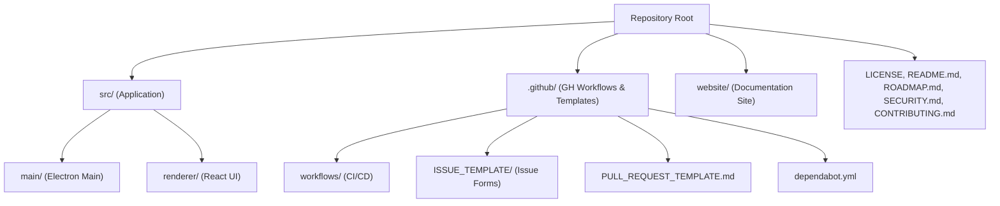
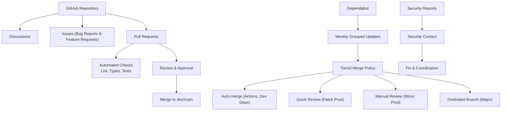
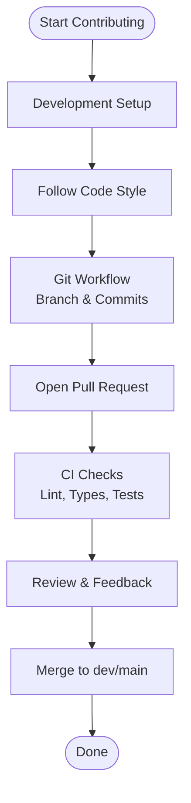
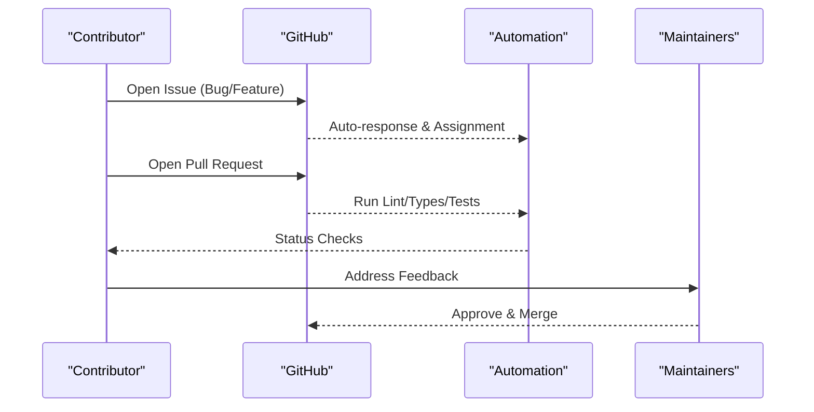
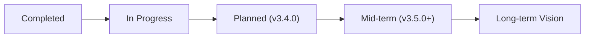
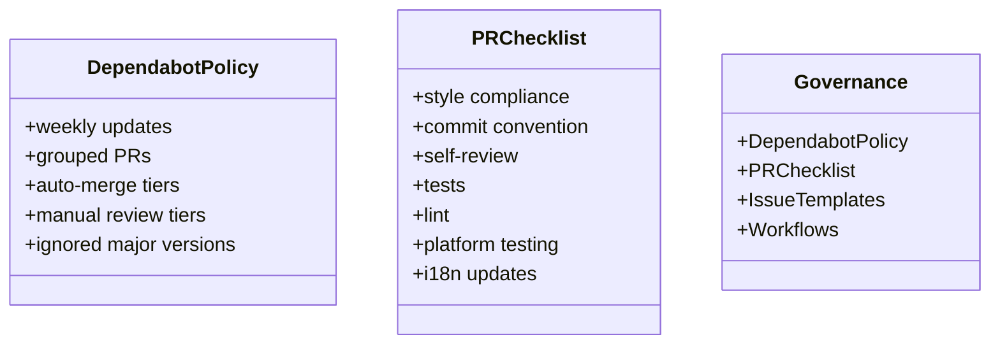
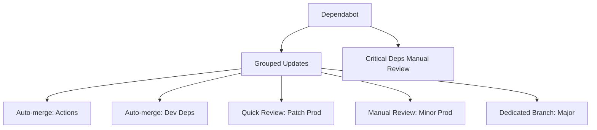
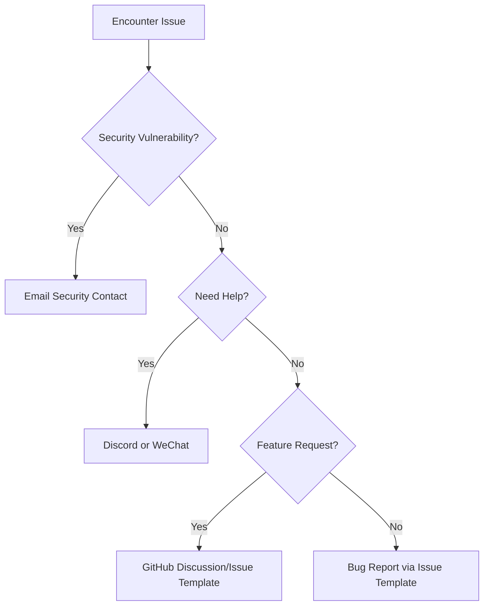

# Community and Resources

<cite>
**Referenced Files in This Document**
- [README.md](file://README.md)
- [CONTRIBUTING.md](file://CONTRIBUTING.md)
- [CODE_OF_CONDUCT.md](file://CODE_OF_CONDUCT.md)
- [ROADMAP.md](file://ROADMAP.md)
- [SECURITY.md](file://SECURITY.md)
- [.github/PULL_REQUEST_TEMPLATE.md](file://.github/PULL_REQUEST_TEMPLATE.md)
- [.github/ISSUE_TEMPLATE/bug_report.yml](file://.github/ISSUE_TEMPLATE/bug_report.yml)
- [.github/ISSUE_TEMPLATE/feature_request.yml](file://.github/ISSUE_TEMPLATE/feature_request.yml)
- [.github/dependabot.yml](file://.github/dependabot.yml)
- [LICENSE](file://LICENSE)
- [CHANGELOG.md](file://CHANGELOG.md)
</cite>

## Table of Contents

1. [Introduction](#introduction)
2. [Project Structure](#project-structure)
3. [Core Components](#core-components)
4. [Architecture Overview](#architecture-overview)
5. [Detailed Component Analysis](#detailed-component-analysis)
6. [Dependency Analysis](#dependency-analysis)
7. [Performance Considerations](#performance-considerations)
8. [Troubleshooting Guide](#troubleshooting-guide)
9. [Conclusion](#conclusion)
10. [Appendices](#appendices)

## Introduction

Open Cowork is an open-source desktop AI agent application designed for secure, collaborative workflows in government and controlled environments. It emphasizes local execution, sandbox isolation, and extensibility through Skills and MCP connectors. The project is licensed under the MIT License and actively welcomes community contributions, discussions, and feedback.

Key community resources:

- Official documentation and quick start guide
- GitHub Discussions and Issues for support and feature requests
- Pull Request process with review and testing requirements
- Code of Conduct and enforcement contacts
- Security vulnerability reporting process
- Governance via Dependabot dependency policy and CI workflows

**Section sources**

- [README.md:1-353](file://README.md#L1-L353)

## Project Structure

The repository is organized into:

- Application source code under src/ (Electron main and React renderer)
- GitHub workflows and issue templates under .github/
- Contribution, roadmap, security, and license materials at the repository root
- Website content under website/

**Section sources**

- [README.md:214-273](file://README.md#L214-L273)

## Core Components

- Open-source nature and licensing: MIT License
- Community channels: Discord and WeChat
- Contribution guidelines: development setup, branch naming, conventional commits, PR requirements, testing, and dependency management
- Code of Conduct: Contributor Covenant 2.1
- Security policy: supported versions, vulnerability reporting, scope, and best practices
- Roadmap: completed items, in-progress, near/mid-term plans, and long-term vision
- Governance: Dependabot grouping and tiered merge policy, CI automation, and PR templates

**Section sources**

- [LICENSE:1-22](file://LICENSE#L1-L22)
- [README.md:331-341](file://README.md#L331-L341)
- [CONTRIBUTING.md:7-33](file://CONTRIBUTING.md#L7-L33)
- [CONTRIBUTING.md:73-104](file://CONTRIBUTING.md#L73-L104)
- [CONTRIBUTING.md:107-115](file://CONTRIBUTING.md#L107-L115)
- [CONTRIBUTING.md:160-184](file://CONTRIBUTING.md#L160-L184)
- [CONTRIBUTING.md:118-157](file://CONTRIBUTING.md#L118-L157)
- [CODE_OF_CONDUCT.md:1-74](file://CODE_OF_CONDUCT.md#L1-L74)
- [SECURITY.md:1-47](file://SECURITY.md#L1-L47)
- [ROADMAP.md:1-56](file://ROADMAP.md#L1-L56)
- [.github/dependabot.yml:1-53](file://.github/dependabot.yml#L1-L53)
- [.github/PULL_REQUEST_TEMPLATE.md:1-33](file://.github/PULL_REQUEST_TEMPLATE.md#L1-L33)

## Architecture Overview

Community and contribution architecture:

- Issue triage and assignment workflows
- Pull Request review and automated checks
- Dependency management via Dependabot with grouped updates and tiered policies
- Security reporting and disclosure process

**Section sources**

- [.github/ISSUE_TEMPLATE/bug_report.yml:1-80](file://.github/ISSUE_TEMPLATE/bug_report.yml#L1-L80)
- [.github/ISSUE_TEMPLATE/feature_request.yml:1-67](file://.github/ISSUE_TEMPLATE/feature_request.yml#L1-L67)
- [.github/PULL_REQUEST_TEMPLATE.md:1-33](file://.github/PULL_REQUEST_TEMPLATE.md#L1-L33)
- [.github/dependabot.yml:1-53](file://.github/dependabot.yml#L1-L53)
- [CONTRIBUTING.md:118-157](file://CONTRIBUTING.md#L118-L157)
- [SECURITY.md:10-27](file://SECURITY.md#L10-L27)

## Detailed Component Analysis

### Open-source Nature and Licensing

- License: MIT License
- Permissions and conditions: permission to use, copy, modify, merge, publish, distribute, sublicense, and sell copies; include copyright notice and permission notice; no warranty

Practical implications:

- You may freely use, modify, and distribute the software for both commercial and non-commercial purposes.
- Redistribution must include the LICENSE file and copyright notice.

**Section sources**

- [LICENSE:1-22](file://LICENSE#L1-L22)

### Contribution Guidelines

- Development setup: Node.js requirements, installation steps, and common commands
- Project structure overview and test placement conventions
- Code style: TypeScript strict mode, ESLint + Prettier, React functional components, Tailwind CSS, icon library usage
- Git workflow: branch naming, conventional commits specification, and commit header limits
- Pull Request guidelines: target branches, tests requirement, component size limits, type safety rules, CI requirements, and minimal change focus
- Dependency management: Dependabot tiers, critical dependencies, weekly workflow, and addition criteria
- Testing: Vitest usage, file placement, and coverage reporting
- Internationalization: i18n requirements and translation file locations

**Section sources**

- [CONTRIBUTING.md:7-33](file://CONTRIBUTING.md#L7-L33)
- [CONTRIBUTING.md:36-59](file://CONTRIBUTING.md#L36-L59)
- [CONTRIBUTING.md:63-70](file://CONTRIBUTING.md#L63-L70)
- [CONTRIBUTING.md:73-104](file://CONTRIBUTING.md#L73-L104)
- [CONTRIBUTING.md:107-115](file://CONTRIBUTING.md#L107-L115)
- [CONTRIBUTING.md:118-157](file://CONTRIBUTING.md#L118-L157)
- [CONTRIBUTING.md:160-184](file://CONTRIBUTING.md#L160-L184)
- [CONTRIBUTING.md:187-202](file://CONTRIBUTING.md#L187-L202)

### Community Engagement Opportunities

- GitHub Discussions: use for questions and informal discussion
- Issue reporting: structured bug reports and feature requests via GitHub Issue templates
- Pull request process: PR template, automated checks, and review workflow
- Code of Conduct: adhere to Contributor Covenant and report violations via designated contact

**Section sources**

- [CONTRIBUTING.md:205-222](file://CONTRIBUTING.md#L205-L222)
- [.github/ISSUE_TEMPLATE/bug_report.yml:1-80](file://.github/ISSUE_TEMPLATE/bug_report.yml#L1-L80)
- [.github/ISSUE_TEMPLATE/feature_request.yml:1-67](file://.github/ISSUE_TEMPLATE/feature_request.yml#L1-L67)
- [.github/PULL_REQUEST_TEMPLATE.md:1-33](file://.github/PULL_REQUEST_TEMPLATE.md#L1-L33)
- [CODE_OF_CONDUCT.md:37-41](file://CODE_OF_CONDUCT.md#L37-L41)

### Code of Conduct Expectations

- Pledge: inclusive, harassment-free participation
- Standards: positive behaviors and unacceptable conduct categories
- Enforcement responsibilities and scope
- Reporting mechanism: email contact for incidents
- Enforcement guidelines: correction, warning, temporary ban, permanent ban
- Attribution to Contributor Covenant 2.1

**Section sources**

- [CODE_OF_CONDUCT.md:1-74](file://CODE_OF_CONDUCT.md#L1-L74)

### Security and Responsible Disclosure

- Supported versions policy
- Private vulnerability reporting via email with required details
- Expected timelines: acknowledgment, status updates, and fix evaluation
- Scope and out-of-scope categories
- Security best practices for users

**Section sources**

- [SECURITY.md:1-47](file://SECURITY.md#L1-L47)

### Development Roadmap and Vision

- Completed milestones: installers, sandboxing, VM isolation, Skills, MCP connectors, multi-model support, UI/UX, remote control, CI/CD, model presets, dependency policy, memory system foundation
- In-progress: v3.3.0 stable release
- Planned near-term (v3.4.0): sandbox hardening, app slimming, code cleanup, naming standardization, tool completeness, memory enhancements, scheduled tasks, log management, installation experience, Linux support
- Mid-term (v3.5.0+): plugin system, multi-agent orchestration, workspace templates
- Long-term: computer use (GUI automation), collaborative mode, mobile companion

**Section sources**

- [ROADMAP.md:1-56](file://ROADMAP.md#L1-L56)

### Governance and Decision-Making

- Dependabot configuration: weekly grouping, labels, grouped categories, and ignored major versions
- Tiered dependency merge policy: auto-merge for Actions and dev deps, quick review for patch prod, manual review for minor prod, dedicated branch for major
- PR template: checklist covering style, commits, self-review, tests, lint, platform testing, and i18n updates
- CI workflows: automated builds, smoke tests, PR review bot, website deployment, issue auto-response and assignment, Homebrew updates

**Section sources**

- [.github/dependabot.yml:1-53](file://.github/dependabot.yml#L1-L53)
- [.github/PULL_REQUEST_TEMPLATE.md:15-24](file://.github/PULL_REQUEST_TEMPLATE.md#L15-L24)
- [.github/ISSUE_TEMPLATE/bug_report.yml:10-17](file://.github/ISSUE_TEMPLATE/bug_report.yml#L10-L17)
- [.github/ISSUE_TEMPLATE/feature_request.yml:10-17](file://.github/ISSUE_TEMPLATE/feature_request.yml#L10-L17)

## Dependency Analysis

- Dependency management is governed by Dependabot with weekly grouping and tiered merge policies
- Critical dependencies require manual review and local testing before merging
- CI automates checks and grouping for GitHub Actions and npm dependencies

**Section sources**

- [.github/dependabot.yml:1-53](file://.github/dependabot.yml#L1-L53)
- [CONTRIBUTING.md:118-157](file://CONTRIBUTING.md#L118-L157)

## Performance Considerations

- App slimming targets reducing installer size (~156 MB to ~80 MB) via on-demand downloads and lazy-loading
- Scheduled tasks and log management improvements planned for better resource utilization
- Linux support and sandbox hardening to improve startup performance and cross-platform consistency

**Section sources**

- [ROADMAP.md:29-38](file://ROADMAP.md#L29-L38)

## Troubleshooting Guide

- Reporting bugs: use the GitHub Issue template with version, platform, steps to reproduce, expected vs. actual behavior, and relevant logs
- Feature requests: open a GitHub Discussion or use the feature request template with problem statement, proposed solution, alternatives, area, and platform
- Seeking help: join Discord for real-time chat and support; scan QR code for WeChat group (Chinese community)
- Security issues: do not open public issues; email security contact with vulnerability details and reproduction steps

**Section sources**

- [CONTRIBUTING.md:205-222](file://CONTRIBUTING.md#L205-L222)
- [README.md:331-341](file://README.md#L331-L341)
- [SECURITY.md:10-27](file://SECURITY.md#L10-L27)

## Conclusion

Open Cowork thrives on an open, collaborative community guided by the MIT License, Contributor Covenant Code of Conduct, and structured contribution processes. The project’s governance leverages Dependabot and CI automation to maintain stability while encouraging innovation through clear pathways for issues, discussions, pull requests, and security disclosures. The roadmap outlines a clear path forward with near-term improvements and long-term strategic goals.

[No sources needed since this section summarizes without analyzing specific files]

## Appendices

### Official Documentation and Links

- Quick start and feature overview
- Installation options and sandbox configuration
- Skills library and MCP connectors
- Roadmap and changelog

**Section sources**

- [README.md:45-318](file://README.md#L45-L318)
- [ROADMAP.md:1-56](file://ROADMAP.md#L1-L56)
- [CHANGELOG.md:1-134](file://CHANGELOG.md#L1-L134)

### Example Implementations and Related Projects

- Skills under .claude/skills/ for PPTX, DOCX, PDF, XLSX, and skill-creator
- MCP connectors for browsers, Notion, and other desktop apps
- Remote control integrations via Feishu (Lark) and Slack

**Section sources**

- [README.md:200-212](file://README.md#L200-L212)
- [README.md:310-314](file://README.md#L310-L314)
