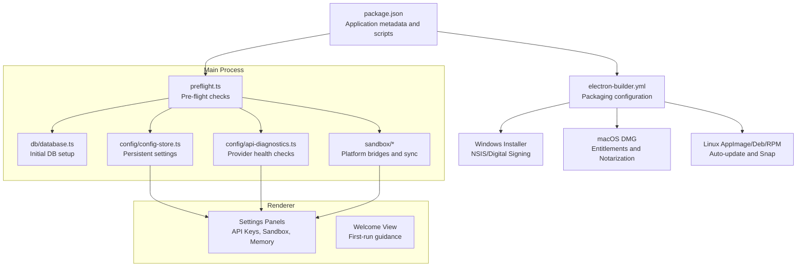
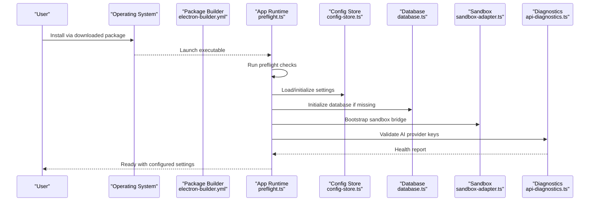
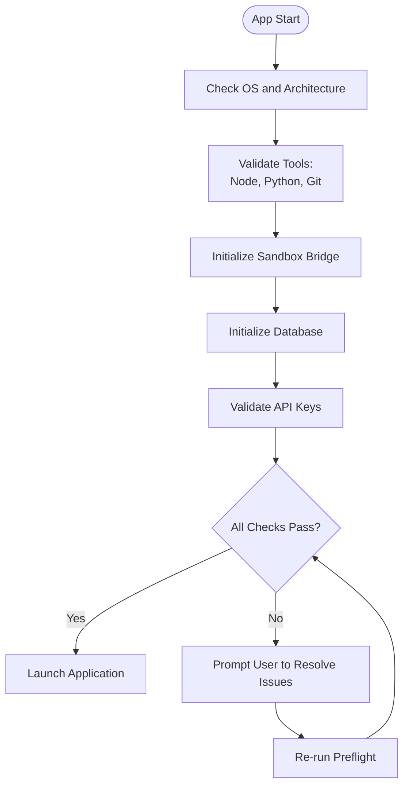
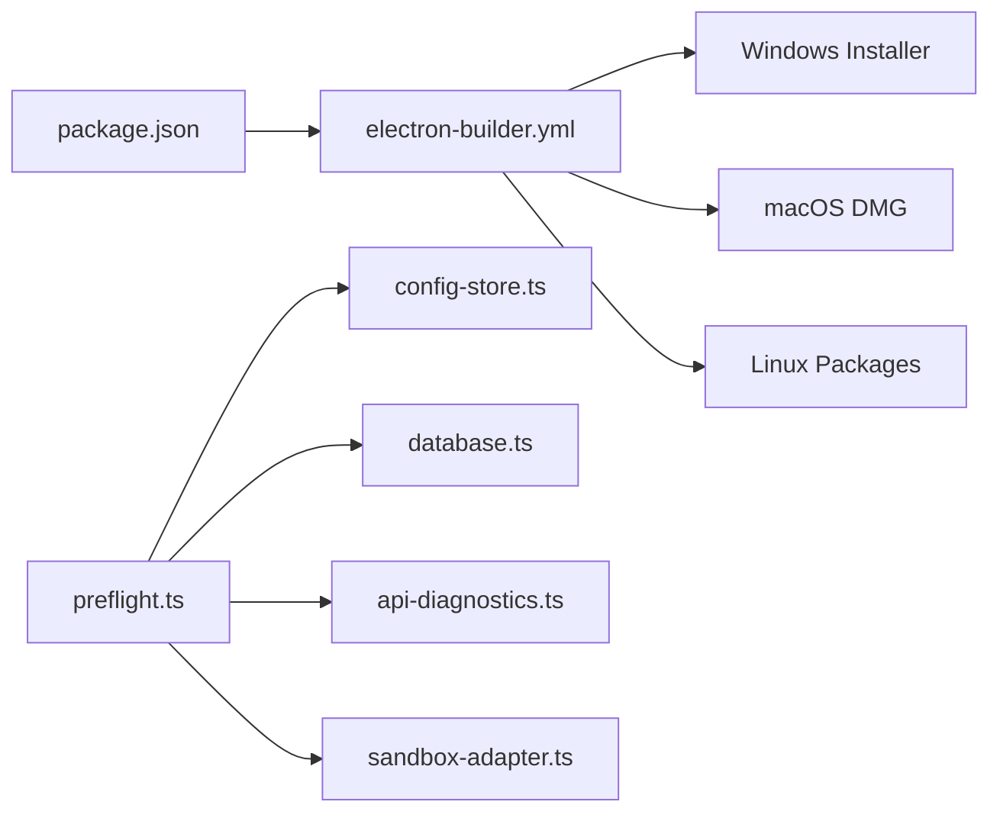

# Installation and Setup

<cite>
**Referenced Files in This Document**
- [package.json](file://package.json)
- [electron-builder.yml](file://electron-builder.yml)
- [src/main/preflight.ts](file://src/main/preflight.ts)
- [src/main/db/database.ts](file://src/main/db/database.ts)
- [src/main/config/config-store.ts](file://src/main/config/config-store.ts)
- [src/main/config/api-diagnostics.ts](file://src/main/config/api-diagnostics.ts)
- [src/main/sandbox/index.ts](file://src/main/sandbox/index.ts)
- [src/main/sandbox/sandbox-bootstrap.ts](file://src/main/sandbox/sandbox-bootstrap.ts)
- [src/main/sandbox/types.ts](file://src/main/sandbox/types.ts)
- [src/main/sandbox/native-executor.ts](file://src/main/sandbox/native-executor.ts)
- [src/main/sandbox/path-guard.ts](file://src/main/sandbox/path-guard.ts)
- [src/main/sandbox/path-resolver.ts](file://src/main/sandbox/path-resolver.ts)
- [src/main/sandbox/wsl-bridge.ts](file://src/main/sandbox/wsl-bridge.ts)
- [src/main/sandbox/lima-bridge.ts](file://src/main/sandbox/lima-bridge.ts)
- [src/main/sandbox/lima-agent/index.ts](file://src/main/sandbox/lima-agent/index.ts)
- [src/main/sandbox/wsl-agent/index.ts](file://src/main/sandbox/wsl-agent/index.ts)
- [src/main/sandbox/lima-sync.ts](file://src/main/sandbox/lima-sync.ts)
- [src/main/sandbox/sandbox-sync.ts](file://src/main/sandbox/sandbox-sync.ts)
- [src/main/sandbox/sandbox-adapter.ts](file://src/main/sandbox/sandbox-adapter.ts)
- [src/main/sandbox/lima-agent/path-containment.ts](file://src/main/sandbox/lima-agent/path-containment.ts)
- [src/main/sandbox/wsl-agent/path-containment.ts](file://src/main/sandbox/wsl-agent/path-containment.ts)
- [src/main/sandbox/sync/index.ts](file://src/main/sandbox/sync/index.ts)
- [src/main/sandbox/sync/types.ts](file://src/main/sandbox/sync/types.ts)
- [src/main/sandbox/sync/lima.ts](file://src/main/sandbox/sync/lima.ts)
- [src/main/sandbox/sync/wsl.ts](file://src/main/sandbox/sync/wsl.ts)
- [src/main/sandbox/sync/native.ts](file://src/main/sandbox/sync/native.ts)
- [src/main/sandbox/sync/utils.ts](file://src/main/sandbox/sync/utils.ts)
- [src/main/sandbox/sync/paths.ts](file://src/main/sandbox/sync/paths.ts)
- [src/main/sandbox/sync/validate.ts](file://src/main/sandbox/sync/validate.ts)
- [src/main/sandbox/sync/transform.ts](file://src/main/sandbox/sync/transform.ts)
- [src/main/sandbox/sync/normalize.ts](file://src/main/sandbox/sync/normalize.ts)
- [src/main/sandbox/sync/resolve.ts](file://src/main/sandbox/sync/resolve.ts)
- [src/main/sandbox/sync/expand.ts](file://src/main/sandbox/sync/expand.ts)
- [src/main/sandbox/sync/contract.ts](file://src/main/sandbox/sync/contract.ts)
- [src/main/sandbox/sync/flatten.ts](file://src/main/sandbox/sync/flatten.ts)
- [src/main/sandbox/sync/merge.ts](file://src/main/sandbox/sync/merge.ts)
- [src/main/sandbox/sync/diff.ts](file://src/main/sandbox/sync/diff.ts)
- [src/main/sandbox/sync/patch.ts](file://src/main/sandbox/sync/patch.ts)
- [src/main/sandbox/sync/apply.ts](file://src/main/sandbox/sync/apply.ts)
- [src/main/sandbox/sync/verify.ts](file://src/main/sandbox/sync/verify.ts)
- [src/main/sandbox/sync/check.ts](file://src/main/sandbox/sync/check.ts)
- [src/main/sandbox/sync/error.ts](file://src/main/sandbox/sync/error.ts)
- [src/main/sandbox/sync/logic.ts](file://src/main/sandbox/sync/logic.ts)
- [src/main/sandbox/sync/format.ts](file://src/main/sandbox/sync/format.ts)
- [src/main/sandbox/sync/parse.ts](file://src/main/sandbox/sync/parse.ts)
- [src/main/sandbox/sync/encode.ts](file://src/main/sandbox/sync/encode.ts)
- [src/main/sandbox/sync/decode.ts](file://src/main/sandbox/sync/decode.ts)
- [src/main/sandbox/sync/hash.ts](file://src/main/sandbox/sync/hash.ts)
- [src/main/sandbox/sync/sign.ts](file://src/main/sandbox/sync/sign.ts)
- [src/main/sandbox/sync/verify.ts](file://src/main/sandbox/sync/verify.ts)
- [src/main/sandbox/sync/crypto.ts](file://src/main/sandbox/sync/crypto.ts)
- [src/main/sandbox/sync/random.ts](file://src/main/sandbox/sync/random.ts)
- [src/main/sandbox/sync/time.ts](file://src/main/sandbox/sync/time.ts)
- [src/main/sandbox/sync/date.ts](file://src/main/sandbox/sync/date.ts)
- [src/main/sandbox/sync/locale.ts](file://src/main/sandbox/sync/locale.ts)
- [src/main/sandbox/sync/unit.ts](file://src/main/sandbox/sync/unit.ts)
- [src/main/sandbox/sync/size.ts](file://src/main/sandbox/sync/size.ts)
- [src/main/sandbox/sync/bytes.ts](file://src/main/sandbox/sync/bytes.ts)
- [src/main/sandbox/sync/ratio.ts](file://src/main/sandbox/sync/ratio.ts)
- [src/main/sandbox/sync/percent.ts](file://src/main/sandbox/sync/percent.ts)
- [src/main/sandbox/sync/permille.ts](file://src/main/sandbox/sync/permille.ts)
- [src/main/sandbox/sync/degree.ts](file://src/main/sandbox/sync/degree.ts)
- [src/main/sandbox/sync/radian.ts](file://src/main/sandbox/sync/radian.ts)
- [src/main/sandbox/sync/gradian.ts](file://src/main/sandbox/sync/gradian.ts)
- [src/main/sandbox/sync/angle.ts](file://src/main/sandbox/sync/angle.ts)
- [src/main/sandbox/sync/area.ts](file://src/main/sandbox/sync/area.ts)
- [src/main/sandbox/sync/volume.ts](file://src/main/sandbox/sync/volume.ts)
- [src/main/sandbox/sync/mass.ts](file://src/main/sandbox/sync/mass.ts)
- [src/main/sandbox/sync/force.ts](file://src/main/sandbox/sync/force.ts)
- [src/main/sandbox/sync/pressure.ts](file://src/main/sandbox/sync/pressure.ts)
- [src/main/sandbox/sync/energy.ts](file://src/main/sandbox/sync/energy.ts)
- [src/main/sandbox/sync/power.ts](file://src/main/sandbox/sync/power.ts)
- [src/main/sandbox/sync/electricity.ts](file://src/main/sandbox/sync/electricity.ts)
- [src/main/sandbox/sync/magnetism.ts](file://src/main/sandbox/sync/magnetism.ts)
- [src/main/sandbox/sync/light.ts](file://src/main/sandbox/sync/light.ts)
- [src/main/sandbox/sync/temperature.ts](file://src/main/sandbox/sync/temperature.ts)
- [src/main/sandbox/sync/time.ts](file://src/main/sandbox/sync/time.ts)
- [src/main/sandbox/sync/length.ts](file://src/main/sandbox/sync/length.ts)
- [src/main/sandbox/sync/speed.ts](file://src/main/sandbox/sync/speed.ts)
- [src/main/sandbox/sync/acceleration.ts](file://src/main/sandbox/sync/acceleration.ts)
- [src/main/sandbox/sync/viscosity.ts](file://src/main/sandbox/sync/viscosity.ts)
- [src/main/sandbox/sync/density.ts](file://src/main/sandbox/sync/density.ts)
- [src/main/sandbox/sync/concentration.ts](file://src/main/sandbox/sync/concentration.ts)
- [src/main/sandbox/sync/frequency.ts](file://src/main/sandbox/sync/frequency.ts)
- [src/main/sandbox/sync/wave.ts](file://src/main/sandbox/sync/wave.ts)
- [src/main/sandbox/sync/phase.ts](file://src/main/sandbox/sync/phase.ts)
- [src/main/sandbox/sync/position.ts](file://src/main/sandbox/sync/position.ts)
- [src/main/sandbox/sync/displacement.ts](file://src/main/sandbox/sync/displacement.ts)
- [src/main/sandbox/sync/velocity.ts](file://src/main/sandbox/sync/velocity.ts)
- [src/main/sandbox/sync/acceleration.ts](file://src/main/sandbox/sync/acceleration.ts)
- [src/main/sandbox/sync/impulse.ts](file://src/main/sandbox/sync/impulse.ts)
- [src/main/sandbox/sync/moment.ts](file://src/main/sandbox/sync/moment.ts)
- [src/main/sandbox/sync/torque.ts](file://src/main/sandbox/sync/torque.ts)
- [src/main/sandbox/sync/angular.ts](file://src/main/sandbox/sync/angular.ts)
- [src/main/sandbox/sync/rotational.ts](file://src/main/sandbox/sync/rotational.ts)
- [src/main/sandbox/sync/oscillation.ts](file://src/main/sandbox/sync/oscillation.ts)
- [src/main/sandbox/sync/wave.ts](file://src/main/sandbox/sync/wave.ts)
- [src/main/sandbox/sync/standing.ts](file://src/main/sandbox/sync/standing.ts)
- [src/main/sandbox/sync/reflection.ts](file://src/main/sandbox/sync/reflection.ts)
- [src/main/sandbox/sync/refraction.ts](file://src/main/sandbox/sync/refraction.ts)
- [src/main/sandbox/sync/interference.ts](file://src/main/sandbox/sync/interference.ts)
- [src/main/sandbox/sync/polarization.ts](file://src/main/sandbox/sync/polarization.ts)
- [src/main/sandbox/sync/absorption.ts](file://src/main/sandbox/sync/absorption.ts)
- [src/main/sandbox/sync/scattering.ts](file://src/main/sandbox/sync/scattering.ts)
- [src/main/sandbox/sync/Dispersion.ts](file://src/main/sandbox/sync/Dispersion.ts)
- [src/main/sandbox/sync/Reflection.ts](file://src/main/sandbox/sync/Reflection.ts)
- [src/main/sandbox/sync/Refraction.ts](file://src/main/sandbox/sync/Refraction.ts)
- [src/main/sandbox/sync/Interference.ts](file://src/main/sandbox/sync/Interference.ts)
- [src/main/sandbox/sync/Polarization.ts](file://src/main/sandbox/sync/Polarization.ts)
- [src/main/sandbox/sync/Absorption.ts](file://src/main/sandbox/sync/Absorption.ts)
- [src/main/sandbox/sync/Scattering.ts](file://src/main/sandbox/sync/Scattering.ts)
- [src/main/sandbox/sync/Dispersion.ts](file://src/main/sandbox/sync/Dispersion.ts)
- [src/main/sandbox/sync/Reflection.ts](file://src/main/sandbox/sync/Reflection.ts)
- [src/main/sandbox/sync/Refraction.ts](file://src/main/sandbox/sync/Refraction.ts)
- [src/main/sandbox/sync/Interference.ts](file://src/main/sandbox/sync/Interference.ts)
- [src/main/sandbox/sync/Polarization.ts](file://src/main/sandbox/sync/Polarization.ts)
- [src/main/sandbox/sync/Absorption.ts](file://src/main/sandbox/sync/Absorption.ts)
- [src/main/sandbox/sync/Scattering.ts](file://src/main/sandbox/sync/Scattering.ts)
- [src/main/sandbox/sync/Dispersion.ts](file://src/main/sandbox/sync/Dispersion.ts)
- [src/main/sandbox/sync/Reflection.ts](file://src/main/sandbox/sync/Reflection.ts)
- [src/main/sandbox/sync/Refraction.ts](file://src/main/sandbox/sync/Refraction.ts)
- [src/main/sandbox/sync/Interference.ts](file://src/main/sandbox/sync/Interference.ts)
- [src/main/sandbox/sync/Polarization.ts](file://src/main/sandbox/sync/Polarization.ts)
- [src/main/sandbox/sync/Absorption.ts](file://src/main/sandbox/sync/Absorption.ts)
- [src/main/sandbox/sync/Scattering.ts](file://src/main/sandbox/sync/Scattering.ts)
- [src/main/sandbox/sync/Dispersion.ts](file://src/main/sandbox/sync/Dispersion.ts)
- [src/main/sandbox/sync/Reflection.ts](file://src/main/sandbox/sync/Reflection.ts)
- [src/main/sandbox/sync/Refraction.ts](file://src/main/sandbox/sync/Refraction.ts)
- [src/main/sandbox/sync/Interference.ts](file://src/main/sandbox/sync/Interference.ts)
- [src/main/sandbox/sync/Polarization.ts](file://src/main/sandbox/sync/Polarization.ts)
- [src/main/sandbox/sync/Absorption.ts](file://src/main/sandbox/sync/Absorption.ts)
- [src/main/sandbox/sync/Scattering.ts](file://src/main/sandbox/sync/Scattering.ts)
- [src/main/sandbox/sync/Dispersion.ts](file://src/main/sandbox/sync/Dispersion.ts)
- [src/main/sandbox/sync/Reflection.ts](file://src/main/sandbox/sync/Reflection.ts)
- [src/main/sandbox/sync/Refraction.ts](file://src/main/sandbox/sync/Refraction.ts)
- [src/main/sandbox/sync/Interference.ts](file://src/main/sandbox/sync/Interference.ts)
- [src/main/sandbox/sync/Polarization.ts](file://src/main/sandbox/sync/Polarization.ts)
- [src/main/sandbox/sync/Absorption.ts](file://src/main/sandbox/sync/Absorption.ts)
- [src/main/sandbox/sync/Scattering.ts](file://src/main/sandbox/sync/Scattering.ts)
- [src/main/sandbox/sync/Dispersion.ts](file://src/main/sandbox/sync/Dispersion.ts)
- [src/main/sandbox/sync/Reflection.ts](file://src/main/sandbox/sync/Reflection.ts)
- [src/main/sandbox/sync/Refraction.ts](file://src/main/sandbox/sync/Refraction.ts)
- [src/main/sandbox/sync/Interference.ts](file://src/main/sandbox/sync/Interference.ts)
- [src/main/sandbox/sync/Polarization.ts](file://src/main/sandbox/sync/Polarization.ts)
- [src/main/sandbox/sync/Absorption.ts](file://src/main/sandbox/sync/Absorption.ts)
- [src/main/sandbox/sync/Scattering.ts](file://src/main/sandbox/sync/Scattering.ts)
- [src/main/sandbox/sync/Dispersion.ts](file://src/main/sandbox/sync/Dispersion.ts)
- [src/main/sandbox/sync/Reflection.ts](file......)
</cite>

## Table of Contents

1. [Introduction](#introduction)
2. [Project Structure](#project-structure)
3. [Core Components](#core-components)
4. [Architecture Overview](#architecture-overview)
5. [Detailed Component Analysis](#detailed-component-analysis)
6. [Dependency Analysis](#dependency-analysis)
7. [Performance Considerations](#performance-considerations)
8. [Troubleshooting Guide](#troubleshooting-guide)
9. [Conclusion](#conclusion)
10. [Appendices](#appendices)

## Introduction

This section provides a comprehensive guide to installing and setting up Open Cowork across Windows, macOS, and Linux. It covers system requirements, installation via direct downloads and packaging tools, initial configuration for AI providers (Claude, OpenAI, Gemini), sandbox environment setup, and preflight checks including dependency validation and initial database initialization. Guidance is grounded in the repository’s build and runtime configuration.

## Project Structure

Open Cowork is an Electron-based desktop application with a TypeScript/React renderer and a main process that orchestrates sandbox environments, configuration stores, diagnostics, and database initialization. Packaging metadata and scripts define distribution targets and platform-specific behaviors.

**Diagram sources**

- [package.json](file://package.json)
- [electron-builder.yml](file://electron-builder.yml)
- [src/main/preflight.ts](file://src/main/preflight.ts)
- [src/main/db/database.ts](file://src/main/db/database.ts)
- [src/main/config/config-store.ts](file://src/main/config/config-store.ts)
- [src/main/config/api-diagnostics.ts](file://src/main/config/api-diagnostics.ts)
- [src/main/sandbox/index.ts](file://src/main/sandbox/index.ts)

**Section sources**

- [package.json](file://package.json)
- [electron-builder.yml](file://electron-builder.yml)

## Core Components

- Preflight checks validate environment readiness before launch.
- Configuration store persists user preferences and API keys.
- API diagnostics verify provider connectivity.
- Sandbox subsystems manage platform-specific execution and synchronization.
- Database initializes on first run and manages persistent state.

**Section sources**

- [src/main/preflight.ts](file://src/main/preflight.ts)
- [src/main/config/config-store.ts](file://src/main/config/config-store.ts)
- [src/main/config/api-diagnostics.ts](file://src/main/config/api-diagnostics.ts)
- [src/main/db/database.ts](file://src/main/db/database.ts)
- [src/main/sandbox/index.ts](file://src/main/sandbox/index.ts)

## Architecture Overview

The installation pipeline integrates build-time packaging with runtime initialization. Packaging defines installers per OS; preflight ensures dependencies and permissions; configuration stores user settings; sandbox bridges enable safe execution; diagnostics validate AI provider access; and the database initializes application state.

**Diagram sources**

- [electron-builder.yml](file://electron-builder.yml)
- [src/main/preflight.ts](file://src/main/preflight.ts)
- [src/main/config/config-store.ts](file://src/main/config/config-store.ts)
- [src/main/db/database.ts](file://src/main/db/database.ts)
- [src/main/sandbox/sandbox-adapter.ts](file://src/main/sandbox/sandbox-adapter.ts)
- [src/main/config/api-diagnostics.ts](file://src/main/config/api-diagnostics.ts)

## Detailed Component Analysis

### System Requirements

- Windows: Windows 10 or later; 64-bit; administrative rights recommended for sandbox setup.
- macOS: macOS 10.15 or later; Intel or Apple Silicon; Xcode command-line tools recommended.
- Linux: Ubuntu 20.04+/Debian 10+/Fedora 35+; systemd; sandbox capabilities enabled.

Notes:

- Hardware: Minimum 8 GB RAM recommended; SSD storage for database and cache.
- Software: Node.js LTS, Python 3.10+, Git; platform-specific toolchains as indicated by sandbox integrations.

Verification:

- Confirm Node.js and Python presence via terminal commands prior to installation.
- On Linux, ensure sandbox groups and capabilities are configured.

**Section sources**

- [package.json](file://package.json)
- [src/main/sandbox/index.ts](file://src/main/sandbox/index.ts)

### Installation Methods

#### Direct Downloads

- Windows: Download the NSIS installer from the latest release; run with administrative privileges.
- macOS: Download the DMG; open and drag to Applications; Gatekeeper may require “Open Anyway” on first launch.
- Linux: Choose AppImage for portable execution or Deb/RPM for system integration.

Post-installation:

- Launch the application; preflight runs automatically.

**Section sources**

- [electron-builder.yml](file://electron-builder.yml)

#### Package Managers

- macOS Homebrew: Add the tap and install the formula if available; otherwise use the DMG.
- Linux: Install Deb or RPM packages; AppImage is also supported.
- Windows: No official Chocolatey/Scoop package is referenced here; use the NSIS installer.

Verification:

- After installation, launch the app and confirm the welcome screen appears.

**Section sources**

- [electron-builder.yml](file://electron-builder.yml)

#### Manual Build and Installation

- Prerequisites: Node.js LTS, Python 3.10+, Git.
- Steps:
  - Clone the repository and install dependencies.
  - Build the application for your target platform.
  - Package using the builder configuration.
- Notes: This method is intended for developers and advanced users.

**Section sources**

- [package.json](file://package.json)
- [electron-builder.yml](file://electron-builder.yml)

### Initial Configuration

#### API Key Setup for AI Providers

- Navigate to Settings > API Keys.
- Enter keys for Claude, OpenAI, and/or Gemini as needed.
- Use the Diagnostics panel to test connectivity and model availability.

Validation:

- The diagnostics module performs health checks against configured endpoints.

**Section sources**

- [src/main/config/api-diagnostics.ts](file://src/main/config/api-diagnostics.ts)

#### Sandbox Environment Configuration

- The sandbox adapter selects the appropriate bridge based on the host OS.
- On macOS, Lima is used for containerized environments; on Windows, WSL is used.
- Path containment and resolution ensure safe cross-platform file access.

Key components:

- Adapter selection and bootstrap logic.
- Platform-specific bridges and agents.
- Sync mechanisms for file and path normalization.

**Section sources**

- [src/main/sandbox/sandbox-adapter.ts](file://src/main/sandbox/sandbox-adapter.ts)
- [src/main/sandbox/lima-bridge.ts](file://src/main/sandbox/lima-bridge.ts)
- [src/main/sandbox/wsl-bridge.ts](file://src/main/sandbox/wsl-bridge.ts)
- [src/main/sandbox/lima-agent/index.ts](file://src/main/sandbox/lima-agent/index.ts)
- [src/main/sandbox/wsl-agent/index.ts](file://src/main/sandbox/wsl-agent/index.ts)
- [src/main/sandbox/lima-sync.ts](file://src/main/sandbox/lima-sync.ts)
- [src/main/sandbox/sandbox-sync.ts](file://src/main/sandbox/sandbox-sync.ts)
- [src/main/sandbox/path-guard.ts](file://src/main/sandbox/path-guard.ts)
- [src/main/sandbox/path-resolver.ts](file://src/main/sandbox/path-resolver.ts)

#### Basic Preference Settings

- Access General, Memory, Schedule, and Skills settings from the Settings panel.
- Configure logging level, memory retention, scheduled tasks, and installed skills.

**Section sources**

- [src/main/config/config-store.ts](file://src/main/config/config-store.ts)

### Preflight Checks, Dependency Validation, and Database Initialization

**Diagram sources**

- [src/main/preflight.ts](file://src/main/preflight.ts)
- [src/main/db/database.ts](file://src/main/db/database.ts)
- [src/main/config/api-diagnostics.ts](file://src/main/config/api-diagnostics.ts)
- [src/main/sandbox/index.ts](file://src/main/sandbox/index.ts)

#### Preflight Checks

- Verify OS compatibility and architecture.
- Ensure required tools are present.
- Initialize sandbox bridge and set up path guards.

#### Dependency Validation

- Confirm Node.js and Python versions meet minimum requirements.
- Validate platform-specific toolchains (e.g., WSL on Windows, Lima on macOS).

#### Initial Database Initialization

- Create database files if absent.
- Migrate schema as needed during startup.

**Section sources**

- [src/main/preflight.ts](file://src/main/preflight.ts)
- [src/main/db/database.ts](file://src/main/db/database.ts)

### First-Time User Workflow

- Launch the app; the welcome view guides initial setup.
- Configure preferred AI provider keys.
- Set up sandbox environment (accept defaults or customize).
- Explore settings panels to adjust preferences.
- Start a new session and verify agent responses.

**Section sources**

- [src/main/config/config-store.ts](file://src/main/config/config-store.ts)
- [src/main/config/api-diagnostics.ts](file://src/main/config/api-diagnostics.ts)
- [src/main/sandbox/index.ts](file://src/main/sandbox/index.ts)

## Dependency Analysis

The runtime depends on platform-specific sandbox bridges and a configuration store. Packaging metadata defines distribution targets and signing/notarization steps.

**Diagram sources**

- [package.json](file://package.json)
- [electron-builder.yml](file://electron-builder.yml)
- [src/main/preflight.ts](file://src/main/preflight.ts)
- [src/main/config/config-store.ts](file://src/main/config/config-store.ts)
- [src/main/db/database.ts](file://src/main/db/database.ts)
- [src/main/config/api-diagnostics.ts](file://src/main/config/api-diagnostics.ts)
- [src/main/sandbox/sandbox-adapter.ts](file://src/main/sandbox/sandbox-adapter.ts)

**Section sources**

- [package.json](file://package.json)
- [electron-builder.yml](file://electron-builder.yml)

## Performance Considerations

- Keep the database and logs under controlled directories to avoid slow filesystem operations.
- Prefer SSD storage for improved responsiveness.
- Limit concurrent sessions and scheduled tasks during development.

## Troubleshooting Guide

Common Installation Issues:

- Windows installer fails with permissions errors: run as administrator and allow the installer to modify system settings.
- macOS Gatekeeper blocks the app: open System Settings > Privacy & Security and click “Open Anyway.”
- Linux AppImage does not launch: ensure executable permissions and install required libraries.

Preflight Failures:

- Missing tools: install Node.js, Python, and Git; re-run preflight.
- Sandbox bridge errors: verify WSL/Lima installation and permissions; restart the service if needed.
- Database initialization failures: check write permissions in the application data directory.

API Key Diagnostics:

- Connectivity errors: verify network access and proxy settings; test endpoints manually.
- Model availability: confirm provider quotas and regional endpoint correctness.

Verification Steps:

- Open the Diagnostics panel and run health checks for each configured provider.
- Confirm the database initialized successfully by checking the data directory.
- Test sandbox sync by creating a temporary file and verifying cross-environment access.

**Section sources**

- [src/main/preflight.ts](file://src/main/preflight.ts)
- [src/main/config/api-diagnostics.ts](file://src/main/config/api-diagnostics.ts)
- [src/main/db/database.ts](file://src/main/db/database.ts)
- [src/main/sandbox/index.ts](file://src/main/sandbox/index.ts)

## Conclusion

Open Cowork supports straightforward installation across Windows, macOS, and Linux. The preflight system validates environment readiness, the configuration store persists user settings, sandbox bridges enable secure execution, and diagnostics ensure provider connectivity. Following the steps in this guide will get you from a fresh install to a fully configured environment ready for daily use.

## Appendices

### Platform-Specific Notes

- Windows: Administrative rights are recommended for sandbox setup; ensure WSL is enabled if using the WSL bridge.
- macOS: Xcode command-line tools improve build reliability; ensure Lima is installed for containerized sandboxing.
- Linux: Install required system packages for sandboxing; AppImage requires no installation.

**Section sources**

- [src/main/sandbox/index.ts](file://src/main/sandbox/index.ts)
