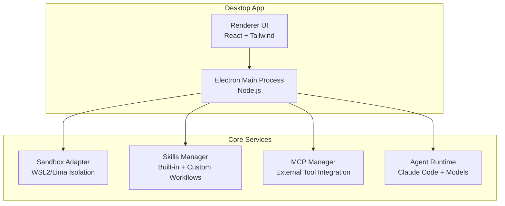
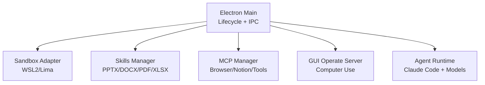
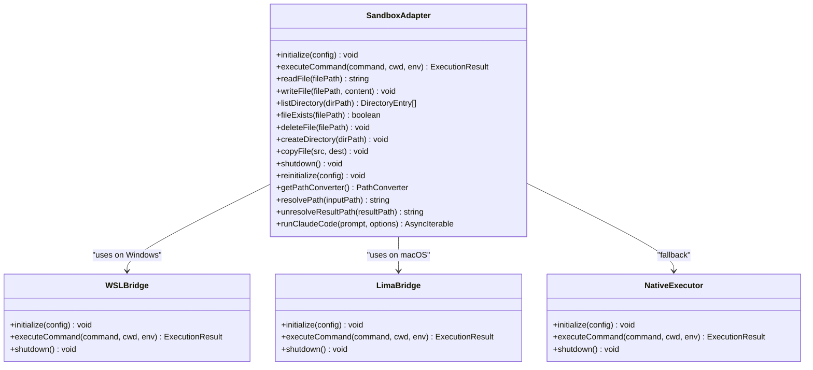
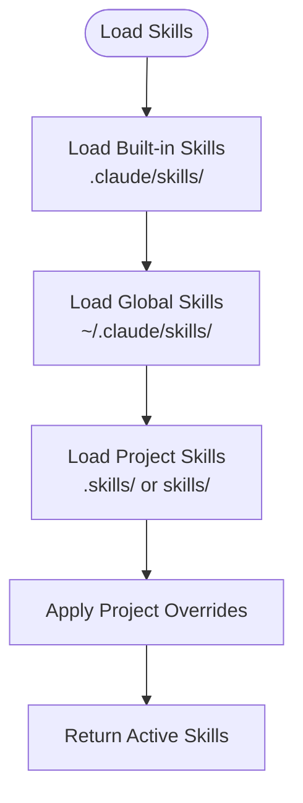
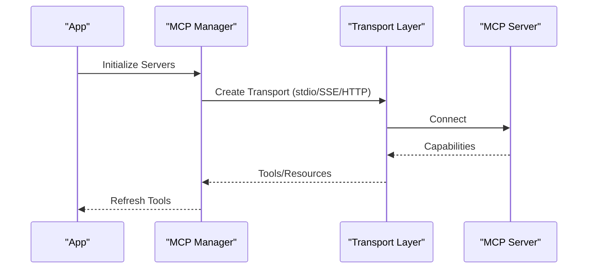
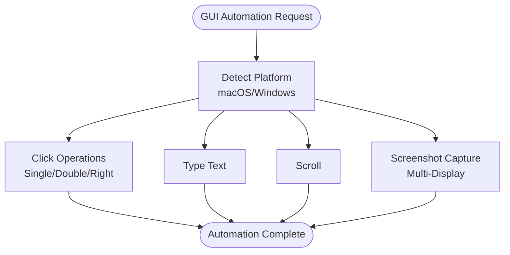
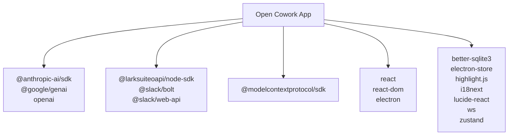

# Introduction and Purpose

<cite>
**Referenced Files in This Document**
- [readme.md](file://readme.md)
- [README_zh.md](file://README_zh.md)
- [package.json](file://package.json)
- [src/main/index.ts](file://src/main/index.ts)
- [src/main/sandbox/sandbox-adapter.ts](file://src/main/sandbox/sandbox-adapter.ts)
- [src/main/skills/skills-manager.ts](file://src/main/skills/skills-manager.ts)
- [src/main/mcp/mcp-manager.ts](file://src/main/mcp/mcp-manager.ts)
- [src/main/mcp/gui-operate-server.ts](file://src/main/mcp/gui-operate-server.ts)
- [.claude/skills/docx/SKILL.md](file://.claude/skills/docx/SKILL.md)
- [.claude/skills/pdf/SKILL.md](file://.claude/skills/pdf/SKILL.md)
- [ROADMAP.md](file://ROADMAP.md)
</cite>

## Table of Contents

1. [Introduction](#introduction)
2. [Project Structure](#project-structure)
3. [Core Components](#core-components)
4. [Architecture Overview](#architecture-overview)
5. [Detailed Component Analysis](#detailed-component-analysis)
6. [Dependency Analysis](#dependency-analysis)
7. [Performance Considerations](#performance-considerations)
8. [Troubleshooting Guide](#troubleshooting-guide)
9. [Conclusion](#conclusion)

## Introduction

Open Cowork is an open-source AI agent desktop application that brings powerful AI-driven automation to your desktop. It provides a unified, user-friendly interface for multiple AI providers while offering integrated tools, skills, and sandboxed execution capabilities. Designed to make AI-powered desktop automation accessible to everyone, Open Cowork wraps Claude Code, OpenAI, Gemini, DeepSeek, and other AI models into a single GUI with one-click installers for Windows and macOS—no coding required.

### Mission Statement

Open Cowork’s mission is to democratize AI desktop automation by combining:

- A simple, secure, and accessible desktop app
- Multi-provider AI support (Claude, OpenAI-compatible APIs, and Chinese models)
- A robust skills system for document generation and processing
- Secure sandbox execution with VM-level isolation
- MCP (Model Context Protocol) integration for connecting to browsers, Notion, and other desktop apps
- GUI automation capabilities for interacting with desktop applications

### Relationship to Claude Cowork

Open Cowork is the open-source implementation of Claude Cowork. While Claude Cowork focuses primarily on Claude integration, Open Cowork expands the vision by:

- Supporting multiple AI providers beyond Claude
- Adding GUI automation via computer use
- Enabling remote control through Feishu (Lark) and Slack
- Providing VM-level sandbox isolation for enhanced security

### How Open Cowork Differs From Other AI Desktop Applications

- **Multi-provider AI support**: Works with Claude, OpenAI-compatible APIs, and Chinese models like GLM, MiniMax, and Kimi
- **Integrated skills system**: Built-in workflows for PPTX, DOCX, PDF, and XLSX generation and processing
- **Secure sandbox execution**: VM-level isolation using WSL2 (Windows) and Lima (macOS) to protect your host system
- **MCP connectors**: Connect to browsers, Notion, and other desktop apps to extend AI capabilities
- **GUI automation**: Control and interact with desktop GUI applications for broader automation scenarios
- **Remote collaboration**: Automate workflows and cross-platform operations via Feishu and Slack

### Core Value Propositions

- **One-click installation**: Pre-built installers for Windows and macOS—no environment setup needed
- **Multi-provider AI support**: Flexible configuration for Claude, OpenAI-compatible APIs, and Chinese models
- **Secure sandbox execution**: VM-level isolation (WSL2 on Windows, Lima on macOS) with path-based safeguards
- **Extensive built-in skills system**: Generate and process professional documents (PPTX, DOCX, PDF, XLSX) with custom skill creation
- **MCP integration**: Connect external tools and services for expanded AI capabilities
- **GUI automation**: Interact with desktop applications for advanced automation scenarios
- **Remote collaboration**: Automate workflows and cross-platform operations via Feishu and Slack

### Practical Examples

- **Document processing**: Transform CSV data into a PowerPoint presentation summarizing financial reports
- **GUI automation**: Automate repetitive tasks by controlling desktop applications through screenshots and mouse/keyboard actions
- **Remote collaboration**: Receive commands and deliver results via Feishu or Slack for cross-platform workflows
- **Workflow automation**: Use skills and MCP connectors to orchestrate multi-step processes across applications

These examples illustrate how Open Cowork empowers users to leverage AI for everyday productivity tasks, from document generation to desktop automation and remote collaboration.

**Section sources**

- [readme.md:30-31](file://readme.md#L30-L31)
- [readme.md:36-38](file://readme.md#L36-L38)
- [readme.md:289-293](file://readme.md#L289-L293)
- [README_zh.md:30-31](file://README_zh.md#L30-L31)
- [README_zh.md:36-38](file://README_zh.md#L36-L38)
- [README_zh.md:280-284](file://README_zh.md#L280-L284)

## Project Structure

Open Cowork follows a layered architecture:

- Electron main process (Node.js) orchestrates app lifecycle, IPC, sandbox execution, skills, MCP, and UI
- Renderer process (React + Tailwind) provides the user interface
- Sandbox layer manages secure execution with VM-level isolation
- Skills system handles built-in and custom workflows
- MCP manager connects external tools and services

**Diagram sources**

- [src/main/index.ts:1-14](file://src/main/index.ts#L1-L14)
- [src/main/sandbox/sandbox-adapter.ts:1-12](file://src/main/sandbox/sandbox-adapter.ts#L1-L12)
- [src/main/skills/skills-manager.ts:1-13](file://src/main/skills/skills-manager.ts#L1-L13)
- [src/main/mcp/mcp-manager.ts:1-13](file://src/main/mcp/mcp-manager.ts#L1-L13)

**Section sources**

- [readme.md:214-273](file://readme.md#L214-L273)
- [README_zh.md:205-264](file://README_zh.md#L205-L264)

## Core Components

- Electron main process: App lifecycle, IPC, window management, and service coordination
- Sandbox adapter: Platform-aware sandbox execution with WSL2/Lima isolation
- Skills manager: Discovery, loading, and lifecycle management of built-in and custom skills
- MCP manager: Server configuration, lifecycle, and transport handling for external tools
- GUI operate server: Computer use capabilities for GUI automation on macOS and Windows
- Renderer UI: Chat interface, settings, and control panels

**Section sources**

- [src/main/index.ts:1-14](file://src/main/index.ts#L1-L14)
- [src/main/sandbox/sandbox-adapter.ts:1-12](file://src/main/sandbox/sandbox-adapter.ts#L1-L12)
- [src/main/skills/skills-manager.ts:1-13](file://src/main/skills/skills-manager.ts#L1-L13)
- [src/main/mcp/mcp-manager.ts:1-13](file://src/main/mcp/mcp-manager.ts#L1-L13)
- [src/main/mcp/gui-operate-server.ts:1-19](file://src/main/mcp/gui-operate-server.ts#L1-L19)

## Architecture Overview

Open Cowork integrates multiple subsystems to deliver a cohesive desktop automation experience:

- App lifecycle and IPC handled by the Electron main process
- Secure execution via sandbox adapter with VM-level isolation
- Skills system for document generation and processing
- MCP connectors for browser, Notion, and other desktop integrations
- GUI automation for desktop application control

**Diagram sources**

- [src/main/index.ts:1-14](file://src/main/index.ts#L1-L14)
- [src/main/sandbox/sandbox-adapter.ts:1-12](file://src/main/sandbox/sandbox-adapter.ts#L1-L12)
- [src/main/skills/skills-manager.ts:1-13](file://src/main/skills/skills-manager.ts#L1-L13)
- [src/main/mcp/mcp-manager.ts:1-13](file://src/main/mcp/mcp-manager.ts#L1-L13)
- [src/main/mcp/gui-operate-server.ts:1-19](file://src/main/mcp/gui-operate-server.ts#L1-L19)

## Detailed Component Analysis

### Sandbox Adapter

The sandbox adapter provides a unified interface for secure command execution and file operations across platforms:

- Windows: WSL2 integration for isolated Linux execution
- macOS: Lima integration for isolated Linux execution
- Fallback: Native execution with path-based restrictions

**Diagram sources**

- [src/main/sandbox/sandbox-adapter.ts:53-712](file://src/main/sandbox/sandbox-adapter.ts#L53-L712)

**Section sources**

- [src/main/sandbox/sandbox-adapter.ts:1-12](file://src/main/sandbox/sandbox-adapter.ts#L1-L12)
- [src/main/sandbox/sandbox-adapter.ts:116-156](file://src/main/sandbox/sandbox-adapter.ts#L116-L156)
- [src/main/sandbox/sandbox-adapter.ts:311-335](file://src/main/sandbox/sandbox-adapter.ts#L311-L335)

### Skills Manager

The skills manager discovers built-in skills from the .claude/skills directory, parses metadata, and supports hot-reload and custom skill management:

- Built-in skills: PPTX, DOCX, PDF, XLSX
- Custom skills: User-defined workflows with SKILL.md metadata
- Project-level skills: Override built-in/global with project-specific configurations
- MCP skills: Connect external tools via MCP servers

**Diagram sources**

- [src/main/skills/skills-manager.ts:112-121](file://src/main/skills/skills-manager.ts#L112-L121)
- [src/main/skills/skills-manager.ts:471-486](file://src/main/skills/skills-manager.ts#L471-L486)
- [src/main/skills/skills-manager.ts:649-681](file://src/main/skills/skills-manager.ts#L649-L681)

**Section sources**

- [src/main/skills/skills-manager.ts:1-13](file://src/main/skills/skills-manager.ts#L1-L13)
- [src/main/skills/skills-manager.ts:126-174](file://src/main/skills/skills-manager.ts#L126-L174)
- [src/main/skills/skills-manager.ts:491-514](file://src/main/skills/skills-manager.ts#L491-L514)
- [src/main/skills/skills-manager.ts:649-681](file://src/main/skills/skills-manager.ts#L649-L681)

### MCP Manager

The MCP manager handles server configuration, lifecycle, and transport for connecting external tools:

- Transport types: stdio, SSE, Streamable HTTP
- OAuth integration for secure connections
- Tool discovery and resource prompts
- Server management and health checks

**Diagram sources**

- [src/main/mcp/mcp-manager.ts:526-585](file://src/main/mcp/mcp-manager.ts#L526-L585)
- [src/main/mcp/mcp-manager.ts:734-747](file://src/main/mcp/mcp-manager.ts#L734-L747)

**Section sources**

- [src/main/mcp/mcp-manager.ts:1-13](file://src/main/mcp/mcp-manager.ts#L1-L13)
- [src/main/mcp/mcp-manager.ts:526-585](file://src/main/mcp/mcp-manager.ts#L526-L585)
- [src/main/mcp/mcp-manager.ts:734-747](file://src/main/mcp/mcp-manager.ts#L734-L747)

### GUI Operate Server

The GUI operate server enables computer use capabilities for GUI automation:

- Click, double-click, right-click, typing, scrolling
- Screenshot capture and multi-display support
- Platform-specific tools (macOS: cliclick + AppleScript; Windows: PowerShell + .NET)

**Diagram sources**

- [src/main/mcp/gui-operate-server.ts:1-19](file://src/main/mcp/gui-operate-server.ts#L1-L19)
- [src/main/mcp/gui-operate-server.ts:40-42](file://src/main/mcp/gui-operate-server.ts#L40-L42)

**Section sources**

- [src/main/mcp/gui-operate-server.ts:1-19](file://src/main/mcp/gui-operate-server.ts#L1-L19)
- [src/main/mcp/gui-operate-server.ts:40-42](file://src/main/mcp/gui-operate-server.ts#L40-L42)

### Practical Use Cases

- Document processing: Use the DOCX skill to create and edit professional documents, or the PDF skill to extract text and tables
- GUI automation: Automate repetitive tasks by controlling desktop applications through screenshots and mouse/keyboard actions
- Remote collaboration: Send commands and receive results via Feishu or Slack for cross-platform workflows
- Workflow automation: Combine skills and MCP connectors to orchestrate multi-step processes across applications

**Section sources**

- [.claude/skills/docx/SKILL.md:1-5](file://.claude/skills/docx/SKILL.md#L1-L5)
- [.claude/skills/pdf/SKILL.md:1-5](file://.claude/skills/pdf/SKILL.md#L1-L5)
- [readme.md:74-92](file://readme.md#L74-L92)
- [README_zh.md:74-84](file://README_zh.md#L74-L84)

## Dependency Analysis

Open Cowork integrates a wide range of dependencies to support AI models, desktop automation, and security:

- AI SDKs: @anthropic-ai/sdk, @google/genai, openai
- Collaboration: @larksuiteoapi/node-sdk, @slack/bolt, @slack/web-api
- MCP: @modelcontextprotocol/sdk
- UI and utilities: react, react-dom, electron, electron-store, better-sqlite3, highlight.js, i18next, lucide-react, ws, zustand

**Diagram sources**

- [package.json:67-101](file://package.json#L67-L101)

**Section sources**

- [package.json:1-148](file://package.json#L1-L148)

## Performance Considerations

- Sandbox initialization: Background bootstrap pre-initializes WSL/Lima environments at app startup to improve responsiveness
- Path resolution: Efficient path conversion between host and VM environments reduces overhead
- MCP transport: Optimized transport selection (stdio/SSE/Streamable HTTP) balances performance and reliability
- Skills hot-reload: File watchers and polling minimize reload latency for custom skills

[No sources needed since this section provides general guidance]

## Troubleshooting Guide

- Sandbox warnings: If WSL2 or Lima are unavailable, the app falls back to native execution with security warnings
- Node.js installation: On Windows, Node.js may need to be installed in WSL; on macOS, ensure Lima is installed
- MCP server errors: Verify bundled Node.js availability and PATH configuration for MCP servers
- Permissions: Some operations may require sudo or user approval; review permission dialogs carefully

**Section sources**

- [src/main/sandbox/sandbox-adapter.ts:339-462](file://src/main/sandbox/sandbox-adapter.ts#L339-L462)
- [src/main/mcp/mcp-manager.ts:305-320](file://src/main/mcp/mcp-manager.ts#L305-L320)

## Conclusion

Open Cowork delivers a powerful, secure, and accessible AI desktop automation solution. By combining multi-provider AI support, an extensive skills system, sandboxed execution, MCP integrations, and GUI automation capabilities, it makes AI-driven productivity achievable for everyone. Whether automating document processing, controlling desktop applications, collaborating remotely, or orchestrating complex workflows, Open Cowork provides the tools and flexibility needed to enhance daily productivity.

[No sources needed since this section summarizes without analyzing specific files]
