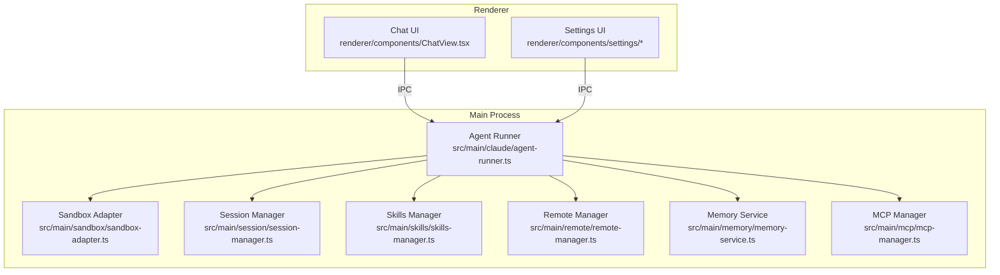
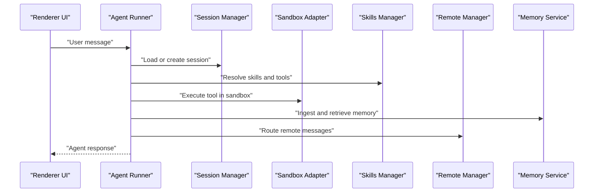
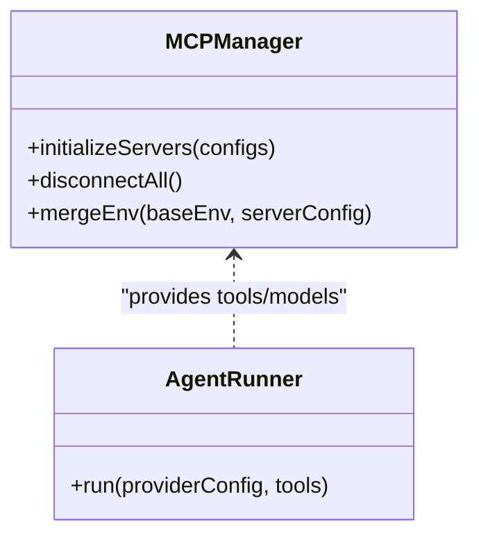
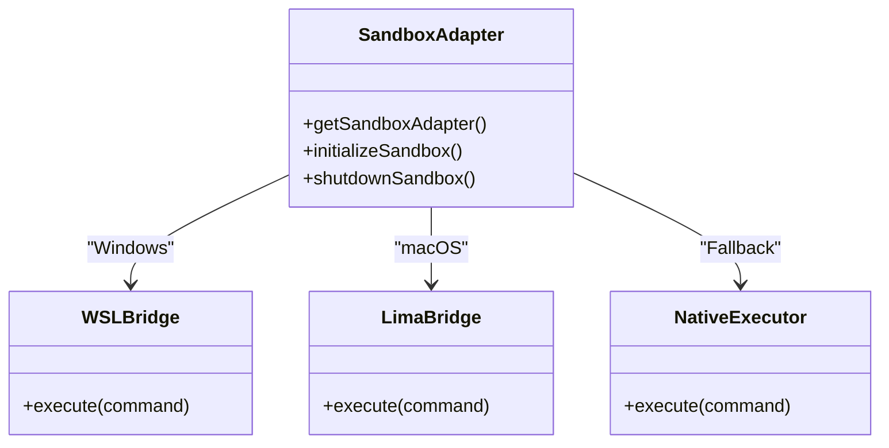
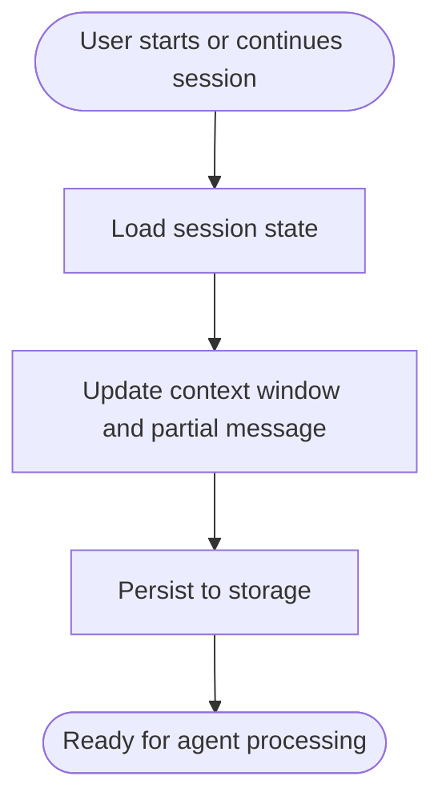
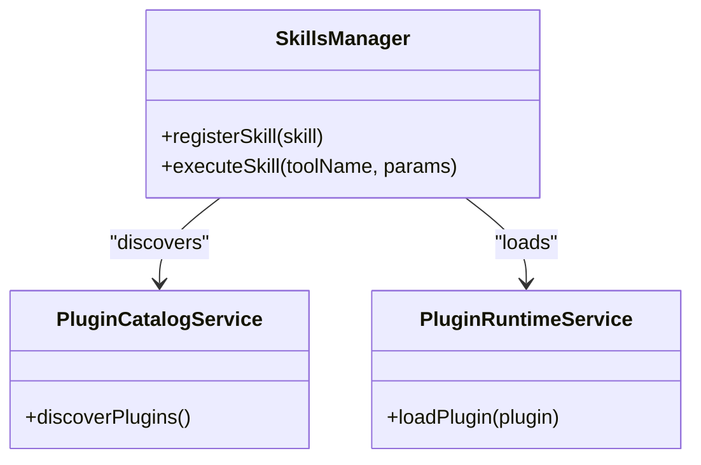
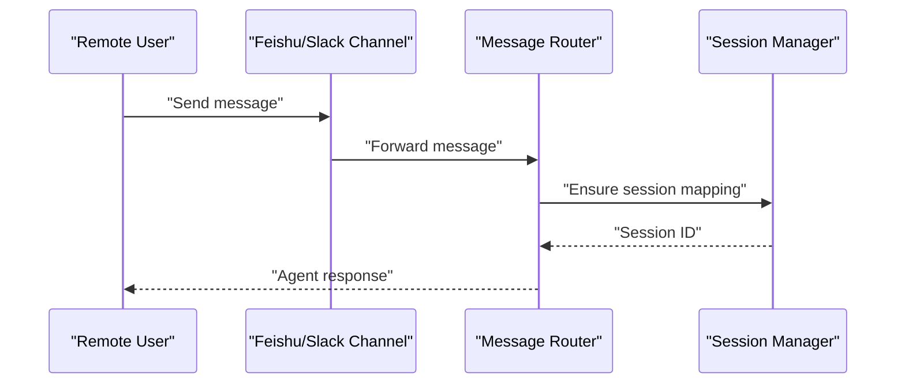
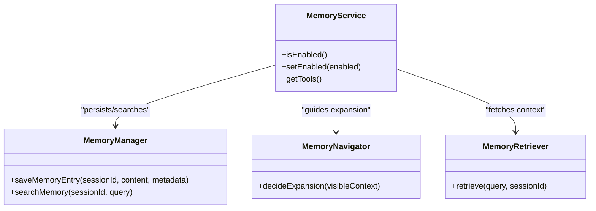
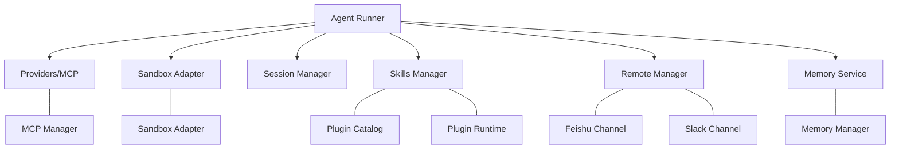

# Key Features Overview

<cite>
**Referenced Files in This Document**
- [agent-runner.ts](file://src/main/claude/agent-runner.ts)
- [index.ts](file://src/main/index.ts)
- [mcp-manager.ts](file://src/main/mcp/mcp-manager.ts)
- [gui-operate-server.ts](file://src/main/mcp/gui-operate-server.ts)
- [sandbox-adapter.ts](file://src/main/sandbox/sandbox-adapter.ts)
- [index.ts](file://src/main/sandbox/index.ts)
- [session-manager.ts](file://src/main/session/session-manager.ts)
- [skills-manager.ts](file://src/main/skills/skills-manager.ts)
- [plugin-catalog-service.ts](file://src/main/skills/plugin-catalog-service.ts)
- [plugin-runtime-service.ts](file://src/main/skills/plugin-runtime-service.ts)
- [remote-manager.ts](file://src/main/remote/remote-manager.ts)
- [feishu-channel.ts](file://src/main/remote/channels/feishu/feishu-channel.ts)
- [slack-channel.ts](file://src/main/remote/channels/slack/slack-channel.ts)
- [memory-manager.ts](file://src/main/memory/memory-manager.ts)
- [memory-service.ts](file://src/main/memory/memory-service.ts)
- [memory-tools.ts](file://src/main/memory/memory-tools.ts)
- [memory-prompts.ts](file://src/main/memory/memory-prompts.ts)
- [memory-navigator.ts](file://src/main/memory/memory-navigator.ts)
- [memory-retriever.ts](file://src/main/memory/memory-retriever.ts)
- [memory-state-store.ts](file://src/main/memory/memory-state-store.ts)
- [memory-ingestion-queue.ts](file://src/main/memory/memory-ingestion-queue.ts)
- [memory-llm-client.ts](file://src/main/memory/memory-llm-client.ts)
- [memory-utils.ts](file://src/main/memory/memory-utils.ts)
- [client-event-utils.ts](file://src/main/client-event-utils.ts)
- [message-router.ts](file://src/main/remote/message-router.ts)
- [memory-eval-harness.test.ts](file://src/tests/memory/memory-eval-harness.test.ts)
- [README_zh.md](file://README_zh.md)
- [readme.md](file://readme.md)
</cite>

## Table of Contents

1. [Introduction](#introduction)
2. [Project Structure](#project-structure)
3. [Core Components](#core-components)
4. [Architecture Overview](#architecture-overview)
5. [Detailed Component Analysis](#detailed-component-analysis)
6. [Dependency Analysis](#dependency-analysis)
7. [Performance Considerations](#performance-considerations)
8. [Troubleshooting Guide](#troubleshooting-guide)
9. [Conclusion](#conclusion)

## Introduction

Open Cowork delivers a cohesive desktop AI experience by integrating six primary feature categories:

- AI provider integration with multi-provider support
- Sandboxed execution environment with platform-specific isolation
- Session management with persistent conversations
- Skills and tools system with built-in document processing
- Remote collaboration via Feishu and Slack channels
- Memory and knowledge base systems

These features are unified by a robust agent runner architecture, MCP protocol integration, and cross-platform compatibility that ensures reliable, secure, and extensible operation across macOS, Windows, and Linux environments.

## Project Structure

The application follows an Electron-based architecture with a clear separation between the main process (Node.js), preload scripts, and the renderer (React). The main process orchestrates AI agents, memory, sandboxing, skills, and remote channels, while the renderer provides the user interface and integrates with the main process via IPC.

**Diagram sources**

- [agent-runner.ts](file://src/main/claude/agent-runner.ts)
- [sandbox-adapter.ts](file://src/main/sandbox/sandbox-adapter.ts)
- [session-manager.ts](file://src/main/session/session-manager.ts)
- [skills-manager.ts](file://src/main/skills/skills-manager.ts)
- [remote-manager.ts](file://src/main/remote/remote-manager.ts)
- [memory-service.ts](file://src/main/memory/memory-service.ts)
- [mcp-manager.ts](file://src/main/mcp/mcp-manager.ts)

**Section sources**

- [readme.md](file://readme.md)
- [README_zh.md](file://README_zh.md)

## Core Components

This section introduces the six feature categories and their core functionality, benefits, and typical use cases.

- AI provider integration with multi-provider support
  - Core functionality: Unified orchestration of multiple AI providers through a consistent interface, enabling flexible model selection and fallback strategies.
  - Benefits: Reduces dependency on a single provider, improves resilience, and allows dynamic switching based on availability and cost.
  - Typical use cases: Multi-cloud deployments, failover scenarios, and provider-agnostic workflows.
  - Technical highlights: MCP protocol integration enables standardized tool and model access across providers.

- Sandboxed execution environment with platform-specific isolation
  - Core functionality: Secure execution of tools and scripts with strict path containment and platform bridges for macOS (Lima) and Windows (WSL).
  - Benefits: Prevents unauthorized file system access, reduces risk of malicious code, and maintains system stability.
  - Typical use cases: Document processing, external tool invocation, and automated workflows requiring elevated privileges.
  - Technical highlights: Cross-platform compatibility via adapter pattern and path guard utilities.

- Session management with persistent conversations
  - Core functionality: Persistent storage and retrieval of conversation history, context windows, and partial messages per session.
  - Benefits: Enables long-running tasks, iterative refinement, and seamless continuation across application restarts.
  - Typical use cases: Research workflows, project planning, and multi-step problem solving.
  - Technical highlights: Isolation between sessions prevents cross-session interference.

- Skills and tools system with built-in document processing
  - Core functionality: Extensible skill registry and runtime that supports document processing (PDF, DOCX, PPTX, XLSX) and custom tool execution.
  - Benefits: Rapidly extends capabilities without modifying core code, streamlines repetitive tasks, and integrates third-party tools.
  - Typical use cases: Report generation, data extraction, form filling, and presentation creation.
  - Technical highlights: Progressive disclosure design keeps context minimal while enabling on-demand resource loading.

- Remote collaboration via Feishu and Slack channels
  - Core functionality: Bidirectional messaging and session mapping across Feishu and Slack, supporting group and direct messages.
  - Benefits: Enables team collaboration, centralized coordination, and asynchronous workflows.
  - Typical use cases: Team stand-ups, project reviews, and distributed QA processes.
  - Technical highlights: Message routing and session mapping ensure coherent conversation continuity.

- Memory and knowledge base systems
  - Core functionality: Structured memory extraction, navigation, retrieval, and tool integration for memory search and read operations.
  - Benefits: Enhances contextual awareness, reduces repetition, and supports long-term learning across sessions.
  - Typical use cases: Knowledge consolidation, research synthesis, and personalized assistance.
  - Technical highlights: Modular components (extractors, retriever, navigator) enable flexible prompt-driven optimization.

**Section sources**

- [mcp-manager.ts](file://src/main/mcp/mcp-manager.ts)
- [sandbox-adapter.ts](file://src/main/sandbox/sandbox-adapter.ts)
- [session-manager.ts](file://src/main/session/session-manager.ts)
- [skills-manager.ts](file://src/main/skills/skills-manager.ts)
- [plugin-catalog-service.ts](file://src/main/skills/plugin-catalog-service.ts)
- [plugin-runtime-service.ts](file://src/main/skills/plugin-runtime-service.ts)
- [remote-manager.ts](file://src/main/remote/remote-manager.ts)
- [feishu-channel.ts](file://src/main/remote/channels/feishu/feishu-channel.ts)
- [slack-channel.ts](file://src/main/remote/channels/slack/slack-channel.ts)
- [memory-manager.ts](file://src/main/memory/memory-manager.ts)
- [memory-service.ts](file://src/main/memory/memory-service.ts)
- [memory-tools.ts](file://src/main/memory/memory-tools.ts)
- [memory-prompts.ts](file://src/main/memory/memory-prompts.ts)
- [memory-navigator.ts](file://src/main/memory/memory-navigator.ts)
- [memory-retriever.ts](file://src/main/memory/memory-retriever.ts)
- [memory-state-store.ts](file://src/main/memory/memory-state-store.ts)
- [memory-ingestion-queue.ts](file://src/main/memory/memory-ingestion-queue.ts)
- [memory-llm-client.ts](file://src/main/memory/memory-llm-client.ts)
- [memory-utils.ts](file://src/main/memory/memory-utils.ts)

## Architecture Overview

The agent runner architecture coordinates AI providers, sandbox execution, session management, skills/tools, remote channels, and memory systems. It leverages the MCP protocol to integrate tools and models, ensuring a standardized and extensible interface.

**Diagram sources**

- [agent-runner.ts](file://src/main/claude/agent-runner.ts)
- [session-manager.ts](file://src/main/session/session-manager.ts)
- [sandbox-adapter.ts](file://src/main/sandbox/sandbox-adapter.ts)
- [skills-manager.ts](file://src/main/skills/skills-manager.ts)
- [remote-manager.ts](file://src/main/remote/remote-manager.ts)
- [memory-service.ts](file://src/main/memory/memory-service.ts)

## Detailed Component Analysis

### AI Provider Integration with Multi-Provider Support

- Core functionality
  - Centralized provider orchestration and model resolution
  - MCP server initialization and environment management
- Benefits
  - Flexible provider selection and failover
  - Standardized tool/model access across providers
- Typical use cases
  - Multi-cloud model serving
  - Cost-aware provider switching
- Technical highlights
  - MCP protocol integration for tool discovery and invocation
  - Environment merging and PATH normalization for consistent execution

**Diagram sources**

- [mcp-manager.ts](file://src/main/mcp/mcp-manager.ts)
- [agent-runner.ts](file://src/main/claude/agent-runner.ts)

**Section sources**

- [mcp-manager.ts](file://src/main/mcp/mcp-manager.ts)
- [agent-runner.ts](file://src/main/claude/agent-runner.ts)

### Sandboxed Execution Environment with Platform-Specific Isolation

- Core functionality
  - Platform bridges for macOS (Lima) and Windows (WSL)
  - Path containment and path guard validation
  - Native executor for direct system commands
- Benefits
  - Secure execution with strict boundaries
  - Cross-platform compatibility
- Typical use cases
  - Document processing scripts
  - External tool invocation
- Technical highlights
  - Adapter pattern for platform abstraction
  - Path resolver and sync utilities for consistent behavior

**Diagram sources**

- [sandbox-adapter.ts](file://src/main/sandbox/sandbox-adapter.ts)
- [index.ts](file://src/main/sandbox/index.ts)

**Section sources**

- [sandbox-adapter.ts](file://src/main/sandbox/sandbox-adapter.ts)
- [index.ts](file://src/main/sandbox/index.ts)

### Session Management with Persistent Conversations

- Core functionality
  - Session creation, continuation, and deletion
  - Persistent message cache and context window management
  - Cross-session isolation guarantees
- Benefits
  - Seamless conversation continuity
  - Isolated state per session
- Typical use cases
  - Long-running projects
  - Iterative feedback loops
- Technical highlights
  - Event gating for session-managed IPC events
  - Partial message handling for streaming responses

**Diagram sources**

- [session-manager.ts](file://src/main/session/session-manager.ts)
- [client-event-utils.ts](file://src/main/client-event-utils.ts)

**Section sources**

- [session-manager.ts](file://src/main/session/session-manager.ts)
- [client-event-utils.ts](file://src/main/client-event-utils.ts)

### Skills and Tools System with Built-in Document Processing

- Core functionality
  - Plugin catalog and runtime service
  - Skill registration and execution
  - Built-in document processing (PDF, DOCX, PPTX, XLSX)
- Benefits
  - Extensible capabilities without core modifications
  - Efficient document workflows
- Typical use cases
  - Report generation and data extraction
  - Presentation automation
- Technical highlights
  - Progressive disclosure design to minimize context load
  - Skill creator toolkit for rapid development

**Diagram sources**

- [skills-manager.ts](file://src/main/skills/skills-manager.ts)
- [plugin-catalog-service.ts](file://src/main/skills/plugin-catalog-service.ts)
- [plugin-runtime-service.ts](file://src/main/skills/plugin-runtime-service.ts)

**Section sources**

- [skills-manager.ts](file://src/main/skills/skills-manager.ts)
- [plugin-catalog-service.ts](file://src/main/skills/plugin-catalog-service.ts)
- [plugin-runtime-service.ts](file://src/main/skills/plugin-runtime-service.ts)

### Remote Collaboration via Feishu and Slack Channels

- Core functionality
  - Channel abstraction for Feishu and Slack
  - Message routing and session mapping
  - Group and direct message support
- Benefits
  - Team-centric workflows
  - Centralized collaboration
- Typical use cases
  - Distributed team coordination
  - Asynchronous collaboration
- Technical highlights
  - Session mapping ensures coherent conversation continuity across channels

**Diagram sources**

- [feishu-channel.ts](file://src/main/remote/channels/feishu/feishu-channel.ts)
- [slack-channel.ts](file://src/main/remote/channels/slack/slack-channel.ts)
- [message-router.ts](file://src/main/remote/message-router.ts)
- [session-manager.ts](file://src/main/session/session-manager.ts)

**Section sources**

- [feishu-channel.ts](file://src/main/remote/channels/feishu/feishu-channel.ts)
- [slack-channel.ts](file://src/main/remote/channels/slack/slack-channel.ts)
- [message-router.ts](file://src/main/remote/message-router.ts)
- [session-manager.ts](file://src/main/session/session-manager.ts)

### Memory and Knowledge Base Systems

- Core functionality
  - Core and experience memory extraction
  - Memory navigation and retrieval
  - Memory tools for search and read operations
- Benefits
  - Enhanced contextual awareness
  - Reduced repetition and improved recall
- Typical use cases
  - Knowledge consolidation
  - Personalized assistance
- Technical highlights
  - Modular components with configurable prompts
  - Optional FTS behavior controlled by configuration

**Diagram sources**

- [memory-service.ts](file://src/main/memory/memory-service.ts)
- [memory-manager.ts](file://src/main/memory/memory-manager.ts)
- [memory-navigator.ts](file://src/main/memory/memory-navigator.ts)
- [memory-retriever.ts](file://src/main/memory/memory-retriever.ts)
- [memory-tools.ts](file://src/main/memory/memory-tools.ts)

**Section sources**

- [memory-service.ts](file://src/main/memory/memory-service.ts)
- [memory-manager.ts](file://src/main/memory/memory-manager.ts)
- [memory-navigator.ts](file://src/main/memory/memory-navigator.ts)
- [memory-retriever.ts](file://src/main/memory/memory-retriever.ts)
- [memory-tools.ts](file://src/main/memory/memory-tools.ts)
- [memory-prompts.ts](file://src/main/memory/memory-prompts.ts)
- [memory-state-store.ts](file://src/main/memory/memory-state-store.ts)
- [memory-ingestion-queue.ts](file://src/main/memory/memory-ingestion-queue.ts)
- [memory-llm-client.ts](file://src/main/memory/memory-llm-client.ts)
- [memory-utils.ts](file://src/main/memory/memory-utils.ts)

## Dependency Analysis

The following diagram illustrates key dependencies among major components, highlighting how the agent runner integrates providers, sandbox, sessions, skills, remotes, and memory.

**Diagram sources**

- [agent-runner.ts](file://src/main/claude/agent-runner.ts)
- [mcp-manager.ts](file://src/main/mcp/mcp-manager.ts)
- [sandbox-adapter.ts](file://src/main/sandbox/sandbox-adapter.ts)
- [session-manager.ts](file://src/main/session/session-manager.ts)
- [skills-manager.ts](file://src/main/skills/skills-manager.ts)
- [plugin-catalog-service.ts](file://src/main/skills/plugin-catalog-service.ts)
- [plugin-runtime-service.ts](file://src/main/skills/plugin-runtime-service.ts)
- [remote-manager.ts](file://src/main/remote/remote-manager.ts)
- [feishu-channel.ts](file://src/main/remote/channels/feishu/feishu-channel.ts)
- [slack-channel.ts](file://src/main/remote/channels/slack/slack-channel.ts)
- [memory-service.ts](file://src/main/memory/memory-service.ts)
- [memory-manager.ts](file://src/main/memory/memory-manager.ts)

**Section sources**

- [agent-runner.ts](file://src/main/claude/agent-runner.ts)
- [mcp-manager.ts](file://src/main/mcp/mcp-manager.ts)
- [sandbox-adapter.ts](file://src/main/sandbox/sandbox-adapter.ts)
- [session-manager.ts](file://src/main/session/session-manager.ts)
- [skills-manager.ts](file://src/main/skills/skills-manager.ts)
- [plugin-catalog-service.ts](file://src/main/skills/plugin-catalog-service.ts)
- [plugin-runtime-service.ts](file://src/main/skills/plugin-runtime-service.ts)
- [remote-manager.ts](file://src/main/remote/remote-manager.ts)
- [feishu-channel.ts](file://src/main/remote/channels/feishu/feishu-channel.ts)
- [slack-channel.ts](file://src/main/remote/channels/slack/slack-channel.ts)
- [memory-service.ts](file://src/main/memory/memory-service.ts)
- [memory-manager.ts](file://src/main/memory/memory-manager.ts)

## Performance Considerations

- Sandboxing overhead: Platform bridges introduce minimal latency; use caching and batch operations for frequent tool invocations.
- Memory retrieval: Prefer targeted queries and leverage memory navigation to avoid unnecessary expansions.
- Session isolation: Keep sessions focused to reduce context window growth and improve responsiveness.
- MCP server initialization: Reuse initialized servers and avoid redundant reinitializations to minimize startup delays.
- Remote message routing: Use efficient session mapping to prevent duplicate or stale mappings.

## Troubleshooting Guide

- Agent runner loop guard
  - Symptom: Unexpected termination or infinite loops during agent runs.
  - Action: Review loop guard mechanisms and abort conditions in the agent runner.
  - Section sources
    - [agent-runner.ts](file://src/main/claude/agent-runner.ts)

- MCP server initialization
  - Symptom: Tools unavailable or environment mismatch.
  - Action: Verify server configurations and environment merging; ensure PATH normalization and header propagation.
  - Section sources
    - [mcp-manager.ts](file://src/main/mcp/mcp-manager.ts)

- Sandbox path containment
  - Symptom: Permission errors or unexpected file access.
  - Action: Validate path guard rules and platform-specific path conversions; confirm adapter mode alignment.
  - Section sources
    - [sandbox-adapter.ts](file://src/main/sandbox/sandbox-adapter.ts)
    - [index.ts](file://src/main/sandbox/index.ts)

- Session state isolation
  - Symptom: Cross-session interference or lost context.
  - Action: Confirm session ID scoping and partial message handling; verify event gating for session-managed operations.
  - Section sources
    - [session-manager.ts](file://src/main/session/session-manager.ts)
    - [client-event-utils.ts](file://src/main/client-event-utils.ts)

- Memory search behavior
  - Symptom: Unexpected search results or performance degradation.
  - Action: Validate LIKE-based search queries and FTS configuration; review memory ingestion queue and state store.
  - Section sources
    - [memory-manager.ts](file://src/main/memory/memory-manager.ts)
    - [memory-ingestion-queue.ts](file://src/main/memory/memory-ingestion-queue.ts)
    - [memory-state-store.ts](file://src/main/memory/memory-state-store.ts)

- Remote message routing
  - Symptom: Messages not routed or duplicated.
  - Action: Inspect session mapping logic and ensure unique session keys per channel and sender.
  - Section sources
    - [message-router.ts](file://src/main/remote/message-router.ts)

## Conclusion

Open Cowork’s six feature categories—AI provider integration, sandboxed execution, session management, skills/tools, remote collaboration, and memory/knowledge—work together through a robust agent runner architecture and MCP protocol integration. This combination delivers a secure, extensible, and cross-platform desktop AI experience that scales from individual productivity to team collaboration, while maintaining strong performance and reliability.
