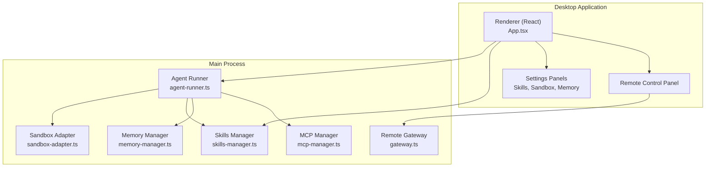
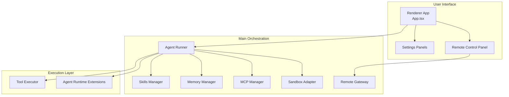
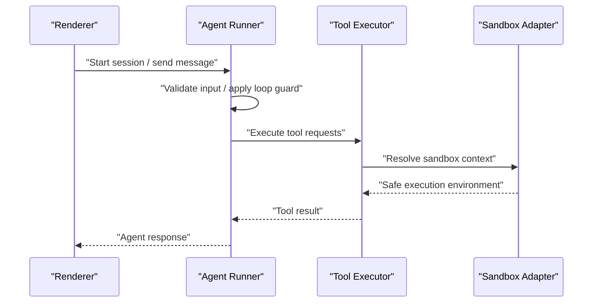
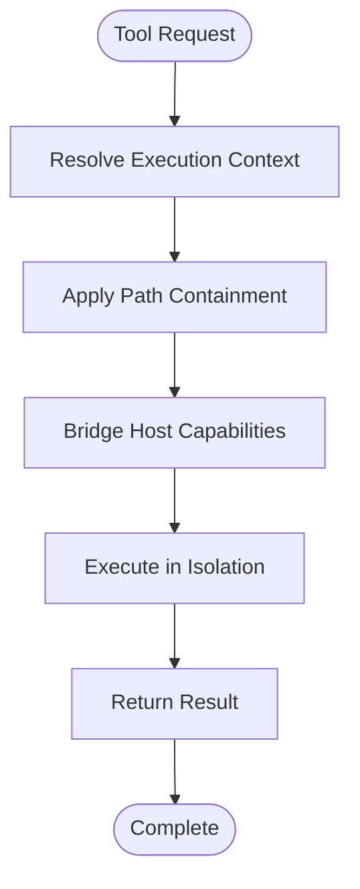
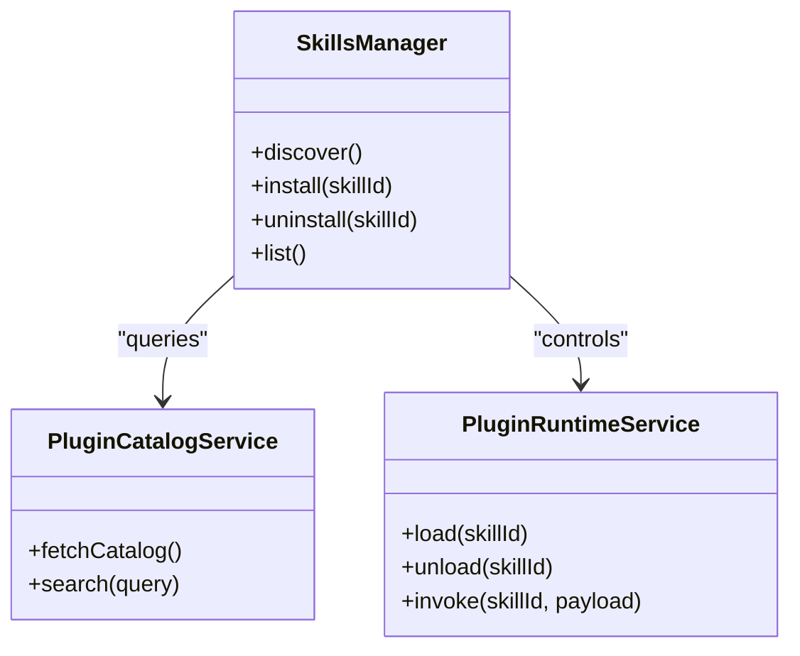
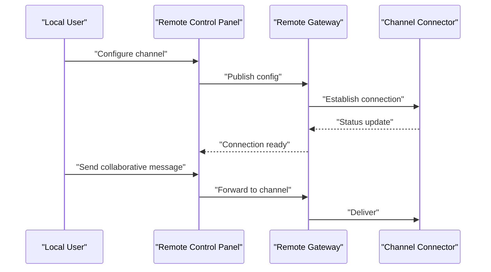
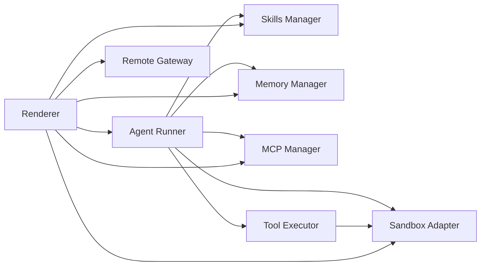

# Project Overview

<cite>
**Referenced Files in This Document**
- [README_zh.md](file://README_zh.md)
- [package.json](file://package.json)
- [src/main/index.ts](file://src/main/index.ts)
- [src/main/claude/agent-runner.ts](file://src/main/claude/agent-runner.ts)
- [src/main/sandbox/sandbox-adapter.ts](file://src/main/sandbox/sandbox-adapter.ts)
- [src/main/skills/skills-manager.ts](file://src/main/skills/skills-manager.ts)
- [src/main/mcp/mcp-manager.ts](file://src/main/mcp/mcp-manager.ts)
- [src/main/memory/memory-manager.ts](file://src/main/memory/memory-manager.ts)
- [src/main/extensions/agent-runtime-extension-manager.ts](file://src/main/extensions/agent-runtime-extension-manager.ts)
- [src/main/tools/tool-executor.ts](file://src/main/tools/tool-executor.ts)
- [src/main/remote/gateway.ts](file://src/main/remote/gateway.ts)
- [src/renderer/App.tsx](file://src/renderer/App.tsx)
- [src/renderer/components/settings/SettingsSkills.tsx](file://src/renderer/components/settings/SettingsSkills.tsx)
- [src/renderer/components/remote/RemoteControlPanel.tsx](file://src/renderer/components/remote/RemoteControlPanel.tsx)
- [.claude/skills/docx/SKILL.md](file://.claude/skills/docx/SKILL.md)
- [.claude/skills/pdf/SKILL.md](file://.claude/skills/pdf/SKILL.md)
- [.claude/skills/pptx/SKILL.md](file://.claude/skills/pptx/SKILL.md)
- [CONTRIBUTING.md](file://CONTRIBUTING.md)
- [CODE_OF_CONDUCT.md](file://CODE_OF_CONDUCT.md)
- [SECURITY.md](file://SECURITY.md)
</cite>

## Table of Contents

1. [Introduction](#introduction)
2. [Project Structure](#project-structure)
3. [Core Components](#core-components)
4. [Architecture Overview](#architecture-overview)
5. [Detailed Component Analysis](#detailed-component-analysis)
6. [Dependency Analysis](#dependency-analysis)
7. [Performance Considerations](#performance-considerations)
8. [Troubleshooting Guide](#troubleshooting-guide)
9. [Conclusion](#conclusion)
10. [Appendices](#appendices)

## Introduction

Open Cowork is an open-source AI agent desktop application designed to bring powerful AI-driven automation directly to your workstation. Its core mission is to make AI-powered desktop automation accessible to everyone—without requiring deep technical expertise. The project emphasizes practical productivity outcomes while maintaining strong security and privacy controls.

Key value propositions:

- One-click installation: Streamlined setup enables immediate use across platforms.
- Multi-provider AI support: Seamlessly integrate with various AI providers and local models.
- Sandboxed execution: A dedicated sandbox adapter ensures safe, isolated operation of tools and agents.
- Built-in skills system: A modular skills manager allows extending capabilities with reusable plugins and workflows.

Open Cowork is positioned as a desktop-first companion to Claude Cowork, aligning with the broader ecosystem’s goals of accessible, secure AI assistance for everyday tasks.

Why it matters:

- It lowers the barrier to adopting AI for routine work tasks such as document generation, GUI automation, and remote collaboration.
- It preserves user control and transparency via open-source development, clear licensing, and community-driven governance.

**Section sources**

- [README_zh.md](file://README_zh.md)
- [package.json](file://package.json)

## Project Structure

The project follows a hybrid Electron desktop architecture with a TypeScript/React renderer and a main process that orchestrates AI agents, sandbox execution, skills, memory, and integrations. Key areas:

- Main process: Agent runtime, sandbox adapter, skills manager, MCP integration, memory, remote collaboration, and configuration.
- Renderer: React-based UI for settings, chat, skills configuration, and remote control panels.
- Skills: A curated set of reusable capabilities under .claude/skills, each documented and licensed independently.
- Community: Contributing guidelines, code of conduct, and security policy define participation and safety.

**Diagram sources**

- [src/renderer/App.tsx](file://src/renderer/App.tsx)
- [src/main/claude/agent-runner.ts](file://src/main/claude/agent-runner.ts)
- [src/main/sandbox/sandbox-adapter.ts](file://src/main/sandbox/sandbox-adapter.ts)
- [src/main/skills/skills-manager.ts](file://src/main/skills/skills-manager.ts)
- [src/main/mcp/mcp-manager.ts](file://src/main/mcp/mcp-manager.ts)
- [src/main/memory/memory-manager.ts](file://src/main/memory/memory-manager.ts)
- [src/main/remote/gateway.ts](file://src/main/remote/gateway.ts)

**Section sources**

- [src/main/index.ts](file://src/main/index.ts)
- [src/renderer/App.tsx](file://src/renderer/App.tsx)

## Core Components

- Agent Runner: Coordinates end-to-end agent workflows, including message handling, loop guards, and integration with provider-specific SDKs.
- Sandbox Adapter: Enforces path containment, resolves execution contexts, and bridges host OS capabilities safely.
- Skills Manager: Manages discovery, installation, and lifecycle of skills, enabling extensibility through a plugin catalog service.
- MCP Manager: Integrates with Model Context Protocol servers to expose tools and capabilities as standardized services.
- Memory Manager: Provides ingestion, retrieval, and evaluation of contextual memories to improve agent performance.
- Remote Gateway: Enables secure remote collaboration channels with configurable connectors and message routing.
- Tool Executor: Executes tools within sandboxed contexts, ensuring isolation and safety during automation tasks.

Practical examples:

- Document generation: Use skills for docx, pdf, and pptx to create and manipulate office documents.
- GUI automation: Combine agent runner with sandbox adapter to automate desktop interactions safely.
- Remote collaboration: Leverage remote gateway and channels to coordinate with team members securely.

**Section sources**

- [src/main/claude/agent-runner.ts](file://src/main/claude/agent-runner.ts)
- [src/main/sandbox/sandbox-adapter.ts](file://src/main/sandbox/sandbox-adapter.ts)
- [src/main/skills/skills-manager.ts](file://src/main/skills/skills-manager.ts)
- [src/main/mcp/mcp-manager.ts](file://src/main/mcp/mcp-manager.ts)
- [src/main/memory/memory-manager.ts](file://src/main/memory/memory-manager.ts)
- [src/main/remote/gateway.ts](file://src/main/remote/gateway.ts)
- [src/main/tools/tool-executor.ts](file://src/main/tools/tool-executor.ts)

## Architecture Overview

Open Cowork’s architecture centers on the main process orchestrating agent workflows, while the renderer provides a user-friendly interface. The agent runner interacts with AI providers, manages tool execution via the sandbox adapter, and leverages the skills manager for extensibility. Memory and MCP layers enhance context and interoperability. Remote collaboration is integrated through a gateway with channel-specific implementations.

**Diagram sources**

- [src/renderer/App.tsx](file://src/renderer/App.tsx)
- [src/main/claude/agent-runner.ts](file://src/main/claude/agent-runner.ts)
- [src/main/skills/skills-manager.ts](file://src/main/skills/skills-manager.ts)
- [src/main/memory/memory-manager.ts](file://src/main/memory/memory-manager.ts)
- [src/main/mcp/mcp-manager.ts](file://src/main/mcp/mcp-manager.ts)
- [src/main/sandbox/sandbox-adapter.ts](file://src/main/sandbox/sandbox-adapter.ts)
- [src/main/tools/tool-executor.ts](file://src/main/tools/tool-executor.ts)
- [src/main/extensions/agent-runtime-extension-manager.ts](file://src/main/extensions/agent-runtime-extension-manager.ts)
- [src/main/remote/gateway.ts](file://src/main/remote/gateway.ts)

## Detailed Component Analysis

### Agent Runner

The agent runner coordinates the lifecycle of AI agent sessions, including message handling, loop guards, and provider integration. It ensures robustness against infinite loops and supports both one-shot and streaming interactions with AI models.

**Diagram sources**

- [src/main/claude/agent-runner.ts](file://src/main/claude/agent-runner.ts)
- [src/main/tools/tool-executor.ts](file://src/main/tools/tool-executor.ts)
- [src/main/sandbox/sandbox-adapter.ts](file://src/main/sandbox/sandbox-adapter.ts)

**Section sources**

- [src/main/claude/agent-runner.ts](file://src/main/claude/agent-runner.ts)

### Sandbox Adapter

The sandbox adapter provides a secure execution boundary for tools and scripts. It resolves paths, enforces containment, and bridges host capabilities while preventing unauthorized access.

**Diagram sources**

- [src/main/sandbox/sandbox-adapter.ts](file://src/main/sandbox/sandbox-adapter.ts)
- [src/main/tools/tool-executor.ts](file://src/main/tools/tool-executor.ts)

**Section sources**

- [src/main/sandbox/sandbox-adapter.ts](file://src/main/sandbox/sandbox-adapter.ts)

### Skills Manager

The skills manager discovers, installs, and manages reusable capabilities. It integrates with a plugin catalog service and exposes a runtime service for dynamic loading of skills.

**Diagram sources**

- [src/main/skills/skills-manager.ts](file://src/main/skills/skills-manager.ts)
- [src/main/skills/plugin-catalog-service.ts](file://src/main/skills/plugin-catalog-service.ts)
- [src/main/skills/plugin-runtime-service.ts](file://src/main/skills/plugin-runtime-service.ts)

**Section sources**

- [src/main/skills/skills-manager.ts](file://src/main/skills/skills-manager.ts)

### Remote Collaboration

The remote gateway enables secure collaboration by routing messages through configured channels (e.g., Feishu, Slack). The UI provides configuration steps and connection controls.

**Diagram sources**

- [src/main/remote/gateway.ts](file://src/main/remote/gateway.ts)
- [src/renderer/components/remote/RemoteControlPanel.tsx](file://src/renderer/components/remote/RemoteControlPanel.tsx)

**Section sources**

- [src/main/remote/gateway.ts](file://src/main/remote/gateway.ts)
- [src/renderer/components/remote/RemoteControlPanel.tsx](file://src/renderer/components/remote/RemoteControlPanel.tsx)

### Practical Use Cases

- Document generation: Use skills for docx, pdf, and pptx to create and edit office documents. See skill documentation for capabilities and licensing.
- GUI automation: Combine agent runner with sandbox adapter to automate desktop tasks safely.
- Remote collaboration: Configure channels via the remote control panel and collaborate securely with team members.

**Section sources**

- [.claude/skills/docx/SKILL.md](file://.claude/skills/docx/SKILL.md)
- [.claude/skills/pdf/SKILL.md](file://.claude/skills/pdf/SKILL.md)
- [.claude/skills/pptx/SKILL.md](file://.claude/skills/pptx/SKILL.md)
- [src/renderer/components/settings/SettingsSkills.tsx](file://src/renderer/components/settings/SettingsSkills.tsx)

## Dependency Analysis

Open Cowork’s main process composes multiple subsystems with clear boundaries:

- Agent Runner depends on Skills Manager, Memory Manager, MCP Manager, and Sandbox Adapter.
- Tools execute through Tool Executor within Sandbox Adapter.
- Remote collaboration relies on Remote Gateway and channel connectors.
- Renderer UI integrates with all major subsystems via IPC and state management.

**Diagram sources**

- [src/main/claude/agent-runner.ts](file://src/main/claude/agent-runner.ts)
- [src/main/skills/skills-manager.ts](file://src/main/skills/skills-manager.ts)
- [src/main/memory/memory-manager.ts](file://src/main/memory/memory-manager.ts)
- [src/main/mcp/mcp-manager.ts](file://src/main/mcp/mcp-manager.ts)
- [src/main/sandbox/sandbox-adapter.ts](file://src/main/sandbox/sandbox-adapter.ts)
- [src/main/tools/tool-executor.ts](file://src/main/tools/tool-executor.ts)
- [src/renderer/App.tsx](file://src/renderer/App.tsx)
- [src/main/remote/gateway.ts](file://src/main/remote/gateway.ts)

**Section sources**

- [src/main/claude/agent-runner.ts](file://src/main/claude/agent-runner.ts)
- [src/main/skills/skills-manager.ts](file://src/main/skills/skills-manager.ts)
- [src/main/memory/memory-manager.ts](file://src/main/memory/memory-manager.ts)
- [src/main/mcp/mcp-manager.ts](file://src/main/mcp/mcp-manager.ts)
- [src/main/sandbox/sandbox-adapter.ts](file://src/main/sandbox/sandbox-adapter.ts)
- [src/main/tools/tool-executor.ts](file://src/main/tools/tool-executor.ts)
- [src/renderer/App.tsx](file://src/renderer/App.tsx)

## Performance Considerations

- Minimize cross-process overhead by batching UI updates and deferring heavy computations to the main process.
- Use sandbox adapter judiciously to avoid unnecessary path resolution costs.
- Cache frequently accessed skills and memory retrievals to reduce latency.
- Keep MCP streams efficient and close unused connections to conserve resources.

[No sources needed since this section provides general guidance]

## Troubleshooting Guide

Common areas to inspect:

- Agent Runner: Loop guards and message handling logs to diagnose stalled sessions.
- Sandbox Adapter: Path containment and execution bridging errors.
- Skills Manager: Plugin catalog connectivity and runtime load/unload failures.
- Remote Gateway: Channel configuration and connection status.
- Tool Executor: Sandbox execution permissions and tool invocation errors.

**Section sources**

- [src/main/claude/agent-runner.ts](file://src/main/claude/agent-runner.ts)
- [src/main/sandbox/sandbox-adapter.ts](file://src/main/sandbox/sandbox-adapter.ts)
- [src/main/skills/skills-manager.ts](file://src/main/skills/skills-manager.ts)
- [src/main/remote/gateway.ts](file://src/main/remote/gateway.ts)
- [src/main/tools/tool-executor.ts](file://src/main/tools/tool-executor.ts)

## Conclusion

Open Cowork delivers a practical, secure, and extensible desktop AI automation platform. By combining a robust agent runner, sandboxed execution, a skills manager, and remote collaboration capabilities, it empowers users to automate real-world tasks confidently. Its open-source foundation invites contributions and ensures transparency, while community guidelines and security policies support responsible development and usage.

[No sources needed since this section summarizes without analyzing specific files]

## Appendices

### Open-Source Nature, Licensing, and Community

- Open-source: The project is licensed under terms defined in the repository. Refer to individual skill licenses within .claude/skills for third-party components.
- Licensing: Review the repository license and skill-specific licenses for distribution and modification rights.
- Community: Contributions, conduct, and security practices are governed by CONTRIBUTING.md, CODE_OF_CONDUCT.md, and SECURITY.md.

**Section sources**

- [package.json](file://package.json)
- [.claude/skills/docx/LICENSE.txt](file://.claude/skills/docx/LICENSE.txt)
- [.claude/skills/pdf/LICENSE.txt](file://.claude/skills/pdf/LICENSE.txt)
- [.claude/skills/pptx/LICENSE.txt](file://.claude/skills/pptx/LICENSE.txt)
- [CONTRIBUTING.md](file://CONTRIBUTING.md)
- [CODE_OF_CONDUCT.md](file://CODE_OF_CONDUCT.md)
- [SECURITY.md](file://SECURITY.md)
