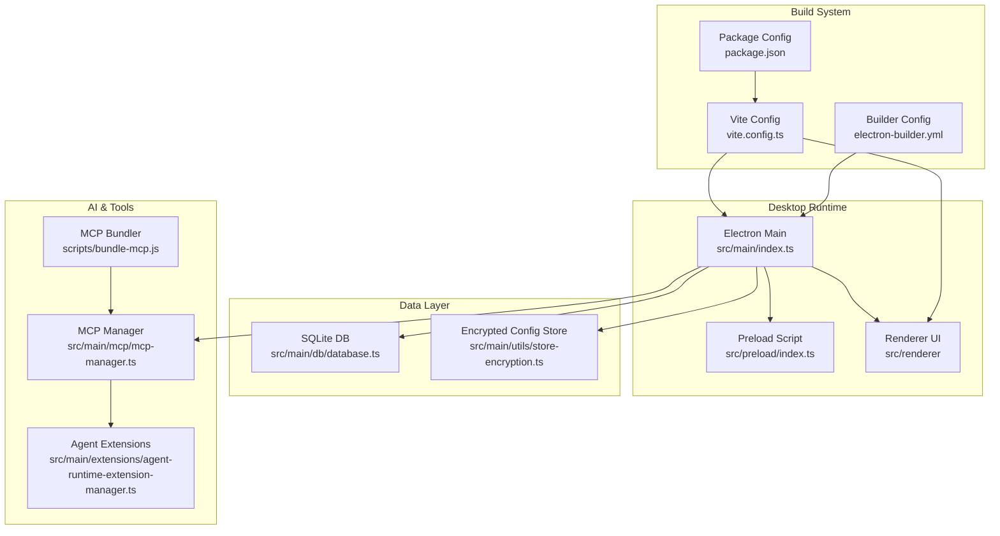
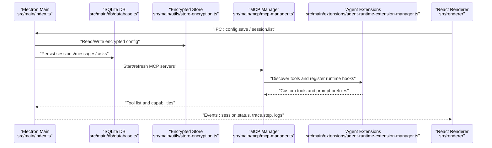
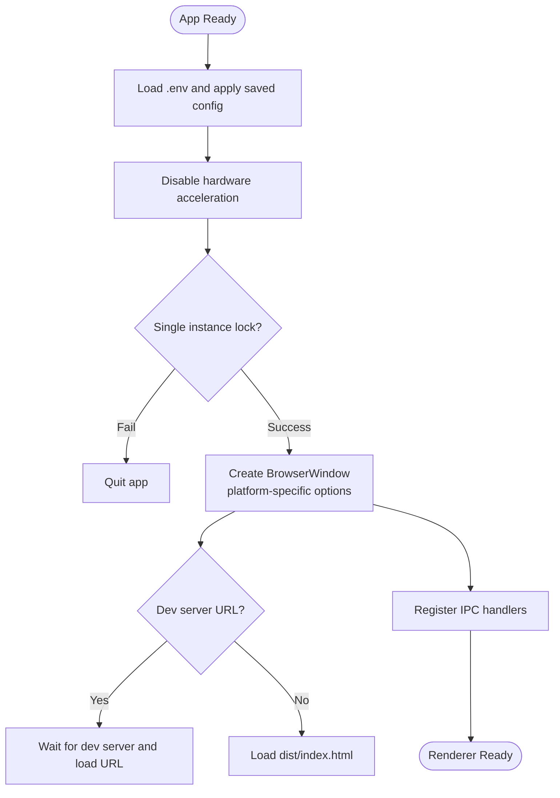
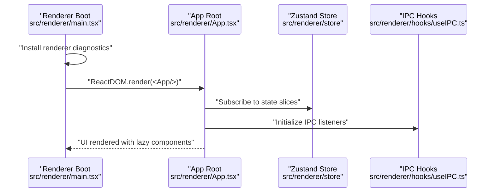
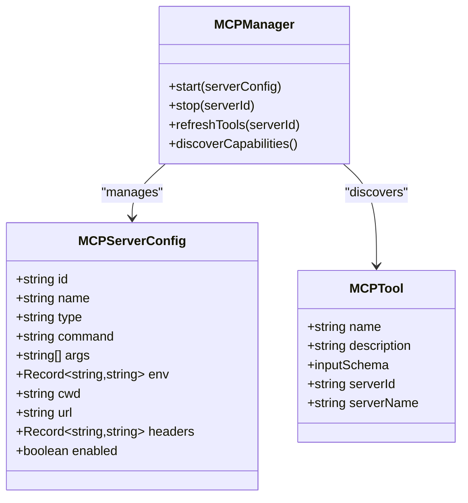
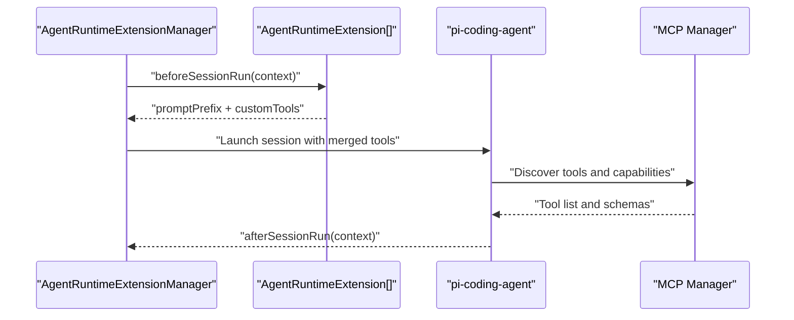
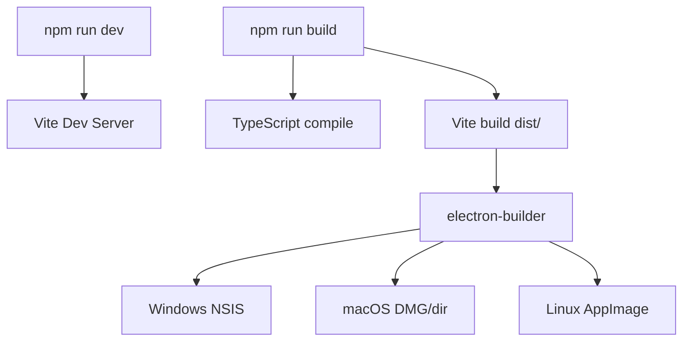
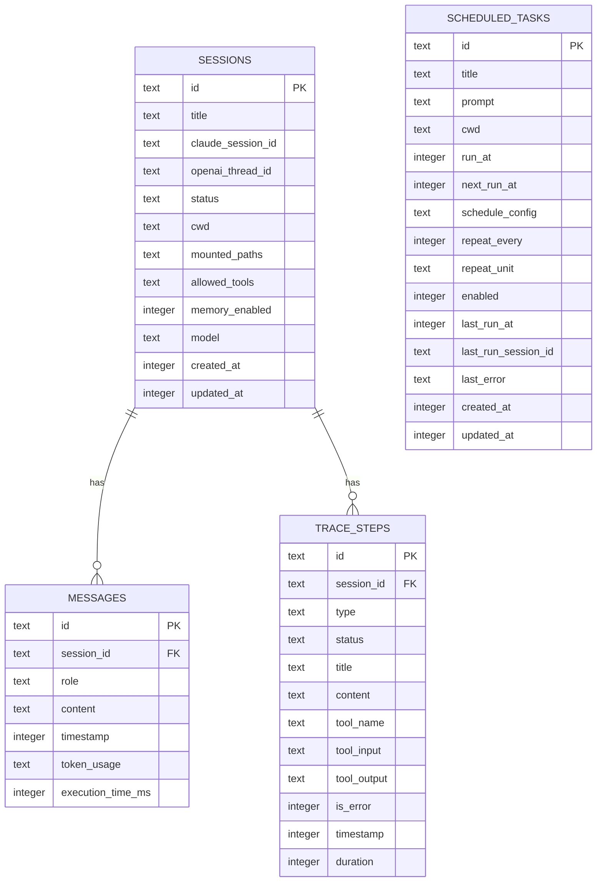
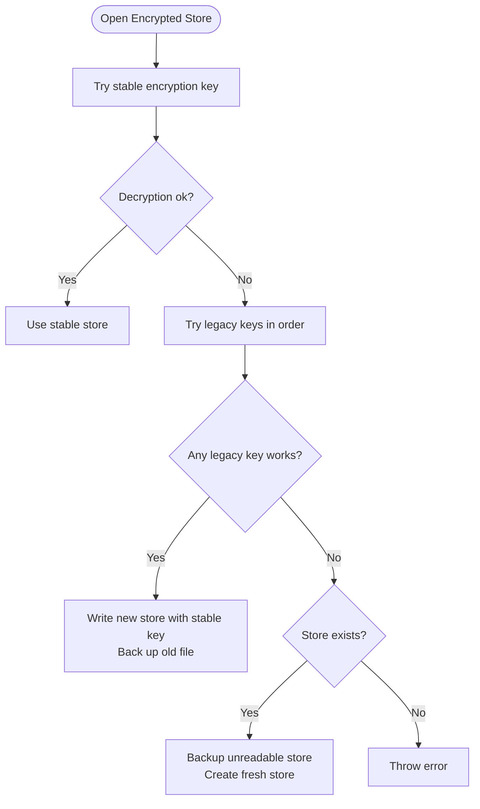
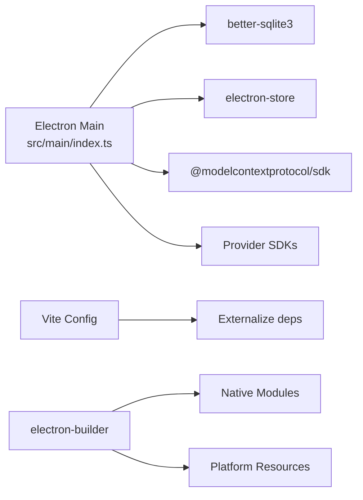

# Technology Stack

<cite>
**Referenced Files in This Document**
- [package.json](file://package.json)
- [vite.config.ts](file://vite.config.ts)
- [electron-builder.yml](file://electron-builder.yml)
- [src/main/index.ts](file://src/main/index.ts)
- [src/main/db/database.ts](file://src/main/db/database.ts)
- [src/main/utils/store-encryption.ts](file://src/main/utils/store-encryption.ts)
- [src/renderer/main.tsx](file://src/renderer/main.tsx)
- [src/renderer/App.tsx](file://src/renderer/App.tsx)
- [tsconfig.json](file://tsconfig.json)
- [tsconfig.node.json](file://tsconfig.node.json)
- [src/main/mcp/mcp-manager.ts](file://src/main/mcp/mcp-manager.ts)
- [src/main/extensions/agent-runtime-extension-manager.ts](file://src/main/extensions/agent-runtime-extension-manager.ts)
- [scripts/bundle-mcp.js](file://scripts/bundle-mcp.js)
- [patches/@mariozechner+pi-ai+0.60.0.patch](file://patches/@mariozechner+pi-ai+0.60.0.patch)
</cite>

## Table of Contents

1. [Introduction](#introduction)
2. [Project Structure](#project-structure)
3. [Core Technologies](#core-technologies)
4. [Architecture Overview](#architecture-overview)
5. [Detailed Component Analysis](#detailed-component-analysis)
6. [Dependency Analysis](#dependency-analysis)
7. [Performance Considerations](#performance-considerations)
8. [Troubleshooting Guide](#troubleshooting-guide)
9. [Conclusion](#conclusion)
10. [Appendices](#appendices)

## Introduction

This document describes the Open Cowork technology stack, focusing on the cross-platform desktop framework, UI framework, AI agent orchestration, Model Context Protocol (MCP) integration, build system, database backend, and security mechanisms. It explains how these technologies are configured, how they interact, and how to develop and deploy the application across Windows, macOS, and Linux.

## Project Structure

Open Cowork is organized into:

- Electron main process under src/main
- React renderer under src/renderer
- Shared utilities and types
- Scripts for building and bundling native components
- Platform packaging configuration via electron-builder

**Diagram sources**

- [src/main/index.ts:1-120](file://src/main/index.ts#L1-L120)
- [vite.config.ts:18-94](file://vite.config.ts#L18-L94)
- [electron-builder.yml:1-170](file://electron-builder.yml#L1-L170)
- [src/main/db/database.ts:1-120](file://src/main/db/database.ts#L1-L120)
- [src/main/utils/store-encryption.ts:1-60](file://src/main/utils/store-encryption.ts#L1-L60)
- [src/main/mcp/mcp-manager.ts:1-120](file://src/main/mcp/mcp-manager.ts#L1-L120)
- [src/main/extensions/agent-runtime-extension-manager.ts:1-60](file://src/main/extensions/agent-runtime-extension-manager.ts#L1-L60)
- [scripts/bundle-mcp.js:1-120](file://scripts/bundle-mcp.js#L1-L120)

**Section sources**

- [package.json:1-148](file://package.json#L1-L148)
- [vite.config.ts:1-94](file://vite.config.ts#L1-L94)
- [electron-builder.yml:1-170](file://electron-builder.yml#L1-L170)

## Core Technologies

- Electron 41.7.1: Cross-platform desktop runtime hosting the main process, renderer UI, and native integrations.
- React 18.3.1 with TypeScript: Declarative UI framework for the renderer process with strict type checking.
- Model Context Protocol (MCP) SDK 1.26.0: Protocol and client for discovering and invoking tools/resources from MCP servers.
- pi-coding-agent 0.60.0: AI agent runtime orchestrator integrated with MCP and skills.
- Vite 7.3.1: Fast build toolchain and dev server for the renderer and Electron main/preload.
- better-sqlite3 12.8.0: High-performance embedded SQL database for persistent storage.
- electron-store 11.0.2: Robust encrypted configuration store with key rotation and migration support.
- Security: Encrypted storage with scrypt-based key derivation and legacy key support; platform-specific entitlements and hardened runtime on macOS.

**Section sources**

- [package.json:67-131](file://package.json#L67-L131)
- [src/main/db/database.ts:1-120](file://src/main/db/database.ts#L1-L120)
- [src/main/utils/store-encryption.ts:1-120](file://src/main/utils/store-encryption.ts#L1-L120)
- [src/main/mcp/mcp-manager.ts:1-120](file://src/main/mcp/mcp-manager.ts#L1-L120)
- [src/main/extensions/agent-runtime-extension-manager.ts:1-60](file://src/main/extensions/agent-runtime-extension-manager.ts#L1-L60)
- [vite.config.ts:18-94](file://vite.config.ts#L18-L94)

## Architecture Overview

The desktop app runs as a single Electron process with three primary areas:

- Main process: Initializes app lifecycle, manages IPC, database, MCP servers, sandbox, and remote channels.
- Preload: Bridges secure IPC and exposes minimal APIs to the renderer.
- Renderer: React application rendering UI, handling user interactions, and communicating with the main process.

**Diagram sources**

- [src/main/index.ts:786-800](file://src/main/index.ts#L786-L800)
- [src/main/db/database.ts:412-720](file://src/main/db/database.ts#L412-L720)
- [src/main/utils/store-encryption.ts:148-236](file://src/main/utils/store-encryption.ts#L148-L236)
- [src/main/mcp/mcp-manager.ts:1-200](file://src/main/mcp/mcp-manager.ts#L1-L200)
- [src/main/extensions/agent-runtime-extension-manager.ts:25-105](file://src/main/extensions/agent-runtime-extension-manager.ts#L25-L105)

## Detailed Component Analysis

### Electron Desktop Runtime

- Main process entry initializes environment, loads .env, applies saved config, disables hardware acceleration, sets up single-instance locks, creates BrowserWindow with platform-specific titlebar/frameless options, and wires IPC handlers.
- Dev server integration supports hot reload; packaged builds load from dist/index.html.
- Window navigation safety restricts external links and reveals local paths securely.

**Diagram sources**

- [src/main/index.ts:94-120](file://src/main/index.ts#L94-L120)
- [src/main/index.ts:177-220](file://src/main/index.ts#L177-L220)
- [src/main/index.ts:382-556](file://src/main/index.ts#L382-L556)

**Section sources**

- [src/main/index.ts:1-120](file://src/main/index.ts#L1-L120)
- [src/main/index.ts:382-556](file://src/main/index.ts#L382-L556)

### React 18.3.1 with TypeScript Renderer

- Renderer bootstraps React DOM, installs diagnostic capture, and renders App with lazy-loaded views.
- App composes Sidebar, ChatView/WelcomeView, ContextPanel, dialogs, and settings panels, driven by a centralized store and IPC hooks.

**Diagram sources**

- [src/renderer/main.tsx:14-84](file://src/renderer/main.tsx#L14-L84)
- [src/renderer/App.tsx:59-262](file://src/renderer/App.tsx#L59-L262)

**Section sources**

- [src/renderer/main.tsx:1-84](file://src/renderer/main.tsx#L1-L84)
- [src/renderer/App.tsx:1-262](file://src/renderer/App.tsx#L1-L262)
- [tsconfig.json:1-32](file://tsconfig.json#L1-L32)
- [tsconfig.node.json:1-16](file://tsconfig.node.json#L1-L16)

### Model Context Protocol (MCP) Integration

- MCP Manager handles server lifecycle (stdio, SSE, Streamable HTTP), OAuth flows, tool discovery, and transport selection.
- MCP servers are bundled with esbuild into self-contained CommonJS files and staged for packaging.
- Patch applied to pi-ai to support DeepSeek V4 “thinking” content format.

**Diagram sources**

- [src/main/mcp/mcp-manager.ts:35-122](file://src/main/mcp/mcp-manager.ts#L35-L122)

**Section sources**

- [src/main/mcp/mcp-manager.ts:1-200](file://src/main/mcp/mcp-manager.ts#L1-L200)
- [scripts/bundle-mcp.js:205-334](file://scripts/bundle-mcp.js#L205-L334)
- [patches/@mariozechner+pi-ai+0.60.0.patch:1-64](file://patches/@mariozechner+pi-ai+0.60.0.patch#L1-L64)

### AI Agent Orchestration with pi-coding-agent

- Agent runtime extension manager aggregates custom tools and prompt prefixes from registered extensions.
- Integration with MCP allows dynamic tool discovery and invocation during agent sessions.

**Diagram sources**

- [src/main/extensions/agent-runtime-extension-manager.ts:25-105](file://src/main/extensions/agent-runtime-extension-manager.ts#L25-L105)
- [src/main/mcp/mcp-manager.ts:1-200](file://src/main/mcp/mcp-manager.ts#L1-L200)

**Section sources**

- [src/main/extensions/agent-runtime-extension-manager.ts:1-105](file://src/main/extensions/agent-runtime-extension-manager.ts#L1-L105)

### Build System with Vite and Electron Builder

- Vite compiles the renderer and bundles the main/preload entries, externalizing Node/Electron dependencies and enabling sourcemaps in development.
- Electron Builder packages the app for Windows (NSIS), macOS (DMG/dir), and Linux (AppImage), including native modules and platform-specific resources.

**Diagram sources**

- [vite.config.ts:18-94](file://vite.config.ts#L18-L94)
- [electron-builder.yml:1-170](file://electron-builder.yml#L1-L170)
- [package.json:39-66](file://package.json#L39-L66)

**Section sources**

- [vite.config.ts:1-94](file://vite.config.ts#L1-L94)
- [electron-builder.yml:1-170](file://electron-builder.yml#L1-L170)
- [package.json:39-66](file://package.json#L39-L66)

### Database Backend with better-sqlite3

- Centralized initialization in the main process ensures a consistent database path under Electron’s userData directory.
- Schema includes sessions, messages, trace steps, scheduled tasks, and indexes optimized for query patterns.
- Foreign keys and WAL mode improve integrity and concurrency.

**Diagram sources**

- [src/main/db/database.ts:56-112](file://src/main/db/database.ts#L56-L112)
- [src/main/db/database.ts:219-355](file://src/main/db/database.ts#L219-L355)

**Section sources**

- [src/main/db/database.ts:1-120](file://src/main/db/database.ts#L1-L120)
- [src/main/db/database.ts:412-720](file://src/main/db/database.ts#L412-L720)

### Security and Encrypted Storage

- electron-store-backed encrypted configuration with scrypt-based key derivation and legacy key rotation.
- Migration logic attempts stable key first, then legacy keys, and falls back to a fresh store with backup of unreadable files.

**Diagram sources**

- [src/main/utils/store-encryption.ts:148-236](file://src/main/utils/store-encryption.ts#L148-L236)

**Section sources**

- [src/main/utils/store-encryption.ts:1-120](file://src/main/utils/store-encryption.ts#L1-L120)
- [src/main/utils/store-encryption.ts:148-236](file://src/main/utils/store-encryption.ts#L148-L236)

## Dependency Analysis

- Electron main process depends on better-sqlite3, electron-store, MCP SDK, and various SDKs for providers and integrations.
- Vite externalizes Node/Electron built-ins and selected CJS dependencies to ensure compatibility in the main process.
- electron-builder includes native modules and platform-specific resources, unpacks large binaries, and signs artifacts on macOS.

**Diagram sources**

- [vite.config.ts:37-56](file://vite.config.ts#L37-L56)
- [electron-builder.yml:13-62](file://electron-builder.yml#L13-L62)
- [package.json:67-101](file://package.json#L67-L101)

**Section sources**

- [vite.config.ts:37-56](file://vite.config.ts#L37-L56)
- [electron-builder.yml:13-62](file://electron-builder.yml#L13-L62)
- [package.json:67-101](file://package.json#L67-L101)

## Performance Considerations

- SQLite WAL mode improves concurrent reads/writes; indexes on timestamps and session IDs optimize frequent queries.
- Vite bundling with externalized dependencies reduces main process bundle size and avoids loading large CJS-only libraries at runtime.
- Electron Builder unpacks native modules to avoid ASAR symlink issues and improve startup performance for binary-heavy modules.
- MCP servers are bundled with esbuild to minimize cold-start overhead and dependency resolution in production.

[No sources needed since this section provides general guidance]

## Troubleshooting Guide

- Database path conflicts: The database initialization detects directory conflicts and moves them to backups; legacy SQLite files are recovered into the new schema.
- Encrypted store unreadable: If decryption fails with all keys, the system backs up the unreadable file and recreates a fresh store.
- MCP bundling failure: esbuild must be present; otherwise, the build exits with a fatal error indicating missing devDependencies.
- Platform packaging: macOS requires hardened runtime and entitlements; Windows uses NSIS with custom installer options; Linux targets AppImage.

**Section sources**

- [src/main/db/database.ts:164-214](file://src/main/db/database.ts#L164-L214)
- [src/main/db/database.ts:182-194](file://src/main/db/database.ts#L182-L194)
- [src/main/utils/store-encryption.ts:215-236](file://src/main/utils/store-encryption.ts#L215-L236)
- [scripts/bundle-mcp.js:320-329](file://scripts/bundle-mcp.js#L320-L329)
- [electron-builder.yml:83-134](file://electron-builder.yml#L83-L134)

## Conclusion

Open Cowork combines Electron, React, and TypeScript to deliver a secure, extensible desktop environment. The MCP integration enables dynamic tool discovery and orchestration through pi-coding-agent, while better-sqlite3 and electron-store provide robust persistence and encrypted configuration. Vite and electron-builder streamline development and packaging across Windows, macOS, and Linux.

[No sources needed since this section summarizes without analyzing specific files]

## Appendices

### Development Environment Setup

- Prerequisites
  - Node.js version requirement is defined in engines; ensure Node meets the minimum version.
  - Install dependencies with npm ci to include esbuild for MCP bundling.
- Scripts
  - Development: downloads Node, builds agents and MCP, compiles TypeScript, starts Vite dev server.
  - Build: prepares GUI tools and Python runtimes, builds agents and MCP, compiles TS, builds Vite, runs pre-build checks, and packages with electron-builder.
  - Packaging: platform-specific targets and signing options are configured in electron-builder.yml.

**Section sources**

- [package.json:35-66](file://package.json#L35-L66)
- [package.json:39-66](file://package.json#L39-L66)
- [electron-builder.yml:1-170](file://electron-builder.yml#L1-L170)

### Version Compatibility and Platform Notes

- Electron 41.7.1 aligns with Node/Electron headers for native module rebuilds.
- React 18.3.1 and TypeScript 5.x with ESNext module resolution and bundler-aware settings.
- MCP SDK 1.26.0 integrates with pi-coding-agent 0.60.0; patch ensures compatibility with DeepSeek V4 “thinking” content format.
- macOS: hardened runtime and entitlements enabled; screen recording and accessibility permissions requested for GUI automation.
- Windows/Linux: platform-specific targets and resource bundling handled by electron-builder.

**Section sources**

- [package.json:103-131](file://package.json#L103-L131)
- [package.json:67-101](file://package.json#L67-L101)
- [electron-builder.yml:83-134](file://electron-builder.yml#L83-L134)
- [patches/@mariozechner+pi-ai+0.60.0.patch:1-64](file://patches/@mariozechner+pi-ai+0.60.0.patch#L1-L64)
