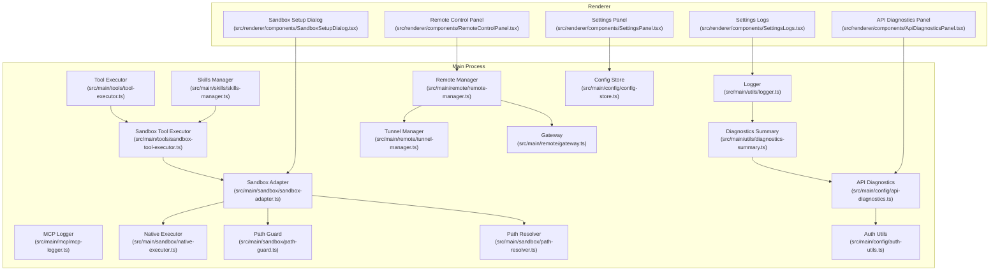
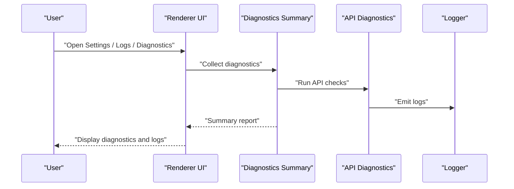
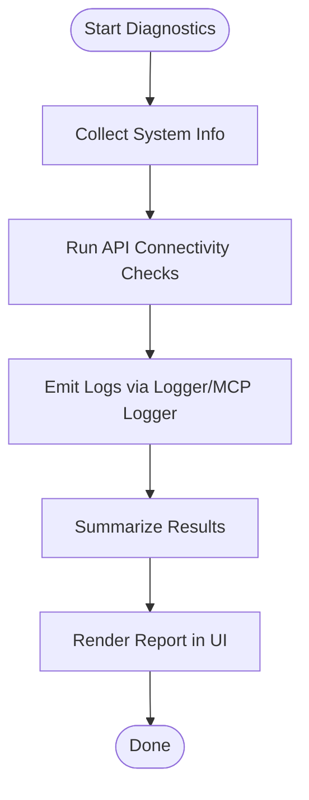
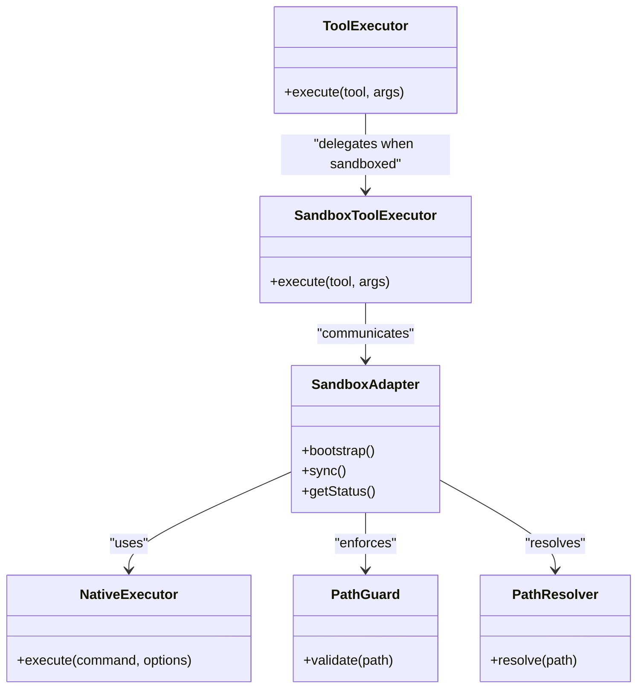
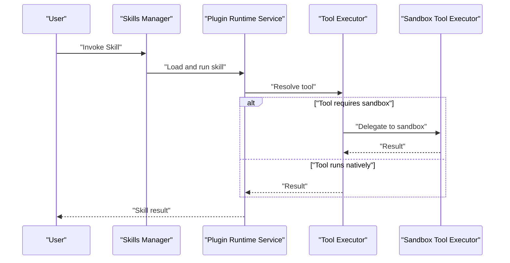
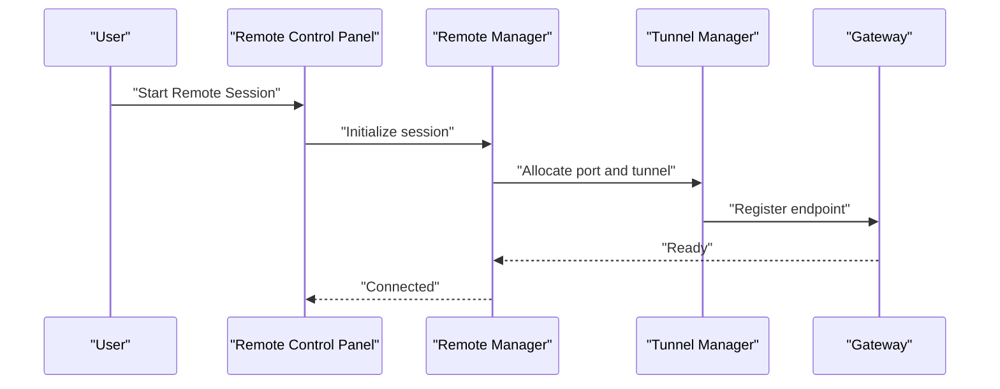
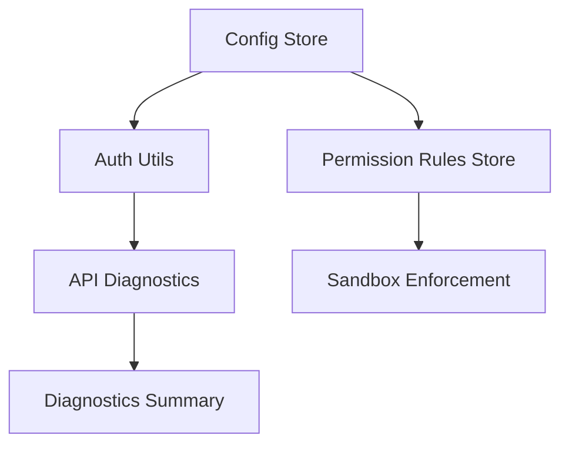
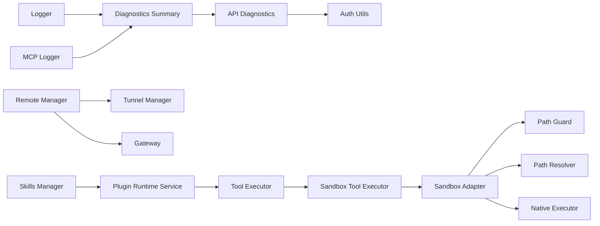

# Troubleshooting & FAQ

<cite>
**Referenced Files in This Document**
- [README.md](file://README.md)
- [CONTRIBUTING.md](file://CONTRIBUTING.md)
- [SECURITY.md](file://SECURITY.md)
- [ROADMAP.md](file://ROADMAP.md)
- [src/main/utils/error-utils.ts](file://src/main/utils/error-utils.ts)
- [src/main/utils/logger.ts](file://src/main/utils/logger.ts)
- [src/main/mcp/mcp-logger.ts](file://src/main/mcp/mcp-logger.ts)
- [src/main/config/api-diagnostics.ts](file://src/main/config/api-diagnostics.ts)
- [src/main/utils/diagnostics-summary.ts](file://src/main/utils/diagnostics-summary.ts)
- [src/renderer/utils/renderer-diagnostics.ts](file://src/renderer/utils/renderer-diagnostics.ts)
- [src/main/sandbox/sandbox-adapter.ts](file://src/main/sandbox/sandbox-adapter.ts)
- [src/main/sandbox/sandbox-bootstrap.ts](file://src/main/sandbox/sandbox-bootstrap.ts)
- [src/main/sandbox/native-executor.ts](file://src/main/sandbox/native-executor.ts)
- [src/main/sandbox/path-guard.ts](file://src/main/sandbox/path-guard.ts)
- [src/main/sandbox/path-resolver.ts](file://src/main/sandbox/path-resolver.ts)
- [src/main/sandbox/types.ts](file://src/main/sandbox/types.ts)
- [src/main/tools/sandbox-tool-executor.ts](file://src/main/tools/sandbox-tool-executor.ts)
- [src/main/tools/tool-executor.ts](file://src/main/tools/tool-executor.ts)
- [src/main/skills/plugin-runtime-service.ts](file://src/main/skills/plugin-runtime-service.ts)
- [src/main/skills/skills-manager.ts](file://src/main/skills/skills-manager.ts)
- [src/main/remote/remote-manager.ts](file://src/main/remote/remote-manager.ts)
- [src/main/remote/tunnel-manager.ts](file://src/main/remote/tunnel-manager.ts)
- [src/main/remote/gateway.ts](file://src/main/remote/gateway.ts)
- [src/main/remote/message-router.ts](file://src/main/remote/message-router.ts)
- [src/main/remote/types.ts](file://src/main/remote/types.ts)
- [src/main/config/config-store.ts](file://src/main/config/config-store.ts)
- [src/main/config/auth-utils.ts](file://src/main/config/auth-utils.ts)
- [src/main/config/permission-rules-store.ts](file://src/main/config/permission-rules-store.ts)
- [src/renderer/components/SettingsPanel.tsx](file://src/renderer/components/SettingsPanel.tsx)
- [src/renderer/components/SettingsLogs.tsx](file://src/renderer/components/SettingsLogs.tsx)
- [src/renderer/components/SandboxSetupDialog.tsx](file://src/renderer/components/SandboxSetupDialog.tsx)
- [src/renderer/components/RemoteControlPanel.tsx](file://src/renderer/components/RemoteControlPanel.tsx)
- [src/renderer/components/ApiDiagnosticsPanel.tsx](file://src/renderer/components/ApiDiagnosticsPanel.tsx)
- [src/renderer/utils/sandbox-i18n.ts](file://src/renderer/utils/sandbox-i18n.ts)
- [src/shared/network/loopback.ts](file://src/shared/network/loopback.ts)
- [scripts/start.ps1](file://scripts/start.ps1)
- [scripts/build-windows.js](file://scripts/build-windows.js)
- [scripts/notarize.js](file://scripts/notarize.js)
- [scripts/pre-build-check.js](file://scripts/pre-build-check.js)
- [resources/installer.nsh](file://resources/installer.nsh)
- [resources/windows/Open-Cowork-Legacy-Cleanup.cmd](file://resources/windows/Open-Cowork-Legacy-Cleanup.cmd)
- [resources/windows/Open-Cowork-Legacy-Cleanup.ps1](file://resources/windows/Open-Cowork-Legacy-Cleanup.ps1)
- [patches/@mariozechner+pi-ai+0.60.0.patch](file://patches/@mariozechner+pi-ai+0.60.0.patch)
- [tests/sandbox-executor-containment.test.ts](file://tests/sandbox-executor-containment.test.ts)
- [tests/tool-executor-sandbox.test.ts](file://tests/tool-executor-sandbox.test.ts)
- [tests/sandbox-command-injection.test.ts](file://tests/sandbox-command-injection.test.ts)
- [tests/api-diagnostics.test.ts](file://tests/api-diagnostics.test.ts)
- [tests/renderer-diagnostics.test.ts](file://tests/renderer-diagnostics.test.ts)
- [tests/diagnostics-summary.test.ts](file://tests/diagnostics-summary.test.ts)
- [tests/logger-context.test.ts](file://tests/logger-context.test.ts)
- [tests/logger-fallback.test.ts](file://tests/logger-fallback.test.ts)
- [tests/logger-level-persistence.test.ts](file://tests/logger-level-persistence.test.ts)
- [tests/remote-manager-port-conflict.test.ts](file://tests/remote-manager-port-conflict.test.ts)
- [tests/preflight.test.ts](file://tests/preflight.test.ts)
- [tests/build-windows-artifacts.test.ts](file://tests/build-windows-artifacts.test.ts)
- [tests/build-windows-script.test.ts](file://tests/build-windows-script.test.ts)
- [tests/windows-legacy-uninstall-remediation.test.ts](file://tests/windows-legacy-uninstall-remediation.test.ts)
</cite>

## Table of Contents

1. [Introduction](#introduction)
2. [Project Structure](#project-structure)
3. [Core Components](#core-components)
4. [Architecture Overview](#architecture-overview)
5. [Detailed Component Analysis](#detailed-component-analysis)
6. [Dependency Analysis](#dependency-analysis)
7. [Performance Considerations](#performance-considerations)
8. [Troubleshooting Guide](#troubleshooting-guide)
9. [Conclusion](#conclusion)
10. [Appendices](#appendices)

## Introduction

This Troubleshooting & FAQ guide helps Open Cowork users and administrators diagnose and resolve common installation, runtime, and performance issues. It covers dependency problems, sandbox setup failures, platform-specific configurations, runtime errors, log analysis, network/API keys, sandbox isolation, error codes, diagnostic tools, and step-by-step fixes for frequent problems such as file access, skill execution, and remote control connectivity. Community support and escalation paths are also included.

## Project Structure

Open Cowork is an Electron-based desktop application with a TypeScript/React frontend and a Node/Electron main process. Key areas relevant to troubleshooting include:

- Logging and diagnostics subsystems
- Sandbox execution and path containment
- Skills and tool execution
- Remote control and tunneling
- Configuration stores and authentication utilities
- Platform-specific build and packaging scripts

**Diagram sources**

- [src/main/utils/logger.ts](file://src/main/utils/logger.ts)
- [src/main/mcp/mcp-logger.ts](file://src/main/mcp/mcp-logger.ts)
- [src/main/utils/diagnostics-summary.ts](file://src/main/utils/diagnostics-summary.ts)
- [src/main/config/api-diagnostics.ts](file://src/main/config/api-diagnostics.ts)
- [src/main/sandbox/sandbox-adapter.ts](file://src/main/sandbox/sandbox-adapter.ts)
- [src/main/sandbox/native-executor.ts](file://src/main/sandbox/native-executor.ts)
- [src/main/sandbox/path-guard.ts](file://src/main/sandbox/path-guard.ts)
- [src/main/sandbox/path-resolver.ts](file://src/main/sandbox/path-resolver.ts)
- [src/main/tools/tool-executor.ts](file://src/main/tools/tool-executor.ts)
- [src/main/tools/sandbox-tool-executor.ts](file://src/main/tools/sandbox-tool-executor.ts)
- [src/main/skills/skills-manager.ts](file://src/main/skills/skills-manager.ts)
- [src/main/remote/remote-manager.ts](file://src/main/remote/remote-manager.ts)
- [src/main/remote/tunnel-manager.ts](file://src/main/remote/tunnel-manager.ts)
- [src/main/remote/gateway.ts](file://src/main/remote/gateway.ts)
- [src/main/config/config-store.ts](file://src/main/config/config-store.ts)
- [src/main/config/auth-utils.ts](file://src/main/config/auth-utils.ts)
- [src/renderer/components/SettingsPanel.tsx](file://src/renderer/components/SettingsPanel.tsx)
- [src/renderer/components/SettingsLogs.tsx](file://src/renderer/components/SettingsLogs.tsx)
- [src/renderer/components/SandboxSetupDialog.tsx](file://src/renderer/components/SandboxSetupDialog.tsx)
- [src/renderer/components/RemoteControlPanel.tsx](file://src/renderer/components/RemoteControlPanel.tsx)
- [src/renderer/components/ApiDiagnosticsPanel.tsx](file://src/renderer/components/ApiDiagnosticsPanel.tsx)

**Section sources**

- [README.md](file://README.md)
- [src/main/utils/logger.ts](file://src/main/utils/logger.ts)
- [src/main/utils/diagnostics-summary.ts](file://src/main/utils/diagnostics-summary.ts)
- [src/main/config/api-diagnostics.ts](file://src/main/config/api-diagnostics.ts)
- [src/main/sandbox/sandbox-adapter.ts](file://src/main/sandbox/sandbox-adapter.ts)
- [src/main/sandbox/native-executor.ts](file://src/main/sandbox/native-executor.ts)
- [src/main/sandbox/path-guard.ts](file://src/main/sandbox/path-guard.ts)
- [src/main/sandbox/path-resolver.ts](file://src/main/sandbox/path-resolver.ts)
- [src/main/tools/tool-executor.ts](file://src/main/tools/tool-executor.ts)
- [src/main/tools/sandbox-tool-executor.ts](file://src/main/tools/sandbox-tool-executor.ts)
- [src/main/skills/skills-manager.ts](file://src/main/skills/skills-manager.ts)
- [src/main/remote/remote-manager.ts](file://src/main/remote/remote-manager.ts)
- [src/main/remote/tunnel-manager.ts](file://src/main/remote/tunnel-manager.ts)
- [src/main/remote/gateway.ts](file://src/main/remote/gateway.ts)
- [src/main/config/config-store.ts](file://src/main/config/config-store.ts)
- [src/main/config/auth-utils.ts](file://src/main/config/auth-utils.ts)
- [src/renderer/components/SettingsPanel.tsx](file://src/renderer/components/SettingsPanel.tsx)
- [src/renderer/components/SettingsLogs.tsx](file://src/renderer/components/SettingsLogs.tsx)
- [src/renderer/components/SandboxSetupDialog.tsx](file://src/renderer/components/SandboxSetupDialog.tsx)
- [src/renderer/components/RemoteControlPanel.tsx](file://src/renderer/components/RemoteControlPanel.tsx)
- [src/renderer/components/ApiDiagnosticsPanel.tsx](file://src/renderer/components/ApiDiagnosticsPanel.tsx)

## Core Components

- Logging and diagnostics: Centralized logging and diagnostic summaries enable structured troubleshooting.
- Sandbox execution: Path containment, resolver, and executor enforce safe command execution.
- Skills and tools: Plugin runtime and tool executors manage skill execution and tool availability.
- Remote control: Tunnel and gateway managers coordinate secure remote sessions.
- Configuration and auth: Stores and utilities manage API keys, permissions, and environment settings.

**Section sources**

- [src/main/utils/logger.ts](file://src/main/utils/logger.ts)
- [src/main/utils/diagnostics-summary.ts](file://src/main/utils/diagnostics-summary.ts)
- [src/main/config/api-diagnostics.ts](file://src/main/config/api-diagnostics.ts)
- [src/main/sandbox/sandbox-adapter.ts](file://src/main/sandbox/sandbox-adapter.ts)
- [src/main/sandbox/native-executor.ts](file://src/main/sandbox/native-executor.ts)
- [src/main/sandbox/path-guard.ts](file://src/main/sandbox/path-guard.ts)
- [src/main/sandbox/path-resolver.ts](file://src/main/sandbox/path-resolver.ts)
- [src/main/tools/tool-executor.ts](file://src/main/tools/tool-executor.ts)
- [src/main/tools/sandbox-tool-executor.ts](file://src/main/tools/sandbox-tool-executor.ts)
- [src/main/skills/skills-manager.ts](file://src/main/skills/skills-manager.ts)
- [src/main/remote/remote-manager.ts](file://src/main/remote/remote-manager.ts)
- [src/main/remote/tunnel-manager.ts](file://src/main/remote/tunnel-manager.ts)
- [src/main/remote/gateway.ts](file://src/main/remote/gateway.ts)
- [src/main/config/config-store.ts](file://src/main/config/config-store.ts)
- [src/main/config/auth-utils.ts](file://src/main/config/auth-utils.ts)

## Architecture Overview

The application integrates a robust diagnostics pipeline with sandboxed execution and remote capabilities.

**Diagram sources**

- [src/main/utils/diagnostics-summary.ts](file://src/main/utils/diagnostics-summary.ts)
- [src/main/config/api-diagnostics.ts](file://src/main/config/api-diagnostics.ts)
- [src/main/utils/logger.ts](file://src/main/utils/logger.ts)

## Detailed Component Analysis

### Logging and Diagnostics

- Logger: Provides structured logging with configurable levels and fallback behavior.
- MCP Logger: Specialized logging for Model Context Protocol components.
- Diagnostics Summary: Aggregates system and API health checks.
- API Diagnostics: Validates provider connectivity and credentials.
- Renderer Diagnostics: Bridges UI diagnostics to backend.

**Diagram sources**

- [src/main/utils/logger.ts](file://src/main/utils/logger.ts)
- [src/main/mcp/mcp-logger.ts](file://src/main/mcp/mcp-logger.ts)
- [src/main/utils/diagnostics-summary.ts](file://src/main/utils/diagnostics-summary.ts)
- [src/main/config/api-diagnostics.ts](file://src/main/config/api-diagnostics.ts)
- [src/renderer/utils/renderer-diagnostics.ts](file://src/renderer/utils/renderer-diagnostics.ts)

**Section sources**

- [src/main/utils/logger.ts](file://src/main/utils/logger.ts)
- [src/main/mcp/mcp-logger.ts](file://src/main/mcp/mcp-logger.ts)
- [src/main/utils/diagnostics-summary.ts](file://src/main/utils/diagnostics-summary.ts)
- [src/main/config/api-diagnostics.ts](file://src/main/config/api-diagnostics.ts)
- [src/renderer/utils/renderer-diagnostics.ts](file://src/renderer/utils/renderer-diagnostics.ts)
- [tests/logger-context.test.ts](file://tests/logger-context.test.ts)
- [tests/logger-fallback.test.ts](file://tests/logger-fallback.test.ts)
- [tests/logger-level-persistence.test.ts](file://tests/logger-level-persistence.test.ts)
- [tests/api-diagnostics.test.ts](file://tests/api-diagnostics.test.ts)
- [tests/renderer-diagnostics.test.ts](file://tests/renderer-diagnostics.test.ts)
- [tests/diagnostics-summary.test.ts](file://tests/diagnostics-summary.test.ts)

### Sandbox Execution and Isolation

- Sandbox Adapter: Orchestrates sandbox lifecycle and environment.
- Native Executor: Executes commands in the host OS with strict containment.
- Path Guard and Path Resolver: Enforce path containment and resolve safe paths.
- Tool Executors: Execute tools inside or outside sandbox depending on capability.

**Diagram sources**

- [src/main/sandbox/sandbox-adapter.ts](file://src/main/sandbox/sandbox-adapter.ts)
- [src/main/sandbox/native-executor.ts](file://src/main/sandbox/native-executor.ts)
- [src/main/sandbox/path-guard.ts](file://src/main/sandbox/path-guard.ts)
- [src/main/sandbox/path-resolver.ts](file://src/main/sandbox/path-resolver.ts)
- [src/main/tools/tool-executor.ts](file://src/main/tools/tool-executor.ts)
- [src/main/tools/sandbox-tool-executor.ts](file://src/main/tools/sandbox-tool-executor.ts)

**Section sources**

- [src/main/sandbox/sandbox-adapter.ts](file://src/main/sandbox/sandbox-adapter.ts)
- [src/main/sandbox/native-executor.ts](file://src/main/sandbox/native-executor.ts)
- [src/main/sandbox/path-guard.ts](file://src/main/sandbox/path-guard.ts)
- [src/main/sandbox/path-resolver.ts](file://src/main/sandbox/path-resolver.ts)
- [src/main/tools/tool-executor.ts](file://src/main/tools/tool-executor.ts)
- [src/main/tools/sandbox-tool-executor.ts](file://src/main/tools/sandbox-tool-executor.ts)
- [tests/sandbox-executor-containment.test.ts](file://tests/sandbox-executor-containment.test.ts)
- [tests/tool-executor-sandbox.test.ts](file://tests/tool-executor-sandbox.test.ts)
- [tests/sandbox-command-injection.test.ts](file://tests/sandbox-command-injection.test.ts)

### Skills and Tools

- Skills Manager: Installs, loads, and manages plugins.
- Plugin Runtime Service: Executes skills with proper isolation and permissions.
- Tool Executors: Resolve and execute tools respecting sandbox boundaries.

**Diagram sources**

- [src/main/skills/skills-manager.ts](file://src/main/skills/skills-manager.ts)
- [src/main/skills/plugin-runtime-service.ts](file://src/main/skills/plugin-runtime-service.ts)
- [src/main/tools/tool-executor.ts](file://src/main/tools/tool-executor.ts)
- [src/main/tools/sandbox-tool-executor.ts](file://src/main/tools/sandbox-tool-executor.ts)

**Section sources**

- [src/main/skills/skills-manager.ts](file://src/main/skills/skills-manager.ts)
- [src/main/skills/plugin-runtime-service.ts](file://src/main/skills/plugin-runtime-service.ts)
- [src/main/tools/tool-executor.ts](file://src/main/tools/tool-executor.ts)
- [src/main/tools/sandbox-tool-executor.ts](file://src/main/tools/sandbox-tool-executor.ts)

### Remote Control and Tunneling

- Remote Manager: Coordinates remote sessions and permissions.
- Tunnel Manager: Manages secure tunnels and ports.
- Gateway: Routes messages and maintains connectivity.

**Diagram sources**

- [src/main/remote/remote-manager.ts](file://src/main/remote/remote-manager.ts)
- [src/main/remote/tunnel-manager.ts](file://src/main/remote/tunnel-manager.ts)
- [src/main/remote/gateway.ts](file://src/main/remote/gateway.ts)
- [src/renderer/components/RemoteControlPanel.tsx](file://src/renderer/components/RemoteControlPanel.tsx)

**Section sources**

- [src/main/remote/remote-manager.ts](file://src/main/remote/remote-manager.ts)
- [src/main/remote/tunnel-manager.ts](file://src/main/remote/tunnel-manager.ts)
- [src/main/remote/gateway.ts](file://src/main/remote/gateway.ts)
- [src/main/remote/message-router.ts](file://src/main/remote/message-router.ts)
- [src/main/remote/types.ts](file://src/main/remote/types.ts)
- [src/renderer/components/RemoteControlPanel.tsx](file://src/renderer/components/RemoteControlPanel.tsx)
- [tests/remote-manager-port-conflict.test.ts](file://tests/remote-manager-port-conflict.test.ts)

### Configuration and Authentication

- Config Store: Persists user preferences and environment settings.
- Auth Utils: Handles API key validation and credential management.
- Permission Rules Store: Enforces capability-based permissions.

**Diagram sources**

- [src/main/config/config-store.ts](file://src/main/config/config-store.ts)
- [src/main/config/auth-utils.ts](file://src/main/config/auth-utils.ts)
- [src/main/config/permission-rules-store.ts](file://src/main/config/permission-rules-store.ts)
- [src/main/config/api-diagnostics.ts](file://src/main/config/api-diagnostics.ts)
- [src/main/utils/diagnostics-summary.ts](file://src/main/utils/diagnostics-summary.ts)

**Section sources**

- [src/main/config/config-store.ts](file://src/main/config/config-store.ts)
- [src/main/config/auth-utils.ts](file://src/main/config/auth-utils.ts)
- [src/main/config/permission-rules-store.ts](file://src/main/config/permission-rules-store.ts)
- [src/main/config/api-diagnostics.ts](file://src/main/config/api-diagnostics.ts)
- [src/main/utils/diagnostics-summary.ts](file://src/main/utils/diagnostics-summary.ts)

## Dependency Analysis

Key dependencies and their roles:

- Logging depends on Logger and MCP Logger for structured output.
- Diagnostics depend on API Diagnostics and Config Store for environment checks.
- Sandbox depends on Path Guard, Path Resolver, and Native Executor for containment and execution.
- Remote Control depends on Tunnel Manager and Gateway for connectivity.
- Skills depend on Plugin Runtime Service and Tool Executors for execution.

**Diagram sources**

- [src/main/utils/logger.ts](file://src/main/utils/logger.ts)
- [src/main/mcp/mcp-logger.ts](file://src/main/mcp/mcp-logger.ts)
- [src/main/utils/diagnostics-summary.ts](file://src/main/utils/diagnostics-summary.ts)
- [src/main/config/api-diagnostics.ts](file://src/main/config/api-diagnostics.ts)
- [src/main/sandbox/sandbox-adapter.ts](file://src/main/sandbox/sandbox-adapter.ts)
- [src/main/sandbox/path-guard.ts](file://src/main/sandbox/path-guard.ts)
- [src/main/sandbox/path-resolver.ts](file://src/main/sandbox/path-resolver.ts)
- [src/main/sandbox/native-executor.ts](file://src/main/sandbox/native-executor.ts)
- [src/main/tools/tool-executor.ts](file://src/main/tools/tool-executor.ts)
- [src/main/tools/sandbox-tool-executor.ts](file://src/main/tools/sandbox-tool-executor.ts)
- [src/main/remote/remote-manager.ts](file://src/main/remote/remote-manager.ts)
- [src/main/remote/tunnel-manager.ts](file://src/main/remote/tunnel-manager.ts)
- [src/main/remote/gateway.ts](file://src/main/remote/gateway.ts)
- [src/main/skills/skills-manager.ts](file://src/main/skills/skills-manager.ts)
- [src/main/skills/plugin-runtime-service.ts](file://src/main/skills/plugin-runtime-service.ts)

**Section sources**

- [src/main/utils/logger.ts](file://src/main/utils/logger.ts)
- [src/main/mcp/mcp-logger.ts](file://src/main/mcp/mcp-logger.ts)
- [src/main/utils/diagnostics-summary.ts](file://src/main/utils/diagnostics-summary.ts)
- [src/main/config/api-diagnostics.ts](file://src/main/config/api-diagnostics.ts)
- [src/main/sandbox/sandbox-adapter.ts](file://src/main/sandbox/sandbox-adapter.ts)
- [src/main/sandbox/native-executor.ts](file://src/main/sandbox/native-executor.ts)
- [src/main/sandbox/path-guard.ts](file://src/main/sandbox/path-guard.ts)
- [src/main/sandbox/path-resolver.ts](file://src/main/sandbox/path-resolver.ts)
- [src/main/tools/tool-executor.ts](file://src/main/tools/tool-executor.ts)
- [src/main/tools/sandbox-tool-executor.ts](file://src/main/tools/sandbox-tool-executor.ts)
- [src/main/remote/remote-manager.ts](file://src/main/remote/remote-manager.ts)
- [src/main/remote/tunnel-manager.ts](file://src/main/remote/tunnel-manager.ts)
- [src/main/remote/gateway.ts](file://src/main/remote/gateway.ts)
- [src/main/skills/skills-manager.ts](file://src/main/skills/skills-manager.ts)
- [src/main/skills/plugin-runtime-service.ts](file://src/main/skills/plugin-runtime-service.ts)

## Performance Considerations

- Memory usage: Reduce concurrent skill executions and limit large artifact processing. Use the memory settings panel to adjust ingestion queues and retriever thresholds.
- Startup times: Disable unnecessary providers during development; leverage preflight checks to surface issues early.
- Resource consumption: Prefer sandboxed tools for heavy workloads to isolate resource usage; monitor logs for excessive retries or timeouts.
- Network: Configure API diagnostics to detect latency and failure patterns; adjust retry policies via configuration store.

[No sources needed since this section provides general guidance]

## Troubleshooting Guide

### Installation and Build Issues

Common symptoms:

- Dependency resolution failures
- Sandbox bootstrap errors
- Platform-specific packaging problems

Recommended steps:

- Run pre-build checks to validate environment prerequisites.
- Review build scripts for platform-specific steps and patch application.
- Clean legacy installations on Windows before reinstalling.

References and steps:

- Pre-build checks and environment validation:
  - [scripts/pre-build-check.js](file://scripts/pre-build-check.js)
- Windows build artifacts and packaging:
  - [scripts/build-windows.js](file://scripts/build-windows.js)
  - [tests/build-windows-artifacts.test.ts](file://tests/build-windows-artifacts.test.ts)
  - [tests/build-windows-script.test.ts](file://tests/build-windows-script.test.ts)
- Legacy cleanup on Windows:
  - [resources/windows/Open-Cowork-Legacy-Cleanup.cmd](file://resources/windows/Open-Cowork-Legacy-Cleanup.cmd)
  - [resources/windows/Open-Cowork-Legacy-Cleanup.ps1](file://resources/windows/Open-Cowork-Legacy-Cleanup.ps1)
  - [tests/windows-legacy-uninstall-remediation.test.ts](file://tests/windows-legacy-uninstall-remediation.test.ts)
- Patch application for third-party components:
  - [patches/@mariozechner+pi-ai+0.60.0.patch](file://patches/@mariozechner+pi-ai+0.60.0.patch)

**Section sources**

- [scripts/pre-build-check.js](file://scripts/pre-build-check.js)
- [scripts/build-windows.js](file://scripts/build-windows.js)
- [tests/build-windows-artifacts.test.ts](file://tests/build-windows-artifacts.test.ts)
- [tests/build-windows-script.test.ts](file://tests/build-windows-script.test.ts)
- [resources/windows/Open-Cowork-Legacy-Cleanup.cmd](file://resources/windows/Open-Cowork-Legacy-Cleanup.cmd)
- [resources/windows/Open-Cowork-Legacy-Cleanup.ps1](file://resources/windows/Open-Cowork-Legacy-Cleanup.ps1)
- [tests/windows-legacy-uninstall-remediation.test.ts](file://tests/windows-legacy-uninstall-remediation.test.ts)
- [patches/@mariozechner+pi-ai+0.60.0.patch](file://patches/@mariozechner+pi-ai+0.60.0.patch)

### Sandbox Setup Failures

Symptoms:

- Sandbox not initializing
- Path containment violations
- Tool execution denied

Resolution steps:

- Verify sandbox adapter bootstrap and sync status.
- Confirm path guard and resolver are enforcing containment.
- Check native executor permissions and environment.

References:

- [src/renderer/components/SandboxSetupDialog.tsx](file://src/renderer/components/SandboxSetupDialog.tsx)
- [src/main/sandbox/sandbox-adapter.ts](file://src/main/sandbox/sandbox-adapter.ts)
- [src/main/sandbox/sandbox-bootstrap.ts](file://src/main/sandbox/sandbox-bootstrap.ts)
- [src/main/sandbox/path-guard.ts](file://src/main/sandbox/path-guard.ts)
- [src/main/sandbox/path-resolver.ts](file://src/main/sandbox/path-resolver.ts)
- [src/main/sandbox/native-executor.ts](file://src/main/sandbox/native-executor.ts)
- [src/main/sandbox/types.ts](file://src/main/sandbox/types.ts)
- [tests/sandbox-executor-containment.test.ts](file://tests/sandbox-executor-containment.test.ts)
- [tests/sandbox-command-injection.test.ts](file://tests/sandbox-command-injection.test.ts)

**Section sources**

- [src/renderer/components/SandboxSetupDialog.tsx](file://src/renderer/components/SandboxSetupDialog.tsx)
- [src/main/sandbox/sandbox-adapter.ts](file://src/main/sandbox/sandbox-adapter.ts)
- [src/main/sandbox/sandbox-bootstrap.ts](file://src/main/sandbox/sandbox-bootstrap.ts)
- [src/main/sandbox/path-guard.ts](file://src/main/sandbox/path-guard.ts)
- [src/main/sandbox/path-resolver.ts](file://src/main/sandbox/path-resolver.ts)
- [src/main/sandbox/native-executor.ts](file://src/main/sandbox/native-executor.ts)
- [src/main/sandbox/types.ts](file://src/main/sandbox/types.ts)
- [tests/sandbox-executor-containment.test.ts](file://tests/sandbox-executor-containment.test.ts)
- [tests/sandbox-command-injection.test.ts](file://tests/sandbox-command-injection.test.ts)

### Runtime Errors and Diagnostics

Symptoms:

- API connectivity failures
- Tool not found errors
- Excessive retries or timeouts

Diagnostic techniques:

- Use API diagnostics to validate provider endpoints and keys.
- Inspect logs emitted by Logger and MCP Logger.
- Review diagnostics summary for system-wide issues.

References:

- [src/main/config/api-diagnostics.ts](file://src/main/config/api-diagnostics.ts)
- [src/main/utils/logger.ts](file://src/main/utils/logger.ts)
- [src/main/mcp/mcp-logger.ts](file://src/main/mcp/mcp-logger.ts)
- [src/main/utils/diagnostics-summary.ts](file://src/main/utils/diagnostics-summary.ts)
- [src/renderer/utils/renderer-diagnostics.ts](file://src/renderer/utils/renderer-diagnostics.ts)
- [src/renderer/components/ApiDiagnosticsPanel.tsx](file://src/renderer/components/ApiDiagnosticsPanel.tsx)
- [tests/api-diagnostics.test.ts](file://tests/api-diagnostics.test.ts)
- [tests/logger-context.test.ts](file://tests/logger-context.test.ts)
- [tests/logger-fallback.test.ts](file://tests/logger-fallback.test.ts)
- [tests/logger-level-persistence.test.ts](file://tests/logger-level-persistence.test.ts)
- [tests/renderer-diagnostics.test.ts](file://tests/renderer-diagnostics.test.ts)
- [tests/diagnostics-summary.test.ts](file://tests/diagnostics-summary.test.ts)

**Section sources**

- [src/main/config/api-diagnostics.ts](file://src/main/config/api-diagnostics.ts)
- [src/main/utils/logger.ts](file://src/main/utils/logger.ts)
- [src/main/mcp/mcp-logger.ts](file://src/main/mcp/mcp-logger.ts)
- [src/main/utils/diagnostics-summary.ts](file://src/main/utils/diagnostics-summary.ts)
- [src/renderer/utils/renderer-diagnostics.ts](file://src/renderer/utils/renderer-diagnostics.ts)
- [src/renderer/components/ApiDiagnosticsPanel.tsx](file://src/renderer/components/ApiDiagnosticsPanel.tsx)
- [tests/api-diagnostics.test.ts](file://tests/api-diagnostics.test.ts)
- [tests/logger-context.test.ts](file://tests/logger-context.test.ts)
- [tests/logger-fallback.test.ts](file://tests/logger-fallback.test.ts)
- [tests/logger-level-persistence.test.ts](file://tests/logger-level-persistence.test.ts)
- [tests/renderer-diagnostics.test.ts](file://tests/renderer-diagnostics.test.ts)
- [tests/diagnostics-summary.test.ts](file://tests/diagnostics-summary.test.ts)

### Network Connectivity and API Keys

Symptoms:

- 401/403 unauthorized
- 404 tool not found
- Timeout or unreachable endpoints

Resolution steps:

- Validate API keys and permissions via auth utilities.
- Use API diagnostics panel to test connectivity and credentials.
- Check loopback network configuration for local endpoints.

References:

- [src/main/config/auth-utils.ts](file://src/main/config/auth-utils.ts)
- [src/main/config/api-diagnostics.ts](file://src/main/config/api-diagnostics.ts)
- [src/shared/network/loopback.ts](file://src/shared/network/loopback.ts)
- [src/renderer/components/ApiDiagnosticsPanel.tsx](file://src/renderer/components/ApiDiagnosticsPanel.tsx)
- [tests/api-diagnostics.test.ts](file://tests/api-diagnostics.test.ts)

**Section sources**

- [src/main/config/auth-utils.ts](file://src/main/config/auth-utils.ts)
- [src/main/config/api-diagnostics.ts](file://src/main/config/api-diagnostics.ts)
- [src/shared/network/loopback.ts](file://src/shared/network/loopback.ts)
- [src/renderer/components/ApiDiagnosticsPanel.tsx](file://src/renderer/components/ApiDiagnosticsPanel.tsx)
- [tests/api-diagnostics.test.ts](file://tests/api-diagnostics.test.ts)

### Sandbox Isolation Troubleshooting

Symptoms:

- Path traversal attempts
- Unexpected file access
- Command injection attempts

Resolution steps:

- Audit path guard and resolver behavior.
- Review sandbox executor containment rules.
- Confirm tool execution respects sandbox boundaries.

References:

- [src/main/sandbox/path-guard.ts](file://src/main/sandbox/path-guard.ts)
- [src/main/sandbox/path-resolver.ts](file://src/main/sandbox/path-resolver.ts)
- [src/main/tools/sandbox-tool-executor.ts](file://src/main/tools/sandbox-tool-executor.ts)
- [src/main/sandbox/types.ts](file://src/main/sandbox/types.ts)
- [tests/sandbox-executor-containment.test.ts](file://tests/sandbox-executor-containment.test.ts)
- [tests/sandbox-command-injection.test.ts](file://tests/sandbox-command-injection.test.ts)

**Section sources**

- [src/main/sandbox/path-guard.ts](file://src/main/sandbox/path-guard.ts)
- [src/main/sandbox/path-resolver.ts](file://src/main/sandbox/path-resolver.ts)
- [src/main/tools/sandbox-tool-executor.ts](file://src/main/tools/sandbox-tool-executor.ts)
- [src/main/sandbox/types.ts](file://src/main/sandbox/types.ts)
- [tests/sandbox-executor-containment.test.ts](file://tests/sandbox-executor-containment.test.ts)
- [tests/sandbox-command-injection.test.ts](file://tests/sandbox-command-injection.test.ts)

### File Access Problems

Symptoms:

- Permission denied
- Path not found
- Cross-platform path issues

Resolution steps:

- Use path resolver to normalize paths.
- Enforce path guard rules before executing commands.
- On Windows, ensure UNC paths are handled correctly.

References:

- [src/main/sandbox/path-resolver.ts](file://src/main/sandbox/path-resolver.ts)
- [src/main/sandbox/path-guard.ts](file://src/main/sandbox/path-guard.ts)
- [src/main/tools/tool-executor.ts](file://src/main/tools/tool-executor.ts)
- [tests/tool-executor-sandbox.test.ts](file://tests/tool-executor-sandbox.test.ts)

**Section sources**

- [src/main/sandbox/path-resolver.ts](file://src/main/sandbox/path-resolver.ts)
- [src/main/sandbox/path-guard.ts](file://src/main/sandbox/path-guard.ts)
- [src/main/tools/tool-executor.ts](file://src/main/tools/tool-executor.ts)
- [tests/tool-executor-sandbox.test.ts](file://tests/tool-executor-sandbox.test.ts)

### Skill Execution Failures

Symptoms:

- Tool not found
- Plugin load errors
- Execution timeouts

Resolution steps:

- Verify tool availability and sandbox delegation.
- Check skills manager and plugin runtime service logs.
- Adjust sandbox tool executor settings.

References:

- [src/main/skills/skills-manager.ts](file://src/main/skills/skills-manager.ts)
- [src/main/skills/plugin-runtime-service.ts](file://src/main/skills/plugin-runtime-service.ts)
- [src/main/tools/sandbox-tool-executor.ts](file://src/main/tools/sandbox-tool-executor.ts)
- [src/main/tools/tool-executor.ts](file://src/main/tools/tool-executor.ts)
- [tests/tool-executor-sandbox.test.ts](file://tests/tool-executor-sandbox.test.ts)

**Section sources**

- [src/main/skills/skills-manager.ts](file://src/main/skills/skills-manager.ts)
- [src/main/skills/plugin-runtime-service.ts](file://src/main/skills/plugin-runtime-service.ts)
- [src/main/tools/sandbox-tool-executor.ts](file://src/main/tools/sandbox-tool-executor.ts)
- [src/main/tools/tool-executor.ts](file://src/main/tools/tool-executor.ts)
- [tests/tool-executor-sandbox.test.ts](file://tests/tool-executor-sandbox.test.ts)

### Remote Control Connectivity Issues

Symptoms:

- Port conflicts
- Tunnel establishment failures
- Gateway timeouts

Resolution steps:

- Check remote manager and tunnel manager status.
- Resolve port conflicts and reinitialize tunnels.
- Validate gateway registration and routing.

References:

- [src/main/remote/remote-manager.ts](file://src/main/remote/remote-manager.ts)
- [src/main/remote/tunnel-manager.ts](file://src/main/remote/tunnel-manager.ts)
- [src/main/remote/gateway.ts](file://src/main/remote/gateway.ts)
- [src/main/remote/message-router.ts](file://src/main/remote/message-router.ts)
- [src/main/remote/types.ts](file://src/main/remote/types.ts)
- [src/renderer/components/RemoteControlPanel.tsx](file://src/renderer/components/RemoteControlPanel.tsx)
- [tests/remote-manager-port-conflict.test.ts](file://tests/remote-manager-port-conflict.test.ts)

**Section sources**

- [src/main/remote/remote-manager.ts](file://src/main/remote/remote-manager.ts)
- [src/main/remote/tunnel-manager.ts](file://src/main/remote/tunnel-manager.ts)
- [src/main/remote/gateway.ts](file://src/main/remote/gateway.ts)
- [src/main/remote/message-router.ts](file://src/main/remote/message-router.ts)
- [src/main/remote/types.ts](file://src/main/remote/types.ts)
- [src/renderer/components/RemoteControlPanel.tsx](file://src/renderer/components/RemoteControlPanel.tsx)
- [tests/remote-manager-port-conflict.test.ts](file://tests/remote-manager-port-conflict.test.ts)

### Log File Locations and Diagnostic Tools

- Application logs: Managed by Logger and MCP Logger; review settings panel for log level and persistence.
- Diagnostics reports: Generated by diagnostics summary and rendered via API diagnostics panel.
- Sandbox logs: Emitted by sandbox adapter and native executor; inspect setup dialog for status.
- Remote logs: Captured by remote manager and tunnel manager; check connection panel.

References:

- [src/main/utils/logger.ts](file://src/main/utils/logger.ts)
- [src/main/mcp/mcp-logger.ts](file://src/main/mcp/mcp-logger.ts)
- [src/main/utils/diagnostics-summary.ts](file://src/main/utils/diagnostics-summary.ts)
- [src/renderer/components/SettingsLogs.tsx](file://src/renderer/components/SettingsLogs.tsx)
- [src/renderer/components/ApiDiagnosticsPanel.tsx](file://src/renderer/components/ApiDiagnosticsPanel.tsx)
- [src/renderer/components/SandboxSetupDialog.tsx](file://src/renderer/components/SandboxSetupDialog.tsx)
- [src/renderer/components/RemoteControlPanel.tsx](file://src/renderer/components/RemoteControlPanel.tsx)

**Section sources**

- [src/main/utils/logger.ts](file://src/main/utils/logger.ts)
- [src/main/mcp/mcp-logger.ts](file://src/main/mcp/mcp-logger.ts)
- [src/main/utils/diagnostics-summary.ts](file://src/main/utils/diagnostics-summary.ts)
- [src/renderer/components/SettingsLogs.tsx](file://src/renderer/components/SettingsLogs.tsx)
- [src/renderer/components/ApiDiagnosticsPanel.tsx](file://src/renderer/components/ApiDiagnosticsPanel.tsx)
- [src/renderer/components/SandboxSetupDialog.tsx](file://src/renderer/components/SandboxSetupDialog.tsx)
- [src/renderer/components/RemoteControlPanel.tsx](file://src/renderer/components/RemoteControlPanel.tsx)

### Error Codes and Meanings

- 40404 Tool not found: Indicates requested tool is unavailable in the current environment or sandbox.
- 401/403 Unauthorized: Authentication or permission failure for API access.
- 408/504 Timeout: Network or endpoint unresponsive during API call.
- Sandbox containment violations: Path guard or resolver blocked unsafe operations.

Resolution actions:

- Reinstall missing tools or update sandbox configuration.
- Validate API keys and permissions.
- Increase timeout settings and retry limits via configuration store.
- Review path guard and resolver logs for containment violations.

References:

- [src/main/config/api-diagnostics.ts](file://src/main/config/api-diagnostics.ts)
- [src/main/sandbox/path-guard.ts](file://src/main/sandbox/path-guard.ts)
- [src/main/sandbox/path-resolver.ts](file://src/main/sandbox/path-resolver.ts)
- [src/main/config/config-store.ts](file://src/main/config/config-store.ts)

**Section sources**

- [src/main/config/api-diagnostics.ts](file://src/main/config/api-diagnostics.ts)
- [src/main/sandbox/path-guard.ts](file://src/main/sandbox/path-guard.ts)
- [src/main/sandbox/path-resolver.ts](file://src/main/sandbox/path-resolver.ts)
- [src/main/config/config-store.ts](file://src/main/config/config-store.ts)

### Step-by-Step Solutions

#### Problem: Tool Not Found (40404)

Steps:

1. Open API diagnostics panel and run connectivity checks.
2. Verify tool availability in sandbox or native environment.
3. Reinstall missing tools or adjust sandbox tool executor settings.
4. Review logs for detailed error context.

References:

- [src/renderer/components/ApiDiagnosticsPanel.tsx](file://src/renderer/components/ApiDiagnosticsPanel.tsx)
- [src/main/tools/sandbox-tool-executor.ts](file://src/main/tools/sandbox-tool-executor.ts)
- [src/main/utils/logger.ts](file://src/main/utils/logger.ts)

**Section sources**

- [src/renderer/components/ApiDiagnosticsPanel.tsx](file://src/renderer/components/ApiDiagnosticsPanel.tsx)
- [src/main/tools/sandbox-tool-executor.ts](file://src/main/tools/sandbox-tool-executor.ts)
- [src/main/utils/logger.ts](file://src/main/utils/logger.ts)

#### Problem: Sandbox Initialization Failure

Steps:

1. Open sandbox setup dialog and check status.
2. Run sandbox bootstrap and sync routines.
3. Confirm path guard and resolver are active.
4. Review native executor logs for permission issues.

References:

- [src/renderer/components/SandboxSetupDialog.tsx](file://src/renderer/components/SandboxSetupDialog.tsx)
- [src/main/sandbox/sandbox-bootstrap.ts](file://src/main/sandbox/sandbox-bootstrap.ts)
- [src/main/sandbox/sandbox-adapter.ts](file://src/main/sandbox/sandbox-adapter.ts)
- [src/main/sandbox/path-guard.ts](file://src/main/sandbox/path-guard.ts)
- [src/main/sandbox/native-executor.ts](file://src/main/sandbox/native-executor.ts)

**Section sources**

- [src/renderer/components/SandboxSetupDialog.tsx](file://src/renderer/components/SandboxSetupDialog.tsx)
- [src/main/sandbox/sandbox-bootstrap.ts](file://src/main/sandbox/sandbox-bootstrap.ts)
- [src/main/sandbox/sandbox-adapter.ts](file://src/main/sandbox/sandbox-adapter.ts)
- [src/main/sandbox/path-guard.ts](file://src/main/sandbox/path-guard.ts)
- [src/main/sandbox/native-executor.ts](file://src/main/sandbox/native-executor.ts)

#### Problem: Remote Control Port Conflict

Steps:

1. Open remote control panel and check current sessions.
2. Stop conflicting sessions or change port configuration.
3. Reinitialize tunnel manager and gateway.
4. Validate connectivity via diagnostics.

References:

- [src/renderer/components/RemoteControlPanel.tsx](file://src/renderer/components/RemoteControlPanel.tsx)
- [src/main/remote/remote-manager.ts](file://src/main/remote/remote-manager.ts)
- [src/main/remote/tunnel-manager.ts](file://src/main/remote/tunnel-manager.ts)
- [src/main/remote/gateway.ts](file://src/main/remote/gateway.ts)
- [tests/remote-manager-port-conflict.test.ts](file://tests/remote-manager-port-conflict.test.ts)

**Section sources**

- [src/renderer/components/RemoteControlPanel.tsx](file://src/renderer/components/RemoteControlPanel.tsx)
- [src/main/remote/remote-manager.ts](file://src/main/remote/remote-manager.ts)
- [src/main/remote/tunnel-manager.ts](file://src/main/remote/tunnel-manager.ts)
- [src/main/remote/gateway.ts](file://src/main/remote/gateway.ts)
- [tests/remote-manager-port-conflict.test.ts](file://tests/remote-manager-port-conflict.test.ts)

#### Problem: API Key or Permission Issues

Steps:

1. Open settings panel and review API configuration sets.
2. Validate keys via auth utilities and API diagnostics.
3. Adjust permission rules store as needed.
4. Restart application to apply changes.

References:

- [src/renderer/components/SettingsPanel.tsx](file://src/renderer/components/SettingsPanel.tsx)
- [src/main/config/config-store.ts](file://src/main/config/config-store.ts)
- [src/main/config/auth-utils.ts](file://src/main/config/auth-utils.ts)
- [src/main/config/permission-rules-store.ts](file://src/main/config/permission-rules-store.ts)
- [src/main/config/api-diagnostics.ts](file://src/main/config/api-diagnostics.ts)

**Section sources**

- [src/renderer/components/SettingsPanel.tsx](file://src/renderer/components/SettingsPanel.tsx)
- [src/main/config/config-store.ts](file://src/main/config/config-store.ts)
- [src/main/config/auth-utils.ts](file://src/main/config/auth-utils.ts)
- [src/main/config/permission-rules-store.ts](file://src/main/config/permission-rules-store.ts)
- [src/main/config/api-diagnostics.ts](file://src/main/config/api-diagnostics.ts)

### Community Support and Escalation

- Documentation and guides: Refer to project README and contributor guidelines.
- Bug reports: Use GitHub issue templates and include diagnostics logs.
- Security concerns: Follow responsible disclosure in SECURITY policy.
- Roadmap and updates: Track progress in ROADMAP.

References:

- [README.md](file://README.md)
- [CONTRIBUTING.md](file://CONTRIBUTING.md)
- [SECURITY.md](file://SECURITY.md)
- [ROADMAP.md](file://ROADMAP.md)

**Section sources**

- [README.md](file://README.md)
- [CONTRIBUTING.md](file://CONTRIBUTING.md)
- [SECURITY.md](file://SECURITY.md)
- [ROADMAP.md](file://ROADMAP.md)

## Conclusion

This guide consolidates actionable troubleshooting steps, diagnostic tools, and escalation paths for Open Cowork. By leveraging built-in logging, diagnostics panels, sandbox controls, and remote management tools, most issues can be resolved quickly. For persistent problems, collect logs and diagnostics, and open a GitHub issue with reproducible steps and environment details.

[No sources needed since this section summarizes without analyzing specific files]

## Appendices

### Quick Links to Diagnostic UI

- Settings Panel: [src/renderer/components/SettingsPanel.tsx](file://src/renderer/components/SettingsPanel.tsx)
- Settings Logs: [src/renderer/components/SettingsLogs.tsx](file://src/renderer/components/SettingsLogs.tsx)
- Sandbox Setup Dialog: [src/renderer/components/SandboxSetupDialog.tsx](file://src/renderer/components/SandboxSetupDialog.tsx)
- Remote Control Panel: [src/renderer/components/RemoteControlPanel.tsx](file://src/renderer/components/RemoteControlPanel.tsx)
- API Diagnostics Panel: [src/renderer/components/ApiDiagnosticsPanel.tsx](file://src/renderer/components/ApiDiagnosticsPanel.tsx)

**Section sources**

- [src/renderer/components/SettingsPanel.tsx](file://src/renderer/components/SettingsPanel.tsx)
- [src/renderer/components/SettingsLogs.tsx](file://src/renderer/components/SettingsLogs.tsx)
- [src/renderer/components/SandboxSetupDialog.tsx](file://src/renderer/components/SandboxSetupDialog.tsx)
- [src/renderer/components/RemoteControlPanel.tsx](file://src/renderer/components/RemoteControlPanel.tsx)
- [src/renderer/components/ApiDiagnosticsPanel.tsx](file://src/renderer/components/ApiDiagnosticsPanel.tsx)
